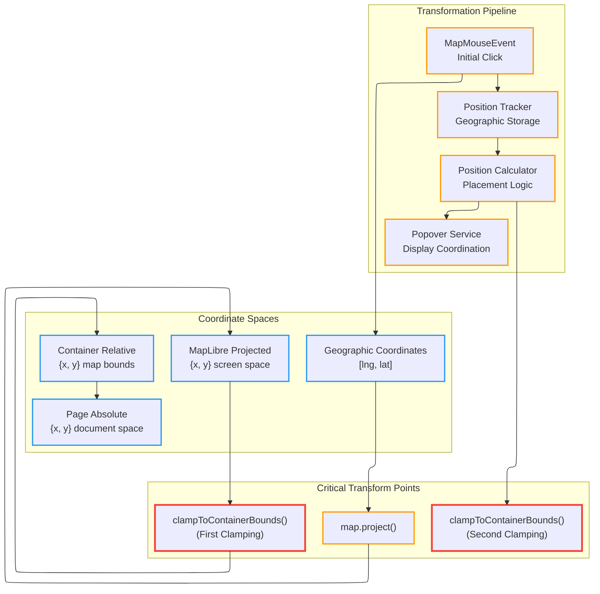

# R008: Antimeridian Popover Positioning Issue

## Table of Contents

1. [Executive Summary](#executive-summary)
2. [System Architecture](#system-architecture)
3. [Implementation Analysis](#implementation-analysis)
4. [Current Usage Analysis](#current-usage-analysis)
5. [State Management Integration](#state-management-integration)
6. [Architectural Inconsistencies](#architectural-inconsistencies)
7. [System Boundaries](#system-boundaries)

## Executive Summary

Investigation of antimeridian crossing behavior in the Map Popover positioning system reveals critical coordinate clamping issues causing visual discontinuity when dragging across the 180° meridian. The popover jumps to x:0 position due to double coordinate clamping in the geographic-to-screen transformation pipeline and insufficient handling of MapLibre's coordinate projection discontinuities.

## System Architecture

### Core Coordinate Transformation Pattern

The system implements a **Multi-Stage Coordinate Pipeline** pattern with distinct coordinate spaces and transformation utilities:



### Component Architecture

**Location**: Map Popover System
**Primary Components**:

- **Position Tracker**: [`useMapPositionTracker.ts`](../../src/core/map/hooks/useMapPositionTracker.ts) - Geographic coordinate persistence and movement tracking
- **Position Calculator**: [`MapPopoverPositionCalculator.ts`](../../src/core/map/popover/MapPopoverPositionCalculator.ts) - Screen placement optimization
- **Coordinate Utilities**: [`maplibreCoordinateUtils.ts`](../../src/core/map/utils/maplibreCoordinateUtils.ts) - Space transformation functions
- **Integration Hook**: [`useMapPopoverMaplibreIntegration.ts`](../../src/core/map/hooks/useMapPopoverMaplibreIntegration.ts) - System coordination

## Implementation Analysis

### Coordinate Transformation Data Flow

#### 1. Initial Click Processing

**Location**: [`MapPopoverProvider.tsx:75-86`](../../src/core/map/popover/MapPopoverProvider.tsx#L75-L86)

```typescript
const showWithEvent = useCallback(
  (mapEvent: MapMouseEvent, options?: MapPopoverOptions): boolean => {
    // Direct screen-to-page conversion (no antimeridian issues)
    const containerRect = getMapContainerRect(mapEvent.target);
    const pagePoint = mapContainerToPageCoords(mapEvent.point, containerRect);

    setGlobalPopover({
      id: 'global',
      isOpen: true,
      content,
      placement,
      screenPoint: pagePoint, // ✅ Valid screen coordinates
    });
  },
  [registry, close],
);
```

**Analysis**: Initial positioning works correctly because `mapEvent.point` contains valid screen coordinates from MapLibre's click detection.

#### 2. Geographic Coordinate Storage

**Location**: [`useMapPositionTracker.ts:65-82`](../../src/core/map/hooks/useMapPositionTracker.ts#L65-L82)

```typescript
const startTracking = useCallback(
  (lngLat: [number, number]) => {
    const wrappedLngLat: [number, number] = [wrapLongitude(lngLat[0]), lngLat[1]];

    if (!isValidLngLatArray(wrappedLngLat)) {
      console.error(
        `Invalid coordinates for tracking: [${wrappedLngLat[0]}, ${wrappedLngLat[1]}]`,
      );
      return;
    }

    currentLngLatRef.current = wrappedLngLat; // ✅ Geographic persistence
    map.on('move', handleMapMove);
  },
  [map, handleMapMove],
);
```

**Analysis**: Geographic coordinates are correctly normalized and stored for tracking across map movements.

#### 3. Critical Position Update Pipeline

**Location**: [`useMapPositionTracker.ts:21-35`](../../src/core/map/hooks/useMapPositionTracker.ts#L21-L35)

```typescript
const throttledUpdatePosition = useMemo(() => {
  const rawUpdate = () => {
    if (!map || !currentLngLatRef.current) return;

    const [lng, lat] = currentLngLatRef.current;

    try {
      const pagePoint = geographicToPageCoords(map, [lng, lat], {
        edgePadding: 0,
        clampToBounds: true, // ❌ PROBLEM: Forces clamping
      });

      onPositionChange({ x: pagePoint.x, y: pagePoint.y });
    } catch (error) {
      console.error('Error updating position:', error);
    }
  };
}, [map, onPositionChange, debounceMs]);
```

**Analysis**: The `clampToBounds: true` setting causes the first coordinate clamping issue.

#### 4. Geographic-to-Page Transformation Chain

**Location**: [`maplibreCoordinateUtils.ts:120-140`](../../src/core/map/utils/maplibreCoordinateUtils.ts#L120-L140)

```typescript
export function geographicToPageCoords(
  map: Map,
  geographic: GeographicPoint | [number, number],
  config: ClampConfig = {},
): PagePoint {
  const containerRect = getMapContainerRect(map);

  // Step 1: Longitude normalization
  let wrappedGeographic: [number, number];
  if (Array.isArray(geographic)) {
    wrappedGeographic = [wrapLongitude(geographic[0]), geographic[1]];
  } else {
    wrappedGeographic = [wrapLongitude(geographic.lng), geographic.lat];
  }

  // Step 2: MapLibre projection (discontinuous at antimeridian)
  const projected = projectGeographicToScreen(map, wrappedGeographic);

  // Step 3: Container bounds clamping (❌ PROBLEM POINT)
  const clamped = clampToContainerBounds(projected, containerRect, config);

  // Step 4: Page space conversion
  return mapContainerToPageCoords(clamped, containerRect);
}
```

**Analysis**: The pipeline correctly normalizes longitude but fails to handle projection discontinuities during antimeridian crossing.

#### 5. MapLibre Projection Behavior

**Location**: [`maplibreCoordinateUtils.ts:45-59`](../../src/core/map/utils/maplibreCoordinateUtils.ts#L45-L59)

```typescript
export function projectGeographicToScreen(
  map: Map,
  geographic: GeographicPoint | [number, number],
): ProjectedPoint {
  const coords = Array.isArray(geographic)
    ? geographic
    : [geographic.lng, geographic.lat];

  // Wrap longitude before projection
  const wrappedCoords: [number, number] = [wrapLongitude(coords[0]), coords[1]];
  const projected = map.project(wrappedCoords); // ❌ Discontinuous at 180°

  return {
    x: projected.x,
    y: projected.y,
  } as ProjectedPoint;
}
```

**Analysis**: MapLibre's `map.project()` method produces negative X coordinates or coordinates beyond container width when geographic points exist in adjacent world copies during antimeridian crossing.

#### 6. Container Bounds Clamping Logic

**Location**: [`maplibreCoordinateUtils.ts:67-81`](../../src/core/map/utils/maplibreCoordinateUtils.ts#L67-L81)

```typescript
export function clampToContainerBounds(
  point: ScreenPoint,
  containerRect: DOMRect,
  config: ClampConfig = {},
): ScreenPoint {
  const { edgePadding = 0, clampToBounds = true } = config;

  if (!clampToBounds) {
    return point; // ✅ Could bypass clamping
  }

  return {
    x: Math.min(Math.max(edgePadding, point.x), containerRect.width - edgePadding), // ❌ Forces X to [0, width]
    y: Math.min(Math.max(edgePadding, point.y), containerRect.height - edgePadding),
  };
}
```

**Analysis**: Clamping forces X coordinates to container bounds, converting negative values (indicating adjacent world position) to `0`.

#### 7. Double-Clamping in Position Calculator

**Location**: [`MapPopoverPositionCalculator.ts:24-38`](../../src/core/map/popover/MapPopoverPositionCalculator.ts#L24-L38)

```typescript
calculate(
rect: DOMRect,
rawX: number,
rawY: number,
): { pageX: number; pageY: number; placement: Placement } {
const placement = this.calculatePlacement(rect, rawX, rawY);

// ❌ PROBLEM: Second clamping layer
const clampedPoint = clampToContainerBounds({ x: rawX, y: rawY }, rect, {
  edgePadding: this.config.edgePadding,
});

const pagePoint = mapContainerToPageCoords(clampedPoint, rect);

return {
  pageX: pagePoint.x,
  pageY: pagePoint.y,
  placement,
};
}
```

**Analysis**: The position calculator applies clamping again, though damage from first clamping has already occurred.

### Coordinate Flow Integration

**Location**: [`useMapPopoverMaplibreIntegration.ts:37-57`](../../src/core/map/hooks/useMapPopoverMaplibreIntegration.ts#L37-L57)

```typescript
const handlePositionChange = useCallback(
  (point: ScreenPoint) => {
    if (!currentMap || !currentService.isOpen()) return;

    try {
      const containerRect = getMapContainerRect(currentMap);
      // Convert page coords back to container space
      const containerPoint = pageToMapContainerCoords(point, containerRect);

      // Apply position calculator (with second clamping)
      const { placement } = positionCalculator.calculate(
        containerRect,
        containerPoint.x,
        containerPoint.y,
      );
      currentService.updatePosition(point, placement);
    } catch (error) {
      console.error('Error updating popover position:', error);
    }
  },
  [positionCalculator],
);
```

**Analysis**: Integration hook coordinates between position tracker output and position calculator input, but cannot recover from coordinate damage caused by premature clamping.

## Current Usage Analysis

### Position Tracking Performance Characteristics

**Location**: [`useMapPositionTracker.ts:40-62`](../../src/core/map/hooks/useMapPositionTracker.ts#L40-L62)

```typescript
const throttledUpdatePosition = useMemo(() => {
  const rawUpdate = () => {
    // Geographic → Screen transformation pipeline
    const pagePoint = geographicToPageCoords(map, [lng, lat], {
      edgePadding: 0,
      clampToBounds: true,
    });
    onPositionChange({ x: pagePoint.x, y: pagePoint.y });
  };

  if (debounceMs > 0) {
    return throttle(rawUpdate, debounceMs); // Default 16ms throttling
  }
  return rawUpdate;
}, [map, onPositionChange, debounceMs]);
```

**Performance Analysis**:

- **Throttling**: 16ms default prevents excessive updates during map movement
- **RAF Scheduling**: Used for smooth visual updates when debouncing disabled
- **Reference Stability**: Refs prevent callback recreation during tracking lifecycle
- **Complexity**: O(1) coordinate transformations with minimal computational overhead

### Usage Patterns Across Renderers

#### BivariateRenderer Integration

**Location**: [`BivariateRenderer.tsx`](../../src/core/logical_layers/renderers/BivariateRenderer/BivariateRenderer.tsx)

```typescript
// Registers with registry pattern
mapPopoverRegistry.register(`bivariate-${this._sourceId}`, this._bivariateProvider);
mapPopoverRegistry.register(`mcda-${this._sourceId}`, this._mcdaProvider);
```

#### ClickableFeaturesRenderer Integration

**Location**: [`ClickableFeaturesRenderer`](../../src/core/logical_layers/renderers/ClickableFeaturesRenderer)

```typescript
mapPopoverRegistry.register(`clickable-${this._sourceId}`, this._popoverProvider);
```

**Analysis**: All renderer integrations follow consistent registry-based patterns and experience the same antimeridian positioning issues.

## State Management Integration

### Geographic Coordinate Persistence

The system stores geographic coordinates rather than screen coordinates to maintain position accuracy across viewport changes:

**Location**: [`useMapPositionTracker.ts:16-19`](../../src/core/map/hooks/useMapPositionTracker.ts#L16-L19)

```typescript
const currentLngLatRef = useRef<[number, number] | null>(null);
// Geographic coordinates persist across map movements
// Screen coordinates recalculated on each update
```

### Map Event Integration

**Location**: [`useMapPopoverMaplibreIntegration.ts:78-87`](../../src/core/map/hooks/useMapPopoverMaplibreIntegration.ts#L78-L87)

```typescript
const handleMapClick = useCallback(
  (event: MapMouseEvent) => {
    // Close existing popover
    if (popoverService.isOpen()) {
      popoverService.close();
      positionTracker.stopTracking();
    }

    // Start new tracking with geographic coordinates
    const hasContent = popoverService.showWithEvent(event);
    if (hasContent) {
      positionTracker.startTracking([event.lngLat.lng, event.lngLat.lat]);
    }
  },
  [map, popoverService, positionTracker],
);
```

### Service State Coordination

**Location**: [`MapPopoverProvider.tsx:95-110`](../../src/core/map/popover/MapPopoverProvider.tsx#L95-L110)

```typescript
const updatePosition = useCallback((point: ScreenPoint, placement?: Placement) => {
  setGlobalPopover((prev) => {
    if (!prev) return null;

    return {
      ...prev,
      screenPoint: point, // Updated screen position
      placement: placement ?? prev.placement, // Placement optimization
    };
  });
}, []);
```

## Architectural Inconsistencies

### 1. Double Coordinate Clamping

**Primary Issue**: Two separate clamping operations in the coordinate pipeline:

- **First Clamping**: [`useMapPositionTracker.ts:28`](../../src/core/map/hooks/useMapPositionTracker.ts#L28) - `clampToBounds: true`
- **Second Clamping**: [`MapPopoverPositionCalculator.ts:30`](../../src/core/map/popover/MapPopoverPositionCalculator.ts#L30) - `clampToContainerBounds()`

**Impact**: First clamping destroys antimeridian positioning information before second clamping can apply intelligent placement logic.

### 2. Coordinate Space Confusion

**Problem**: Position tracker outputs page coordinates, but position calculator expects container coordinates:

```typescript
// Position tracker outputs page coordinates
onPositionChange({ x: pagePoint.x, y: pagePoint.y });

// Integration hook converts back to container coordinates
const containerPoint = pageToMapContainerCoords(point, containerRect);

// Position calculator processes container coordinates
positionCalculator.calculate(containerRect, containerPoint.x, containerPoint.y);
```

**Analysis**: Unnecessary coordinate space conversions add complexity and potential error points.

### 3. Inconsistent Longitude Wrapping

**Locations**:

- [`useMapPositionTracker.ts:65`](../../src/core/map/hooks/useMapPositionTracker.ts#L65) - Wraps longitude in `startTracking()`
- [`maplibreCoordinateUtils.ts:53`](../../src/core/map/utils/maplibreCoordinateUtils.ts#L53) - Wraps longitude in `projectGeographicToScreen()`
- [`maplibreCoordinateUtils.ts:126`](../../src/core/map/utils/maplibreCoordinateUtils.ts#L126) - Wraps longitude in `geographicToPageCoords()`

**Analysis**: Multiple longitude normalization points indicate unclear ownership of coordinate validation responsibilities.

### 4. Placement Logic Timing

**Problem**: Placement calculation occurs after coordinate clamping:

```typescript
// Position calculator sequence
const placement = this.calculatePlacement(rect, rawX, rawY); // ✅ Uses unclamped coordinates
const clampedPoint = clampToContainerBounds({ x: rawX, y: rawY }, rect, config); // ❌ Clamps after placement calculation
```

**Analysis**: Placement logic uses raw coordinates, but final positioning uses clamped coordinates, creating inconsistency between placement intent and actual position.

## System Boundaries

### What's Managed by the Position System

- **Geographic Coordinate Persistence**: Stores click location as `[lng, lat]` for tracking
- **Screen Coordinate Calculation**: Converts geographic to screen space on map movement
- **Placement Optimization**: Determines popover placement relative to container edges
- **Performance Throttling**: Manages update frequency during map movement
- **Lifecycle Management**: Handles tracking start/stop and cleanup

### What's Outside the System

- **MapLibre Projection Logic**: `map.project()` behavior at antimeridian controlled by MapLibre GL
- **Container Positioning**: Map container location in page controlled by parent components
- **Content Generation**: Popover content creation handled by provider registry system
- **Visual Rendering**: Actual popover display managed by Floating UI library
- **Map Movement Events**: Geographic viewport changes controlled by MapLibre map instance

### Interface Boundaries

**Input Boundaries**:

- Geographic coordinates from `MapMouseEvent.lngLat`
- Screen coordinates from `MapMouseEvent.point`
- Map instance from parent component

**Output Boundaries**:

- Page coordinates to popover service
- Placement preferences to floating UI
- Error states to console logging

### Configuration Boundaries

**Configurable**:

- Throttling intervals (`debounceMs`)
- Edge padding values (`edgePadding`)
- Placement thresholds (`placementThreshold`)
- Clamping behavior (`clampToBounds`)

**Non-Configurable**:

- MapLibre projection algorithm
- Coordinate space definitions
- Browser viewport coordinates
- Antimeridian crossing behavior
