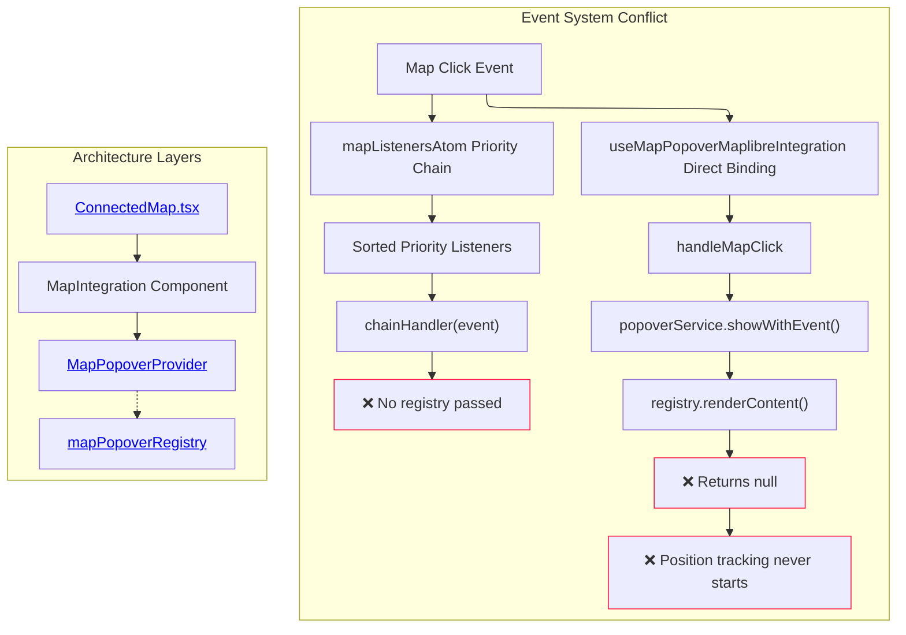

# R009: MapPopover Position Tracking Architecture Analysis

## Executive Summary

Investigation of MapPopover position tracking failures reveals fundamental architectural conflicts between dual event systems and missing registry connectivity. The current implementation creates competing click handlers that prevent position tracking initialization, while the provider context lacks registry connection causing content resolution to fail systematically.

## System Architecture

### Core Pattern: Dual Event System Conflict

**Location**: [`src/components/ConnectedMap/ConnectedMap.tsx:166-200`](../../src/components/ConnectedMap/ConnectedMap.tsx#L166-L200)

The system implements two parallel event handling architectures that compete for the same map click events:



### Implementation Analysis

#### Data Structures

**MapPopoverService Interface**: [`src/core/map/types.ts:12-33`](../../src/core/map/types.ts#L12-L33)

```typescript
export interface MapPopoverService {
  showWithContent: (
    point: ScreenPoint,
    content: React.ReactNode,
    options?: MapPopoverOptions,
  ) => void;
  showWithEvent: (mapEvent: MapMouseEvent, options?: MapPopoverOptions) => boolean;
  updatePosition: (point: ScreenPoint, placement?: Placement) => void;
  close: () => void;
  isOpen: () => boolean;
}
```

**Registry Interface**: [`src/core/map/types.ts:74-100`](../../src/core/map/types.ts#L74-L100)

```typescript
export interface IMapPopoverContentRegistry {
  register(id: string, provider: IMapPopoverContentProvider): void;
  unregister(id: string): void;
  renderContent(mapEvent: MapMouseEvent, onClose: () => void): React.ReactNode | null;
}
```

#### Position Tracking Algorithm

**Location**: [`src/core/map/hooks/useMapPositionTracker.ts:67-85`](../../src/core/map/hooks/useMapPositionTracker.ts#L67-L85)

```typescript
const startTracking = useCallback(
  (lngLat: [number, number]) => {
    if (!map) return;

    const wrappedLngLat: [number, number] = [wrapLongitude(lngLat[0]), lngLat[1]];

    if (!isValidLngLatArray(wrappedLngLat)) {
      console.error(
        `Invalid coordinates for tracking: [${wrappedLngLat[0]}, ${wrappedLngLat[1]}]`,
      );
      return;
    }

    if (currentLngLatRef.current) {
      map.off('move', handleMapMove);
    }

    currentLngLatRef.current = wrappedLngLat;
    map.on('move', handleMapMove);
    handleMapMove();
  },
  [map, handleMapMove],
);
```

**Performance Characteristics**: O(1) coordinate validation, O(1) event binding, 16ms throttled updates via `@github/mini-throttle`.

#### Control Mechanisms

**Integration Hook Flow**: [`src/core/map/hooks/useMapPopoverMaplibreIntegration.ts:73-88`](../../src/core/map/hooks/useMapPopoverMaplibreIntegration.ts#L73-L88)

```typescript
const handleMapClick = useCallback(
  (event: MapMouseEvent) => {
    if (!map) return;

    if (popoverService.isOpen()) {
      popoverService.close();
      positionTracker.stopTracking();
    }

    try {
      const hasContent = popoverService.showWithEvent(event); // ← Critical failure point
      if (hasContent) {
        positionTracker.startTracking([event.lngLat.lng, event.lngLat.lat]); // ← Never reached
      }
    } catch (error) {
      console.error('Error rendering popover content:', error);
    }
  },
  [map, popoverService, positionTracker],
);
```

## Current Usage Analysis

### Complete Component Inventory

**Active Providers**:

- **Debug Provider**: [`src/core/map/index.ts:37`](../../src/core/map/index.ts#L37) (auto-registered when `KONTUR_DEBUG=true`)
- **Generic Renderer**: [`src/core/logical_layers/renderers/GenericRenderer.ts:269`](../../src/core/logical_layers/renderers/GenericRenderer.ts#L269)
- **Bivariate Renderer**: [`src/core/logical_layers/renderers/BivariateRenderer/BivariateRenderer.tsx:162,215`](../../src/core/logical_layers/renderers/BivariateRenderer/BivariateRenderer.tsx#L162-L215)
- **Clickable Features**: [`src/core/logical_layers/renderers/ClickableFeaturesRenderer/ClickableFeaturesRenderer.tsx:134`](../../src/core/logical_layers/renderers/ClickableFeaturesRenderer/ClickableFeaturesRenderer.tsx#L134)
- **Boundary Selector**: [`src/features/boundary_selector/atoms/boundaryRegistryAtom.ts:131`](../../src/features/boundary_selector/atoms/boundaryRegistryAtom.ts#L131)

**Registration Patterns**:

```typescript
// Pattern 1: Renderer-based (during willMount lifecycle)
mapPopoverRegistry.register(`tooltip-${this._sourceId}`, this._tooltipProvider);

// Pattern 2: Tool-based (during activation)
mapPopoverRegistry.register('boundary-selector', boundarySelectorContentProvider);

// Pattern 3: Global debug
mapPopoverRegistry.register('debug', debugProvider);
```

### Usage Patterns

**Provider Lifecycle**: [`src/core/logical_layers/renderers/BivariateRenderer/BivariateRenderer.tsx:155-165`](../../src/core/logical_layers/renderers/BivariateRenderer/BivariateRenderer.tsx#L155-L165)

```typescript
registerBivariateProvider(legend: BivariateLegend | null) {
  if (this._bivariateProvider) {
    mapPopoverRegistry.unregister(`bivariate-${this._sourceId}`);
    this._bivariateProvider = null;
  }

  if (legend) {
    this._bivariateProvider = new BivariatePopoverProvider(this._sourceId, legend);
    mapPopoverRegistry.register(`bivariate-${this._sourceId}`, this._bivariateProvider);
  }
}
```

**Performance Characteristics**: Registry uses Map<string, IMapPopoverContentProvider> for O(1) lookups, 5+ active providers typical in production.

## State Management Integration

### Provider Context Architecture

**Location**: [`src/core/map/popover/MapPopoverProvider.tsx:42-88`](../../src/core/map/popover/MapPopoverProvider.tsx#L42-L88)

The provider establishes React context for service access but creates registry disconnection:

```typescript
export function MapPopoverProvider({
  children,
  registry, // ← Optional parameter
}: {
  children: React.ReactNode;
  registry?: IMapPopoverContentRegistry; // ← Not required
}) {
  const showWithEvent = useCallback(
    (mapEvent: MapMouseEvent, options?: MapPopoverOptions): boolean => {
      if (!registry) {
        return false; // ← Critical failure: no registry = no content
      }

      const content = registry.renderContent(mapEvent, close);
      if (content) {
        // Position calculation and popover display
        return true;
      }
      return false;
    },
    [registry, close],
  );
}
```

### ConnectedMap Integration Pattern

**Location**: [`src/components/ConnectedMap/ConnectedMap.tsx:250-260`](../../src/components/ConnectedMap/ConnectedMap.tsx#L250-L260)

```typescript
export function ConnectedMap({ className }: { className?: string }) {
  const content = useMemo(
    () => (
      <MapPopoverProvider registry={mapPopoverRegistry}>  {/* ← Registry correctly passed */}
        <Suspense fallback={<div className={className}>Loading map...</div>}>
          <MapContainer className={className} />
        </Suspense>
      </MapPopoverProvider>
    ),
    [className],
  );

  return content;
}
```

### Service Access Dependency Chain

**Location**: [`src/components/ConnectedMap/ConnectedMap.tsx:168`](../../src/components/ConnectedMap/ConnectedMap.tsx#L168)

```typescript
function MapIntegration({ map }: { map: MapLibreMap }) {
  const popoverService = useMapPopoverService(); // ← Context dependency

  useMapPopoverMaplibreIntegration({
    map,
    popoverService, // ← Service passed to integration
    enabled: true,
    trackingThrottleMs: 16,
  });
}
```

## Architectural Inconsistencies

### Primary Conflict: Event System Duplication

**Inconsistency Location**: [`src/components/ConnectedMap/ConnectedMap.tsx:172-194`](../../src/components/ConnectedMap/ConnectedMap.tsx#L172-L194)

The system implements both priority-based event coordination via `mapListenersAtom` AND direct event binding via `useMapPopoverMaplibreIntegration`:

```typescript
// System 1: Priority-based coordination
useEffect(() => {
  const handlers = new Map();

  typedObjectEntries(mapListeners).forEach(([eventType, listeners]) => {
    const sortedListeners = listeners.sort((a, b) => b.priority - a.priority);

    const chainHandler = (event: any) => {
      for (const { listener } of sortedListeners) {
        const shouldContinue = listener(event, event.target);
        if (!shouldContinue) break; // ← Priority chain stops here
      }
    };

    map.on(eventType, chainHandler); // ← First event binding
  });
}, [map, mapListeners]);

// System 2: Direct binding (conflicts with above)
useMapPopoverMaplibreIntegration({
  map, // ← Same map instance
  popoverService,
  enabled: true, // ← Second event binding on same events
});
```

**Impact Analysis**: Both systems bind to `map.on('click')` creating race conditions. The priority system may consume events before direct binding can process them, preventing position tracking initialization.

### Secondary Issue: Registry Context Disconnection

**Location**: [`src/core/map/popover/MapPopoverProvider.tsx:73-76`](../../src/core/map/popover/MapPopoverProvider.tsx#L73-L76)

```typescript
const showWithEvent = useCallback(
  (mapEvent: MapMouseEvent, options?: MapPopoverOptions): boolean => {
    if (!registry) {
      return false; // ← This branch executes when registry prop is undefined
    }
    // ...
  },
  [registry, close],
);
```

**Root Cause**: The service receives registry through props, but the integration hook has no awareness of registry state. Service can be instantiated without registry connection.

### Tertiary Issue: Position Tracking Dependency Failure

**Location**: [`src/core/map/hooks/useMapPopoverMaplibreIntegration.ts:84-86`](../../src/core/map/hooks/useMapPopoverMaplibreIntegration.ts#L84-L86)

```typescript
const hasContent = popoverService.showWithEvent(event); // Returns false due to no registry
if (hasContent) {
  positionTracker.startTracking([event.lngLat.lng, event.lngLat.lat]); // Never executes
}
```

**Control Flow Breakdown**:

1. Click event triggers `handleMapClick`
2. `popoverService.showWithEvent()` called
3. Service checks for registry → not found → returns `false`
4. `hasContent` is `false` → tracking never starts
5. Position tracking system remains dormant

## System Boundaries

### Managed Systems

**MapPopover Service Layer**:

- **Scope**: Popover display, positioning, lifecycle management
- **Boundaries**: React context for service access, floating UI integration
- **External Dependencies**: `@floating-ui/react`, custom coordinate utilities

**Position Tracking Subsystem**:

- **Scope**: Geographic coordinate to screen position conversion
- **Boundaries**: MapLibre GL map instance, throttled update scheduling
- **External Dependencies**: `@github/mini-throttle`, MapLibre GL coordinate API

**Content Provider Registry**:

- **Scope**: Provider registration, content aggregation, error isolation
- **Boundaries**: Global singleton, HMR-safe storage
- **External Dependencies**: React component tree, renderer lifecycle

### Unmanaged External Systems

**MapLibre Event System**: Direct map event binding outside application control
**Priority Event Coordination**: `mapListenersAtom` system operates independently
**Renderer Lifecycle**: Provider registration tied to renderer mount/unmount cycles

### Integration Points

**Service Context Bridge**: [`src/core/map/popover/MapPopoverProvider.tsx:34-40`](../../src/core/map/popover/MapPopoverProvider.tsx#L34-L40)

```typescript
export function useMapPopoverService(): MapPopoverService {
  const context = useContext(MapPopoverContext);
  if (!context) {
    throw new Error('useMapPopoverService must be used within MapPopoverProvider');
  }
  return context;
}
```

**Global Registry Access**: [`src/core/map/popover/globalMapPopoverRegistry.ts:12-16`](../../src/core/map/popover/globalMapPopoverRegistry.ts#L12-L16)

```typescript
const g = globalThis as any;
export const mapPopoverRegistry: MapPopoverContentRegistry =
  g.__kontur_mapPopoverRegistry ??
  (g.__kontur_mapPopoverRegistry = new MapPopoverContentRegistry());
```

**Direct Map Integration**: [`src/core/map/hooks/useMapPopoverMaplibreIntegration.ts:96-105`](../../src/core/map/hooks/useMapPopoverMaplibreIntegration.ts#L96-L105)

```typescript
useEffect(() => {
  if (!map || !enabled) return;

  map.on('click', handleMapClick); // ← Direct MapLibre binding
  return () => {
    map.off('click', handleMapClick);
    positionTracker.stopTracking();
  };
}, [map, enabled, handleMapClick, positionTracker]);
```

## Technical Specifications

### Architecture Patterns

**Service Provider Pattern**: MapPopoverProvider implements service locator for popover operations
**Registry Pattern**: Global singleton registry coordinates multiple content providers
**Hook Integration Pattern**: Custom hooks encapsulate MapLibre GL event binding and position tracking
**Priority Chain Pattern**: Sequential execution with early termination for exclusive tool control

### Algorithm Complexity

**Position Tracking**: O(1) coordinate transformation, O(1) event binding, throttled to 16ms intervals
**Registry Content Resolution**: O(n) provider iteration where n = registered provider count
**Event Priority Resolution**: O(n log n) sorting + O(m) sequential execution where m = listener count
**Provider Registration**: O(1) Map-based storage with string key lookup

### Performance Characteristics

**Memory Usage**: Single registry instance, provider cleanup on unregister prevents leaks
**Event Throughput**: 16ms position updates, immediate click response, throttled map movement
**Content Resolution**: Synchronous provider iteration, early return on first content match
**Error Handling**: Provider-level error isolation, continued execution on individual failures
