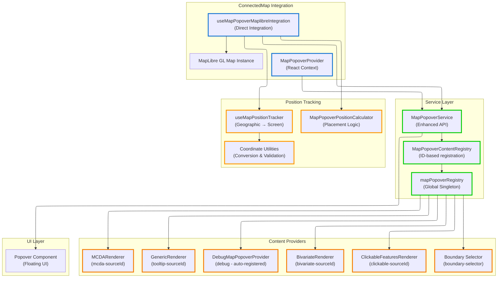

# Map Popover System

Registry-based popover system for displaying content on map click events with automatic position tracking and coordinate conversion. The system uses a content provider registry for clean separation of concerns between map interaction and content generation.

## Table of Contents

- [Executive Summary](#executive-summary)
- [System Architecture](#system-architecture)
- [Implementation Analysis](#implementation-analysis)
- [Current Usage Analysis](#current-usage-analysis)
- [Position Tracking Architecture](#position-tracking-architecture)
- [Content Provider System](#content-provider-system)
- [State Management Integration](#state-management-integration)
- [Coordinate System Architecture](#coordinate-system-architecture)
- [Service API Reference](#service-api-reference)
- [Memory Safety](#memory-safety)

## Executive Summary

The MapPopover system provides a service-based architecture for displaying interactive content on map click events using a global content provider registry and automatic position tracking that follows geographic coordinates across viewport changes.

## System Architecture



### Core Components

**Location**: [`types.ts:12-33`](../../../src/core/map/types.ts#L12-L33)

- **`MapPopoverService`**: Enhanced service API for popover display and positioning
- **`MapPopoverProvider`**: React context provider for service access and UI rendering
- **`MapPopoverContentRegistry`**: ID-based registry for content provider coordination
- **`mapPopoverRegistry`**: Global singleton registry instance
- **`useMapPopoverMaplibreIntegration`**: Direct integration hook for MapLibre GL events
- **`useMapPositionTracker`**: Geographic coordinate tracking with viewport tolerance

## Implementation Analysis

### Service Interface Design

**Location**: [`types.ts:12-33`](../../../src/core/map/types.ts#L12-L33)

The service provides a dual-API approach for different integration patterns:

```typescript
interface MapPopoverService {
  // Content-based API - direct content display
  showWithContent: (
    point: ScreenPoint,
    content: React.ReactNode,
    options?: MapPopoverOptions,
  ) => void;

  // Registry-based API - event delegation to providers
  showWithEvent: (mapEvent: MapMouseEvent, options?: MapPopoverOptions) => boolean;

  // Position management
  updatePosition: (point: ScreenPoint, placement?: Placement) => void;
  close: () => void;
  isOpen: () => boolean;
}
```

**Design Benefits:**

- **Flexibility**: Supports both direct content and provider-based patterns
- **Event delegation**: Registry system determines content automatically
- **Position abstraction**: Service handles all coordinate conversions
- **State management**: Centralized open/close state tracking

### Registry Architecture

**Location**: [`MapPopoverContentRegistry.ts:5-51`](../../../src/core/map/popover/MapPopoverContentRegistry.ts#L5-L51)

The registry implements aggregated content rendering with error isolation:

```typescript
renderContent(mapEvent: MapMouseEvent, onClose: () => void): React.ReactNode | null {
  const contentElements: React.ReactNode[] = [];

  for (const [id, provider] of this.providers) {
    try {
      const providerContent = provider.renderContent(mapEvent, onClose);
      if (providerContent) {
        contentElements.push(
          React.createElement('div', { key: id, title: id }, providerContent),
        );
      }
    } catch (error) {
      console.error(`Error in MapPopover provider "${id}":`, error);
    }
  }

  return contentElements.length === 0
    ? null
    : React.createElement(React.Fragment, {}, ...contentElements);
}
```

**Key Features:**

- **Error isolation**: Provider errors don't crash the entire system
- **Stable React keys**: Uses provider IDs for optimal reconciliation
- **Aggregated content**: Multiple providers can contribute to single popover
- **Conditional rendering**: Returns `null` when no content available

### Global Registry Pattern

**Location**: [`globalMapPopoverRegistry.ts:10-17`](../../../src/core/map/popover/globalMapPopoverRegistry.ts#L10-L17)

The system uses a global singleton for cross-component coordination:

```typescript
const g = globalThis as any;
export const mapPopoverRegistry: MapPopoverContentRegistry =
  g.__kontur_mapPopoverRegistry ??
  (g.__kontur_mapPopoverRegistry = new MapPopoverContentRegistry());
```

**Rationale:**

- **HMR stability**: Survives hot reloads during development
- **Cross-component access**: Renderers register from anywhere in the app
- **Memory efficiency**: Single registry instance across all map instances
- **Debug capabilities**: Global access for debugging and inspection

## Current Usage Analysis

### ConnectedMap Integration

**Location**: [`ConnectedMap.tsx:159-176`](../../../src/components/ConnectedMap/ConnectedMap.tsx#L159-L176)

ConnectedMap uses direct integration without plugin infrastructure:

```typescript
function MapIntegration({ map }: { map: MapLibreMap }) {
  const popoverService = useMapPopoverService();

  // Direct MapLibre integration with position tracking
  useMapPopoverMaplibreIntegration({
    map,
    popoverService,
    enabled: true,
    trackingThrottleMs: 16,
  });

  return null;
}

export function ConnectedMap({ className }: { className?: string }) {
  return (
    <MapPopoverProvider registry={mapPopoverRegistry}>
      <Suspense fallback={<div className={className}>Loading map...</div>}>
        <MapContainer className={className} />
      </Suspense>
    </MapPopoverProvider>
  );
}
```

**Integration Pattern:**

- **Provider wrapping**: `MapPopoverProvider` provides service context
- **Direct hook usage**: `useMapPopoverMaplibreIntegration` handles events
- **Global registry**: All content providers register with `mapPopoverRegistry`
- **Suspense safety**: Map loading handled with proper error boundaries

### Renderer Integration Patterns

#### GenericRenderer Integration

**Location**: [`GenericRenderer.ts:269`](../../../src/core/logical_layers/renderers/GenericRenderer.ts#L269)

```typescript
// Registration pattern used by GenericRenderer
if (paramName && tooltipType === 'markdown') {
  this._tooltipProvider = new GenericRendererPopoverProvider(
    this._sourceId,
    paramName,
    tooltipType,
  );
  mapPopoverRegistry.register(`tooltip-${this._sourceId}`, this._tooltipProvider);
}

// Cleanup in willUnMount
if (this._tooltipProvider) {
  mapPopoverRegistry.unregister(`tooltip-${this._sourceId}`);
  this._tooltipProvider = null;
}
```

#### BivariateRenderer Integration

**Location**: [`BivariateRenderer.tsx:162,215`](../../../src/core/logical_layers/renderers/BivariateRenderer/BivariateRenderer.tsx#L162)

```typescript
// Dual provider registration for different content types
registerBivariateProvider(legend: BivariateLegend | null) {
  if (legend) {
    this._bivariateProvider = new BivariatePopoverProvider(this._sourceId, legend);
    mapPopoverRegistry.register(`bivariate-${this._sourceId}`, this._bivariateProvider);
  }
}

registerMCDAProvider(style: MCDALayerStyle | null) {
  if (style) {
    this._mcdaProvider = new MCDAPopoverProvider(this._sourceId, style);
    mapPopoverRegistry.register(`mcda-${this._sourceId}`, this._mcdaProvider);
  }
}
```

#### Boundary Selector Integration

**Location**: [`boundaryRegistryAtom.ts:131`](../../../src/features/boundary_selector/atoms/boundaryRegistryAtom.ts#L131)

```typescript
// Feature-level registration pattern
mapPopoverRegistry.register('boundary-selector', boundarySelectorContentProvider);
```

**Common Registration Patterns:**

- **Source-based IDs**: `tooltip-${sourceId}`, `bivariate-${sourceId}`, `mcda-${sourceId}`
- **Feature-based IDs**: `boundary-selector`, `debug`
- **Lifecycle management**: Register on mount, unregister on unmount
- **Conditional registration**: Only register when content is available

### Event Handling Integration

**Location**: [`useMapPopoverMaplibreIntegration.ts:108-128`](../../../src/core/map/hooks/useMapPopoverMaplibreIntegration.ts#L108-L128)

The integration uses the existing `mapListeners` system:

```typescript
const handleMapClick = useCallback(
  (event: MapMouseEvent) => {
    if (popoverService.isOpen()) {
      popoverService.close();
      stopTracking();
    }

    try {
      const hasContent = popoverService.showWithEvent(event);
      if (hasContent) {
        startTracking([event.lngLat.lng, event.lngLat.lat]);
      }
    } catch (error) {
      console.error('Error rendering popover content:', error);
    }

    return true; // Continue chain - allow other click listeners
  },
  [popoverService, startTracking, stopTracking],
);

// Registration with existing priority system
useEffect(() => {
  if (!enabled) return;

  const unregisterClick = registerMapListener('click', handleMapClick, 55);

  return () => {
    unregisterClick();
    stopTracking();
  };
}, [enabled, handleMapClick, stopTracking]);
```

**Event Flow:**

1. **Click event**: MapLibre GL fires click event
2. **Close existing**: Any open popover gets closed first
3. **Content resolution**: Registry queries all providers for content
4. **Position tracking**: Start tracking if content was found
5. **Chain continuation**: Return `true` to allow other click handlers

## Position Tracking Architecture

### Geographic Coordinate Persistence

**Location**: [`useMapPositionTracker.ts:67-80`](../../../src/core/map/hooks/useMapPositionTracker.ts#L67-L80)

The system tracks geographic coordinates rather than screen pixels:

```typescript
const setCurrentPosition = useCallback(
  (lngLat: [number, number]) => {
    const wrappedLngLat: [number, number] = [wrapLongitude(lngLat[0]), lngLat[1]];

    if (!isValidLngLatArray(wrappedLngLat)) {
      console.error(
        `Invalid coordinates for tracking: [${wrappedLngLat[0]}, ${wrappedLngLat[1]}]`,
      );
      return;
    }

    currentLngLatRef.current = wrappedLngLat;
    updatePosition(); // Trigger initial position update
  },
  [updatePosition],
);
```

**Coordinate Handling:**

- **Longitude wrapping**: Handles antimeridian crossing with `wrapLongitude`
- **Validation**: Ensures coordinates are within valid ranges
- **Reference storage**: Uses ref for stable coordinate tracking
- **Immediate update**: Triggers position calculation on coordinate set

### Viewport Change Tolerance

**Location**: [`useMapPopoverMaplibreIntegration.ts:79-105`](../../../src/core/map/hooks/useMapPopoverMaplibreIntegration.ts#L79-L105)

Position updates respond to all viewport changes:

```typescript
const startTracking = useCallback(
  (lngLat: [number, number]) => {
    // Stop any existing tracking
    unregisterMoveListener();

    // Start position tracking
    positionTracker.setCurrentPosition(lngLat);

    // Register move listener for position updates
    const handleMapMove = () => {
      positionTracker.updatePosition();
      return true; // Continue chain
    };

    unregisterMoveRef.current = registerMapListener('move', handleMapMove, 80);
  },
  [positionTracker, unregisterMoveListener],
);
```

**Tracking Features:**

- **Move event binding**: Responds to `move` events (pan, zoom, rotate, resize)
- **Geographic persistence**: Coordinates stay fixed while screen position updates
- **Performance optimization**: Uses throttling and RAF for smooth updates
- **Chain continuation**: Allows other move listeners to process events

### Performance Strategies

**Location**: [`useMapPositionTracker.ts:25-41`](../../../src/core/map/hooks/useMapPositionTracker.ts#L25-L41)

The system employs dual performance optimization:

```typescript
const throttledUpdatePosition = useMemo(() => {
  const rawUpdate = () => {
    if (!currentLngLatRef.current) return;

    try {
      const pagePoint = coordinateConverter(currentLngLatRef.current);
      onPositionChange({ x: pagePoint.x, y: pagePoint.y });
    } catch (error) {
      console.error('Error updating position:', error);
    }
  };

  // Strategy 1: Throttled updates for high-frequency events
  if (throttleMs > 0) {
    return throttle(rawUpdate, throttleMs);
  }
  // Strategy 2: RAF scheduling for smooth animations
  return rawUpdate;
}, [onPositionChange, throttleMs, coordinateConverter]);
```

**Optimization Techniques:**

- **Configurable throttling**: Default 16ms for 60fps performance
- **RAF scheduling**: Smooth visual updates without throttling overhead
- **Error resilience**: Continues tracking even if single update fails
- **Reference stability**: Prevents callback recreation during tracking

## Content Provider System

### Provider Interface

**Location**: [`types.ts:62-72`](../../../src/core/map/types.ts#L62-L72)

Content providers receive map events and close callbacks:

```typescript
interface IMapPopoverContentProvider {
  /**
   * Renders content for the map popover based on the click event.
   * @param mapEvent - The original MapLibre mouse event
   * @param onClose - Callback to close the popover (for interactive content)
   * @returns React content to display, or null if this provider doesn't handle this event
   */
  renderContent(mapEvent: MapMouseEvent, onClose: () => void): React.ReactNode | null;
}
```

**Interface Benefits:**

- **Event access**: Full MapLibre event with features, coordinates, and target map
- **Interactive content**: `onClose` callback enables interactive popover content
- **Conditional rendering**: Providers return `null` when they can't handle the event
- **Type safety**: Full TypeScript support with proper return types

### Debug Provider Implementation

**Location**: [`DebugMapPopoverProvider.tsx:8-63`](../../../src/core/map/popover/DebugMapPopoverProvider.tsx#L8-L63)

The debug provider demonstrates the interface usage:

```typescript
export class DebugMapPopoverProvider implements IMapPopoverContentProvider {
  renderContent(mapEvent: MapMouseEvent, onClose: () => void): React.ReactNode | null {
    const features = mapEvent.target?.queryRenderedFeatures?.(mapEvent.point) || [];

    if (features.length === 0) {
      return (
        <div>
          <h4>Features Inspector: No features found</h4>
          <p><strong>Coordinates:</strong> {mapEvent.lngLat.lng.toFixed(6)}, {mapEvent.lngLat.lat.toFixed(6)}</p>
          <p><strong>Screen Point:</strong> x: {mapEvent.point.x}, y: {mapEvent.point.y}</p>
        </div>
      );
    }

    return (
      <div>
        <h4>Features Inspector: Found {features.length} feature(s)</h4>
        {features.map((feature, index) => (
          <details key={index}>
            <summary>#{index + 1} <strong>Source Layer:</strong> {feature?.sourceLayer}</summary>
            <pre>{JSON.stringify(feature?.properties, null, 2)}</pre>
          </details>
        ))}
      </div>
    );
  }
}
```

**Auto-Registration**: [`index.ts:36-40`](../../../src/core/map/index.ts#L36-L40)

```typescript
if (KONTUR_DEBUG) {
  const debugProvider = new DebugMapPopoverProvider();
  mapPopoverRegistry.register('debug', debugProvider);
  console.info('Map popover debug provider registered');
}
```

## State Management Integration

### React Context Pattern

**Location**: [`MapPopoverProvider.tsx:42-141`](../../../src/core/map/popover/MapPopoverProvider.tsx#L42-L141)

The provider manages multiple popover instances with stable service references:

```typescript
export function MapPopoverProvider({
  children,
  registry,
}: {
  children: React.ReactNode;
  registry?: IMapPopoverContentRegistry;
}) {
  const [globalPopover, setGlobalPopover] = useState<PopoverState | null>(null);

  const showWithEvent = useCallback(
    (mapEvent: MapMouseEvent, options?: MapPopoverOptions): boolean => {
      if (!registry) return false;

      const content = registry.renderContent(mapEvent, close);
      if (content) {
        const containerRect = getMapContainerRect(mapEvent.target);
        const pagePoint = mapContainerToPageCoords(mapEvent.point, containerRect);

        setGlobalPopover({
          id: 'global',
          isOpen: true,
          content,
          placement: options?.placement ?? 'top',
          screenPoint: pagePoint,
        });
        return true;
      }
      return false;
    },
    [registry, close],
  );

  const contextValue = useMemo(
    () => ({
      showWithContent,
      showWithEvent,
      updatePosition,
      isOpen,
      close,
    }),
    [showWithContent, showWithEvent, updatePosition, isOpen, close],
  );

  return (
    <MapPopoverContext.Provider value={contextValue}>
      {children}
      {globalPopover && (
        <Popover
          open={globalPopover.isOpen}
          onOpenChange={(open) => !open && close()}
          virtualReference={globalPopover.screenPoint}
          placement={globalPopover.placement}
        >
          <PopoverContent>{globalPopover.content}</PopoverContent>
        </Popover>
      )}
    </MapPopoverContext.Provider>
  );
}
```

**State Management Features:**

- **Service stability**: Context value uses memoized callbacks
- **Registry delegation**: Content resolution delegated to registry
- **Coordinate conversion**: Automatic MapLibre to page coordinate conversion
- **UI rendering**: Direct Floating UI integration with virtual positioning

### Multiple Maps Support

The system supports multiple map instances through provider isolation:

```typescript
function MultiMapApp() {
  return (
    <div>
      {/* Each map gets isolated popover system */}
      <MapPopoverProvider registry={mapPopoverRegistry}>
        <ConnectedMap mapId="map1" />
      </MapPopoverProvider>

      <MapPopoverProvider registry={mapPopoverRegistry}>
        <ConnectedMap mapId="map2" />
      </MapPopoverProvider>
    </div>
  );
}
```

**Isolation Benefits:**

- **Independent state**: Each provider manages its own popover state
- **Shared content**: Same global registry can serve multiple maps
- **Memory efficiency**: Providers only exist when maps are mounted
- **Service separation**: Each map gets its own service instance

## Coordinate System Architecture

### Coordinate Space Types

**Location**: [`maplibreCoordinateUtils.ts:11-23`](../../../src/core/map/utils/maplibreCoordinateUtils.ts#L11-L23)

The system uses type-safe coordinate spaces to prevent mixing:

```typescript
export interface MapContainerPoint extends ScreenPoint {
  readonly _mapContainer: unique symbol;
}

export interface PagePoint extends ScreenPoint {
  readonly _page: unique symbol;
}

export interface ProjectedPoint extends ScreenPoint {
  readonly _projected: unique symbol;
}
```

**Type Safety Benefits:**

- **Compile-time safety**: Prevents mixing coordinate systems
- **Clear interfaces**: Explicit coordinate space in function signatures
- **Runtime safety**: Functions expect specific coordinate types
- **Documentation**: Type names indicate coordinate space meaning

### Geographic Coordinate Utilities

**Location**: [`maplibreCoordinateUtils.ts:43-61`](../../../src/core/map/utils/maplibreCoordinateUtils.ts#L43-L61)

Core utilities handle coordinate conversion and validation:

```typescript
export function projectGeographicToScreen(
  map: Map,
  geographic: GeographicPoint | [number, number],
): ProjectedPoint {
  const coords = Array.isArray(geographic)
    ? geographic
    : [geographic.lng, geographic.lat];

  // Wrap longitude before projection
  const wrappedCoords: [number, number] = [wrapLongitude(coords[0]), coords[1]];
  const projected = map.project(wrappedCoords);

  return {
    x: projected.x,
    y: projected.y,
  } as ProjectedPoint;
}

export function geographicToPageCoords(
  map: Map,
  geographic: GeographicPoint | [number, number],
  config: ClampConfig = {},
): PagePoint {
  const containerRect = getMapContainerRect(map);
  const wrappedGeographic = Array.isArray(geographic)
    ? ([wrapLongitude(geographic[0]), geographic[1]] as [number, number])
    : ([wrapLongitude(geographic.lng), geographic.lat] as [number, number]);

  const projected = projectGeographicToScreen(map, wrappedGeographic);
  const clamped = clampToContainerBounds(projected, containerRect, config);
  return mapContainerToPageCoords(clamped, containerRect);
}
```

**Coordinate Features:**

- **Antimeridian handling**: Automatic longitude wrapping
- **Input flexibility**: Accepts both object and array coordinate formats
- **Viewport clamping**: Optional clamping to container bounds
- **Chained conversion**: Geographic → Projected → Container → Page coordinates

### Coordinate Validation

**Location**: [`coordinateValidation.ts:8-17`](../../../src/core/map/utils/coordinateValidation.ts#L8-L17)

Validation prevents invalid coordinate tracking:

```typescript
export function isValidLngLat(lng: number, lat: number): boolean {
  return (
    Number.isFinite(lat) &&
    Number.isFinite(lng) &&
    lat >= -90 &&
    lat <= 90 &&
    lng >= -180 &&
    lng <= 180
  );
}
```

**Validation Features:**

- **Finite number checks**: Rejects NaN and infinite values
- **Range validation**: Ensures coordinates within valid geographic bounds
- **Array support**: Convenience function for `[lng, lat]` arrays
- **Error prevention**: Prevents tracking invalid coordinates

## Service API Reference

### Current Export Interface

**Location**: [`index.ts:7-22`](../../../src/core/map/index.ts#L7-L22)

```typescript
// Primary service and provider exports
export { MapPopoverProvider, useMapPopoverService } from './popover/MapPopoverProvider';
export { MapPopoverContentRegistry } from './popover/MapPopoverContentRegistry';
export { mapPopoverRegistry } from './popover/globalMapPopoverRegistry';

// Coordinate utilities
export {
  getMapContainerRect,
  projectGeographicToScreen,
  clampToContainerBounds,
  mapContainerToPageCoords,
  pageToMapContainerCoords,
  geographicToPageCoords,
  geographicToClampedContainerCoords,
} from './utils/maplibreCoordinateUtils';

// Direct integration for simple use cases
export { useMapPopoverMaplibreIntegration } from './hooks/useMapPopoverMaplibreIntegration';
```

### Service Methods

**Location**: [`types.ts:12-33`](../../../src/core/map/types.ts#L12-L33)

```typescript
interface MapPopoverService {
  // Registry-based content resolution
  showWithEvent(mapEvent: MapMouseEvent, options?: MapPopoverOptions): boolean;

  // Direct content display
  showWithContent(
    point: ScreenPoint,
    content: React.ReactNode,
    options?: MapPopoverOptions,
  ): void;

  // Position updates during map movement
  updatePosition(point: ScreenPoint, placement?: Placement): void;

  // State queries and control
  isOpen(): boolean;
  close(): void;
}
```

**Service Options**: [`types.ts:54-60`](../../../src/core/map/types.ts#L54-L60)

```typescript
interface MapPopoverOptions {
  placement?: Placement; // Floating UI placement
  closeOnMove?: boolean; // Auto-close on map movement
  className?: string; // Custom CSS class
}
```

### Integration Hook Options

**Location**: [`useMapPopoverMaplibreIntegration.ts:17-25`](../../../src/core/map/hooks/useMapPopoverMaplibreIntegration.ts#L17-L25)

```typescript
interface UseMapPopoverMaplibreIntegrationOptions {
  map: Map; // MapLibre GL map instance
  popoverService: MapPopoverService; // Service from context
  positionCalculator?: MapPopoverPositionCalculator; // Custom placement logic
  enabled?: boolean; // Enable/disable integration
  trackingThrottleMs?: number; // Position update throttling (default: 16ms)
}
```

## Memory Safety

### Provider Lifecycle Management

All content providers must implement proper cleanup to prevent memory leaks:

```typescript
// ✅ Correct pattern - GenericRenderer cleanup
willUnMount({ map }: { map: ApplicationMap }) {
  // Clean up tooltip provider
  if (this._tooltipProvider) {
    mapPopoverRegistry.unregister(`tooltip-${this._sourceId}`);
    this._tooltipProvider = null; // Clear reference
  }
}

// ✅ Correct pattern - BivariateRenderer cleanup
willUnMount({ map }: { map: ApplicationMap }) {
  // Unregister popover providers
  if (this._bivariateProvider) {
    mapPopoverRegistry.unregister(`bivariate-${this._sourceId}`);
    this._bivariateProvider = null;
  }
  if (this._mcdaProvider) {
    mapPopoverRegistry.unregister(`mcda-${this._sourceId}`);
    this._mcdaProvider = null;
  }
}
```

### Registry Safety Features

**Location**: [`MapPopoverContentRegistry.ts:18-37`](../../../src/core/map/popover/MapPopoverContentRegistry.ts#L18-L37)

The registry includes safety mechanisms for robust operation:

```typescript
renderContent(mapEvent: MapMouseEvent, onClose: () => void): React.ReactNode | null {
  const contentElements: React.ReactNode[] = [];

  for (const [id, provider] of this.providers) {
    try {
      const providerContent = provider.renderContent(mapEvent, onClose);
      if (providerContent) {
        contentElements.push(
          React.createElement('div', { key: id, title: id }, providerContent),
        );
      }
    } catch (error) {
      console.error(`Error in MapPopover provider "${id}":`, error);
      // Continue processing other providers
    }
  }

  return contentElements.length === 0 ? null : React.createElement(React.Fragment, {}, ...contentElements);
}
```

**Safety Features:**

- **Error isolation**: Provider errors don't crash other providers
- **Stable keys**: Provider IDs ensure proper React reconciliation
- **Memory cleanup**: `Map.delete()` properly removes references
- **Reference clearing**: Renderers null out provider references
- **Close callback safety**: `onClose` doesn't capture provider state

### Memory Leak Prevention Checklist

- ✅ **Provider cleanup**: All renderers unregister on unmount
- ✅ **Reference nulling**: Provider instances set to `null` after unregistration
- ✅ **Error boundaries**: Registry continues operation if one provider fails
- ✅ **Event cleanup**: Position tracking unregisters map listeners
- ✅ **HMR safety**: Global registry survives hot reloads
- ✅ **Stable callbacks**: `onClose` doesn't create circular references
