# MapPopover Coordinate Tracking Rearchitecture Report

## Executive Summary

Current coordinate tracking architecture tightly couples map instances throughout the transformation pipeline. Analysis reveals excessive map dependency propagation, redundant container rect calculations, and poor testability. This report proposes rearchitecting around container rect management and projection function dependency injection for cleaner separation of concerns.

## Current Architecture Analysis

### Dependency Chain Problems

**Map Instance Propagation**: [`useMapPopoverMaplibreIntegration.ts:63-68`](../../src/core/map/hooks/useMapPopoverMaplibreIntegration.ts#L63-L68)

```typescript
const coordinateConverter = useCallback((coords: [number, number]) => {
  return geographicToPageCoords(map, coords, {
    edgePadding: 0,
    clampToBounds: true,
  });
}, []);
```

**Deep Map Coupling**: [`maplibreCoordinateUtils.ts:121-138`](../../src/core/map/utils/maplibreCoordinateUtils.ts#L121-L138)

```typescript
export function geographicToPageCoords(
  map: Map, // ← Full map instance required
  geographic: GeographicPoint | [number, number],
  config: ClampConfig = {},
): PagePoint {
  const containerRect = getMapContainerRect(map); // ← Rect calculation every call

  const projected = projectGeographicToScreen(map, wrappedGeographic); // ← Map.project()
  const clamped = clampToContainerBounds(projected, containerRect, config);
  return mapContainerToPageCoords(clamped, containerRect);
}
```

**Multiple Rect Calculations**: Analysis shows `getMapContainerRect(map)` called in:

- Position updates: [`useMapPopoverMaplibreIntegration.ts:47`](../../src/core/map/hooks/useMapPopoverMaplibreIntegration.ts#L47)
- Content display: [`MapPopoverProvider.tsx:81`](../../src/core/map/popover/MapPopoverProvider.tsx#L81)
- Position calculation: [`MapPopoverPositionCalculator.ts`](../../src/core/map/popover/MapPopoverPositionCalculator.ts)
- Coordinate conversion: `geographicToPageCoords` calls

### Architecture Violations

**Single Responsibility**: Functions handle projection + container management + coordinate space conversion
**Dependency Inversion**: High-level hooks depend on low-level map instances
**Interface Segregation**: Functions require full Map API when only needing projection capability
**Testability**: Mocking entire MapLibre Map instances for unit tests

### Performance Issues

**Container Rect Recalculation**:

- Called on every position update (16ms throttling = ~60 calls/second during movement)
- DOMRect calculation involves layout recomputation
- No caching mechanism between calls

**Memory Allocation**:

- New DOMRect objects created per position update
- Temporary coordinate objects in transformation pipeline
- Function closure overhead in coordinate converter

## Proposed Architecture

### Core Concept: Container Rect Management + Projection DI

The new architecture separates container rect management from projection logic, introducing dedicated managers and dependency injection patterns. This eliminates tight coupling to map instances while providing caching and performance optimizations.

#### Architecture Overview

```mermaid
%%{init: {'flowchart': {'defaultRenderer': 'elk'}}}%%
graph
    subgraph "Current Tight Coupling"
        direction TB
        A1["useMapPositionTracker"] --> B1["coordinateConverter"]
        B1 --> C1["geographicToPageCoords"]
        C1 --> D1["getMapContainerRect<br/>🔄 Every call"]
        C1 --> E1["map.project<br/>🔄 Every call"]
        D1 --> F1["DOMRect calculation<br/>💥 Layout recomputation"]
        E1 --> G1["MapLibre API<br/>💥 Full map instance"]

        classDef badNode stroke:#c62828,stroke-width:2px;
        classDef badProcess stroke:#c62828,stroke-width:1px;
        class A1,B1,C1,F1,G1 badNode;
        class D1,E1 badProcess;
    end

    subgraph "Proposed Architecture"
        direction TB
        A2["useMapPositionTracker"] --> B2["coordinateConverter"]
        B2 --> C2["geographicToPageCoords"]
        C2 --> D2["IContainerRectManager<br/>✅ Cached access"]
        C2 --> E2["IProjectionFunction<br/>✅ Injected interface"]
        D2 --> F2["ResizeObserver<br/>✅ Automatic invalidation"]
        E2 --> G2["Pure function<br/>✅ No map coupling"]

        classDef goodNode stroke:#2e7d32,stroke-width:2px;
        classDef goodProcess stroke:#2e7d32,stroke-width:1px;
        class A2,B2,C2,F2,G2 goodNode;
        class D2,E2 goodProcess;
    end
```



#### Component Architecture


#### Data Flow Architecture


#### Performance Architecture


## New Architecture Detailed Explanation

### Architecture Principles

The new architecture follows these core principles:

1.  **Separation of Concerns**: Container management, projection logic, and coordinate transformation are isolated
2.  **Dependency Injection**: Functions receive minimal required interfaces instead of full map instances
3.  **Caching Strategy**: Container rect calculations are cached and invalidated automatically
4.  **Performance Optimization**: Reduces DOM queries from ~60/sec to ~1/layout-change during map movement
5.  **Testability**: Pure functions and interfaces enable comprehensive unit testing

### Component Responsibilities

#### Container Management Layer

- **Purpose**: Manages DOMRect caching and invalidation for map containers
- **Optimization**: Eliminates repeated getBoundingClientRect() calls during position updates
- **Lifecycle**: Automatically observes container resize events and notifies subscribers

#### Projection Abstraction Layer

- **Purpose**: Provides pure coordinate transformation functions without map coupling
- **Flexibility**: Supports different projection systems (MapLibre, custom, WebMercator)
- **Testing**: Enables mocking projection logic independently of map instances

#### Coordinate Transformation Layer

- **Purpose**: Handles multi-stage coordinate space conversions
- **Pipeline**: Geographic → Screen → Container → Page coordinate transformations
- **Configuration**: Supports clamping, edge padding, and bounds validation

#### Position Tracking Layer

- **Purpose**: Maintains geographic position persistence during map interactions
- **Performance**: Throttled updates with configurable timing for different use cases
- **State Management**: Uses React refs to avoid useEffect dependency issues

### New Architecture Components

#### 1. Container Rect Manager

```typescript
interface IContainerRectManager {
  getRect(): DOMRect;
  invalidate(): void;
  subscribe(callback: (rect: DOMRect) => void): () => void;
}

class MapContainerRectManager implements IContainerRectManager {
  private cachedRect: DOMRect | null = null;
  private container: HTMLElement;
  private resizeObserver: ResizeObserver;
  private callbacks = new Set<(rect: DOMRect) => void>();

  constructor(container: HTMLElement) {
    this.container = container;
    this.resizeObserver = new ResizeObserver(() => this.invalidate());
    this.resizeObserver.observe(container);
  }

  getRect(): DOMRect {
    if (!this.cachedRect) {
      this.cachedRect = this.container.getBoundingClientRect();
    }
    return this.cachedRect;
  }

  invalidate(): void {
    this.cachedRect = null;
    const rect = this.getRect();
    this.callbacks.forEach((callback) => callback(rect));
  }

  subscribe(callback: (rect: DOMRect) => void): () => void {
    this.callbacks.add(callback);
    return () => this.callbacks.delete(callback);
  }
}
```

#### 2. Projection Function Interface

```typescript
interface IProjectionFunction {
  (geographic: [number, number]): { x: number; y: number };
}

// MapLibre-specific implementation
function createMapLibreProjection(map: Map): IProjectionFunction {
  return (coords: [number, number]) => {
    const wrappedCoords: [number, number] = [wrapLongitude(coords[0]), coords[1]];
    return map.project(wrappedCoords);
  };
}
```

#### 3. Decoupled Coordinate Utilities

```typescript
export function geographicToPageCoords(
  projectionFn: IProjectionFunction,
  containerRect: DOMRect,
  geographic: GeographicPoint | [number, number],
  config: ClampConfig = {},
): PagePoint {
  const coords = Array.isArray(geographic)
    ? geographic
    : [geographic.lng, geographic.lat];

  // Pure projection - no map dependency
  const projected = projectionFn(coords);

  // Container-based operations
  const clamped = clampToContainerBounds(projected, containerRect, config);
  return mapContainerToPageCoords(clamped, containerRect);
}
```

#### 4. Rearchitected Position Tracker

```typescript
interface UseMapPositionTrackerOptions {
  onPositionChange: (point: ScreenPoint) => void;
  throttleMs?: number;
  projectionFn: IProjectionFunction;
  containerRectManager: IContainerRectManager;
}

export function useMapPositionTracker(
  options: UseMapPositionTrackerOptions,
): MapPositionTracker {
  const {
    onPositionChange,
    throttleMs = 0,
    projectionFn,
    containerRectManager,
  } = options;
  const currentLngLatRef = useRef<[number, number] | null>(null);

  const throttledUpdatePosition = useMemo(() => {
    const rawUpdate = () => {
      if (!currentLngLatRef.current) return;

      try {
        const containerRect = containerRectManager.getRect(); // ← Cached
        const pagePoint = geographicToPageCoords(
          projectionFn, // ← Injected function
          containerRect,
          currentLngLatRef.current,
          { clampToBounds: true },
        );
        onPositionChange(pagePoint);
      } catch (error) {
        console.error('Error updating position:', error);
      }
    };

    return throttleMs > 0 ? throttle(rawUpdate, throttleMs) : rawUpdate;
  }, [onPositionChange, throttleMs, projectionFn, containerRectManager]);

  // ... rest of implementation unchanged
}
```

### Integration Pattern

```typescript
function useMapPopoverMaplibreIntegration(
  options: UseMapPopoverMaplibreIntegrationOptions,
) {
  const { map, popoverService, enabled = true, trackingThrottleMs = 16 } = options;

  // Create managers once
  const containerRectManager = useMemo(
    () => new MapContainerRectManager(map.getContainer()),
    [map],
  );

  const projectionFn = useMemo(() => createMapLibreProjection(map), [map]);

  const handlePositionChange = useCallback(
    (point: ScreenPoint) => {
      if (!popoverService.isOpen()) return;

      try {
        const containerRect = containerRectManager.getRect(); // ← Cached access
        const containerPoint = pageToMapContainerCoords(point, containerRect);

        const { placement } = positionCalculator.calculate(
          containerRect,
          containerPoint.x,
          containerPoint.y,
        );
        popoverService.updatePosition(point, placement);
      } catch (error) {
        console.error('Error updating popover position:', error);
      }
    },
    [popoverService, containerRectManager, positionCalculator],
  );

  const positionTracker = useMapPositionTracker({
    onPositionChange: handlePositionChange,
    throttleMs: trackingThrottleMs,
    projectionFn, // ← Clean dependency injection
    containerRectManager, // ← Managed container rect
  });

  // ... rest unchanged
}
```

## Architecture Benefits

### Separation of Concerns

**Container Management**: Isolated in dedicated manager with caching
**Projection Logic**: Pure function interface, implementation-agnostic
**Coordinate Transformation**: Decoupled from map-specific APIs
**Position Tracking**: Focused on geographic coordinate persistence

### Performance Improvements

**Container Rect Caching**:

- Single calculation per layout change
- ResizeObserver-based invalidation
- Eliminates ~60 DOM queries/second during movement

**Memory Efficiency**:

- Stable function references reduce closure allocations
- Cached DOMRect objects prevent GC pressure
- Reduced temporary object creation in hot paths

**Computational Optimization**:

- Projection function can be optimized independently
- Container rect operations batched by manager
- Validation logic separated from transformation pipeline

### Testability Enhancements

**Unit Testing**: Mock projection function and container rect manager
**Integration Testing**: Test coordinate transformations without map instances
**Performance Testing**: Benchmark projection functions independently
**Regression Testing**: Validate container rect caching behavior

### Extensibility

**Multiple Map Support**: Different projection functions per map instance
**Custom Projections**: WebMercator, geographic, custom coordinate systems
**Container Flexibility**: Support different container types (canvas, div, SVG)
**Performance Tuning**: Configurable caching strategies per use case

### Integration Architecture

Initialization Phase


Runtime Phase


Cache Management


### Performance Comparison


