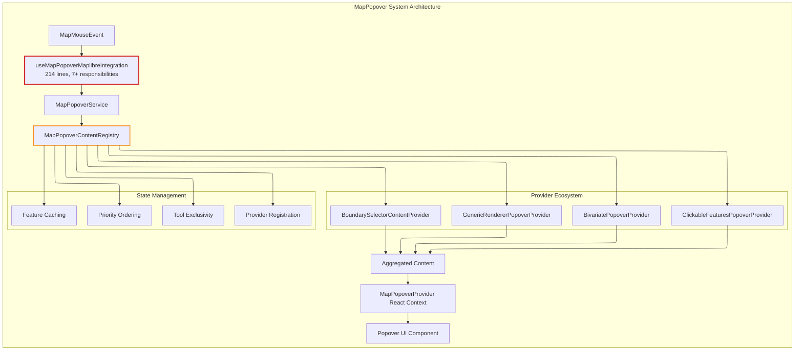

# R012: MapPopover Architecture Issues - Current State Analysis

## Executive Summary

Investigation of the MapPopover system reveals significant architectural issues in the current implementation including Single Responsibility Principle violations in the integration hook (214 lines managing 7+ responsibilities), performance bottlenecks from eager feature querying and multiple state updates, silent error handling that masks provider failures, and memory management concerns from improper provider cleanup. The system implements a provider-based content aggregation pattern but suffers from responsibility mixing between content coordination and tool state management.

## System Architecture

### Core Pattern: Provider-Based Content Aggregation

**Location**: [`src/core/map/popover/MapPopoverContentRegistry.ts:9-204`](../../src/core/map/popover/MapPopoverContentRegistry.ts#L9-L204)

The system implements a registry pattern where multiple content providers contribute to a unified popover display through priority-based execution and content aggregation.



### Component List

| Component                            | Location                                                                                                              | Responsibilities                                   | Lines     |
| ------------------------------------ | --------------------------------------------------------------------------------------------------------------------- | -------------------------------------------------- | --------- |
| **MapPopoverContentRegistry**        | [`MapPopoverContentRegistry.ts:9-204`](../../src/core/map/popover/MapPopoverContentRegistry.ts#L9-L204)               | Provider coordination, tool state, feature caching | 204       |
| **useMapPopoverMaplibreIntegration** | [`useMapPopoverMaplibreIntegration.ts:37-214`](../../src/core/map/hooks/useMapPopoverMaplibreIntegration.ts#L37-L214) | Event handling, position tracking, ref management  | 214       |
| **MapPopoverProvider**               | [`MapPopoverProvider.tsx:52-218`](../../src/core/map/popover/MapPopoverProvider.tsx#L52-L218)                         | React context, popover state, UI rendering         | 166       |
| **MapPopoverService**                | [`types.ts:12-33`](../../src/core/map/types.ts#L12-L33)                                                               | Service interface definition                       | Interface |

## Implementation Analysis

### Data Structures

**ProviderRegistration Structure**: [`types.ts:94-100`](../../src/core/map/types.ts#L94-L100)

```typescript
export interface ProviderRegistration {
  provider: IMapPopoverContentProvider;
  priority: number;
  registrationOrder: number;
  isActive: boolean;
  toolId?: string;
}
```

**Registry State Management**: [`MapPopoverContentRegistry.ts:10-18`](../../src/core/map/popover/MapPopoverContentRegistry.ts#L10-L18)

```typescript
private providers = new Map<string, ProviderRegistration>();
private orderedProviderIds: string[] = [];
private currentToolState: { activeToolId?: string; isExclusive: boolean };
private exclusiveProviderId: string | null = null;
private registrationCounter = 0;
private currentMapEvent: MapMouseEvent | null = null;
private cachedFeatures: MapGeoJSONFeature[] | null = null;
private onCloseCallback: (() => void) | null = null;
```

### Algorithms

**Provider Priority Sorting**: [`MapPopoverContentRegistry.ts:156-164`](../../src/core/map/popover/MapPopoverContentRegistry.ts#L156-L164)

The registry maintains provider execution order through dual-criteria sorting: primary by priority value (higher numbers execute first), secondary by registration order (earlier registration wins ties). This ensures predictable behavior when multiple providers have identical priorities.

**Complexity**: O(n log n) for sorting operations, O(1) for Map-based provider lookups during rendering.

### Control Mechanisms

**Dual Execution Modes**: The registry operates in two distinct modes that determine provider execution strategy.

**Exclusive Mode**: When tools like boundary selector or drawing tools are active, only the designated exclusive provider executes. This prevents interference from other providers during tool-specific interactions. The system validates exclusive provider existence and falls back to no content if the exclusive provider is unavailable.

**Normal Mode**: Standard aggregation where all active providers execute in priority order. Each provider contributes content that gets wrapped in a keyed div element for stable React reconciliation. The aggregation continues even if individual providers fail, ensuring partial functionality rather than complete failure.

## Current Usage Analysis

### Provider Inventory

| Provider                             | Source ID Pattern       | Priority       | Registration Location                                                                                                                          |
| ------------------------------------ | ----------------------- | -------------- | ---------------------------------------------------------------------------------------------------------------------------------------------- |
| **GenericRendererPopoverProvider**   | `tooltip-${sourceId}`   | `NORMAL` (100) | [`GenericRenderer.ts:302-310`](../../src/core/logical_layers/renderers/GenericRenderer.ts#L302-L310)                                           |
| **BivariatePopoverProvider**         | `bivariate-${sourceId}` | `NORMAL` (100) | [`BivariateRenderer.tsx:155-165`](../../src/core/logical_layers/renderers/BivariateRenderer/BivariateRenderer.tsx#L155-L165)                   |
| **ClickableFeaturesPopoverProvider** | `clickable-${sourceId}` | `NORMAL` (100) | [`ClickableFeaturesRenderer.ts:45-55`](../../src/core/logical_layers/renderers/ClickableFeaturesRenderer/ClickableFeaturesRenderer.ts#L45-L55) |
| **BoundarySelectorContentProvider**  | `boundary-selector`     | `HIGH` (500)   | [`BoundarySelectorContentProvider.tsx:17-25`](../../src/features/boundary_selector/components/BoundarySelectorContentProvider.tsx#L17-L25)     |
| **DebugMapPopoverProvider**          | `debug`                 | `DEBUG` (1)    | [`DebugMapPopoverProvider.tsx:7-15`](../../src/core/map/popover/DebugMapPopoverProvider.tsx#L7-L15)                                            |

### Usage Patterns

**Registration Pattern**: All providers follow lifecycle-based registration tied to logical layer renderer mounting. Each provider creates a unique ID based on its source and registers during `willMount`, then unregisters during `willUnMount`. This pattern creates tight coupling between layer lifecycle and popup functionality.

**Performance Characteristics**: Registry operations use Map<string, ProviderRegistration> for O(1) provider lookups. Typical production environment has 5+ active providers with rendering performance dependent on provider count and content complexity. The system scales linearly with provider count during normal mode execution.

## State Management Integration

### React Context Integration

**Location**: [`MapPopoverProvider.tsx:42-88`](../../src/core/map/popover/MapPopoverProvider.tsx#L42-L88)

The provider establishes React context for service access but creates an integration gap through optional registry parameter. When no registry is provided, the service fails silently, returning false for all content requests. This design allows flexible integration but introduces potential runtime failures that are difficult to debug.

### Dependencies

**Service Dependencies**: The system creates a dependency hierarchy where MapPopoverService depends on IMapPopoverContentRegistry, which depends on IMapPopoverContentProvider implementations. Providers themselves depend on domain-specific state atoms and configurations, creating deep dependency chains that complicate testing and maintenance.

**Lifecycle Dependencies**: Provider registration is tightly coupled to logical layer renderer lifecycle through `willMount`/`willUnMount` pattern. This creates architectural rigidity where popup functionality cannot exist independently of layer management, limiting reusability and increasing complexity in scenarios where popups might be needed without corresponding layers.

## Architectural Inconsistencies

### Single Responsibility Principle Violations

**Primary Violation**: [`useMapPopoverMaplibreIntegration.ts:37-214`](../../src/core/map/hooks/useMapPopoverMaplibreIntegration.ts#L37-L214)

Single hook managing 7 distinct responsibilities in 214 lines:

- ❌ Ref management (8+ refs)
- ❌ Click event handling
- ❌ Position tracking coordination
- ❌ Content rendering orchestration
- ❌ Registry management
- ❌ Error handling
- ❌ Event binding lifecycle

**Secondary Violation**: [`MapPopoverContentRegistry.ts:9-204`](../../src/core/map/popover/MapPopoverContentRegistry.ts#L9-L204)

Registry class mixing content coordination with tool state management:

- ✅ Provider registration/unregistration
- ❌ Exclusive mode management (`setExclusiveMode`, `clearExclusiveMode`)
- ❌ Tool state tracking (`updateToolState`)
- ❌ Close callback coordination (`setCloseCallback`)

### Performance Issues

**Multiple State Updates**: [`MapPopoverProvider.tsx:120-130`](../../src/core/map/popover/MapPopoverProvider.tsx#L120-L130)

```typescript
const updatePosition = useCallback((point: ScreenPoint, placement?: Placement) => {
  setGlobalPopover((prev) => {
    // ❌ Forces re-render of entire provider context
    return { ...prev, screenPoint: point, placement: placement ?? prev.placement };
  });
}, []);
```

### Error Handling Inconsistencies

**Silent Failures**: [`MapPopoverContentRegistry.ts:196-203`](../../src/core/map/popover/MapPopoverContentRegistry.ts#L196-L203)

```typescript
try {
  return registration.provider.renderContent(context);
} catch (error) {
  console.error(`Error in MapPopover provider "${context.getProviderInfo().id}":`, error);
  return null; // ❌ No user feedback, no recovery mechanism
}
```

**Generic Error Handling**: Integration hook catches errors without recovery:

```typescript
} catch (error) {
  console.error('Error updating popover position:', error);
  // ❌ No user feedback, popover may become stuck
}
```

### Memory Management Issues

**Provider Replacement**: [`MapPopoverContentRegistry.ts:21-37`](../../src/core/map/popover/MapPopoverContentRegistry.ts#L21-L37)

```typescript
register(id: string, provider: IMapPopoverContentProvider): void {
  if (this.providers.has(id)) {
    console.warn(`MapPopover provider "${id}" already registered, replacing`);
  }
  this.providers.set(id, registration); // ❌ Old provider not cleaned up properly
}
```

## System Boundaries

### What's Managed by MapPopover System

- ✅ **Content Provider Registration**: ID-based registration with priority ordering
- ✅ **Content Aggregation**: Multiple providers contributing to unified popover
- ✅ **Feature Query Optimization**: Shared feature loading across providers
- ✅ **Tool Coordination**: Exclusive mode for tools requiring isolation
- ✅ **Position Tracking**: Geographic point following during map movement
- ✅ **UI Rendering**: Popover positioning and display management

### What's Outside the System

- ❌ **Map Event Handling**: Managed by `mapListenersAtom` priority system
- ❌ **Tool Lifecycle**: Tool activation/deactivation controlled by toolbar
- ❌ **Layer Management**: Logical layer mounting/unmounting independent
- ❌ **Content Generation**: Individual providers control their rendering logic
- ❌ **State Persistence**: No popover state stored beyond session
- ❌ **Multi-Map Coordination**: Each map instance has isolated popover system

### Integration Boundaries

- **Upstream**: Receives events through `registerMapListener` priority chain and - direct MapLibre event binding
- **Downstream**: Provides coordinated content to React context and UI components
- **Lateral**: Coordinates with tool state atoms while maintaining independence - from renderer lifecycle patterns
