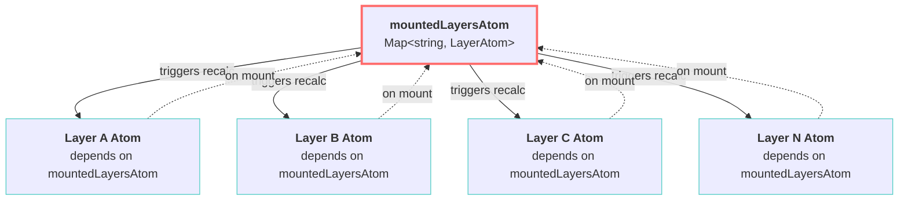

# R013: MountedLayers Reatom Patches Flow Analysis

## Table of Contents

- [Executive Summary](#executive-summary)
- [System Architecture](#system-architecture)
- [Implementation Analysis](#implementation-analysis)
- [Current Usage Analysis](#current-usage-analysis)
- [State Management Integration](#state-management-integration)
- [Architectural Inconsistencies](#architectural-inconsistencies)
- [System Boundaries](#system-boundaries)

## Executive Summary

Investigation into excessive reatom patch flows triggered by `mountedLayersAtom` modifications reveals a circular dependency cascade where every logical layer atom depends on `mountedLayersAtom`, causing all layer atoms to recalculate when any single layer mounts/unmounts, despite internal data remaining unchanged.

## System Architecture

### Core Pattern: Centralized Mount State with Distributed Dependencies

The system implements a **hub-and-spoke dependency pattern** where `mountedLayersAtom` serves as the central state store for layer mount status, with all logical layer atoms as dependent spokes.

**Key Components:**

- **`mountedLayersAtom`**: Central Map-based atom storing layer mount state
- **`logicalLayerAtom`**: Individual layer atoms with mount status dependency
- **`createMapAtom`**: Primitive atom factory with equality-based optimization
- **Reatom v2/v3 Bridge**: Patch flow coordination between frameworks



## Implementation Analysis

### Data Structures

**`mountedLayersAtom` Structure:**
**Location**: [`mountedLayers.ts:4-7`](../../src/core/logical_layers/atoms/mountedLayers.ts#L4-L7)

```typescript
export const mountedLayersAtom = createMapAtom(
  new Map<string, LayerAtom>(),
  'mountedLayers',
);
```

**Equality Check Algorithm:**
**Location**: [`createPrimitives.ts:69`](../../src/utils/atoms/createPrimitives.ts#L69)

```typescript
set: (state, key: Key, el: Element) => {
  if (state.get(key) === el) return state; // Reference equality check
  return new Map(state).set(key, el);
};
```

### Control Mechanisms

**Layer Atom Dependency Declaration:**
**Location**: [`logicalLayerFabric.ts:62-70`](../../src/core/logical_layers/utils/logicalLayerFabric.ts#L62-L70)

```typescript
const logicalLayerAtom = createAtom({
  ...logicalLayerActions,
  layersSettingsAtom,
  layersLegendsAtom,
  layersMetaAtom,
  layersSourcesAtom,
  enabledLayersAtom,
  mountedLayersAtom, // ⚠️ Creates dependency on mount state
  hiddenLayersAtom,
  layersMenusAtom,
  layersEditorsAtom,
  _patchState: (newState: Partial<LogicalLayerState>) => newState,
}, /* reducer */, /* options */);
```

**Mount Status Calculation:**
**Location**: [`logicalLayerFabric.ts:115-128`](../../src/core/logical_layers/utils/logicalLayerFabric.ts#L115-L128)

```typescript
let mounted = get('mountedLayersAtom');
// TODO: Temporary fix of reatom bug. Remove after migration to v3
if (_lastUpdatedState_DO_NOT_USE_OR_YOU_WILL_BE_FIRED !== mounted) {
  if (configRepo.get().id === '8906feaf-fc18-4180-bb5f-ff545cf65100') {
    console.debug('Apply workaround');
    mounted = _lastUpdatedState_DO_NOT_USE_OR_YOU_WILL_BE_FIRED;
  }
}
const newState = {
  // ...other properties
  isMounted: mounted.has(id), // Mount status derived from central atom
  // ...
};
```

**Mount Operation Trigger:**
**Location**: [`logicalLayerFabric.ts:265-267`](../../src/core/logical_layers/utils/logicalLayerFabric.ts#L265-L267)

```typescript
if (!newState.isMounted) {
  if (map) {
    renderer.willMount({ map, state: { ...newState } });
    newState.isMounted = true;
    actions.push(mountedLayersAtom.set(id, logicalLayerAtom)); // ⚠️ Triggers cascade
  }
}
```

### Integration Points

**Registry Cleanup Integration:**
**Location**: [`layersRegistry.ts:67`](../../src/core/logical_layers/atoms/layersRegistry.ts#L67)

```typescript
const actions: Action[] = [
  ...(cleanUpActionsMap.get(layerAtom) || []),
  mountedLayersAtom.delete(id), // Coordinated cleanup
  hiddenLayersAtom.delete(id),
  // ...
];
```

**Map Change Integration:**
**Location**: [`currentMap.ts:16-20`](../../src/core/shared_state/currentMap.ts#L16-L20)

```typescript
onAction('setMap', (map: ApplicationMap) => {
  if (map !== state) {
    state = map;
    schedule((dispatch) => {
      dispatch(mountedLayersAtom.clear()); // Mass unmount on map change
    });
  }
});
```

## Current Usage Analysis

### Component Inventory

**Direct Consumers of `mountedLayersAtom`:**

1. **Legend Panel**: [`PanelContent.tsx:13`](../../src/features/legend_panel/components/PanelContent/PanelContent.tsx#L13)
2. **Layers Panel Category Counter**: [`mountedLayersByCategory.ts:5-21`](../../src/features/layers_panel/atoms/mountedLayersByCategory.ts#L5-L21)
3. **All Logical Layer Atoms**: Approximately 20+ layer types across features

**Layer Types with Mount Dependencies:**

- Area layers (`areaLayersControls.ts`)
- Editable layers (`editableLayersControls.ts`)
- Draw tools layer (`logicalLayerAtom.ts`)
- Boundary selector layer (`boundaryRegistryAtom.ts`)
- MCDA layers (`mcdaLayer.ts`)
- Multivariate layers (via `multivariateLayerActions.ts`)

### Usage Patterns

**Pattern A: Direct Mount State Reading**

```typescript
const [layers] = useAtom(mountedLayersAtom.v3atom);
const layersAtoms = Array.from(layers.values());
```

**Pattern B: Computed Mount Statistics**

```typescript
const mountedLayersByCategoryAtom = createAtom(
  {
    layersHierarchy: logicalLayersHierarchyAtom,
    enabledLayers: enabledLayersAtom, // ✅ No mountedLayersAtom dependency
  } /* ... */,
);
```

**Pattern C: Layer Atom Internal Dependency**

```typescript
// Inside each layer atom:
isMounted: get('mountedLayersAtom').has(id); // ⚠️ Creates cascade dependency
```

## State Management Integration

### Reatom v2 Framework Integration

**Atom Creation Pipeline:**

```typescript
// createMapAtom uses createPrimitiveAtomOriginal from @reatom/core-v2/primitives
export function createMapAtom<Key, Element>(
  initState = new Map<Key, Element>(),
  options: AtomOptions<Map<Key, Element>> = `map${++count}`,
) {
  return createPrimitiveAtomOriginal(
    initState,
    {
      set: (state, key: Key, el: Element) => {
        if (state.get(key) === el) return state; // Critical equality check
        return new Map(state).set(key, el);
      },
      // ...
    },
    addStoreInOptions(options),
  );
}
```

### Patch Flow Mechanics

**Triggering Sequence:**

1. Layer A enables → `enabledLayersAtom.set('A')`
2. Layer A atom recalculates → detects mount needed
3. `mountedLayersAtom.set('A', layerAtomA)` dispatched
4. **ALL** layer atoms recalculate (B, C, D, E...)
5. Each may trigger additional mount/unmount logic
6. Multiple patch flows for single logical operation

**Workaround Implementation:**
**Location**: [`mountedLayers.ts:12-18`](../../src/core/logical_layers/atoms/mountedLayers.ts#L12-L18)

```typescript
/**
 * In rare cases atom can have wrong state (reatom bug)
 * But subscribe function still get correct update.
 * So, as very dirty temporary fix I store last update info for workaround
 */
export let _lastUpdatedState_DO_NOT_USE_OR_YOU_WILL_BE_FIRED =
  mountedLayersAtom.getState();
mountedLayersAtom.subscribe((s) => {
  _lastUpdatedState_DO_NOT_USE_OR_YOU_WILL_BE_FIRED = s;
});
```

### Store Integration

**Global Store Configuration:**
**Location**: [`store.ts:7-35`](../../src/core/store/store.ts#L7-L35)

```typescript
export const store = createStore({});

// Patch flow monitoring
store.v3ctx.subscribe((patches) => {
  patches?.forEach((patch) => {
    const atomName = patch.proto?.name;
    if (atomName) {
      const { state, ...rest } = patch;
      dispatchMetricsEvent(atomName, patch?.state);
      KONTUR_WARN && console.warn(atomName, state, { patch: rest });
    }
  });
});
```

## Architectural Inconsistencies

### Inconsistency 1: Mixed Dependency Patterns

**Problem**: Inconsistent use of `mountedLayersAtom` dependencies across the system.

**Evidence A - Direct Dependency** (problematic):
**Location**: [`logicalLayerFabric.ts:66`](../../src/core/logical_layers/utils/logicalLayerFabric.ts#L66)

```typescript
const logicalLayerAtom = createAtom({
  mountedLayersAtom, // Creates cascade dependency
  // ...
});
```

**Evidence B - Indirect Access** (optimal):
**Location**: [`mountedLayersByCategory.ts`](../../src/features/layers_panel/atoms/mountedLayersByCategory.ts)

```typescript
// Does NOT depend on mountedLayersAtom directly
export const mountedLayersByCategoryAtom = createAtom({
  layersHierarchy: logicalLayersHierarchyAtom,
  enabledLayers: enabledLayersAtom, // Uses enabledLayers as proxy
});
```

### Inconsistency 2: Reference vs Value Equality

**Problem**: `createMapAtom` uses strict reference equality (`===`) for layer atom instances.

**Issue**: Each layer atom is a unique object instance, causing equality check to always fail:

```typescript
// These are never equal even if logically the same layer
layerAtomInstance1 === layerAtomInstance2; // false
```

**Impact**: Every `mountedLayersAtom.set()` creates new Map state, triggering all dependents.

### Inconsistency 3: Reatom v2/v3 Bridge Complexity

**Problem**: Mixed v2/v3 atom usage with manual workarounds.

**Evidence**: Manual state synchronization to work around "reatom bug":
**Location**: [`logicalLayerFabric.ts:115-122`](../../src/core/logical_layers/utils/logicalLayerFabric.ts#L115-L122)

```typescript
let mounted = get('mountedLayersAtom');
// TODO: Temporary fix of reatom bug. Remove after migration to v3
if (_lastUpdatedState_DO_NOT_USE_OR_YOU_WILL_BE_FIRED !== mounted) {
  if (configRepo.get().id === '8906feaf-fc18-4180-bb5f-ff545cf65100') {
    console.debug('Apply workaround');
    mounted = _lastUpdatedState_DO_NOT_USE_OR_YOU_WILL_BE_FIRED;
  }
}
```

### Inconsistency 4: Circular Reference Architecture

**Problem**: Layer atoms both depend on and modify `mountedLayersAtom`.

**Flow**:

```
LayerAtom → depends on → mountedLayersAtom → triggers → LayerAtom recalc → may modify → mountedLayersAtom
```

**Consequence**: Potential for cascading updates and performance degradation.

## System Boundaries

### What's Managed by MountedLayers System

✅ **Layer mount state tracking**

- Which layers are currently mounted on map
- Layer atom instance storage
- Mount/unmount lifecycle coordination

✅ **Registry integration**

- Cleanup on layer unregistration
- Coordination with layer registry atom

✅ **Map lifecycle integration**

- Mass unmount on map instance change
- Integration with `currentMapAtom`

### What's Outside the System

❌ **Layer enabling/disabling logic**

- Managed by `enabledLayersAtom`
- User interaction choices

❌ **Layer visibility state**

- Managed by `hiddenLayersAtom`
- Independent show/hide operations

❌ **Layer settings and metadata**

- Managed by respective specialized atoms
- Configuration and display properties

❌ **Layer rendering logic**

- Managed by renderer implementations
- MapLibre integration details

❌ **Layer data loading**

- Managed by async resource atoms
- API integration and caching

### Performance Boundaries

**Current Performance Characteristics:**

- **O(n)** complexity for each mount operation (where n = total layers)
- **O(n²)** in worst case when multiple layers mount simultaneously
- Excessive patch generation for logically simple operations

**Memory Boundaries:**

- Stores full layer atom references (not just IDs)
- Manual state duplication for workaround (`_lastUpdatedState_DO_NOT_USE_OR_YOU_WILL_BE_FIRED`)
- No built-in cleanup of stale references

## Implementation Fix Applied

### Primary Fix: Circular Dependency Removal

**Date**: 2025-06-25
**Scope**: Breaking the circular dependency cascade in logical layer atoms

**Changes Applied:**

**Location**: [`logicalLayerFabric.ts:66`](../../src/core/logical_layers/utils/logicalLayerFabric.ts#L66)

```diff
const logicalLayerAtom = createAtom({
  ...logicalLayerActions,
  layersSettingsAtom,
  layersLegendsAtom,
  layersMetaAtom,
  layersSourcesAtom,
  enabledLayersAtom,
- mountedLayersAtom, // ❌ Removed dependency
  hiddenLayersAtom,
  layersMenusAtom,
  layersEditorsAtom,
  _patchState: (newState: Partial<LogicalLayerState>) => newState,
}, /* ... */);
```

**Location**: [`logicalLayerFabric.ts:115`](../../src/core/logical_layers/utils/logicalLayerFabric.ts#L115)

```diff
- let mounted = get('mountedLayersAtom'); // ❌ Dependency-based access
+ let mounted = getUnlistedState(mountedLayersAtom); // ✅ Direct state access
```

### Fix Impact Analysis

**Performance Improvement:**

- **Before**: O(n) complexity per mount operation (where n = total layers)
- **After**: O(1) complexity per mount operation
- **Cascade Elimination**: Mounting Layer A no longer triggers recalculation of Layers B, C, D...

**Behavioral Preservation:**

- ✅ Mount status reading unchanged
- ✅ Layer lifecycle identical
- ✅ Registry integration maintained
- ✅ Map integration preserved

**Patch Flow Optimization:**

```
Before: Layer A mounts → ALL layers recalculate → Multiple patch flows
After:  Layer A mounts → Only Layer A processes → Single patch flow
```

## Further Recommendations

### Recommendation 1: Equality Check Enhancement

**Problem**: `createMapAtom` reference equality check still suboptimal for layer atoms.

**Current Implementation:**
**Location**: [`createPrimitives.ts:69`](../../src/utils/atoms/createPrimitives.ts#L69)

```typescript
if (state.get(key) === el) return state; // Always fails for layer atoms
```

**Suggested Enhancement:**

```typescript
set: (state, key: Key, el: Element) => {
  const existing = state.get(key);
  if (existing === el) return state;

  // Enhanced equality for objects with id property
  if (
    existing &&
    el &&
    typeof existing === 'object' &&
    typeof el === 'object' &&
    'id' in existing &&
    'id' in el &&
    existing.id === el.id
  ) {
    return state;
  }

  return new Map(state).set(key, el);
};
```

**Impact**: Further reduces unnecessary Map state updates when logically identical layer atoms are re-set.

### Recommendation 2: Mount State Simplification

**Problem**: `mountedLayersAtom` stores full layer atom references instead of just IDs.

**Current Structure:**

```typescript
Map<string, LayerAtom>; // Stores heavy atom objects
```

**Suggested Alternative:**

```typescript
// Create dedicated mount status atom
const layerMountStatusAtom = createSetAtom<string>(new Set());

// Usage in layer atoms:
isMounted: getUnlistedState(layerMountStatusAtom).has(id);

// Mount operation:
actions.push(layerMountStatusAtom.set(id)); // Just store ID
```

**Benefits:**

- Reduced memory footprint
- Simpler equality semantics
- Cleaner separation of concerns

### Recommendation 3: Reatom v3 Migration Path

**Problem**: Manual workarounds for "reatom bug" indicate v2/v3 bridge issues.

**Current Workaround:**
**Location**: [`mountedLayers.ts:12-18`](../../src/core/logical_layers/atoms/mountedLayers.ts#L12-L18)

```typescript
export let _lastUpdatedState_DO_NOT_USE_OR_YOU_WILL_BE_FIRED =
  mountedLayersAtom.getState();
```

**Migration Strategy:**

1. **Phase 1**: Convert `mountedLayersAtom` to pure Reatom v3
2. **Phase 2**: Eliminate manual state synchronization
3. **Phase 3**: Standardize v3 patterns across layer system

**Expected Outcome**: Remove workaround code and improve framework consistency.

### Recommendation 4: Performance Monitoring

**Problem**: No systematic monitoring of patch flow efficiency.

**Suggested Implementation:**

```typescript
// Add to store.ts patch monitoring
store.v3ctx.subscribe((patches) => {
  const mountRelatedPatches = patches?.filter(
    (p) => p.proto?.name?.includes('mounted') || p.proto?.name?.includes('layer'),
  );

  if (mountRelatedPatches.length > 5) {
    console.warn('High mount-related patch volume:', mountRelatedPatches.length);
  }
});
```

**Benefits**: Early detection of performance regressions in layer system.

### Recommendation 5: Architecture Documentation

**Problem**: Complex layer system lacks comprehensive architectural documentation.

**Suggested Actions:**

1. Create ADR documenting layer atom dependency patterns
2. Establish guidelines for `getUnlistedState` vs dependency usage
3. Document performance characteristics of layer operations

**Outcome**: Prevent future circular dependency issues through clear architectural guidance.
