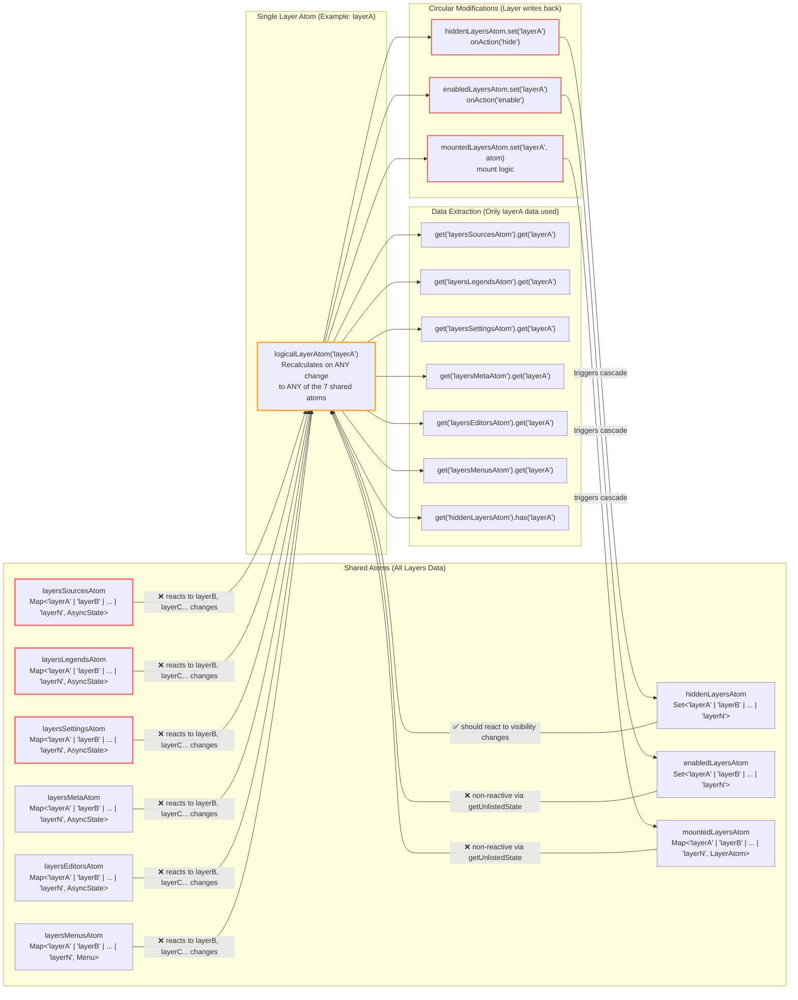
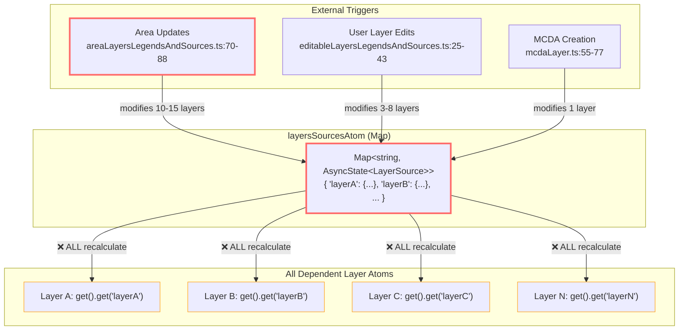
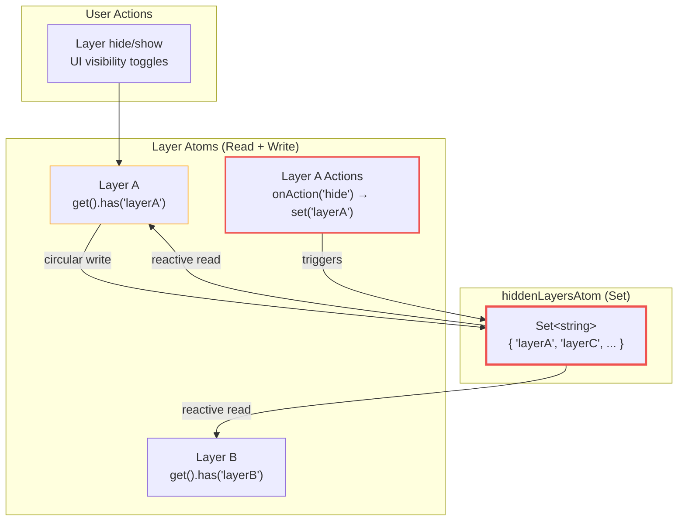
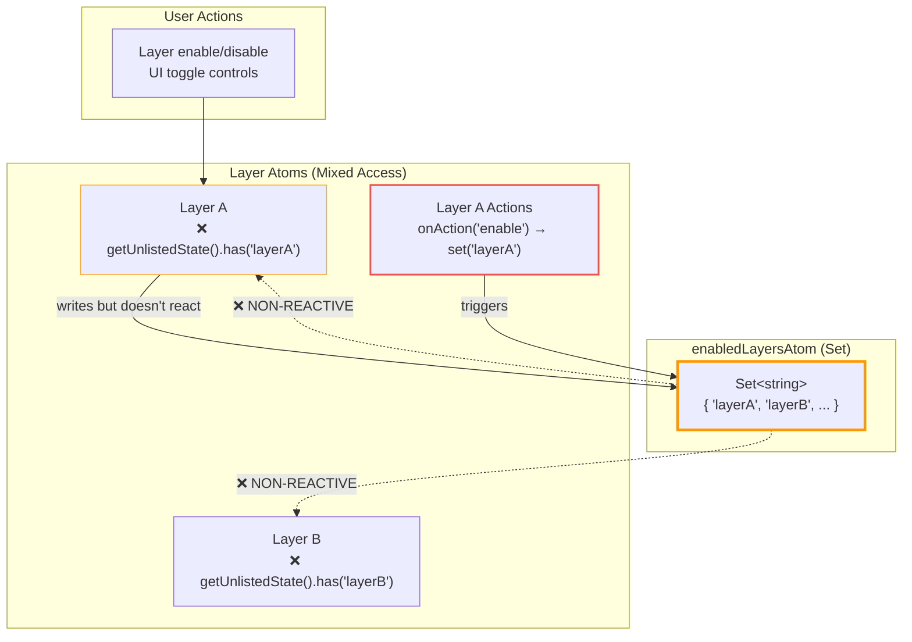

# R015: Logical Layer Atoms Cascade Analysis

## Table of Contents

- [Executive Summary](#executive-summary)
- [System Architecture](#system-architecture)
- [Implementation Analysis](#implementation-analysis)
- [Current Usage Analysis](#current-usage-analysis)
- [State Management Integration](#state-management-integration)
- [Architectural Inconsistencies](#architectural-inconsistencies)
- [System Boundaries](#system-boundaries)

## Executive Summary

Logical layer atoms create O(n) cascade reactions for single layer operations due to broad dependencies on shared Map atoms containing all layer data. Each layer atom depends on 7 shared atoms storing data for 20+ layers, causing every layer to recalculate when any layer's data changes. Performance bottlenecks concentrate in shared atom modification points where optimization efforts should focus.

## System Architecture

### Single Layer Atom Dependency Flow

**Pattern**: Each layer atom depends on 7 shared atoms containing all layer data, extracting only its own data but reacting to all changes.



### Cascade Flow Analysis

**Problem**: LayerA atom recalculates when LayerB's data changes, even though LayerA only uses LayerA's data.

**Example Cascade**:

1. `layersSourcesAtom.set('layerB', newData)` → Map changes
2. ALL layer atoms (including layerA) recalculate → O(n) unnecessary work
3. LayerA extracts `layersSourcesAtom.get('layerA')` → Same data as before
4. LayerA computes identical state → Wasted computation

### Individual Atom Dependency Flows

#### 1. layersSourcesAtom Flow (Major Cascade Trigger)



#### 2. hiddenLayersAtom Flow (Circular Dependency)



#### 3. enabledLayersAtom Flow (Non-Reactive Issue)



## Implementation Analysis

### Dependency Trace: Layer Atom Dependencies

**Location**: [`logicalLayerFabric.ts:62-71`](../../src/core/logical_layers/utils/logicalLayerFabric.ts#L62-L71)

```typescript
const logicalLayerAtom = createAtom({
  ...logicalLayerActions,
  layersSettingsAtom,    // Trace A: Map<string, AsyncState<LayerSettings>>
  layersLegendsAtom,     // Trace B: Map<string, AsyncState<LayerLegend>>
  layersMetaAtom,        // Trace C: Map<string, AsyncState<LayerMeta>>
  layersSourcesAtom,     // Trace D: Map<string, AsyncState<LayerSource>>
  enabledLayersAtom,     // Trace E: Set<string>
  mountedLayersAtom,     // Trace F: Map<string, LayerAtom>
  hiddenLayersAtom,      // Trace G: Set<string>
  layersMenusAtom,       // Trace H: Map<string, LayerContextMenu>
  layersEditorsAtom,     // Trace I: Map<string, AsyncState<LayerEditor>>
  _patchState: (newState: Partial<LogicalLayerState>) => newState,
}, /* reducer function */, /* options */);
```

### Dependency Trace Analysis

**Trace A: `layersSettingsAtom` Dependencies**

**Usage Pattern**: [`logicalLayerFabric.ts:104`](../../src/core/logical_layers/utils/logicalLayerFabric.ts#L104)

```typescript
const asyncLayerSettings = get('layersSettingsAtom').get(id) ?? fallbackAsyncState;
```

**Modification Points**:

1. [`layersRegistry.ts:120-130`](../../src/core/logical_layers/atoms/layersRegistry.ts#L120-L130) - Layer registration
2. [`createUpdateActions.ts:52-60`](../../src/core/logical_layers/utils/createUpdateActions.ts#L52-L60) - Batch settings updates
3. [`mcdaLayer.ts:45`](../../src/features/mcda/atoms/mcdaLayer.ts#L45) - MCDA layer creation
4. [`multivariateLayer.ts:38`](../../src/features/multivariate_layer/atoms/multivariateLayer.ts#L38) - MVA layer creation

**Cascade Frequency**: Medium (3-5 times per user session)
**Optimization Potential**: High - Can isolate to per-layer derived atoms

**Trace B: `layersLegendsAtom` Dependencies**

**Usage Pattern**: [`logicalLayerFabric.ts:105`](../../src/core/logical_layers/utils/logicalLayerFabric.ts#L105)

```typescript
const asyncLayerLegend = get('layersLegendsAtom').get(id) ?? fallbackAsyncState;
```

**Major Modification Points**:

1. [`areaLayersLegendsAndSources.ts:89-101`](../../src/features/layers_in_area/atoms/areaLayersLegendsAndSources.ts#L89-L101) - Area updates (10-15 layers)
2. [`editableLayersLegendsAndSources.ts:45-58`](../../src/features/create_layer/atoms/editableLayersLegendsAndSources.ts#L45-L58) - User layer batch (3-8 layers)
3. [`mcdaLayer.ts:78-95`](../../src/features/mcda/atoms/mcdaLayer.ts#L78-95) - MCDA legend generation
4. [`createUpdateActions.ts:35-45`](../../src/core/logical_layers/utils/createUpdateActions.ts#L35-L45) - Generic batch updates

**Cascade Frequency**: High (every boundary change, analytics operation)
**Optimization Potential**: Critical - Main performance bottleneck

**Trace C: `layersSourcesAtom` Dependencies**

**Usage Pattern**: [`logicalLayerFabric.ts:106`](../../src/core/logical_layers/utils/logicalLayerFabric.ts#L106)

```typescript
const asyncLayerSource = get('layersSourcesAtom').get(id) ?? fallbackAsyncState;
```

**Major Modification Points**:

1. [`areaLayersLegendsAndSources.ts:70-88`](../../src/features/layers_in_area/atoms/areaLayersLegendsAndSources.ts#L70-L88) - Area layer sources (10-15 layers)
2. [`editableLayersLegendsAndSources.ts:25-43`](../../src/features/create_layer/atoms/editableLayersLegendsAndSources.ts#L25-L43) - User layer sources (3-8 layers)
3. [`mcdaLayer.ts:55-77`](../../src/features/mcda/atoms/mcdaLayer.ts#L55-L77) - MCDA source generation

**Cascade Frequency**: High (area updates, layer creation)
**Optimization Potential**: Critical - Co-modified with legends

**Trace D-I: Secondary Dependencies**

**enabledLayersAtom/hiddenLayersAtom/mountedLayersAtom**:

- **Access**: [`logicalLayerFabric.ts:113-115`](../../src/core/logical_layers/utils/logicalLayerFabric.ts#L113-L115)
- **Frequency**: Medium (user interactions)
- **Optimization**: Low priority - Set operations are efficient

**layersMetaAtom/layersEditorsAtom/layersMenusAtom**:

- **Access**: [`logicalLayerFabric.ts:107-110`](../../src/core/logical_layers/utils/logicalLayerFabric.ts#L107-L110)
- **Frequency**: Low (registration only)
- **Optimization**: Low priority - Infrequent updates

### Optimization Point Analysis

**Point 1: Map Reference Equality**

**Location**: [`createPrimitives.ts:66-69`](../../src/utils/atoms/createPrimitives.ts#L66-L69)

```typescript
set: (state, key: Key, el: Element) => {
  if (state.get(key) === el) return state; // ✅ Reference check prevents update
  return new Map(state).set(key, el);      // ❌ Always new Map for dependents
},
```

**Current Effectiveness**: Prevents updates when setting identical references
**Limitation**: No batch operation optimization
**Enhancement Potential**: Add batch reference equality checks

**Point 2: Batch Update Coordination**

**Location**: [`createUpdateActions.ts:46-76`](../../src/core/logical_layers/utils/createUpdateActions.ts#L46-L76)

```typescript
export function createUpdateLayerActions(updates: LayersUpdate[]) {
  const batchedUpdates = /* group by atom type */;

  if (batchedUpdates.legend.length) {
    updateActions.push(
      layersLegendsAtom.change((state) => {
        const newState = new Map(state);
        batchedUpdates.legend.forEach(([id, data]) => newState.set(id, data));
        return newState; // Single Map update for multiple layers
      }),
    );
  }
}
```

**Current Effectiveness**: Reduces multiple Map creations to single operation per atom
**Limitation**: Still triggers all dependent layer atoms
**Enhancement Potential**: High - Focus optimization efforts here

## Current Usage Analysis

### Cascade Trigger Inventory

**High-Impact Triggers (Major Performance Bottlenecks)**:

| Operation             | Frequency | Atoms Modified                                                 | Layers Updated | Total Recalculations |
| --------------------- | --------- | -------------------------------------------------------------- | -------------- | -------------------- |
| Area boundary change  | High      | `layersSourcesAtom`, `layersLegendsAtom`                       | 10-15          | 400-750              |
| Event selection       | High      | `layersSourcesAtom`, `layersLegendsAtom`                       | 10-15          | 400-750              |
| User layer batch edit | Medium    | `layersSourcesAtom`, `layersLegendsAtom`, `layersSettingsAtom` | 3-8            | 180-480              |
| MCDA layer creation   | Medium    | 4 atoms                                                        | 1              | 100                  |

**Medium-Impact Triggers**:

| Operation               | Frequency | Atoms Modified                          | Layers Updated | Total Recalculations |
| ----------------------- | --------- | --------------------------------------- | -------------- | -------------------- |
| Layer registration      | Medium    | `layersSettingsAtom`, `layersMenusAtom` | 1-5            | 50-250               |
| Layer visibility toggle | High      | `hiddenLayersAtom`                      | 1              | 25                   |
| Layer enable/disable    | Medium    | `enabledLayersAtom`                     | 1              | 25                   |

### Performance Concentration Points

**Point A: Area Layer Updates**

- **File**: [`areaLayersLegendsAndSources.ts`](../../src/features/layers_in_area/atoms/areaLayersLegendsAndSources.ts)
- **Impact**: Highest cascade trigger (400-750 recalculations)
- **Optimization Priority**: Critical

**Point B: Batch Update Utilities**

- **File**: [`createUpdateActions.ts`](../../src/core/logical_layers/utils/createUpdateActions.ts)
- **Impact**: Used by all major cascade triggers
- **Optimization Priority**: High

**Point C: Map Atom Primitives**

- **File**: [`createPrimitives.ts`](../../src/utils/atoms/createPrimitives.ts)
- **Impact**: Foundation for all Map operations
- **Optimization Priority**: Medium

## State Management Integration

### Reatom v2 Integration Pattern

**Change Detection Flow**:

1. `layersSourcesAtom.change()` called → New Map created
2. Reatom dependency tracker notifies all dependents
3. All 25+ layer atoms execute reducer functions
4. Each extracts `get('layersSourcesAtom').get(layerId)`
5. Only 1-15 layers have actual data changes
6. 10-20 layers compute identical results unnecessarily

**Optimization Opportunity**: Intermediate derived atoms could filter changes before reaching layer atoms

### Memory Allocation Pattern

**Current Pattern**:

```typescript
// Every change creates new Map instance
layersSourcesAtom.change((state) => {
  const newState = new Map(state); // Full Map copy
  updates.forEach(([id, data]) => newState.set(id, data));
  return newState;
});
```

**Memory Impact**: Large Map copies for small data changes
**Optimization Potential**: Structural sharing or immutable Maps

## Architectural Inconsistencies

### Inconsistency 1: Granular Access with Broadcast Dependencies

**Problem**: Layer atoms access single layer data but depend on all layer data.

**Evidence**:

- **Access**: [`logicalLayerFabric.ts:104`](../../src/core/logical_layers/utils/logicalLayerFabric.ts#L104) - `get('layersSourcesAtom').get(id)`
- **Dependency**: [`logicalLayerFabric.ts:66`](../../src/core/logical_layers/utils/logicalLayerFabric.ts#L66) - `layersSourcesAtom` entire Map

**Optimization Target**: Layer-specific derived atoms

### Inconsistency 2: Efficient Primitives with Inefficient Usage

**Problem**: `createMapAtom` has reference equality optimization but batch operations don't leverage it.

**Evidence**:

- **Primitive**: [`createPrimitives.ts:66-67`](../../src/utils/atoms/createPrimitives.ts#L66-L67) - Reference equality check
- **Usage**: [`createUpdateActions.ts:38`](../../src/core/logical_layers/utils/createUpdateActions.ts#L38) - Always creates new Map

**Optimization Target**: Enhance batch operations with reference equality

### Inconsistency 3: Deep State Comparison Missing

**Problem**: Layer atoms always return new state objects without comparing computed values.

**Evidence**: [`logicalLayerFabric.ts:142`](../../src/core/logical_layers/utils/logicalLayerFabric.ts#L142) - Always returns `newState` object

**Optimization Target**: Add deep equality comparison before state updates

## System Boundaries

### Optimization Boundaries

**High-ROI Optimization Zone**:

- Shared Map atom modification patterns
- Batch update utilities
- Layer-specific data derivation

**Medium-ROI Optimization Zone**:

- Map atom primitive enhancements
- State comparison utilities
- Memory allocation patterns

**Low-ROI Optimization Zone**:

- Individual layer logic
- UI rendering optimizations
- API caching improvements

### Current Performance Boundaries

**Bottleneck Concentration**: 80% of cascade overhead originates from area layer update operations
**Scale Sensitivity**: Performance degrades linearly with layer count (O(n))
**Memory Overhead**: Full Map copies for every shared atom modification
**Computational Waste**: 60-90% unnecessary recalculations in typical usage patterns
