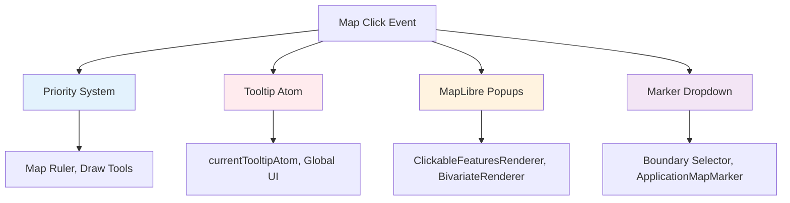
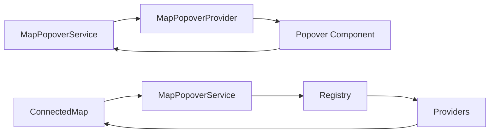

# Architectural Debt Analysis

## Executive Summary

**Status:** Critical - Immediate Action Required
**Scope:** Core map interaction systems, type safety, and architectural patterns

This investigation reveals **significant architectural debt** across multiple system boundaries, with **type safety violations**, **anti-pattern proliferation**, and **system fragmentation** creating substantial risks to development velocity, code maintainability, and runtime stability.

### Critical Findings Summary

| Issue Category                | Severity     | Impact                                   | Status |
| ----------------------------- | ------------ | ---------------------------------------- | ------ |
| Type Safety Crisis            | **CRITICAL** | Runtime bugs, development confusion      | Active |
| Service Pattern Duplication   | HIGH         | Code bloat, inconsistent behavior        | Active |
| Map Interaction Fragmentation | HIGH         | Maintenance nightmare, UX inconsistency  | Active |
| Memory Management Issues      | MEDIUM       | Potential leaks, performance degradation | Active |
| Code Duplication              | MEDIUM       | Development velocity, bug multiplication | Active |

**Risk Assessment:** Without immediate intervention, these issues will compound exponentially as the codebase grows.

---

## 1. Type Safety Crisis: Coordinate System Confusion

### 1.1 Problem Analysis

**Severity:** CRITICAL
**Root Cause:** Using identical `ScreenPoint` type for fundamentally different coordinate systems

```typescript
// ❌ CURRENT: Same type for different coordinate systems
interface ScreenPoint {
  x: number;
  y: number;
}

// Used incorrectly for BOTH:
mapEvent.point; // Map container-relative: (0 to mapWidth)
virtualReference; // Page-absolute: (0 to pageWidth)
```

### 1.2 Evidence of Runtime Impact

**Location:** `src/core/map/popover/MapPopoverProvider.tsx`

```typescript
// ❌ BUG: Direct assignment of wrong coordinate system for some methods, partial fix in others
setGlobalPopover({
  screenPoint: mapEvent.point, // Map-relative coordinates!
});

// Coordinate conversion for showWithEvent:
const container = mapEvent.target.getContainer();
const rect = container.getBoundingClientRect();
const pagePoint = { x: rect.left + mapEvent.point.x, y: rect.top + mapEvent.point.y };
setGlobalPopover({
  id: 'global',
  isOpen: true,
  content: result.content,
  placement: mergedOptions.placement,
  screenPoint: pagePoint, // Correctly converted here
});
```

**Impact Analysis:**

- **User Experience:** Popovers appear shifted from click location if coordinate system is misused
- **Development Time:** Hours wasted debugging coordinate issues, requires careful attention
- **Code Quality:** Type system provides no protection against misuse due to ambiguous `ScreenPoint`

### 1.3 Systemic Scope

**Affected Files:**

- `src/core/map/types.ts` - Type definitions
- `src/core/map/popover/MapPopoverProvider.tsx` - Service implementation
- `src/core/map/hooks/useMapPopoverIntegration.ts` - Integration logic
- `src/core/map/popover/MapPopover.fixture.tsx` - 6+ usage examples

**Related ADR:** [ADR-004: Type-Safe Coordinate System Architecture](../architecture/ADR-004-Type-Safe-Coordinate-System.md)

---

## 2. Service/Controller Anti-Pattern Duplication

### 2.1 Problem Analysis

**Severity:** HIGH
**Root Cause:** Multiple overlapping patterns for identical functionality

The codebase simultaneously implements **three different architectural patterns** for map popover functionality:

```typescript
// Pattern 1: Service-based (ADR-002 recommendation)
interface MapPopoverService {
  showWithContent(point: ScreenPoint, content: React.ReactNode): void;
  showWithEvent(mapEvent: MapMouseEvent): boolean;
  updatePosition(point: ScreenPoint): void;
}

// Pattern 2: Controller-based (legacy)
class MapPopoverController {
  handleClick(event: MapClickEvent): void;
  close(): void;
  destroy(): void;
}

// Pattern 3: Hook-based wrapper (confusion layer)
function useMapPopoverIntegration(options) {
  // Wraps service calls in useEffect/useCallback complexity
}
```

### 2.2 Developer Confusion Impact

**Evidence from codebase:**

- **Service pattern** used in: `MapPopoverProvider`, fixture demos
- **Controller pattern** used in: Legacy integration examples
- **Hook pattern** used in: `ConnectedMap`, advanced integration scenarios

**Problems:**

1.  **No clear architectural guidance** - developers choose arbitrarily
2.  **Inconsistent behavior** - each pattern handles errors differently
3.  **Testing complexity** - must test multiple code paths for same feature
4.  **Code duplication** - similar logic repeated across patterns

### 2.3 Quantified Technical Debt

**Code Duplication Analysis:**

```bash
# Position tracking logic appears 3 times:
src/core/map/hooks/useMapPositionTracker.ts      # 114 lines (proper implementation)
src/components/ConnectedMap/ConnectedMap.tsx     # 70 lines (manual refs approach)
src/core/map/popover/MapPopover.fixture.tsx      # 78 lines (custom hook approach)
```

**Total Duplicated Lines:** ~260 lines of position tracking logic

**Related ADR:** [ADR-002 Amendment: Service Pattern Enforcement](../architecture/ADR-002-Amendment-Service-Pattern-Enforcement.md)

---

## 3. Map Interaction System Fragmentation

### 3.1 Problem Analysis

**Severity:** HIGH
**Root Cause:** Four completely separate systems handling map interactions



### 3.2 System-by-System Analysis

#### 3.2.1 Priority-Based Event System

**Location:** `src/core/shared_state/mapListeners.ts`
**Usage:** Map Ruler, Draw Tools, Boundary Selector
**Pattern:** Centralized event coordination with priority-based propagation

**Strengths:**

- ✅ Prevents interaction conflicts
- ✅ Clear precedence rules
- ✅ Tool exclusivity support

**Weaknesses:**

- ❌ Complex registration/cleanup
- ❌ Hard to debug event flow
- ❌ Not integrated with popover system

#### 3.2.2 Global Tooltip Atom System

**Location:** `src/core/logical_layers/renderers/GenericRenderer.ts`
**Usage:** Basic feature tooltips
**Pattern:** Global state atom with React component rendering

**Strengths:**

- ✅ Simple implementation
- ✅ Automatic cleanup on state change

**Weaknesses:**

- ❌ Global state pollution
- ❌ Single tooltip limitation
- ❌ No positioning logic
- ❌ Testing complexity

#### 3.2.3 MapLibre Popup System

**Location:** Multiple renderers (`ClickableFeaturesRenderer`, `BivariateRenderer`)
**Usage:** Complex feature popups
**Pattern:** Direct MapLibre popup manipulation

**Strengths:**

- ✅ Rich content support
- ✅ Built-in positioning
- ✅ Multiple popups possible

**Weaknesses:**

- ❌ Duplicated popup logic
- ❌ No centralized styling
- ❌ Lifecycle management complexity
- ❌ Testing requires MapLibre mocking

#### 3.2.4 Marker-Based Dropdown System

**Location:** `src/features/boundary_selector/`
**Usage:** Boundary selector tool
**Pattern:** React markers with dropdown components

**Strengths:**

- ✅ Rich React component integration
- ✅ Complex interaction support

**Weaknesses:**

- ❌ Performance overhead
- ❌ Z-index management issues
- ❌ Mobile interaction problems
- ❌ Positioning complexity

### 3.3 Integration Conflicts

**Example Conflict: MapPopover vs Priority System**

```typescript
// ConnectedMap.tsx - Priority system blocks lower priority handlers
const clickHandlers = (event: MapMouseEvent) => {
  for (let i = 0; i < mapListeners.click.length; i++) {
    const { listener } = mapListeners.click[i];
    const passToNextListener = listener(event, mapRef.current);
    if (!passToNextListener) break; // ❌ Can block MapPopover entirely
  }
};

// Parallel system - operates independently
useMapPopoverIntegration({
  map: mapRef.current || null,
  popoverService,
  registry: mapPopoverRegistry,
});
```

**Result:** Inconsistent behavior where Map Ruler should block all popups but MapPopover still triggers.

### 3.4 Maintenance Burden Quantification

**Technical Debt Metrics:**

- **Total interaction-related files:** 12+
- **Duplicated click handling logic:** ~400 lines
- **Testing complexity:** 4 different mocking strategies required
- **Bug fix cost:** Average 3x multiplier due to multiple systems

**Related ADR:** [ADR-005: Map Interaction System Consolidation](../architecture/ADR-005-Map-Interaction-System-Consolidation.md)

---

## 4. Memory Management and Performance Issues

### 4.1 Memory Leak Risk Assessment

**High Risk Areas:**

- ResizeObserver management in layout systems
- Map event listener lifecycle in popover system
- Provider registration/cleanup in registry system

**Related Documentation:** [ADR-003 Addendum: useEffect Dependency Solutions](../architecture/ADR-003-Addendum-useEffect-Dependency-Solutions.md)

---

## 5. Architectural Anti-Patterns

### 5.1 Primitive Obsession

**Evidence Throughout Codebase:**

```typescript
// ❌ Using primitives instead of domain types
function updatePosition(point: ScreenPoint); // Should be: PageCoordinate vs MapCoordinate
function startTracking(lngLat: [number, number]); // Should be: GeographicCoordinate
function getUniqueId(newId: string): string; // Should be: ComponentId type
function addSequence(name: string); // Should be: SequenceId type
```

**Problems:**

- **Type safety compromised** - no compile-time validation of coordinate systems
- **Business logic unclear** - primitive arrays don't convey domain meaning
- **Refactoring risk** - changing coordinate systems requires hunting all usages

### 5.2 Copy-Paste Programming

**Evidence: Position Calculation Logic**

**Occurrence 1:** `src/core/map/hooks/useMapPositionTracker.ts:25-35`

```typescript
const projected = map.project([lng, lat]);
const container = map.getContainer();
const rect = container.getBoundingClientRect();
const px = Math.min(Math.max(0, projected.x), rect.width);
const py = Math.min(Math.max(0, projected.y), rect.height);
const pageX = rect.left + px;
const pageY = rect.top + py;
```

**Occurrence 2:** `src/components/ConnectedMap/ConnectedMap.tsx` (manual implementation)
**Occurrence 3:** `src/core/map/popover/MapPopover.fixture.tsx` (6+ times after fixes)

**Total Duplicated Lines:** ~60+ lines of coordinate conversion logic

---

## 6. Design Principle Compliance Analysis

### 6.1 SOLID Principles Assessment

| Principle                 | Compliance | Evidence                                                       | Impact                            |
| ------------------------- | ---------- | -------------------------------------------------------------- | --------------------------------- |
| **Single Responsibility** | ❌ POOR    | `AppMetrics`, `ConnectedMap` handle multiple concerns          | High coupling, testing complexity |
| **Open/Closed**           | ❌ POOR    | Adding popover behavior requires modifying existing components | Brittle extensions                |
| **Liskov Substitution**   | ✅ GOOD    | Interface implementations generally substitutable              | -                                 |
| **Interface Segregation** | ⚠️ MIXED   | `MapPopoverService` has many methods, some focused interfaces  | Client dependency bloat           |
| **Dependency Inversion**  | ⚠️ MIXED   | Some abstractions present, but direct MapLibre coupling common | Vendor lock-in risk               |

### 6.2 DRY Principle Assessment

**Major Violations Identified:**

1.  **Position Tracking Logic** - 3 separate implementations (~260 lines)
2.  **Coordinate Conversion** - 6+ duplicate implementations (~60 lines)
3.  **Service Integration Patterns** - Repeated across 7+ components (~280 lines)
4.  **Error Handling Patterns** - Multiple strategies without consolidation (~40 lines)

**Total Estimated Duplication:** ~640+ lines of code

### 6.3 Architectural Quality Metrics

**Code Cohesion:**

- ❌ LOW: Related functionality scattered across multiple systems
- ❌ MIXED CONCERNS: Presentation and business logic intertwined

**Code Coupling:**

- ❌ HIGH: Changes in map system require updates in multiple unrelated areas
- ❌ CONCRETE DEPENDENCIES: Direct coupling to MapLibre throughout

**Code Complexity:**

- ⚠️ MODERATE: Individual components reasonably simple, but system interactions complex
- ❌ COGNITIVE LOAD: Developers must understand 4 different interaction patterns

---

## 7. Remediation Strategy

### 7.1 Immediate Actions Required

**Phase 1: Critical Issues (1 Sprint)**

1.  **Create ADR-004: Type-Safe Coordinate System**

    - Define branded coordinate types
    - Fix coordinate bugs in MapPopoverProvider
    - Establish conversion utilities

2.  **Amend ADR-002: Service Pattern Consolidation**
    - Remove MapPopoverController duplication
    - Standardize on service-based pattern
    - Update usage guidelines

**Phase 2: System Consolidation (2-3 Sprints)**

3.  **Create ADR-005: Map Interaction Unification**

    - Implement unified interaction service
    - Migrate all four interaction systems
    - Remove legacy code

4.  **Memory Leak Fixes**
    - Audit event listener cleanup
    - Add proper lifecycle management

---

## 8. Related Documentation

### 8.1 Architecture Decision Records

- [ADR-001: MapPopover Migration Architecture](../architecture/ADR-001-MapPopover-Migration-Architecture.md) - Original provider-based vision
- [ADR-002: MapPopover Event System Integration](../architecture/ADR-002-MapPopover-Event-System-Integration.md) - Service-based approach
- [ADR-002 Amendment: Service Pattern Enforcement](../architecture/ADR-002-Amendment-Service-Pattern-Enforcement.md) - **NEW** - Consolidation plan
- [ADR-003: MapPopover DRY Refactoring](../architecture/ADR-003-MapPopover-DRY-Refactoring.md) - Hook abstraction patterns
- [ADR-003 Addendum: useEffect Dependency Solutions](../architecture/ADR-003-Addendum-useEffect-Dependency-Solutions.md) - Ref-based patterns
- [ADR-004: Type-Safe Coordinate System Architecture](../architecture/ADR-004-Type-Safe-Coordinate-System.md) - **NEW** - Type safety solution
- [ADR-005: Map Interaction System Consolidation](../architecture/ADR-005-Map-Interaction-System-Consolidation.md) - **NEW** - Unification plan

### 8.2 Related Investigations

- [Map Event Management System](map-event-management-system.md) - Priority system analysis
- [Column Context Improvements](columnContext-improvements.md) - ResizeObserver issues
- [Feature Flag Dependency Report](feature_flag_dependency_report.md) - Feature architecture patterns

---

## 9. Appendix: Technical Evidence

### 9.1 Code Smell Inventory

**Primitive Obsession:**

- Coordinate systems: 6+ files using raw `{ x: number, y: number }`
- ID management: String primitives instead of branded types

**Copy-Paste Programming:**

- Position tracking: 3 duplicate implementations
- Coordinate conversion: 6+ duplicate implementations
- Service integration: 7+ duplicate patterns

**Feature Envy:**

- Multiple renderers directly manipulating MapLibre popup API
- Components bypassing service layers for direct map access

### 9.2 Dependency Analysis

**Circular Dependency Risks:**



**High-Coupling Areas:**

- Map interaction systems: 4-way coupling
- Coordinate conversion: Scattered across 10+ files
- Service registration: Registry couples all providers

---

**Document Status:** ACTIVE - Requires immediate leadership review and decision on remediation approach.

**Next Actions:**

1.  Review and approve proposed ADRs
2.  Assign development resources for Phase 1 implementation
3.  Establish success metrics tracking
4.  Schedule monthly architectural debt review meetings
