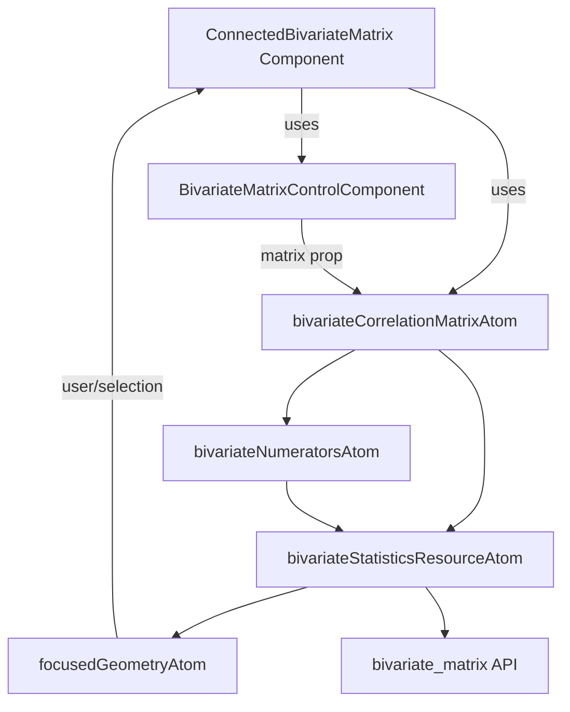
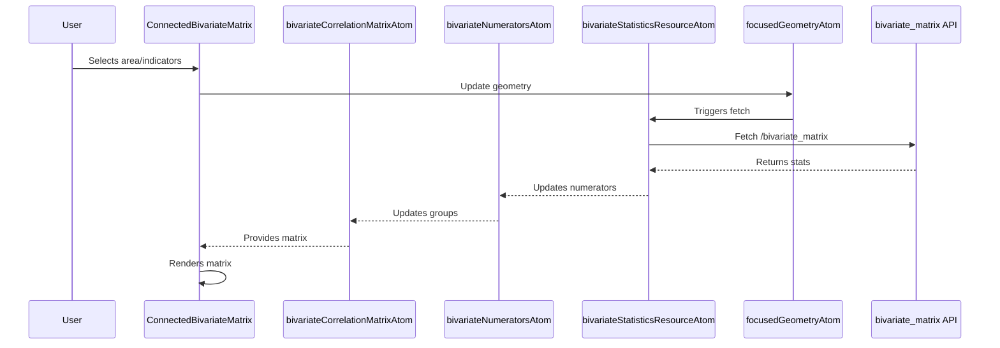
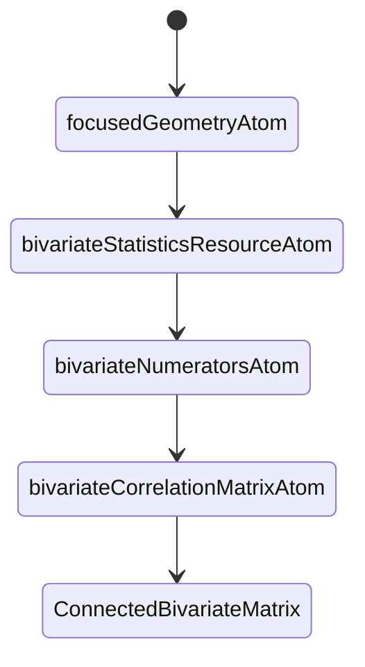

# Bivariate Matrix Architecture & Code Flow Report

## Overview

This document details the architecture and data flow for the bivariate matrix feature in the codebase. It covers the main atoms, components, and their interactions, with code links and mermaid diagrams for clarity.

---

## 1. High-Level Architecture

---

## 2. Main Data Flow

### 2.1 User Interaction

- User interacts with the UI (e.g., selects area, changes numerators/denominators).
- This updates [`focusedGeometryAtom`](../../src/core/focused_geometry/model.ts) or triggers actions in the bivariate manager.

### 2.2 Data Fetching

- [`bivariateStatisticsResourceAtom`](../../src/core/resources/bivariateStatisticsResource/index.ts) observes [`focusedGeometryAtom`](../../src/core/focused_geometry/model.ts) and fetches data from `/bivariate_matrix` API.
- The API response is parsed and validated.

### 2.3 Atom Derivation

- [`bivariateNumeratorsAtom`](../../src/features/bivariate_manager/atoms/bivariateNumerators.ts) derives available numerators/denominators from the statistics data.
- [`bivariateCorrelationMatrixAtom`](../../src/features/bivariate_manager/atoms/bivatiateCorrelationMatrix.ts) builds the matrix from numerators and statistics.

### 2.4 Rendering

- [`ConnectedBivariateMatrix`](../../src/features/bivariate_manager/components/ConnectedBivariateMatrix/ConnectedBivariateMatrix.tsx) reads the matrix and headings, passes them to [`BivariateMatrixControlComponent`](../../src/features/bivariate_manager/components/BivariateMatrixControl/index.tsx) for rendering.

---

## 3. Detailed Code Flow

### 3.1 Atoms & Data Dependencies

- [`bivariateCorrelationMatrixAtom`](../../src/features/bivariate_manager/atoms/bivatiateCorrelationMatrix.ts)
  - Depends on: [`bivariateNumeratorsAtom`](../../src/features/bivariate_manager/atoms/bivariateNumerators.ts), [`bivariateStatisticsResourceAtom`](../../src/core/resources/bivariateStatisticsResource/index.ts)
- [`bivariateNumeratorsAtom`](../../src/features/bivariate_manager/atoms/bivariateNumerators.ts)
  - Depends on: [`bivariateStatisticsResourceAtom`](../../src/core/resources/bivariateStatisticsResource/index.ts)
- [`bivariateStatisticsResourceAtom`](../../src/core/resources/bivariateStatisticsResource/index.ts)
  - Depends on: [`focusedGeometryAtom`](../../src/core/focused_geometry/model.ts)
  - Fetches: `/bivariate_matrix` API

### 3.2 Component Flow

---

## 4. Key Files & Links

- [`ConnectedBivariateMatrix.tsx`](../../src/features/bivariate_manager/components/ConnectedBivariateMatrix/ConnectedBivariateMatrix.tsx)
- [`bivatiateCorrelationMatrix.ts`](../../src/features/bivariate_manager/atoms/bivatiateCorrelationMatrix.ts)
- [`bivariateNumerators.ts`](../../src/features/bivariate_manager/atoms/bivariateNumerators.ts)
- [`bivariateStatisticsResource/index.ts`](../../src/core/resources/bivariateStatisticsResource/index.ts)
- [`focused_geometry/model.ts`](../../src/core/focused_geometry/model.ts)
- [`BivariateMatrixControlComponent`](../../src/features/bivariate_manager/components/BivariateMatrixControl/index.tsx)

---

## 5. Null/Empty Data Handling

- If any upstream atom returns null/empty (geometry, stats, numerators), the matrix will be null and not rendered.
- Error handling is surfaced via notification service on API errors.

---

## 6. Troubleshooting Checklist

- Is [`focusedGeometryAtom`](../../src/core/focused_geometry/model.ts) set and valid?
- Does `/bivariate_matrix` return valid data with non-empty `correlationRates`?
- Are `xGroups` and `yGroups` non-empty in [`bivariateNumeratorsAtom`](../../src/features/bivariate_manager/atoms/bivariateNumerators.ts)?
- Are there any errors in the notification system?

---

## 7. Simplified Data Dependency Chain

---
