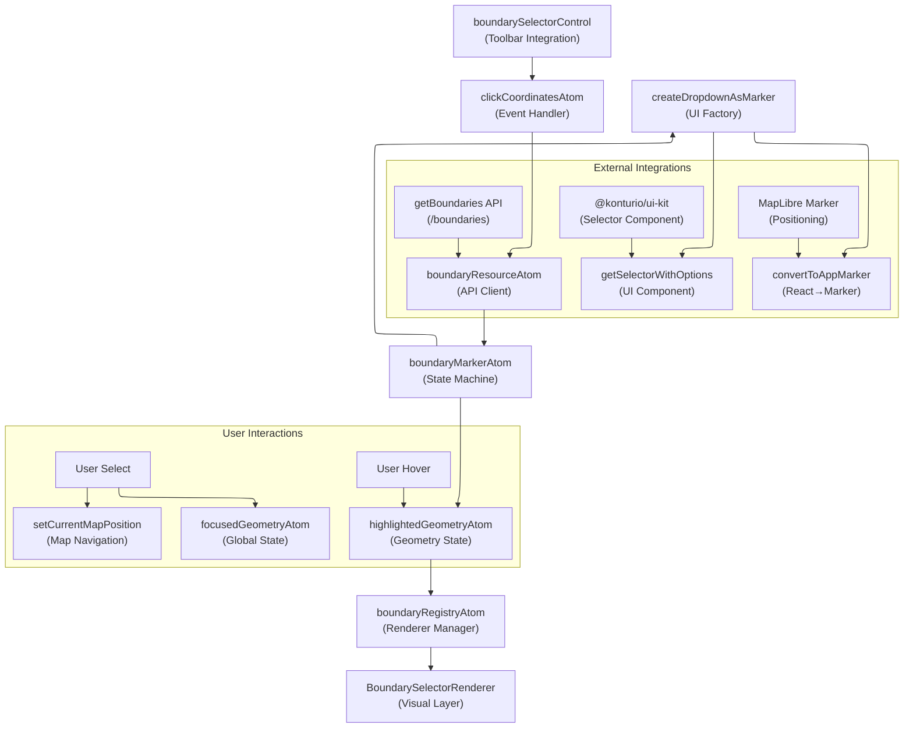
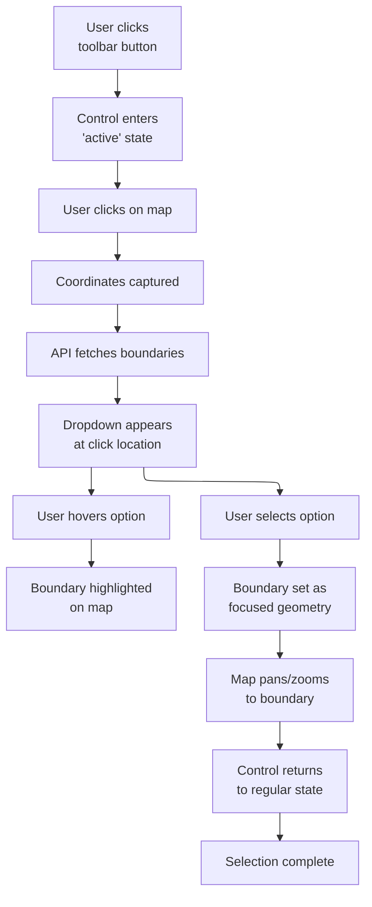

# Boundary Selector System Architecture Investigation

This investigation analyzes the Boundary Selector feature architecture for migration to the unified MapPopover system. The current implementation uses a marker-based dropdown pattern that diverges from standard map interaction patterns in the codebase.

## Executive Summary

The Boundary Selector enables administrative boundary selection through interactive map dropdowns. The system coordinates five Reatom atoms managing click handling, API requests, geometry highlighting, and marker lifecycle. Migration to MapPopover requires replacing the marker positioning system with content provider patterns while preserving state machine coordination and user interaction flows.

## System Architecture

### Core Pattern: Marker-Based State Machine

The Boundary Selector implements a **marker-based dropdown pattern** using MapLibre's marker system to position React components geographically. The architecture follows a **coordinated state machine** approach through Reatom atoms managing the complete interaction lifecycle.

**Entry Point**: [`src/features/boundary_selector/index.tsx:4-6`](../../src/features/boundary_selector/index.tsx#L4-L6)

```typescript
export function initBoundarySelector() {
  boundarySelectorControl.init();
}
```

**Integration**: [`src/views/Map/Map.tsx:66-67`](../../src/views/Map/Map.tsx#L66-L67)

```typescript
import('~features/boundary_selector').then(({ initBoundarySelector }) =>
  initBoundarySelector(),
);
```

### Component Inventory

#### 1. Control Integration System

**Location**: [`src/features/boundary_selector/control.ts:8-21`](../../src/features/boundary_selector/control.ts#L8-L21)

```typescript
export const boundarySelectorControl = toolbar.setupControl<{
  boundaryRegistryAtom?: { start: () => Action; stop: () => Action };
}>({
  id: BOUNDARY_SELECTOR_CONTROL_ID,
  type: 'button',
  borrowMapInteractions: true,
  typeSettings: {
    name: BOUNDARY_SELECTOR_CONTROL_NAME,
    hint: i18n.t('boundary_selector.title'),
    icon: 'SelectArea24',
    preferredSize: 'large',
  },
});
```

- **Pattern**: Toolbar button with exclusive map interaction control
- **Integration**: Leverages `~core/toolbar` system for state management
- **Architecture**: Uses `borrowMapInteractions: true` to disable competing map tools

#### 2. Click Coordinates Management

**Location**: [`src/features/boundary_selector/atoms/clickCoordinatesAtom.ts:88-96`](../../src/features/boundary_selector/atoms/clickCoordinatesAtom.ts#L88-L96)

```typescript
boundarySelectorControl.onStateChange((ctx, state) => {
  if (state === 'active') {
    store.dispatch(clickCoordinatesAtom.start());
  } else {
    store.dispatch(clickCoordinatesAtom.stop());
  }
});
```

- **Architecture**: Event listener atom managing map click capture
- **Functionality**: Records click coordinates and disables map interactions when active
- **Integration**: Uses `registerMapListener` and `setMapInteractivity` utilities
- **State Management**: Coordinates listener cleanup through scheduled context

#### 3. Boundary Data Resource

**Location**: [`src/features/boundary_selector/atoms/boundaryResourceAtom.ts:5-15`](../../src/features/boundary_selector/atoms/boundaryResourceAtom.ts#L5-L15)

```typescript
export const boundaryResourceAtom = createAsyncAtom(
  clickCoordinatesAtom,
  async (params, abortController) => {
    if (!params) return null;
    const { lng, lat } = params;
    const responseData = await getBoundaries([lng, lat], abortController);
    if (!responseData) throw 'No data received';
    return responseData;
  },
  'boundaryResourceAtom',
);
```

- **Pattern**: Async atom with automatic dependency tracking
- **API Integration**: POST `/boundaries` endpoint returning GeoJSON FeatureCollection
- **Cancellation**: AbortController support for request cleanup

#### 4. Marker State Machine (Central Coordinator)

**Location**: [`src/features/boundary_selector/atoms/boundaryMarkerAtom.ts:36-186`](../../src/features/boundary_selector/atoms/boundaryMarkerAtom.ts#L36-L186)

```typescript
interface BoundaryMarkerAtomState {
  marker: null | ApplicationMapMarker;
  isEnabled: boolean;
}

export const boundaryMarkerAtom = createAtom(
  {
    currentMapAtom,
    clickCoordinatesAtom,
    boundaryResourceAtom,
    start: () => null,
    stop: () => null,
    _refreshMarker: (marker, map) => ({ marker, map }),
  } /* state machine reducer */,
);
```

- **Architecture**: Central coordinator managing all boundary interactions
- **State Transitions**: Coordinates between click → API → dropdown → selection workflow
- **Marker Management**: Creates, updates, and destroys MapLibre markers with React content

#### 5. UI Component System

**Location**: [`src/features/boundary_selector/components/getSelectorWithOptions.tsx:3-11`](../../src/features/boundary_selector/components/getSelectorWithOptions.tsx#L3-L11)

```typescript
export const getSelectorWithOptions = (options, onChange, onHover) => (
  <Selector
    small={true}
    options={options}
    stopPropagation={true}
    onChange={onChange}
    onHover={onHover}
  />
);
```

**Marker Creation Pipeline**: [`src/features/boundary_selector/utils/createDropdownAsMarker.ts:16-38`](../../src/features/boundary_selector/utils/createDropdownAsMarker.ts#L16-L38)

```typescript
const marker = convertToAppMarker(BOUNDARY_MARKER_ID, {
  coordinates: [coordinates.lng, coordinates.lat],
  el: DropDownComponent,
  id: BOUNDARY_MARKER_ID,
  wrapperClass: s.boundariesMarker,
});
```

- **Component**: Minimal wrapper around `@konturio/ui-kit` Selector
- **Conversion**: React component → DOM element → MapLibre marker
- **Positioning**: Geographic coordinates determine dropdown placement

## Current Usage Analysis

### Marker-Based UI Positioning Problem

The boundary selector represents the **primary architectural divergence** in the codebase by using MapLibre's marker system for UI component positioning instead of the unified MapPopover system.

#### Current Marker Pattern

**Location**: [`src/utils/map/markers.ts:6-18`](../../src/utils/map/markers.ts#L6-L18)

```typescript
function renderInline(marker: Marker) {
  const container = document.createElement('div');
  container.className = marker.wrapperClass || '';
  const root = createRoot(container); // ❌ Isolated React root
  root.render(marker.el);
  return container;
}

export function convertToAppMarker(id: string, marker: Marker): ApplicationMapMarker {
  const appMarker = new ApplicationMapMarker(id, renderInline(marker));
  appMarker.setLngLat(marker.coordinates); // ❌ Geographic positioning
  return appMarker;
}
```

**Problems**:

- ❌ **Isolated React Root**: Creates separate React context outside main app tree
- ❌ **Geographic Positioning**: Uses lat/lng instead of screen coordinates
- ❌ **Manual Lifecycle**: Requires custom marker cleanup and management
- ❌ **Architectural Inconsistency**: Different pattern from all other map interactions

#### Target MapPopover Pattern

**Location**: [`src/core/map/popover/MapPopoverProvider.tsx:49-63`](../../src/core/map/popover/MapPopoverProvider.tsx#L49-L63)

```typescript
const showWithContent = useCallback(
  (point: ScreenPoint, content: React.ReactNode, options?: MapPopoverOptions) => {
    const placement = options?.placement ?? 'top';
    setGlobalPopover({
      id: 'global',
      isOpen: true,
      content, // ✅ Content renders in main React tree
      placement,
      screenPoint: point, // ✅ Screen coordinate positioning
    });
  },
  [],
);
```

**Benefits**:

- ✅ **Main React Tree**: Component renders within normal React hierarchy
- ✅ **Screen Positioning**: Uses pixel coordinates with proper viewport handling
- ✅ **Unified Lifecycle**: Automatic cleanup and position tracking
- ✅ **Consistent Pattern**: Same system as tooltips, feature popups, etc.

## Implementation Analysis

### Marker-to-Popover Migration Architecture

#### Phase 1: Container Replacement

**Current Flow**:

```
boundaryMarkerAtom → createDropdownAsMarker() → convertToAppMarker() → marker.addTo(map)
```

**Target Flow**:

```
boundaryMarkerAtom → popoverService.showWithContent(screenPoint, <Selector />) → MapPopover
```

#### Required Changes

**1. Replace Marker Creation**

**Current**: [`src/features/boundary_selector/atoms/boundaryMarkerAtom.ts:100-110`](../../src/features/boundary_selector/atoms/boundaryMarkerAtom.ts#L100-L110)

```typescript
// ❌ Current marker approach
schedule((dispatch) => {
  dispatch([
    create('_refreshMarker', createDropdownAsMarker(coordinates, selectOptions), map),
    highlightedGeometryAtom.set(emptyGeometry),
  ]);
});
```

**Target**:

```typescript
// ✅ MapPopover approach
const popoverService = useMapPopoverService();
const screenPoint = mapEventToPageCoords(clickEvent);

popoverService.showWithContent(
  screenPoint,
  <BoundarySelector options={selectOptions} listeners={dropdownListeners} />,
  { placement: 'bottom', closeOnMove: false }
);
```

**2. Component Integration**

**Current**: Isolated React root in marker
**Target**: Normal React component in MapPopover content

```typescript
// New component for MapPopover content
function BoundarySelector({ options, listeners }: {
  options: BoundaryOption[];
  listeners?: {
    onSelect?: (boundaryId: string) => void;
    onHover?: (boundaryId: string) => void;
  };
}) {
  return (
    <Selector
      small={true}
      options={options}
      stopPropagation={true}
      onChange={listeners?.onSelect}
      onHover={listeners?.onHover}
    />
  );
}
```

**3. State Machine Adaptation**

**Preserve**: Existing atom coordination (`clickCoordinatesAtom` → `boundaryResourceAtom` → `boundaryMarkerAtom`)
**Change**: Replace marker management with popover service calls
**Keep**: Loading states, API integration, geometry highlighting, selection workflow

## Architectural Inconsistencies

### Primary Issue: Marker vs Popover Paradigm

The boundary selector creates **architectural divergence** by using a completely different UI positioning system than the rest of the application:

| System                | Positioning            | React Integration    | Lifecycle                 |
| --------------------- | ---------------------- | -------------------- | ------------------------- |
| **Boundary Selector** | Geographic coordinates | Isolated React roots | Manual marker cleanup     |
| **Feature Tooltips**  | Screen coordinates     | Main React tree      | Automatic popover cleanup |
| **Bivariate Popups**  | Screen coordinates     | Main React tree      | Automatic popover cleanup |
| **MCDA Popups**       | Screen coordinates     | Main React tree      | Automatic popover cleanup |

### Migration Requirements

#### 1. Container System Migration (Priority 1)

**Goal**: Replace marker positioning with MapPopover container rendering

**Changes Required**:

- Replace `ApplicationMapMarker` usage with `MapPopoverService.showWithContent()`
- Convert geographic coordinates to screen coordinates
- Move `Selector` component from isolated React root to MapPopover content
- Remove marker creation/cleanup logic

#### 2. State Machine Preservation (Priority 2)

**Goal**: Keep existing state coordination while changing UI container

**Preserve**:

- `clickCoordinatesAtom` → `boundaryResourceAtom` → `boundaryMarkerAtom` flow
- Loading states ("Loading...", "No data received")
- Hover highlighting and selection logic
- API integration and error handling

**Adapt**:

- Replace marker lifecycle with popover service calls
- Convert coordinates for screen positioning
- Handle popover close events

#### 3. Component Architecture (Priority 3)

**Goal**: Normal React component hierarchy instead of isolated roots

**Benefits**:

- React DevTools integration
- Context providers work correctly
- Standard testing patterns
- Memory leak prevention

#### State Management Architecture



#### Boundary Marker State Machine

**Location**: [`atoms/boundaryMarkerAtom.ts:80-186`](../../src/features/boundary_selector/atoms/boundaryMarkerAtom.ts#L80-L186)

```typescript
// State machine logic flow:
onChange('boundaryResourceAtom', (resource) => {
  const { data: featureCollection, loading } = resource;

  if (loading) {
    // Create dropdown with "Loading..." option
    const selectOptions = [LOADING_OPTION];
    schedule((dispatch) => {
      dispatch([
        create('_refreshMarker', createDropdownAsMarker(coordinates, selectOptions), map),
        highlightedGeometryAtom.set(emptyGeometry),
      ]);
    });
  } else {
    // Create dropdown with boundary options
    const selectOptions = constructOptionsFromBoundaries(resource.data) ?? [
      NO_DATA_OPTION,
    ];

    const dropdownListeners = {
      onHover: (boundaryId: string) => {
        const boundaryGeometry = findBoundaryGeometry(featureCollection, boundaryId);
        store.dispatch(highlightedGeometryAtom.set(boundaryGeometry));
      },
      onSelect: (boundaryId: string) => {
        // Complete selection workflow
        store.dispatch([
          boundarySelectorControl.setState('regular'),
          highlightedGeometryAtom.set(new FeatureCollection([])),
          focusedGeometryAtom.setFocusedGeometry(/* ... */),
          setCurrentMapPosition(boundaryCamera),
        ]);
      },
    };

    schedule((dispatch) => {
      dispatch(
        create(
          '_refreshMarker',
          createDropdownAsMarker(coordinates, selectOptions, dropdownListeners),
          map,
        ),
      );
    });
  }
});
```

**State Transitions**:

1. **Idle** → **Click Detected** → `clickCoordinatesAtom` updates
2. **Click Detected** → **Loading** → `boundaryResourceAtom` shows loading state
3. **Loading** → **Options Available** → API response creates interactive dropdown
4. **Options Available** → **Hover Preview** → Geometry highlighting via `highlightedGeometryAtom`
5. **Hover Preview** → **Selection Complete** → Updates `focusedGeometryAtom` and map position

### Algorithms

#### Marker Lifecycle Management

**Complexity**: O(1) for marker operations
**Location**: [`atoms/boundaryMarkerAtom.ts:67-80`](../../src/features/boundary_selector/atoms/boundaryMarkerAtom.ts#L67-L80)

```typescript
onAction('_refreshMarker', ({ marker: newMarker, map }) => {
  const previousMarker = state.marker;
  state = { ...state, marker: newMarker };

  schedule(() => {
    // Atomic marker replacement to prevent UI flickering
    previousMarker?.remove();
    newMarker.addTo(map);
  });
});
```

**Performance Characteristics**:

- **Marker Replacement**: Atomic operation preventing visual artifacts
- **Memory Management**: Previous markers properly removed to prevent leaks
- **Scheduling**: Uses Reatom's `schedule` for proper timing

#### React-to-Marker Conversion

**Location**: [`utils/map/markers.ts:6-18`](../../src/utils/map/markers.ts#L6-L18)

```typescript
function renderInline(marker: Marker) {
  const container = document.createElement('div');
  container.className = marker.wrapperClass || '';
  const root = createRoot(container);
  root.render(marker.el);
  return container;
}

export function convertToAppMarker(id: string, marker: Marker): ApplicationMapMarker {
  const appMarker = new ApplicationMapMarker(id, renderInline(marker));
  appMarker.setLngLat(marker.coordinates);
  return appMarker;
}
```

**Architecture**:

- **React Root Creation**: Each marker gets isolated React root
- **DOM Container**: Wrapper div with optional CSS classes
- **Coordinate Positioning**: MapLibre handles geographic positioning
- **ID Management**: Unique marker identification for lifecycle tracking

### Control Mechanisms

#### Toolbar Integration Pattern

**Location**: [`control.ts:8-21`](../../src/features/boundary_selector/control.ts#L8-L21)

```typescript
export const boundarySelectorControl = toolbar.setupControl<{
  boundaryRegistryAtom?: { start: () => Action; stop: () => Action };
}>({
  id: BOUNDARY_SELECTOR_CONTROL_ID,
  type: 'button',
  borrowMapInteractions: true, // Disables other map interactions
  typeSettings: {
    name: BOUNDARY_SELECTOR_CONTROL_NAME,
    hint: i18n.t('boundary_selector.title'),
    icon: 'SelectArea24',
    preferredSize: 'large',
  },
});
```

**Interaction Borrowing**:

- **Exclusive Mode**: `borrowMapInteractions: true` disables competing interactions
- **Priority System**: Integrates with toolbar's interaction management
- **State Control**: Button state drives atom lifecycle activation

#### State Change Coordination

**Location**: [`atoms/boundaryMarkerAtom.ts:217-223`](../../src/features/boundary_selector/atoms/boundaryMarkerAtom.ts#L217-L223)

```typescript
boundarySelectorControl.onStateChange((ctx, state) => {
  if (state === 'active') {
    store.dispatch(boundaryMarkerAtom.start());
  } else {
    store.dispatch(boundaryMarkerAtom.stop());
  }
});
```

**Control Flow**:

- **Active State**: Enables click listening and marker creation
- **Inactive State**: Cleans up markers and event listeners
- **Synchronized Lifecycle**: All atoms controlled by toolbar button state

### Integration Points

#### API Integration

**Location**: [`core/api/boundaries.ts:4-15`](../../src/core/api/boundaries.ts#L4-L15)

```typescript
export function getBoundaries(
  coords: [number, number],
  abortController?: AbortController,
) {
  return apiClient.post<GeoJSON.FeatureCollection>(
    '/boundaries',
    new GeoJSONPoint(coords),
    {
      signal: abortController ? abortController.signal : undefined,
    },
  );
}
```

**Integration Characteristics**:

- **Endpoint**: `POST /boundaries` with GeoJSON point payload
- **Response**: GeoJSON FeatureCollection with boundary polygons
- **Cancellation**: AbortController support for request cancellation
- **Error Handling**: Managed by `createAsyncAtom` wrapper

#### Focused Geometry Integration

**Location**: [`atoms/boundaryMarkerAtom.ts:152-171`](../../src/features/boundary_selector/atoms/boundaryMarkerAtom.ts#L152-L171)

```typescript
onSelect: (boundaryId: string) => {
  const boundaryGeometry = findBoundaryGeometry(featureCollection, boundaryId);
  const boundaryName = findBoundaryName(boundaryGeometry);
  const boundaryCamera = findCameraPositionForBoundary(map, boundaryGeometry);

  store.dispatch([
    boundarySelectorControl.setState('regular'),
    highlightedGeometryAtom.set(new FeatureCollection([])),
    focusedGeometryAtom.setFocusedGeometry(
      {
        type: 'boundaries',
        meta: { name: boundaryName || 'Boundary geometry' },
      },
      boundaryGeometry,
    ),
    boundaryCamera && v3ActionToV2(setCurrentMapPosition, boundaryCamera),
  ]);
},
```

**Integration Points**:

- **Focused Geometry**: Global state for selected area management
- **Map Position**: Automatic camera adjustment to fit selected boundary
- **Control Reset**: Returns toolbar to regular state after selection
- **Metadata**: Preserves boundary name and source type information

## Current Usage Analysis

### Component Integration Pattern

The boundary selector follows a **feature-based architecture** with clear separation between:

1. **Toolbar Integration** (`control.ts`) - User interface control
2. **State Management** (`atoms/`) - Reactive state coordination
3. **API Integration** (`boundaryResourceAtom.ts`) - External data fetching
4. **UI Components** (`components/`, `utils/`) - React component rendering
5. **Map Rendering** (`renderers/`) - Visual feedback systems

### Usage Patterns

#### Initialization Pattern

**Location**: [`src/views/Map/Map.tsx:66-67`](../../src/views/Map/Map.tsx#L66-L67)

```typescript
import('~features/boundary_selector').then(({ initBoundarySelector }) =>
  initBoundarySelector(),
);
```

- **Dynamic Loading**: Feature loaded only when needed
- **Initialization**: Single function call activates entire system
- **Lazy Registration**: Atoms register with control system on init

#### Interaction Pattern



#### Performance Characteristics

- **Memory Usage**: Single marker instance at a time, previous markers cleaned up
- **API Efficiency**: AbortController prevents stale requests
- **Rendering**: React roots isolated per marker, no global state pollution
- **Event Handling**: Efficient coordinate capture with cleanup on deactivation

## State Management Integration

### Reatom v3 Architecture

The boundary selector extensively uses Reatom v3 patterns for state management:

#### Atom Composition Pattern

```typescript
// Primary coordination atom
export const boundaryMarkerAtom = createAtom(
  {
    currentMapAtom, // Map instance dependency
    clickCoordinatesAtom, // User click coordinates
    boundaryResourceAtom, // API data dependency
    start: () => null, // Lifecycle actions
    stop: () => null,
    _refreshMarker: (marker, map) => ({ marker, map }),
  },
  (reducerContext, state) => {
    // State machine logic coordinating all dependencies
  },
  'boundaryMarkerAtom',
);
```

#### Integration with Global State

**Dependencies**:

- `currentMapAtom` - Map instance access
- `focusedGeometryAtom` - Global geometry selection
- `setCurrentMapPosition` - Map navigation control
- `boundarySelectorControl` - Toolbar state management

**Integrations**:

- **v3 to v2 Conversion**: Uses `v3ActionToV2` for compatibility
- **Store Dispatch**: Direct store integration for complex workflows
- **Action Scheduling**: Proper timing with Reatom's `schedule` mechanism

### Lifecycle Management

#### Control-Driven Lifecycle

**Location**: Multiple files coordinated by control state changes

```typescript
// Pattern repeated across all atoms
boundarySelectorControl.onStateChange((ctx, state) => {
  if (state === 'active') {
    store.dispatch(atomName.start());
  } else {
    store.dispatch(atomName.stop());
  }
});
```

**Lifecycle Phases**:

1. **Init**: Atoms register with control system
2. **Start**: Control activation triggers atom start actions
3. **Active**: Atoms respond to user interactions and coordinate state
4. **Stop**: Control deactivation triggers cleanup and marker removal

## Architectural Inconsistencies

### Marker vs. Popup Paradigm Divergence

The boundary selector represents a significant architectural divergence from the rest of the codebase:

#### **Issue**: Different UI Positioning Paradigm

- **Standard Pattern**: Other interactive features use popup/tooltip systems managed by renderers
- **Boundary Selector**: Uses MapLibre marker system for UI component positioning
- **Impact**: Creates maintenance overhead with different positioning logic and lifecycle management

#### **Issue**: React Root Management

**Location**: [`utils/map/markers.ts:6-11`](../../src/utils/map/markers.ts#L6-L11)

```typescript
function renderInline(marker: Marker) {
  const container = document.createElement('div');
  container.className = marker.wrapperClass || '';
  const root = createRoot(container); // Creates isolated React root
  root.render(marker.el);
  return container;
}
```

- **Problem**: Each marker creates an isolated React root, bypassing normal React component hierarchy
- **Inconsistency**: Other UI components render within the main React tree
- **Memory Implications**: React roots require manual cleanup, increasing leak risk

#### **Issue**: Private Registry System

**Location**: [`atoms/boundaryRegistryAtom.ts:26-43`](../../src/features/boundary_selector/atoms/boundaryRegistryAtom.ts#L26-L43)

```typescript
export const createBoundaryRegistryAtom = (
  layerId: string,
  renderer: LogicalLayerRenderer,
) => {
  const logicalLayerStateAtom = atom<LogicalLayerState>(/* ... */);
  // Private registry implementation instead of using common logical layers system
};
```

- **Deviation**: Creates private logical layer registry instead of using standard `~core/logical_layers` system
- **Justification**: Comment states "layers are private - not accessible from other parts"
- **Impact**: Increases complexity and reduces reusability of renderer patterns

### State Coordination Complexity

#### **Issue**: Multi-Atom State Machine

The boundary selector requires coordination between **5 different atoms** for a single feature:

1. `clickCoordinatesAtom` - Event handling
2. `boundaryResourceAtom` - API integration
3. `highlightedGeometryAtom` - Visual feedback
4. `boundaryRegistryAtom` - Renderer management
5. `boundaryMarkerAtom` - Central coordination

**Architectural Complexity**:

- **High Coupling**: Changes to one atom often require updates to others
- **Debugging Difficulty**: State flows through multiple atoms making debugging complex
- **Testing Overhead**: Unit testing requires mocking multiple atom dependencies

#### **Issue**: Mixed v2/v3 Reatom APIs

**Location**: [`atoms/boundaryMarkerAtom.ts:13-14`](../../src/features/boundary_selector/atoms/boundaryMarkerAtom.ts#L13-L14)

```typescript
import { v3ActionToV2 } from '~utils/atoms/v3tov2';
// ... later in code:
boundaryCamera && v3ActionToV2(setCurrentMapPosition, boundaryCamera),
```

- **Inconsistency**: Mixes Reatom v2 and v3 APIs within single feature
- **Complexity**: Requires conversion utilities and understanding of both API versions
- **Migration Risk**: Future Reatom updates may break conversion utilities

## System Boundaries

### What the Boundary Selector Manages

#### **Core Responsibilities**:

- **Click Event Handling**: Capturing map click coordinates when active
- **Boundary Data Fetching**: API integration for administrative boundary lookup
- **Interactive Dropdown**: Marker-based UI for boundary selection
- **Geometry Highlighting**: Visual preview of boundaries during hover
- **Selection Workflow**: Complete process from click to focused geometry setting

#### **State Ownership**:

- `clickCoordinatesAtom` - Click coordinate capture and map interactivity control
- `boundaryResourceAtom` - Boundary API response caching and loading states
- `highlightedGeometryAtom` - Temporary geometry display during selection process
- `boundaryMarkerAtom` - Marker lifecycle and user interaction coordination
- Private renderer registry for geometry visualization

### What's Outside the System

#### **External Dependencies**:

- **Map Instance**: Uses `currentMapAtom` but doesn't manage map lifecycle
- **Focused Geometry**: Updates `focusedGeometryAtom` but doesn't own the concept
- **Map Position**: Triggers `setCurrentMapPosition` but doesn't manage navigation
- **Toolbar System**: Integrates with `~core/toolbar` but doesn't control toolbar lifecycle
- **API Client**: Uses `~core/api/boundaries` but doesn't manage HTTP configuration

#### **Shared Resources**:

- **UI Components**: Uses `@konturio/ui-kit` Selector component
- **Map Events**: Leverages `~core/shared_state/mapListeners` for event registration
- **Coordinate Utilities**: Uses existing map coordinate transformation utilities
- **Layer Management**: Relies on `~core/logical_layers` infrastructure for rendering

## MapPopover Migration Analysis

### Migration Strategy Requirements

#### **1. Replace Marker Positioning with Popover Positioning**

**Current Architecture**:

```typescript
// Marker-based positioning
const marker = convertToAppMarker(BOUNDARY_MARKER_ID, {
  coordinates: [coordinates.lng, coordinates.lat],
  el: DropDownComponent,
  wrapperClass: s.boundariesMarker,
});
marker.addTo(map);
```

**Target Architecture**:

```typescript
// MapPopover positioning
popoverService.showWithContent(
  { x: clickEvent.point.x, y: clickEvent.point.y },
  <BoundarySelector options={selectOptions} listeners={dropdownListeners} />,
  { placement: 'bottom', closeOnMove: false }
);
```

#### **2. Content Provider Implementation**

**Location**: New file `src/features/boundary_selector/providers/BoundarySelectorContentProvider.ts`

```typescript
import type { IMapPopoverContentProvider } from '~core/map/types';
import type { MapMouseEvent } from 'maplibre-gl';

export class BoundarySelectorContentProvider implements IMapPopoverContentProvider {
  renderContent(mapEvent: MapMouseEvent): React.ReactNode | null {
    // Check if boundary selector is active
    if (!boundarySelectorControl.getState() === 'active') {
      return null;
    }

    // Trigger boundary loading and return loading/content UI
    // Replace marker creation with popover content
    return <BoundaryDropdownContent mapEvent={mapEvent} />;
  }
}
```

#### **3. State Machine Adaptation**

**Required Changes**:

- **Remove Marker Management**: `boundaryMarkerAtom` no longer needs marker lifecycle
- **Add Popover Service Integration**: Use `useMapPopoverService` for display control
- **Preserve State Coordination**: Keep existing atom coordination for data flow
- **Update Event Handling**: Replace marker-based click handling with popover content provider

#### **4. Component Architecture Changes**

**Current Flow**:

```
Click → Marker Creation → React Root → Selector Component
```

**Target Flow**:

```
Click → Content Provider → Popover Service → Selector Component (in main React tree)
```

### Migration Benefits

#### **1. Architectural Consistency**

- **Unified UI Pattern**: Aligns with other map interaction features (tooltips, feature popups)
- **React Tree Integration**: Components render within main React hierarchy instead of isolated roots
- **Event System Integration**: Uses standard MapPopover priority system (priority 55)

#### **2. Performance Improvements**

- **Memory Efficiency**: Eliminates React root creation/cleanup overhead
- **Event Handling**: Leverages optimized MapPopover event coordination
- **Position Tracking**: Benefits from MapPopover's efficient position update system

#### **3. Development Experience**

- **Debugging**: Standard React DevTools integration instead of isolated root inspection
- **Testing**: Simplified testing with normal React component patterns
- **Maintenance**: Reduced custom positioning and lifecycle logic

### Migration Risks

#### **1. User Experience Changes**

- **Positioning Behavior**: MapPopover positioning may differ slightly from marker positioning
- **Interaction Timing**: Different lifecycle may affect dropdown appearance/dismissal timing
- **Visual Consistency**: Need to ensure dropdown styling matches current implementation

#### **2. State Coordination Complexity**

- **Timing Dependencies**: MapPopover content provider pattern may require state coordination changes
- **Loading States**: Need to handle loading/error states within popover content rather than marker replacement
- **Event Propagation**: Different event handling patterns may affect interaction flow

#### **3. Integration Dependencies**

- **Priority Coordination**: Must integrate properly with MapPopover priority system (priority 55)
- **Tool Exclusivity**: Ensure boundary selector still properly borrows map interactions
- **Cleanup Handling**: MapPopover cleanup patterns may differ from marker cleanup requirements

### Implementation Plan

#### **Phase 1: Infrastructure Preparation**

1. Create `BoundarySelectorContentProvider` implementing `IMapPopoverContentProvider`
2. Extract dropdown component logic from marker creation utilities
3. Adapt state machine to work with popover service instead of marker management

#### **Phase 2: Content Provider Integration**

1. Register boundary selector content provider with `mapPopoverRegistry`
2. Update `boundaryMarkerAtom` to use popover service for display control
3. Preserve existing state coordination and API integration

#### **Phase 3: Component Migration**

1. Migrate `getSelectorWithOptions` to render within popover content
2. Update styling and positioning to match current visual behavior
3. Remove marker creation and React root management utilities

#### **Phase 4: Cleanup and Testing**

1. Remove unused marker-related code (`createDropdownAsMarker`, `convertToAppMarker`)
2. Update integration tests to work with popover-based interaction
3. Verify state coordination and user experience consistency

This migration plan preserves the existing state machine architecture while modernizing the UI positioning system to align with the broader application architecture.
