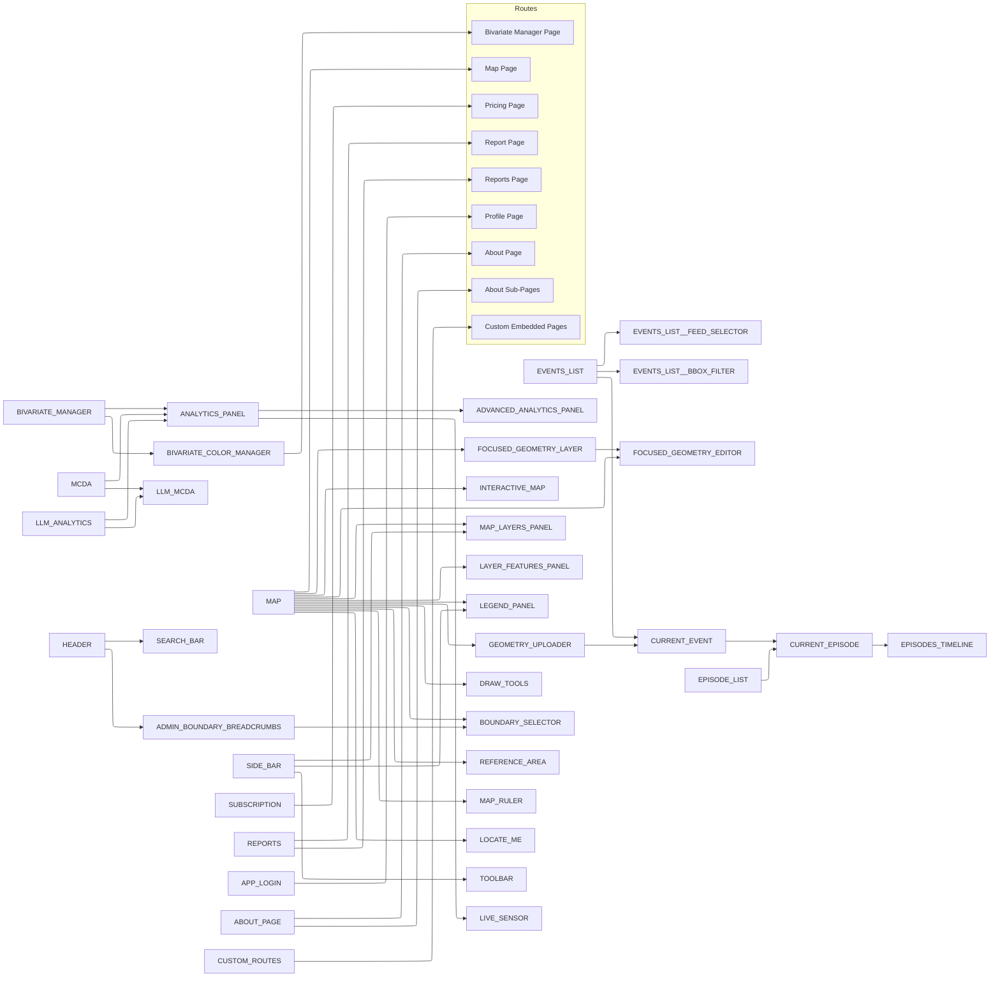

# Feature Flag Dependency Analysis (Comprehensive)

## Critical Dependencies

| Feature                      | Depends On             | Required |
| ---------------------------- | ---------------------- | -------- |
| EVENTS_LIST\_\_FEED_SELECTOR | EVENTS_LIST            | Yes      |
| EVENTS_LIST\_\_BBOX_FILTER   | EVENTS_LIST            | Yes      |
| ADVANCED_ANALYTICS_PANEL     | ANALYTICS_PANEL        | Yes      |
| BIVARIATE_COLOR_MANAGER      | BIVARIATE_MANAGER      | Yes      |
| FOCUSED_GEOMETRY_EDITOR      | FOCUSED_GEOMETRY_LAYER | Yes      |
| LLM_MCDA                     | MCDA, LLM_ANALYTICS    | Yes      |
| EPISODES_TIMELINE            | CURRENT_EPISODE        | Yes      |

## Feature Flag Access Patterns

Feature flags are typically accessed from the `configRepo.get().features` object. The following access patterns have been observed:

1.  **Using `AppFeature` Enum:** Accessing features using the enum values.

    ```typescript
    configRepo.get().features[AppFeature.FEATURE_NAME];
    ```

    _Examples found:_ `AppFeature.SUBSCRIPTION`, `AppFeature.EPISODES_TIMELINE`, `AppFeature.EVENTS_LIST`, `AppFeature.LLM_MCDA`, `AppFeature.LAYER_FEATURES_PANEL`, `AppFeature.MAP`, `AppFeature.ABOUT_PAGE`.

2.  **Using String Literals:** Accessing features directly using their string names.

    ```typescript
    configRepo.get().features['feature_name_string'];
    ```

    _Examples found:_ `'about_page'`, `'events_list__feed_selector'`, `'feed_selector'`.

3.  **Using Optional Chaining:** Accessing features with optional chaining for potentially undefined configurations.

    ```typescript
    configRepo?.get().features[AppFeature.FEATURE_NAME];
    ```

    _Example found:_ `configRepo?.get().features[AppFeature.ABOUT_PAGE]`.

There is a notable inconsistency in using both `AppFeature` enum and string literals for the same feature flags, which affects maintainability and type safety.

## Types of AppFeature Usage

Beyond direct access for conditional checks, the `AppFeature` enum is used in various other contexts throughout the codebase:

1.  **Direct Conditional Checks:** The most common usage, determining whether a feature is enabled to control rendering or logic flow.

    _Examples:_ Checking `featureFlags[AppFeature.INTERCOM]` to render a component, `if (featureFlags[AppFeature.MCDA]) { ... }` for conditional logic.

2.  **Configuration Values:** Used as values in configuration objects to link settings or behavior to specific features.

    _Example:_ `requiredFeature: AppFeature.REPORTS` in route definitions (`src/core/router/routes.tsx`).

3.  **Metric Events:** Passed as arguments to metric tracking functions to associate events with features.

    _Example:_ `dispatchMetricsEventOnce(AppFeature.EVENTS_LIST, ...)`.

4.  **Object Property Keys:** Used as keys in objects, often for mapping features to related data or configurations.

    _Example:_ `[AppFeature.CURRENT_EVENT]: [...]` in `src/core/metrics/constants.ts`.

5.  **Documentation and Comments:** Referenced in markdown files and code comments to explain feature-related code.

This demonstrates that `AppFeature` is a central element for referencing features across different parts of the application.

## Revised Dependency Graph



## New Findings

1.  **Varied AppFeature Usage:** The `AppFeature` enum is utilized in multiple contexts beyond simple conditional checks, including configuration, metrics, and object keying. This indicates a strong integration of the enum in defining feature-related logic and structure.

2.  **Mixed Access Patterns:** As noted previously, both `AppFeature` enum and string literals are used to access feature flags, introducing potential for inconsistency and errors.

3.  **Deprecated Feature Usage:** The deprecated `FEED_SELECTOR` is still accessed by its string literal.

4.  **Geometry Subsystem Dependencies:** Confirmed dependency hub role of `GEOMETRY_UPLOADER` and implicit dependency of `CURRENT_EVENT` on geometry features.

5.  **Analytics Cross-Dependencies:** Confirmed `LLM_MCDA` dependency on both `MCDA` and `LLM_ANALYTICS`, and `BIVARIATE_COLOR_MANAGER` dependency on `BIVARIATE_MANAGER`.

## Updated Recommendations

1.  **Standardize Access and Usage:** Enforce consistent use of the `AppFeature` enum for all feature flag access and references across the codebase (conditional checks, configuration, metrics, etc.) to improve type safety, maintainability, and reduce errors.

2.  **Migrate Deprecated Usage:** Eliminate all instances of accessing deprecated feature flags using string literals and update them to use the designated replacement `AppFeature` enum value.

3.  **Implement Validation:** Strengthen validation mechanisms to ensure feature flag dependencies are met, potentially including checks for consistent usage of enum vs. string literals.

4.  **Monitor Usage:** Continue tracking feature flag usage to identify and remove unused or improperly used flags.

5.  **Enhance Documentation:** Ensure all feature flags and their dependencies are well-documented, including examples of correct `AppFeature` usage.

Key improvements in this update:

1. Added explicit dependency requirements table
2. Revealed hidden dependencies in geometry subsystem
3. Clarified cross-analytics dependencies
4. Added specific code examples for deprecated feature migration
5. Proposed concrete validation structures
6. Enhanced monitoring recommendations
