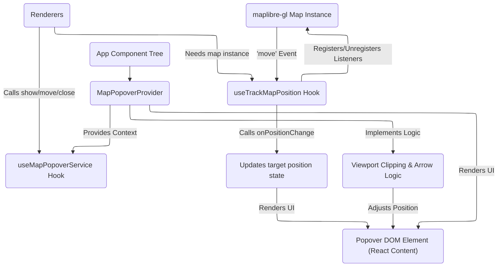

# Map Popover System Specification (Tracker Approach)

This document specifies a new map popover system based on tracking geographical coordinates and rendering popovers as React components, ensuring they remain within the viewport with directional arrows.

## 1. API Description

The system will expose a React hook to manage the popover state and another hook to handle geographical position tracking relative to the map.

### 1.1 `useMapPopoverService` Hook

Provides methods to control the visibility, content, and screen position of a single map popover instance.

```typescript
interface ScreenPoint {
  x: number;
  y: number;
}

interface PopoverService {
  /** Displays content at the given screen point. Replaces any existing popover. */
  show: (point: ScreenPoint, content: React.ReactNode) => void;
  /** Moves the currently displayed content to a new screen point. */
  move: (point: ScreenPoint) => void;
  /** Hides the currently displayed content. */
  close: () => void;
}

/**
 * Hook to access the global popover service.
 * Assumes the service is provided higher up in the component tree by `MapPopoverProvider`.
 */
function useMapPopoverService(): PopoverService;
```

### 1.2 `useTrackMapPosition` Hook

Hook to manage map event listeners for tracking a specific geographical point (`lngLat`) and providing its updated screen position (`ScreenPoint`) as the map moves.

```typescript
/**
 * Hook to get callbacks for tracking a geographical position and updating
 * a dependent value (like a popover's position) on map movement.
 * @param map The maplibre-gl map instance.
 * @param onPositionChange A callback function to receive updated screen coordinates.
 */
function useTrackMapPosition(
  map: maplibregl.Map | null,
  onPositionChange: (point: ScreenPoint) => void,
): {
  /** Start tracking the given geographical position. Stops any previous tracking. */
  startTracking: (lngLat: [number, number]) => void;
  /** Stop tracking the current position and remove map listeners. */
  stopTracking: () => void;
};
```

## 2. Design Architecture

The system will consist of three main parts:

### 2.1 `MapPopoverProvider` (React Component)

- This component will wrap the part of the application tree that needs to display map popovers (likely around or above the map component).
- It will use React Context to provide the `PopoverService` instance via `useMapPopoverService`.
- It will manage the state of the single active popover: its content (`React.ReactNode`), its target screen position (`ScreenPoint`), and whether it's visible.
- It will render the actual popover UI element. This element should be positioned absolutely and its `top` and `left` CSS properties controlled by the target screen position.
- **Crucially, this provider will implement the logic to keep the popover within the viewport.** When the target screen position is outside the map canvas bounds, it will calculate the nearest point on the boundary, position the popover there, and render a directional arrow pointing towards the true off-screen target.
- It should handle cleanup when the popover is closed or the component unmounts.

### 2.2 `useMapPopoverService` (React Hook)

- This hook is a consumer of the Context provided by `MapPopoverProvider`.
- It simply exposes the methods (`show`, `move`, `close`) to update the popover state managed by the provider.

### 2.3 `useTrackMapPosition` (React Hook)

- This hook takes the `maplibre-gl.Map` instance and a callback (`onPositionChange`) as arguments.
- It manages a single geographical point (`lngLat`) state internally.
- When `startTracking` is called with a `lngLat`, it updates the internal state and registers a `'move'` event listener on the map.
- The map listener uses `map.project(lngLat)` to get the current screen coordinates and calls the `onPositionChange` callback with this `ScreenPoint`.
- `stopTracking` removes the map listener and clears the internal state.
- This hook is responsible _only_ for translating geographical position to screen position on map movement; the popover rendering and viewport logic is handled by the `MapPopoverProvider`.



## 3. Migration Guide

The following steps outline how to migrate existing popup and tooltip implementations to use the new tracker-based system:

### 3.1 Wrap the Application with `MapPopoverProvider`

Identify the root component or a high-level layout component that contains the map and related renderers and wrap it with the new `MapPopoverProvider`.

```typescript
// In your main layout or App component
import { MapPopoverProvider } from './path/to/MapPopoverProvider';

function App() {
  return (
    <MapPopoverProvider>
      {/* Your existing layout, including the map and renderers */}
      {/* ... */}
    </MapPopoverProvider>
  );
}
```

### 3.2 Update Renderers Extending `ClickableFeaturesRenderer` (MCDA, Multivariate)

Modify the `createPopupContent` methods and the click handling logic:

C.3.2.1> **Access Hooks:** Within the renderer class or functional component used by the renderer, use `useMapPopoverService` and `useTrackMapPosition`.

C.3.2.2> **Modify Click Handler:**

- In the `onMapClick` equivalent method (where features are queried and popups are currently shown):
- Get the clicked `lngLat` (`e.lngLat`) and screen `point` (`e.point`).
- Use the `popoverService = useMapPopoverService()` and `positionTracker = useTrackMapPosition(map, popoverService.move)` hooks.
- Call `popoverService.close()` to dismiss any currently open popover.
- Generate the popover content by calling the existing content generation logic (`createPopupContent` equivalent), ensuring it returns a `React.ReactNode`.
- Call `popoverService.show(e.point, <GeneratedReactContent>)`.
- Call `positionTracker.startTracking(e.lngLat)`.

C.3.2.3> **Ensure Cleanup:** When the layer is removed or the component unmounts, call `positionTracker.stopTracking()` and `popoverService.close()`.

C.3.2.4> **Standardize Content Output:** Update the content generation utilities (e.g., in `MCDARenderer/popup.ts`, `MultivariateRenderer/popup.ts`) to return React elements directly, rather than rendering to a DOM node internally.

### 3.3 Refactor `BivariateRenderer`

Follow the suggestion from the analysis report to refactor `BivariateRenderer` to extend `ClickableFeaturesRenderer` (or the common base class that now uses the popover hook).

C.3.3.1> Remove the internal `maplibre-gl.Popup` instance and its management logic from `BivariateRenderer`.
C.3.3.2> Implement the required methods from the base `ClickableFeaturesRenderer`.
C.3.3.3> In the map click handler (`addBivariatePopup`), use `useMapPopoverService` and `useTrackMapPosition` as described in step 3.2.2.
C.3.3.4> Implement `createPopupContent` to return the `<MapHexTooltip>` component as a React element, passing the necessary data.

### 3.4 Update `GenericRenderer`

Modify `GenericRenderer` to use the new popover system for click-based tooltips:

C.3.4.1> Remove the logic that interacts with `currentTooltipAtom` for map clicks.
C.3.4.2> Use `useMapPopoverService` and `useTrackMapPosition` within the click handler.
C.3.4.3> Generate the content by creating a simple React component that takes the markdown text from the feature property and renders it (using a markdown rendering library if necessary).
C.3.4.4> Call `popoverService.show` and `positionTracker.startTracking`.
C.3.4.5> Ensure cleanup on layer removal.

### 3.5 Deprecate/Remove `currentTooltipAtom` (for map use)

Once all map-related tooltip/popup logic is migrated, the parts of `currentTooltipAtom` specifically used for map clicks can be removed or the atom can be repurposed if it serves other non-map tooltip needs.

### 3.6 Implement Viewport and Arrow Logic

Add the detailed logic within the `MapPopoverProvider` to check if the target screen position is outside the map bounds and adjust the rendered popover position and arrow visibility/direction accordingly.

By following this specification and migration plan, the codebase will have a unified, maintainable, and user-friendly map popover system that adheres to DRY and KISS principles.
