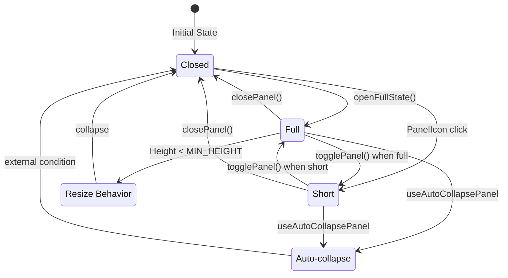
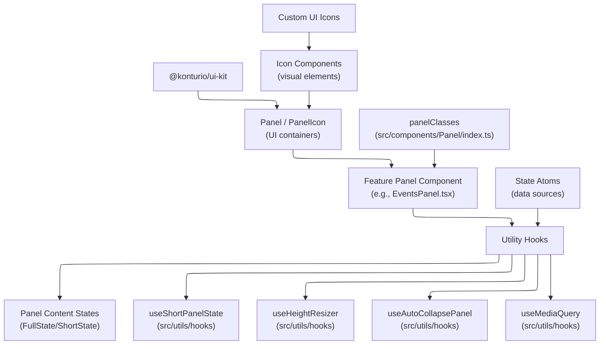

# Panel Component Usage Analysis

## Overview

The Panel component from `@konturio/ui-kit` is used extensively throughout the application to create consistent UI containers for various features. This report analyzes its usage patterns, customizations, and integration into the application's architecture.

## Panel Component Sources

- **Primary Import Source**: `import { Panel } from '@konturio/ui-kit'`
- **Local Styling**: `src/components/Panel/index.ts` and `src/components/Panel/styles.module.css`

## Panel Usage Breakdown

### Files Using Panel Component

1. `src/widgets/FullAndShortStatesPanelWidget/components/FullAndShortStatesPanelWidget.tsx`
2. `src/features/search/index.tsx`
3. `src/features/layer_features_panel/components/LayerFeaturesPanel/index.tsx`
4. `src/features/events_list/components/EventsPanel/EventsPanel.tsx`
5. `src/features/events_list/components/EventsPanel/EventsUniPanel.tsx`
6. `src/features/event_episodes/components/EpisodesTimelinePanel/EpisodesTimelinePanel.tsx`
7. `src/features/create_layer/components/EditLayerPanel/EditLayerPanel.tsx`
8. `src/features/create_layer/components/EditFeaturesPanel/EditFeaturesPanel.tsx`
9. `src/features/breadcrumbs/BreadcrumbsPanel.tsx`
10. `src/features/bivariate_manager/components/BivariatePanel/BivariatePanel.tsx`
11. `src/features/layers_panel/index.tsx`

### Distribution by Feature Area

| Feature Area     | Panel Implementations | Notable Components                                                 |
| ---------------- | --------------------- | ------------------------------------------------------------------ |
| Events           | 3                     | EventsPanel, EventsUniPanel, EpisodesTimelinePanel                 |
| Layer Management | 4                     | LayerFeaturesPanel, EditLayerPanel, EditFeaturesPanel, LayersPanel |
| UI Framework     | 2                     | FullAndShortStatesPanelWidget, BreadcrumbsPanel                    |
| Data Analysis    | 1                     | BivariatePanel                                                     |
| Search           | 1                     | Search Panel                                                       |

### Common Usage Patterns

#### Panel State Management

Most Panel implementations use a shared pattern for state management:

- **State Types**: `'closed'`, `'short'`, and `'full'`
- **Hooks**: `useShortPanelState()` provides standardized panel state handling
- **Responsive Behavior**: Different content rendering based on panel state
- **Persistence**: When a `persistKey` is provided to `useShortPanelState`, panel
  state is stored in `localStorage` and restored on reload

#### Common Props

```tsx
<Panel
  header={string}
  headerIcon={<IconComponent />}
  onHeaderClick={toggleFunction}
  className={combinedClassNames}
  classes={panelClasses}
  isOpen={boolean}
  modal={{ onModalClick: closeFunction, showInModal: isMobile }}
  resize={conditionalResize}
  contentClassName={styles}
  contentContainerRef={resizeHandler}
  customControls={controlsArray}
  contentHeight={conditionalHeight}
  minContentHeight={conditionalMinHeight}
>
  {conditionalContent}
</Panel>
```

#### Panel Icon Pattern

Many Panel implementations include a complementary `PanelIcon` component that appears when the panel is closed:

```tsx
<PanelIcon
  clickHandler={openFullState}
  className={conditionalClasses}
  icon={<IconComponent />}
/>
```

## Panel Styling

- **Base Styles**: Defined in `src/components/Panel/styles.module.css`
- **Custom Class Structure**:

```javascript
// From src/components/Panel/index.ts
export const panelClasses = {
  header: s.header,
  headerTitle: s.headerTitle,
  modal: s.modal,
  closeBtn: s.closeBtn,
};
```

- **Component-specific Styling**: Each Panel implementation typically has its own module CSS file for specific styling

## Panel Integration Patterns

### With Resizing Functionality

```tsx
const handleRefChange = useHeightResizer(
  (isOpen) => !isOpen && setPanelState('closed'),
  isOpen,
  MIN_HEIGHT,
  'panel_identifier',
);
```

### With Auto-collapse

```tsx
useAutoCollapsePanel(isOpen, closeFunction);
```

### With Responsive Design

```tsx
const isMobile = useMediaQuery(IS_MOBILE_QUERY);
// ...
modal={{ onModalClick: closeFunction, showInModal: isMobile }}
resize={isMobile || isShort ? 'none' : 'vertical'}
```

### With PanelFeatureInterface

Some panels like the LayersPanel implement the PanelFeatureInterface for integration with panel containers:

```tsx
export const layersPanel: () => PanelFeatureInterface = () => ({
  content: (
    <Suspense>
      <PanelContent />
    </Suspense>
  ),
  panelIcon: <Layers24 />,
  header: i18n.t('layers'),
  minHeight: MIN_HEIGHT,
  resize: 'vertical',
});
```

### Resizable Panels

The following panels are configured to be vertically resizable, often using the `useHeightResizer` hook and the `resize='vertical'` prop:

- [`FullAndShortStatesPanelWidget.tsx`](../../src/widgets/FullAndShortStatesPanelWidget/components/FullAndShortStatesPanelWidget.tsx)
- [`LayerFeaturesPanel/index.tsx`](../../src/features/layer_features_panel/components/LayerFeaturesPanel/index.tsx)
- [`EventsPanel.tsx`](../../src/features/events_list/components/EventsPanel/EventsPanel.tsx)
- [`layers_panel/index.tsx`](../../src/features/layers_panel/index.tsx) (configured via `PanelFeatureInterface`)

### Mobile Modal Panels

Several Panel implementations are designed to appear as modal sheets on narrow displays (mobile view). This is primarily achieved through the conditional use of the `modal` prop, often in conjunction with the `useMediaQuery` hook and the `react-modal-sheet` library.

The following panels function as mobile modal sheets:

- [`FullAndShortStatesPanelWidget.tsx`](../../src/widgets/FullAndShortStatesPanelWidget/components/FullAndShortStatesPanelWidget.tsx)
- [`LayerFeaturesPanel/index.tsx`](../../src/features/layer_features_panel/components/LayerFeaturesPanel/index.tsx)
- [`EventsPanel.tsx`](../../src/features/events_list/components/EventsPanel/EventsPanel.tsx)
- [`Search/index.tsx`](../../src/features/search/index.tsx)
- [`EpisodesTimelinePanel.tsx`](../../src/features/event_episodes/components/EpisodesTimelinePanel/EpisodesTimelinePanel.tsx)
- [`EditLayerPanel.tsx`](../../src/features/create_layer/components/EditLayerPanel/EditLayerPanel.tsx)
- [`EditFeaturesPanel.tsx`](../../src/features/create_layer/components/EditFeaturesPanel/EditFeaturesPanel.tsx)

Other panels, such as `BreadcrumbsPanel` (`resize="none"`) and `BivariatePanel`, do not appear to have specific resizing or mobile modal implementations based on the reviewed code.

## Panel Content Patterns

### Conditional Content Rendering

```tsx
const panelContent = useCallback(
  (state: typeof panelState) => {
    if (state === 'closed') return null;
    if (loading) return <LoadingSpinner />;
    if (error) return <ErrorMessage />;

    return state === 'full' ? <FullState /> : <ShortState />;
  },
  [dependencies],
);
```

## Code Distribution Analysis

### Key Utility Hooks

| Hook Name              | File Path                                 | Purpose                                                                |
| ---------------------- | ----------------------------------------- | ---------------------------------------------------------------------- |
| `useShortPanelState`   | `src/utils/hooks/useShortPanelState.ts`   | Manages panel state transitions between closed, short, and full states |
| `useHeightResizer`     | `src/utils/hooks/useResizer.ts`           | Handles panel resizing with height constraints                         |
| `useAutoCollapsePanel` | `src/utils/hooks/useAutoCollapsePanel.ts` | Automatically collapses panels based on external conditions            |
| `useMediaQuery`        | `src/utils/hooks/useMediaQuery.ts`        | Provides responsive behavior based on screen size                      |

### Common State Management Pattern

```tsx
const {
  panelState, // Current state: 'closed', 'short', or 'full'
  panelControls, // UI controls for the panel
  openFullState, // Function to open the full panel state
  closePanel, // Function to close the panel
  togglePanel, // Function to toggle panel states
  isOpen, // Boolean indicating if panel is open
  isShort, // Boolean indicating if panel is in short state
} = useShortPanelState();
```

### Panel State Transitions



## Panel Hierarchy Diagram

```mermaid
---
config:
  layout: elk
---
flowchart TD
    classDef eventClass stroke-width:2px
    classDef layerClass stroke-width:4px
    classDef otherClass fill:#333,stroke-width:1px

    App[Application] --> MapView[Map View]
    App --> BivaPanel["BivariatePanel<br/>(features/bivariate_manager)"]:::otherClass
    App --> SearchPanel["SearchPanel<br/>(features/search)"]:::otherClass

    %% Panel Usages
    EventsPanel["EventsPanel<br/>(features/events_list)"]:::eventClass
    EventsUniPanel["EventsUniPanel<br/>(features/events_list)"]:::eventClass
    EditLayerPanel["EditLayerPanel<br/>(features/create_layer)"]:::layerClass
    EditFeaturesPanel["EditFeaturesPanel<br/>(features/create_layer)"]:::layerClass
    EpisodesTimelinePanel["EpisodesTimelinePanel<br/>(features/event_episodes)"]:::eventClass
    LayerFeaturesPanel["LayerFeaturesPanel<br/>(features/layer_features_panel)"]:::layerClass
    LayersPanel["LayersPanel<br/>(features/layers_panel)"]:::layerClass

    MapView --> EventsPanel
    MapView --> EventsUniPanel
    MapView --> LayerFeaturesPanel
    MapView --> EpisodesTimelinePanel
    MapView --> EditLayerPanel
    MapView --> EditFeaturesPanel
    MapView --> LayersPanel

    EventsPanel --> EventsFull["Full State<br/>(list of all events)"]
    EventsPanel --> EventsShort["Short State<br/>(current event)"]

    LayerFeaturesPanel --> LayerFull["Full State<br/>(list of all features)"]
    LayerFeaturesPanel --> LayerShort["Short State<br/>(current feature)"]

    LayersPanel --> LayersTree["LayersTree<br/>(Panel Content)"]
```



## Component Dependency Diagram



## Component Relationships

- **Parent Component**: Usually integrated into view components
- **Child Components**:
  - FullState and ShortState components
  - Feature-specific content components
  - UI controls (buttons, toggles)

## Conclusion

The Panel component serves as a fundamental UI container throughout the application, providing consistent behavior and appearance. Its implementation demonstrates good software design practices including:

1. **Composition**: Using smaller, specialized components within panels
2. **Reusability**: Consistent patterns and shared hooks
3. **Responsive Design**: Adapting to different screen sizes
4. **State Management**: Standardized approach to panel states
5. **Styling Consistency**: Shared base styles with component-specific extensions
