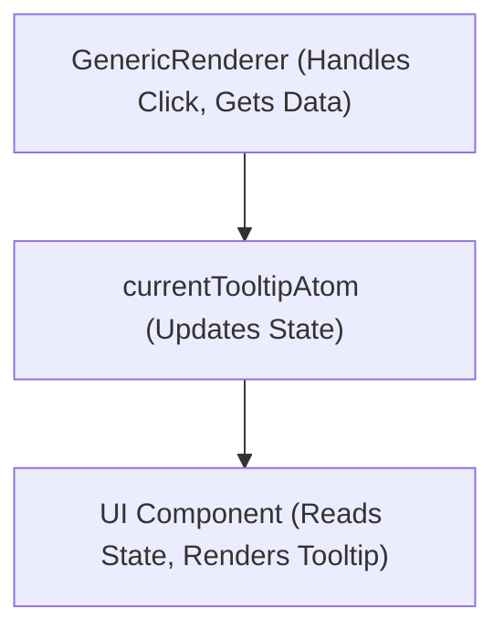
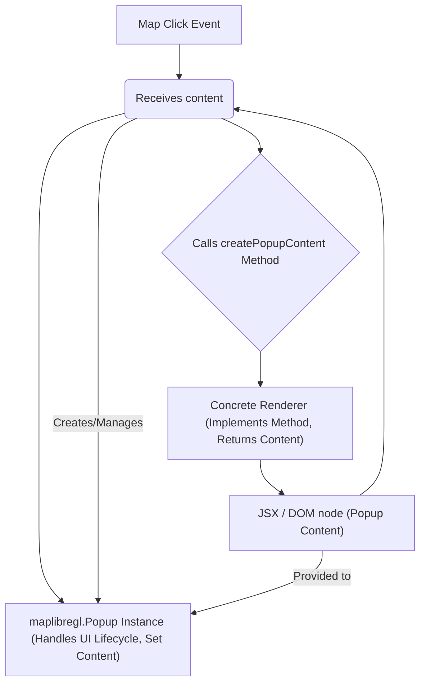
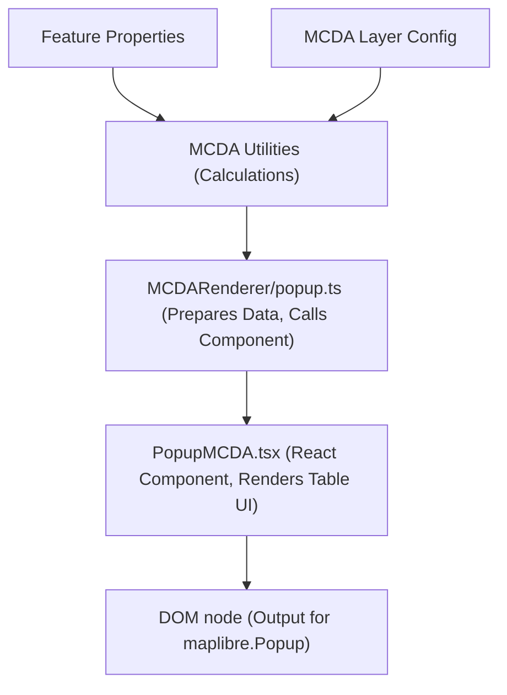
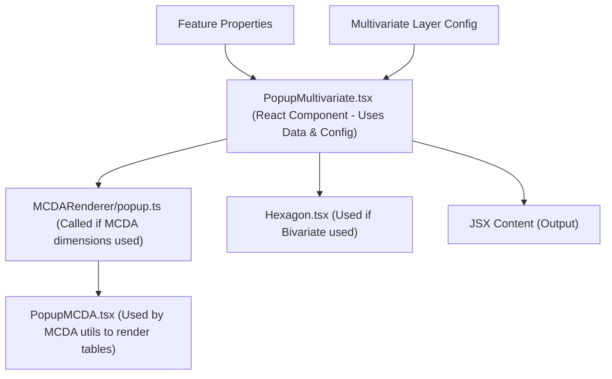
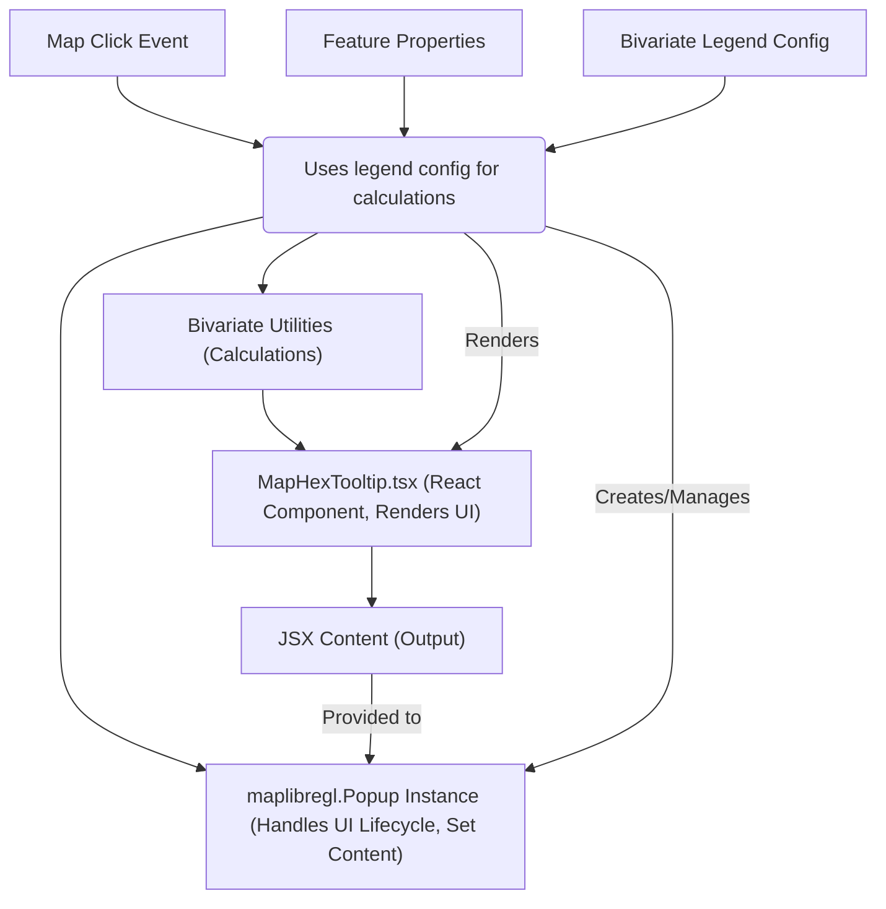

# Tooltip and Popup Implementations in Logical Layer Renderers

This report provides a comprehensive analysis of the different tooltip and popup mechanisms found within the [`src/core/logical_layers/renderers`](../../src/core/logical_layers/renderers) directory.

## Overview of Popup and Tooltip Mechanisms

Within the [`src/core/logical_layers/renderers`](../../src/core/logical_layers/renderers) directory, there appear to be two main mechanisms for displaying contextual information on the map:

1.  A generic tooltip mechanism primarily used by [`GenericRenderer.ts`](../../src/core/logical_layers/renderers/GenericRenderer.ts), which utilizes a global state atom (`currentTooltipAtom`). This mechanism is suitable for simple, text-based content, often sourced directly from feature properties.
2.  A more structured map popup mechanism built around the abstract [`ClickableFeaturesRenderer.tsx`](../../src/core/logical_layers/renderers/ClickableFeaturesRenderer/ClickableFeaturesRenderer.tsx), which uses MapLibre-specific Popup objects and React components for content. This framework allows for richer, interactive popup content and is extended by specific renderers like MCDA and Multivariate.

## Detailed Breakdown by Implementation

### 1. Generic Tooltip ([`GenericRenderer.ts`](../../src/core/logical_layers/renderers/GenericRenderer.ts))

- **Purpose:** To display simple, markdown-formatted tooltip content on clicking a feature, based on configuration provided in the layer's legend (`legend.tooltip`). Also handles opening external links based on `legend.linkProperty`.
- **Mechanism:**
  - Registers a click listener on the map for the layer's source.
  - When a click occurs, it queries rendered features at the click point.
  - If `legend.linkProperty` is defined, it finds a feature with this property and opens the URL in a new tab (`onMapClick`).
  - If `legend.tooltip` is defined with `type: 'markdown'` and `paramName`, it finds a feature with the specified property.
  - If found, it dispatches an action to the global [`currentTooltipAtom`](../../src/core/shared_state/currentTooltip.ts) (`~core/shared_state/currentTooltip`) to set the tooltip content (the markdown text from the feature property) and the screen position of the click.
  - A separate UI component is responsible for listening to `currentTooltipAtom` and rendering the tooltip.
- **Dependencies:**
  - [`currentTooltipAtom`](../../src/core/shared_state/currentTooltip.ts) (for state management of the tooltip display).
  - MapLibre GL JS (`MapMouseEvent` for event handling).
  - Layer legend configuration (to determine if/how to show a tooltip or link).
  - Internal utils (`registerMapListener`, etc.).
- **Architecture/Dependency Description:** [`GenericRenderer`](../../src/core/logical_layers/renderers/GenericRenderer.ts) acts as an intermediary. It listens to map events, extracts relevant data based on layer configuration (legend), and then updates a global state (`currentTooltipAtom`) that a separate UI layer consumes to render the tooltip. This decouples the rendering logic from the renderer itself.

#### Generic Tooltip Flow Diagram

### 2. MapLibre Popup Framework ([`ClickableFeaturesRenderer.tsx`](../../src/core/logical_layers/renderers/ClickableFeaturesRenderer/ClickableFeaturesRenderer.tsx))

- **Purpose:** To provide a reusable base class for renderers that need to display interactive popups on clickable map features, leveraging MapLibre's built-in popup object and using React for flexible content rendering.
- **Mechanism (Abstract):**
  - Extends [`LogicalLayerDefaultRenderer`](../../src/core/logical_layers/renderers/DefaultRenderer.ts).
  - Manages the lifecycle of a `maplibre-gl.Popup` instance (`this._popup`).
  - Registers a click listener on the map, specifically targeting features from the renderer's source and the layer identified by the abstract `getClickableLayerId()`.
  - When a clickable feature is identified and is visible, it calls the abstract method `createPopupContent(feature, style)`. This method is expected to return a React JSX element or a DOM node.
  - Uses `createRoot` from `react-dom/client` to render the JSX returned by `createPopupContent` into a temporary DOM element.
  - Sets this DOM element as the content of the `maplibre-gl.Popup` instance using `setDOMContent`.
  - Opens the popup at the clicked geographical coordinates (`setLngLat`).
  - Includes methods (`cleanPopup`, `onMapZoom`) to manage the popup's visibility and removal.
  - Includes logic for adding hover and active feature states using a border layer.
- **Dependencies:**
  - MapLibre GL JS (`MapPopup`, `MapMouseEvent`, map instance, LayerSpecification for border layer).
  - React and `react-dom/client` (for rendering popup content).
  - Concrete renderer classes (must extend [`ClickableFeaturesRenderer`](../../src/core/logical_layers/renderers/ClickableFeaturesRenderer/ClickableFeaturesRenderer.tsx) and implement abstract methods like `createPopupContent`, `getSourcePrefix`, `getClickableLayerId`, `getMinZoomLevel`, `getMaxZoomLevel`, `mountLayers`).
  - Internal utils (`layerByOrder`, `registerMapListener`, `createFeatureStateHandlers`, `isFeatureVisible`).
- **Architecture/Dependency Description:** [`ClickableFeaturesRenderer`](../../src/core/logical_layers/renderers/ClickableFeaturesRenderer/ClickableFeaturesRenderer.tsx) is an abstract base class providing the common infrastructure for handling map clicks and managing a MapLibre popup instance. It depends on MapLibre GL JS for the popup UI and React/ReactDOM for rendering content. Concrete renderer subclasses inherit this functionality and provide the layer-specific logic for mounting layers, identifying clickable features, and, crucially, generating the unique content for their popups via the `createPopupContent` method. This promotes reusability of the popup handling logic.

#### MapLibre Popup Framework - Abstract Flow Diagram

### 3. MCDA Popups ([`MCDARenderer/popup.ts`](../../src/core/logical_layers/renderers/MCDARenderer/popup.ts), [`MCDARenderer/components/PopupMCDA.tsx`](../../src/core/logical_layers/renderers/MCDARenderer/components/PopupMCDA.tsx))

- **Purpose:** To display detailed, tabular information specific to MCDA calculations for a clicked feature within an MCDA layer.
- **Role in Popup Flow (Content Generation):** These files are primarily responsible for _generating the content_ that the `MCDARenderer` (a concrete implementation extending `ClickableFeaturesRenderer`) will place inside the MapLibre popup.
- **Mechanism:**
  - [`MCDARenderer/popup.ts`](../../src/core/logical_layers/renderers/MCDARenderer/popup.ts) contains utility functions (`generateMCDALayersTableAndScore`, `generateMCDAPopupTable`, `generateMCDAPopupContent`) that take feature properties and MCDA layer configurations as input.
  - `generateMCDALayersTableAndScore` performs calculations based on feature properties and MCDA layer configurations to derive normalized values and the final MCDA score.
  - `generateMCDAPopupTable` takes the calculated data and uses the [`PopupMCDA.tsx`](../../src/core/logical_layers/renderers/MCDARenderer/components/PopupMCDA.tsx) React component to structure and format this information into a table.
  - `generateMCDAPopupContent` creates a DOM node and renders the output of `generateMCDAPopupTable` into it using `createRoot`. This DOM node is the expected return type for `createPopupContent` when using `setDOMContent`.
  - The `MCDARenderer` class implements `createPopupContent` by calling `generateMCDAPopupContent`.
- **Dependencies:**
  - [`MCDARenderer/components/PopupMCDA.tsx`](../../src/core/logical_layers/renderers/MCDARenderer/components/PopupMCDA.tsx) (the React component for rendering the table UI).
  - MCDA style configuration and types ([`~core/logical_layers/renderers/stylesConfigs/mcda/types.ts`](../../src/core/logical_layers/renderers/stylesConfigs/mcda/types.ts)).
  - MCDA calculation utilities ([`~core/logical_layers/renderers/stylesConfigs/mcda/calculations.ts`](../../src/core/logical_layers/renderers/stylesConfigs/mcda/calculations.ts)).
  - React and `react-dom/client`.
- **Architecture/Dependency Description:** The MCDA popup content generation is modularized. [`MCDARenderer/popup.ts`](../../src/core/logical_layers/renderers/MCDARenderer/popup.ts) depends on the MCDA calculation utilities and the `PopupMCDA.tsx` component. The `MCDARenderer` (not fully provided, but inferred to extend `ClickableFeaturesRenderer`) depends on `MCDARenderer/popup.ts` to get the DOM node content for its popup.

#### MCDA Popup Flow - Content Generation Diagram

### 4. Multivariate Popups ([`MultivariateRenderer/components/PopupMultivariate.tsx`](../../src/core/logical_layers/renderers/MultivariateRenderer/components/PopupMultivariate.tsx), [`MultivariateRenderer/popup.ts`](../../src/core/logical_layers/renderers/MultivariateRenderer/popup.ts))

- **Purpose:** To display information for multivariate layers, combining details about the 'score' and 'base' dimensions, potentially including MCDA calculation results and bivariate hexagon representation.
- **Role in Popup Flow (Content Generation):** These files define the React component (`PopupMultivariate.tsx`) and a utility function (`generateMultivariatePopupContent` in `MultivariateRenderer/popup.ts`) responsible for generating the JSX content for the `MultivariateRenderer`'s popup.
- **Mechanism:**
  - [`MultivariateRenderer/components/PopupMultivariate.tsx`](../../src/core/logical_layers/renderers/MultivariateRenderer/components/PopupMultivariate.tsx) is a React component that receives feature data and the multivariate layer configuration.
  - It processes the configuration for 'score', 'base', and 'opacity' dimensions.
  - If dimensions are configured using MCDA, it reuses `generateMCDALayersTableAndScore` and `PopupMCDA` from the MCDA popup implementation to display MCDA-related tables.
  - If the color configuration is bivariate, it uses the `Hexagon` component and related bivariate utilities to display the corresponding hexagon and levels.
  - `MultivariateRenderer/popup.ts` contains `generateMultivariatePopupContent`, which simply serves as an entry point, rendering the `PopupMultivariate` component with the provided feature and layer style configuration.
  - The `MultivariateRenderer` class implements `createPopupContent` by calling `generateMultivariatePopupContent`.
- **Dependencies:**
  - [`MCDARenderer/popup.ts`](../../src/core/logical_layers/renderers/MCDARenderer/popup.ts) and [`MCDARenderer/components/PopupMCDA.tsx`](../../src/core/logical_layers/renderers/MCDARenderer/components/PopupMCDA.tsx) (reused for MCDA dimensions).
  - [`~components/Hexagon/Hexagon`](../../src/components/Hexagon/Hexagon.tsx).
  - Multivariate layer configuration and types.
  - React.
  - Bivariate utilities (`multivariatePopupHelpers.ts`, etc.).
- **Architecture/Dependency Description:** `MultivariateRenderer/popup.ts` is a thin wrapper around the `PopupMultivariate.tsx` component. `PopupMultivariate.tsx` orchestrates the rendering of various pieces of content (MCDA tables, Hexagon) based on the multivariate layer configuration, reusing components and utilities from other parts of the codebase. The `MultivariateRenderer` (inferred to extend `ClickableFeaturesRenderer`) depends on `MultivariateRenderer/popup.ts` to generate the JSX content for its popup.

#### Multivariate Popup Flow - Content Generation Diagram

### 5. Bivariate Popups ([`BivariateRenderer/BivariateRenderer.tsx`](../../src/core/logical_layers/renderers/BivariateRenderer/BivariateRenderer.tsx), `~components/MapHexTooltip/MapHexTooltip.tsx` - not provided)

- **Purpose:** To display detailed information about a hovered or clicked bivariate hexagon on the map, including the bivariate values and corresponding legend cell.
- **Role in Popup Flow (Handling and Content Generation):** `BivariateRenderer.tsx` handles both the map interaction to trigger the popup and the initial step of content generation by calling the `MapHexTooltip` component.
- **Mechanism:**
  - Extends `LogicalLayerDefaultRenderer` (note: it was previously identified as extending `ClickableFeaturesRenderer` in our analysis, but the provided code shows it extends `LogicalLayerDefaultRenderer` directly and implements similar popup logic. This suggests a potential area for refactoring to align with the `ClickableFeaturesRenderer` pattern).
  - Uses Maplibre's native `MapPopup` class to create and manage the popup instance (`this._popup`).
  - Registers a click event listener on the map that filters features belonging to the bivariate source (`addBivariatePopup`).
  - When a clickable feature is identified and visible, it calculates the bivariate values (x and y) based on feature properties and the legend configuration.
  - Determines the bivariate cell label and color based on the calculated values and legend.
  - Creates a DOM node (`div`) and uses `createRoot` from `react-dom/client` to render the [`<MapHexTooltip>`](../../src/components/MapHexTooltip/MapHexTooltip.tsx) React component into it, passing the calculated values, cell info, and color.
  - Sets this DOM node as the content of the `maplibre-gl.Popup` instance using `setDOMContent`.
  - Opens the popup at the clicked geographical coordinates.
  - Includes methods to clean up the previous popup (`cleanPopup`) and handles removal on map zoom (`onMapZoom`).
  - Includes logic for adding hover and active feature states.
- **Dependencies:**
  - `maplibre-gl`: For `MapPopup` and map event handling.
  - `react-dom/client`: For rendering React components into a DOM node.
  - [`~components/MapHexTooltip/MapHexTooltip`](../../src/components/MapHexTooltip/MapHexTooltip.tsx): The React component rendered inside the popup.
  - Internal utils ([`~utils/bivariate`](../../src/utils/bivariate), [`~core/logical_layers/utils/layersOrder/layersOrder`](../../src/core/logical_layers/utils/layersOrder/layersOrder), etc.) for data processing, legend interaction, and layer management.
- **Architecture/Dependency Description:** `BivariateRenderer` manages the full lifecycle of the MapLibre popup for bivariate layers. It directly handles map events, performs necessary data calculations based on feature properties and legend, and then uses the `MapHexTooltip` component to generate the content. While it performs similar functions to `ClickableFeaturesRenderer`, it implements the popup handling logic directly rather than inheriting it, which is a point of divergence.

#### Bivariate Popup Flow - Handling and Content Generation Diagram

## Overall System Diagram

This diagram illustrates how the different renderer types interact with the map and the popup/tooltip mechanisms.

```mermaid
graph LR
    Map["MapLibre GL JS Map"] --> GenericRenderer["GenericRenderer"];
    Map --> ClickableFeaturesRendererAbstract["ClickableFeaturesRenderer (Abstract)"];

    GenericRenderer -- Updates State --> currentTooltipAtom["currentTooltipAtom"];
    currentTooltipAtom -- Read by --> UIComponent["UI Component (Renders Generic Tooltip)"];

    ClickableFeaturesRendererAbstract --> MapLibrePopupInstance["maplibregl.Popup Instance"];
    ClickableFeaturesRendererAbstract -- Calls createPopupContent --> ConcreteRenderer["Concrete Renderers (MCDA, Multivariate)"];

    ConcreteRenderer --> ContentGenerationModules["Content Generation (e.g., MCDARenderer/popup.ts, PopupMultivariate.tsx)"];
    ContentGenerationModules --> PopupContent["Popup Content (JSX/DOM)"];
    PopupContent --> MapLibrePopupInstance;

    BivariateRenderer["BivariateRenderer"] --> Map;
    BivariateRenderer -- Creates/Manages --> MapLibrePopupInstance;
    BivariateRenderer -- Calls --> MapHexTooltipComponent["MapHexTooltip.tsx (Renders Bivariate Popup Content)"];
    MapHexTooltipComponent --> PopupContent;

    UIComponent -- Renders --> GenericTooltipUI["Generic Tooltip UI"];
    MapLibrePopupInstance -- Renders --> MapLibrePopupUI["MapLibre Popup UI"];

    subgraph Popup Content Generation
        MCDAPopupUtils["MCDARenderer/popup.ts"] --> PopupMCDAComponent["PopupMCDA.tsx"];
        MultivariateContent["Multivariate Renderer Content Modules"] --> PopupMCDAComponent;
        MultivariateContent --> HexagonComponent["Hexagon.tsx"];
        MultivariateContent --> PopupMultivariateComponent["PopupMultivariate.tsx"];
    end

    ConcreteRenderer -- Depends on --> ContentGenerationModules;
```

## Analysis: DRY, KISS, and Potential Improvements

Based on the investigation, several areas could be improved to align better with DRY and KISS principles:

1.  **Duplicate Popup Management Logic:** Both `ClickableFeaturesRenderer` and `BivariateRenderer` contain similar logic for handling map click events, querying features, creating and managing `maplibre-gl.Popup` instances, and handling popup cleanup on zoom/unmount. The `BivariateRenderer` effectively duplicates the core responsibilities of `ClickableFeaturesRenderer` instead of extending it. This violates the DRY principle.

    - **Suggestion:** Refactor `BivariateRenderer` to extend `ClickableFeaturesRenderer` and override only the necessary methods, such as `getClickableLayerId`, `getMinZoomLevel`, `getMaxZoomLevel`, `mountLayers`, and `createPopupContent`. The common popup handling logic can be consolidated in the abstract base class.

2.  **Inconsistent Content Generation Output:** `ClickableFeaturesRenderer` expects `createPopupContent` to return either JSX or a DOM node. While both are valid for `setDOMContent`, consistently returning one type (e.g., always returning a React element) could simplify the implementation within the base class and concrete renderers. Currently, MCDA content generation produces a DOM node directly, while Multivariate produces JSX that is then rendered to a DOM node by the base class.

    - **Suggestion:** Standardize the output of `createPopupContent` across all renderers that extend `ClickableFeaturesRenderer` to return a React element. The base class can then consistently handle the `createRoot` and `setDOMContent` steps.

3.  **Generic Tooltip vs. MapLibre Popup:** The existence of two distinct mechanisms for displaying contextual information adds complexity. The `GenericRenderer` uses a global state atom, while `ClickableFeaturesRenderer` uses MapLibre's built-in popup. While `currentTooltipAtom` is suitable for simple tooltips, the `maplibre-gl.Popup` offers more control and is used for richer content. The choice between these two is currently tied to the renderer type.

    - **Suggestion:** Evaluate if the `currentTooltipAtom` mechanism is still necessary or if all contextual information display could be standardized under the `ClickableFeaturesRenderer` pattern, perhaps with different content components (`createPopupContent`) for simple vs. complex popups. This would align better with KISS by reducing the number of ways to achieve the same goal.

4.  **Coupling in Content Generation:** The Multivariate popup component reuses MCDA popup utilities and components. While this is a form of reuse, the direct dependency makes the Multivariate content generation closely coupled to the MCDA implementation details. This is acceptable to some degree as MCDA is a type of multivariate analysis, but careful consideration should be given to ensure this coupling doesn't hinder future changes or introduce unnecessary complexity.

Addressing these points could lead to a more maintainable, understandable, and less repetitive codebase for handling map-based popups and tooltips.
