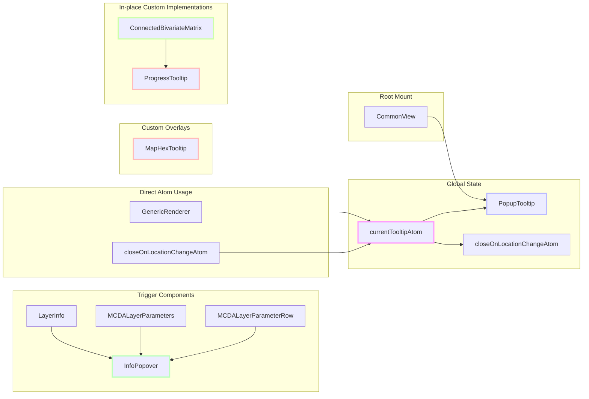

# Current Tooltip and Popup Implementation Status

## Overview

This report summarizes the current usage of tooltips and popups in the codebase, highlights components already migrated to `SimpleTooltip`, identifies remaining components using the legacy global popup system (`PopupTooltip`, `PopupTooltipTrigger`, `PopupTooltipWrapper`, `currentTooltipAtom`), and lists required migrations and deprecations.

## Current Architecture



Legend:

- 🟪 Pink: Global state management
- 🟦 Blue: Global popup renderer
- 🟩 Green: Trigger components (now using InfoPopover)
- 🟨 Yellow-green: In-place Custom Implementations
- 🟥 Red: Custom overlays
- ⬜ White: Supporting components

Key Relationships:

1. `currentTooltipAtom` is the central state manager
2. `PopupTooltipTrigger` has been removed. Components like `LayerInfo`, `MCDALayerParameters`, and `MCDALayerParameterRow` now use `InfoPopover`.
3. Direct atom usage bypasses the trigger component
4. Custom overlays are independent implementations (MapHexTooltip still uses Maplibre)
5. In-place custom implementations manage their tooltip/popup state locally.
6. Global `PopupTooltip` is mounted at the root via `CommonView`.

Migration Path:

1. Replace remaining direct `currentTooltipAtom` usages with `<Popover>`
2. Convert custom overlay `MapHexTooltip` to `<Popover>`
3. Remove global `PopupTooltip` and `currentTooltipAtom`
4. Unmount from `CommonView`

## Custom Overlays and Direct Atom Usage Analysis

### Custom Overlays

1. **MapHexTooltip** ([src/components/MapHexTooltip/MapHexTooltip.tsx](../../src/components/MapHexTooltip/MapHexTooltip.tsx))

   - Purpose: Displays bivariate hex data on map
   - Implementation: Uses Maplibre's native Popup system (Status: Still uses Maplibre popup)
   - Technical Details:
     - Rendered via `createRoot` in [BivariateRenderer](../../src/core/logical_layers/renderers/BivariateRenderer/BivariateRenderer.tsx)
     - Custom CSS module ([MapHexTooltip.module.css](../../src/components/MapHexTooltip/MapHexTooltip.module.css)) for styling
     - Uses Maplibre's Popup API for positioning
     - Props interface:
       ```typescript
       type MapHexTooltipProps = {
         hexagonColor: string;
         axis: BivariateLegend['axis'];
         cellIndex: number;
         cellLabel: string;
         values: { x: string; y: string };
       };
       ```
   - Key Features:
     - Custom styling via CSS modules
     - Hexagon visualization
     - Axis labels and values display
     - Positioned relative to map features
   - Migration Complexity: Medium
     - Needs to be converted from Maplibre Popup to Popover
     - Requires position calculation relative to map features
     - Must maintain current styling and layout

### In-place Custom Implementations

1. **ConnectedBivariateMatrix** ([src/features/bivariate_manager/components/ConnectedBivariateMatrix/ConnectedBivariateMatrix.tsx](../../src/features/bivariate_manager/components/ConnectedBivariateMatrix/ConnectedBivariateMatrix.tsx))

   - Usage: Matrix cell progress tooltip
   - Implementation: Manages `ProgressTooltip` state locally with debounce (Status: Migrated to in-place custom solution)
   - Technical Details:
     - Uses `useAction` for atom actions:
       ```typescript
       const setTooltip = useAction(currentTooltipAtom.setCurrentTooltip.v3action);
       const turnOffById = useAction(currentTooltipAtom.turnOffById.v3action);
       ```
     - Debounced tooltip display:
       ```typescript
       const debouncedShowTooltip = useCallback(
         debounce((position: { x: number; y: number }) => {
           const resetTooltip = () => turnOffById(TOOLTIP_ID);
           resetTooltip();
           setTooltip({
             popup: <ProgressTooltip close={resetTooltip} />,
             position,
             initiatorId: TOOLTIP_ID,
             hoverBehavior: true,
           });
         }, 400),
         [turnOffById, setTooltip]
       );
       ```
   - Key Features:
     - Hover-based activation
     - Debounced display
     - Direct `ProgressTooltip` integration managed by local state.
   - Migration Complexity: Done (Custom In-place)
     - Further migration to `<Popover>` might be considered for consistency, but not strictly necessary for removing global atom dependency.

2. **ProgressTooltip** ([src/features/bivariate_manager/components/ProgressTooltip/ProgressTooltip.tsx](../../src/features/bivariate_manager/components/ProgressTooltip/ProgressTooltip.tsx))
   - Purpose: Shows loading/complete states for bivariate matrix operations
   - Implementation: Used within `ConnectedBivariateMatrix` with local state management (Status: Used in in-place custom solution)
   - Technical Details:
     - Uses React's `useState` and `useEffect` for state management
     - CSS animations for loading spinner ([ProgressTooltip.module.css](../../src/features/bivariate_manager/components/ProgressTooltip/ProgressTooltip.module.css))
     - Auto-dismissal logic:
       ```typescript
       useEffect(() => {
         setContent(renderingContent);
         setTimeout(() => {
           setContent(doneContent);
           setTimeout(() => {
             close();
           }, 800);
         }, 400);
       }, [close]);
       ```
   - Key Features:
     - Animated loading spinner
     - Success state with icon
     - Auto-dismissal after completion
   - Migration Complexity: Done (Used in In-place Custom Solution)
     - Can be refactored if `ConnectedBivariateMatrix` is migrated to `<Popover>`.

### Direct Atom Usage

1. **GenericRenderer** ([src/core/logical_layers/renderers/GenericRenderer.ts](../../src/core/logical_layers/renderers/GenericRenderer.ts))

   - Usage: Map feature tooltips
   - Implementation: Direct currentTooltipAtom dispatch (Status: Still uses currentTooltipAtom)
   - Technical Details:
     - Uses `registerMapListener` for click handling
     - Priority-based event handling:
       ```typescript
       registerMapListener(
         'click',
         (ev) => {
           // ... tooltip logic ...
         },
         50 -
           (this.highestLayerType ? layerTypesOrdered.indexOf(this.highestLayerType) : 0),
       );
       ```
     - Markdown content support via currentTooltipAtom
   - Key Features:
     - Click-based activation
     - Position based on click coordinates
     - Markdown content support
   - Migration Complexity: Medium
     - Needs to be converted to Popover
     - Must maintain click handling and priority
     - Keep markdown rendering support

2. **closeOnLocationChangeAtom** ([src/features/tooltip/atoms/closeOnLocationChangeAtom.ts](../../src/features/tooltip/atoms/closeOnLocationChangeAtom.ts))
   - Usage: Location-based tooltip closing
   - Implementation: Watches currentTooltipAtom state (Status: Still exists, depends on currentTooltipAtom)
   - Technical Details:
     - Uses `getUnlistedState` to access atom state
     - Dispatches reset action on location change:
       ```typescript
       const tooltip = getUnlistedState(currentTooltipAtom);
       if (tooltip) {
         dispatch(currentTooltipAtom.resetCurrentTooltip());
       }
       ```
   - Key Features:
     - Automatic closing on location change
     - Global tooltip state management
   - Migration Complexity: Low
     - Can be removed after all tooltips migrated
     - No direct UI impact

### Migration Strategy

1. **Phase 1: Custom Overlays**

   - Convert MapHexTooltip to use Popover (Status: Pending)
     - Replace Maplibre Popup with Popover component
     - Maintain current styling and layout
     - Update position calculation logic

2. **Phase 2: Direct Atom Usage**

   - Convert GenericRenderer tooltips to Popover (Status: Pending)
     - Replace currentTooltipAtom with Popover
     - Maintain click handling and priority
     - Keep markdown support
   - Remove closeOnLocationChangeAtom (Status: Pending removal after GenericRenderer migrated)
     - Remove after all tooltips migrated
     - Update any dependent code

3. **Phase 3: Cleanup**
   - Remove currentTooltipAtom (Status: Pending)
     - Remove from [currentTooltip.ts](../../src/core/shared_state/currentTooltip.ts)
     - Update any remaining references
   - Remove PopupTooltip component (Status: Pending)
     - Remove from [PopupTooltip.tsx](../../src/features/tooltip/components/PopupTooltip/PopupTooltip.tsx)
     - Clean up related CSS modules
   - Update CommonView (Status: Pending)
     - Remove PopupTooltip mount
     - Clean up any related code

## 1. Migrated (No Action Required)

These components use non-interactive, hover-triggered tooltips via `SimpleTooltip` or have been updated:

- [ToolbarButton](../../src/features/toolbar/components/ToolbarButton/ToolbarButton.tsx) — Toolbar button hint
- [ShortToolbarButton](../../src/features/toolbar/components/ShortToolbarButton/ShortToolbarButton.tsx) — Compact toolbar button hint
- [NavButton](../../src/features/side_bar/components/SideBar/NavButton.tsx) — Sidebar navigation labels
- [ToggleButton](../../src/features/side_bar/components/SideBar/ToggleButton.tsx) — Sidebar toggle hint
- [ReferenceAreaInfo](../../src/features/user_profile/components/SettingsForm/ReferenceAreaInfo/ReferenceAreaInfo.tsx) — Reference-area info
- [Analytics](../../src/features/events_list/components/EventCard/Analytics/Analytics.tsx) — Analytics icon hint
- [DenominatorIcon](../../src/features/bivariate_manager/components/BivariateMatrixControl/components/DenominatorIcon/DenominatorIcon.tsx) — Denominator cell info
- [SeverityIndicator](../../src/components/SeverityIndicator/SeverityIndicator.tsx) — Severity icon description
- [IconButton](../../src/components/Uni/Components/IconButton.tsx) — Generic icon buttons
- [Severity](../../src/components/Uni/Components/Severity.tsx) — Severity component helper
- [Field](../../src/components/Uni/Components/Field.tsx) — Form field helper
- [LabelWithTooltip](../../src/components/LabelWithTooltip/LabelWithTooltip.tsx) — Labeled form fields
- [LayerActionIcon](../../src/components/LayerActionIcon/LayerActionIcon.tsx) — Layer action controls

### PopupTooltipWrapper (Hover/Click Delegation) - converted to tooltips (Status: Removed)

- [PopupTooltipWrapper](../../src/components/PopupTooltipTrigger/PopupTooltipWrapper.tsx) — Legacy wrapper (Status: Removed)
- [AxisCaptions](../../src/features/bivariate_manager/components/BivariateMatrixControl/components/AxisCaptions/AxisCaptions.tsx) — to tooltip
- [CornerTooltipWrapper](../../src/components/BivariateLegend/CornerTooltipWrapper.tsx) — Legend corner tips

### Test Fixtures Still Rendering `<PopupTooltip/>` - converted to tooltips (Status: May still exist, needs verification)

- [BivariateMatrixControl.fixture.tsx](../../src/features/bivariate_manager/fixtures/BivariateMatrixControl.fixture.tsx)
- [BivariateLegend.fixture.tsx](../../src/components/BivariateLegend/BivariateLegend.fixture.tsx)

---

## 2. Legacy Global PopupTooltip System (Status: Partially Migrated)

### PopupTooltip Component (Status: Still exists, mounted in CommonView)

- [PopupTooltip](../../src/features/tooltip/components/PopupTooltip/PopupTooltip.tsx) — Global tooltip renderer
- [CommonView](../../src/views/CommonView.tsx) — `<PopupTooltip/>` mounted at app root

### PopupTooltipTrigger (Click or Hover) (Status: Removed)

- [PopupTooltipTrigger](../../src/components/PopupTooltipTrigger/PopupTooltipTrigger.tsx) — Core trigger wrapper (Status: Removed)
- [LayerInfo](../../src/components/LayerInfo/LayerInfo.tsx) — Layer metadata popup (Status: Migrated to InfoPopover)
- [MCDALayerParameters](../../src/features/mcda/components/MCDALayerEditor/MCDALayerParameters/MCDALayerParameters.tsx) — MCDA parameter info (Status: Migrated to InfoPopover)
- [MCDALayerParameterRow](../../src/features/mcda/components/MCDALayerEditor/MCDALayerParameters/MCDALayerParameterRow/MCDALayerParameterRow.tsx) — MCDA parameter row help (Status: Migrated to InfoPopover)

### Direct currentTooltipAtom Usage (Status: Still in use for some components)

- [GenericRenderer](../../src/core/logical_layers/renderers/GenericRenderer.ts) — Map feature tooltips (Status: Still uses currentTooltipAtom)
- [ConnectedBivariateMatrix](../../src/features/bivariate_manager/components/ConnectedBivariateMatrix/ConnectedBivariateMatrix.tsx) — Matrix cell tooltips (Status: Migrated to in-place custom solution)
- [closeOnLocationChangeAtom](../../src/features/tooltip/atoms/closeOnLocationChangeAtom.ts) — Location-based tooltip closing (Status: Still exists, depends on currentTooltipAtom)

### Shared State Atom (Status: Still exists)

- [currentTooltipAtom](../../src/core/shared_state/currentTooltip.ts) — Global state for PopupTooltip (Status: Still exists)

---

## 3. Custom Map Overlay (Status: Still uses Maplibre popup)

- [MapHexTooltip](../../src/components/MapHexTooltip/MapHexTooltip.tsx) — Bivariate hex popup content (Migration Target: `Popover`)

---

## 4. Migration Targets

- [MapHexTooltip](../../src/components/MapHexTooltip/MapHexTooltip.tsx) — Custom overlay → `Popover`
- [PopupTooltip](../../src/features/tooltip/components/PopupTooltip/PopupTooltip.tsx) — Global popup system → Remove & migrate triggers
- [CommonView](../../src/views/CommonView.tsx) — `<PopupTooltip/>` mount → Unmount; wrap triggers individually
- [GenericRenderer](../../src/core/logical_layers/renderers/GenericRenderer.ts) — Map feature tooltips → `<Popover trigger="click">`
- [closeOnLocationChangeAtom](../../src/features/tooltip/atoms/closeOnLocationChangeAtom.ts) — Remove after all tooltips migrated
