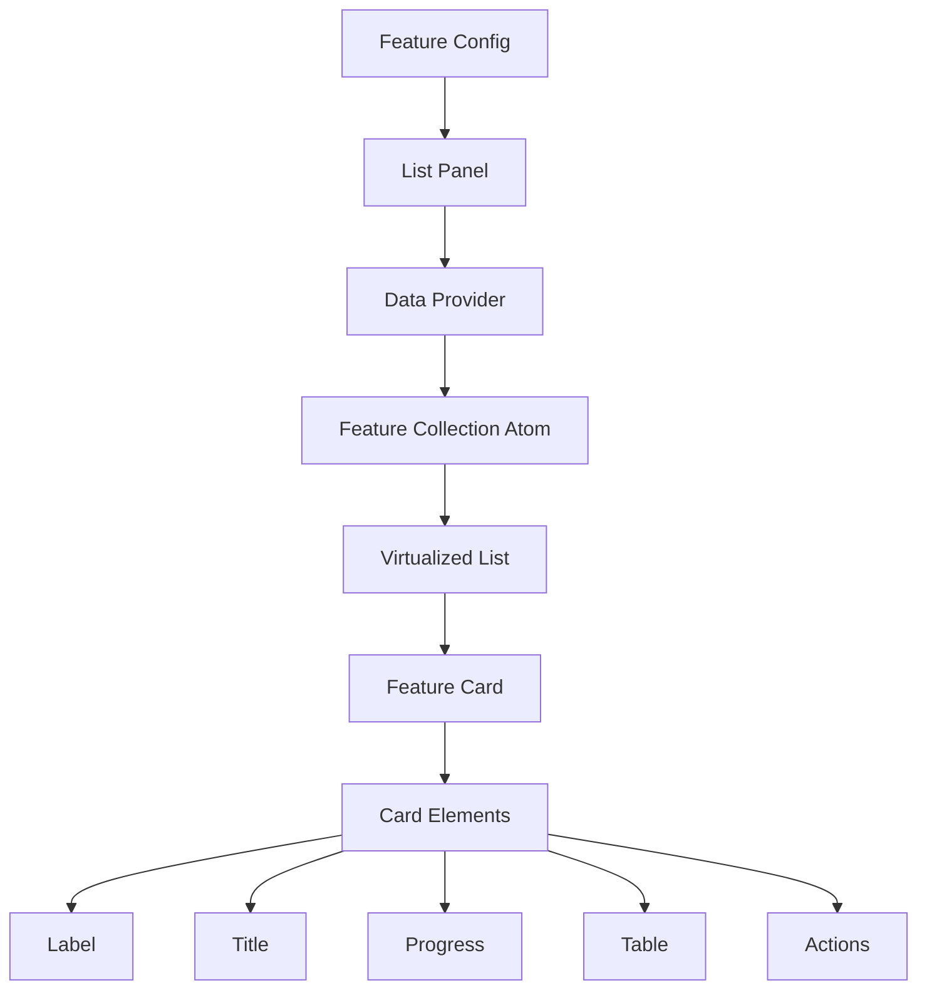

# Feature List Panel Architecture

## Overview

Evolution of `layer_features_panel` into a reusable architecture for feature-rich list panels.



## Core Concepts

### 1. Feature Configuration

```typescript
interface FeatureListPanelConfig {
  id: string; // Feature identifier
  dataProvider: {
    type: DataProviderType; // API endpoint or store identifier
    params?: Record<string, any>; // Provider-specific parameters
  };
  displayRules?: {
    // Optional display/fetch rules
    storeKey?: string; // Store path to watch
    ruleName?: string; // Rule function name
  }[];
  panelTitle: string;
  panelIcon?: string;
}
```

### 2. Feature Card System

```typescript
// Card Elements
interface CardElementBase {
  type: CardElementType; // 'label' | 'title' | 'progress' | 'table' | 'actions'
}

interface LabelElement extends CardElementBase {
  type: 'label';
  items: Array<{
    value: string;
    color?: string;
    backgroundColor?: string;
  }>;
}

interface TitleElement extends CardElementBase {
  type: 'title';
  title: string;
}

interface ProgressElement extends CardElementBase {
  type: 'progress';
  items: Array<{
    title: string;
    value: number;
    color: string;
  }>;
}

interface TableElement extends CardElementBase {
  type: 'table';
  rows: Array<[string, string]>; // [label, value] pairs
}

interface ActionElement extends CardElementBase {
  type: 'actions';
  items: Array<{
    title: string;
    type: 'external_link'; // Currently only external_link supported
    data: string; // URL for external_link
  }>;
}

type CardElement =
  | LabelElement
  | TitleElement
  | ProgressElement
  | TableElement
  | ActionElement;

// Feature Card
interface FeatureCard {
  id: string | number;
  focus?: [number, number, number, number]; // Map bounds [minLng, minLat, maxLng, maxLat]
  properties: Record<string, any>; // Original feature data
  items: CardElement[]; // Card UI elements
}
```

### 3. Component Structure

```typescript
// Main Panel Component
const FeatureListPanel: React.FC<{
  config: FeatureListPanelConfig;
  className?: string;
}>;

// Card Component
const FeatureCard: React.FC<{
  feature: FeatureCard;
  isSelected?: boolean;
  onClick?: () => void;
}>;

// Element Components
const Label: React.FC<LabelElement>;
const Title: React.FC<TitleElement>;
const Progress: React.FC<ProgressElement>;
const Table: React.FC<TableElement>;
const Actions: React.FC<ActionElement>;
```

### 4. Styling System

```scss
// Card Styles
.card {
  display: flex;
  flex-direction: column;
  gap: var(--unit);
  padding: var(--double-unit);
  border-bottom: 1px solid var(--faint-weak);

  &.selected {
    background-color: var(--accent-weak);
    border-left: 4px solid var(--complimentary-strong);
  }
}

// Label Styles
.labelsList {
  display: flex;
  gap: var(--half-unit);

  > div {
    padding: var(--half-unit) var(--unit);
    border-radius: var(--double-unit);
    font: 500 var(--font-xs);
  }
}

// Progress Styles
.progress {
  .stack {
    position: relative;
    height: 6px;
    border-radius: 3px;
    background-color: var(--faint-weak);

    > div {
      position: absolute;
      height: 100%;
      border-radius: 3px;
    }
  }

  .desc {
    display: flex;
    justify-content: space-between;
  }
}

// Table Styles
.table {
  display: grid;
  gap: var(--half-unit);

  > div {
    display: grid;
    grid-template-columns: auto 1fr;
    gap: var(--unit);
  }
}

// Actions Styles
.actions {
  display: flex;
  gap: var(--half-unit);

  a {
    display: flex;
    align-items: center;
    gap: var(--half-unit);
    color: var(--accent-strong);
    text-decoration: none;

    &:hover {
      text-decoration: underline;
    }
  }
}
```

## Directory Structure

```
src/
  features/
    shared/
      feature_list/
        components/
          FeatureListPanel/
            index.tsx
            styles.module.css
          CardElements/
            Label/
              index.tsx
              styles.module.css
            Title/
            Progress/
            Table/
            Actions/
        state/
          featureCollection.ts
        types/
          feature.ts
```

## Usage Example

```typescript
// Feature configuration
{
  "features": [
    {
      "name": "events_list",
      "type": "FEATURE_LIST_PANEL",
      "configuration": {
        "id": "events",
        "dataProvider": {
          "type": "events_api",
          "params": {
            "format": "feature_card"
          }
        },
        "displayRules": [
          {
            "storeKey": "map.selectedArea",
            "ruleName": "hasSelectedArea"
          }
        ],
        "panelTitle": "Events"
      }
    }
  ]
}
```

## Migration Strategy

1. **Extract Card Elements**

   ```typescript
   // From layer_features_panel/components/CardElements
   -Label - Title - Progress - Table - Actions;
   ```

2. **Feature Collection Pattern**

   ```typescript
   // Based on layerFeaturesCollectionAtom
   export const createFeatureCollectionAtom = (config: FeatureListPanelConfig) => {
     return atom<FeatureCard[]>((ctx) => {
       // Similar to layerFeaturesCollectionAtom
     });
   };
   ```

3. **Gradual Feature Migration**
   - Keep existing feature implementations
   - Move shared feature code to core
   - Update implementations one by one
