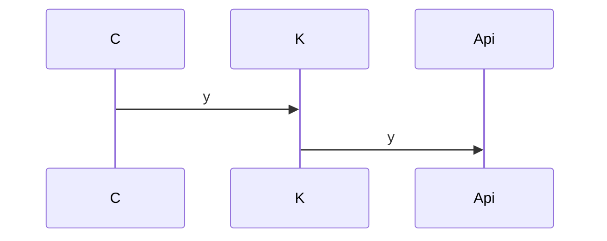

# Auth

### ...

getLocalAuthToken:

    read AT
    decode
    store in private instance props

    throw:
        token error -> resetAuth

resetAuth:

    remove token data from storage and instance
    logout hooks?
    reload page

call:

- checkToken:
  - checkTokenExpiration:
    - expired -> resetAuth -> logout
    - expireSoon (5min) -> refreshAuthToken
- processResponse [errorsConfig]
  - not authorized: 401 | 403 -> unauthorizedCallback
  - send Notification if !errorsConfig.hideErrors
  - throw ApiClientError
