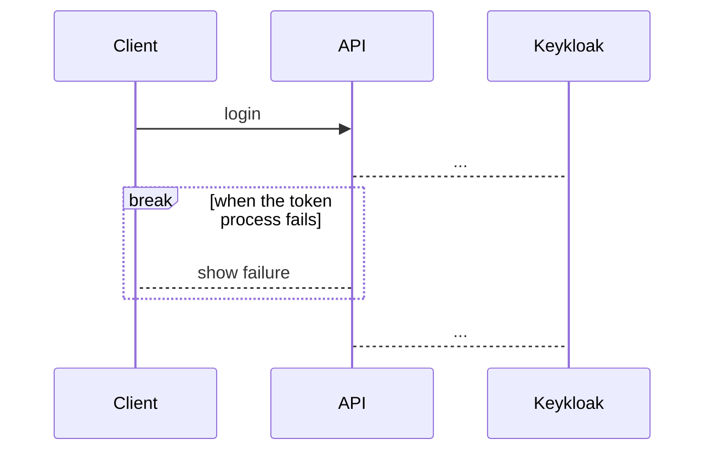

## Auth flow

```mermaid
sequenceDiagram
    Client->>API: login
    API-->Keykloak: ...
    break when the token process fails
        API-->Client: show failure
    end
    API-->Keykloak: ...
```

## Error handling

## ...
