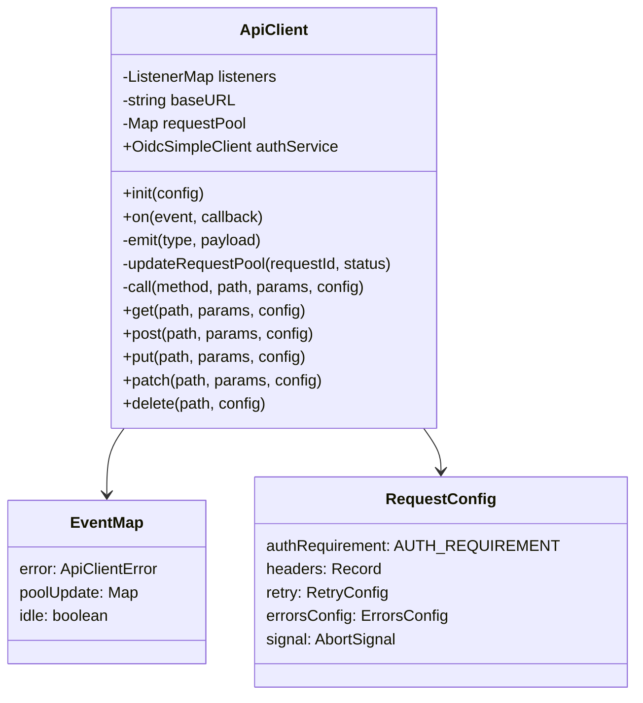
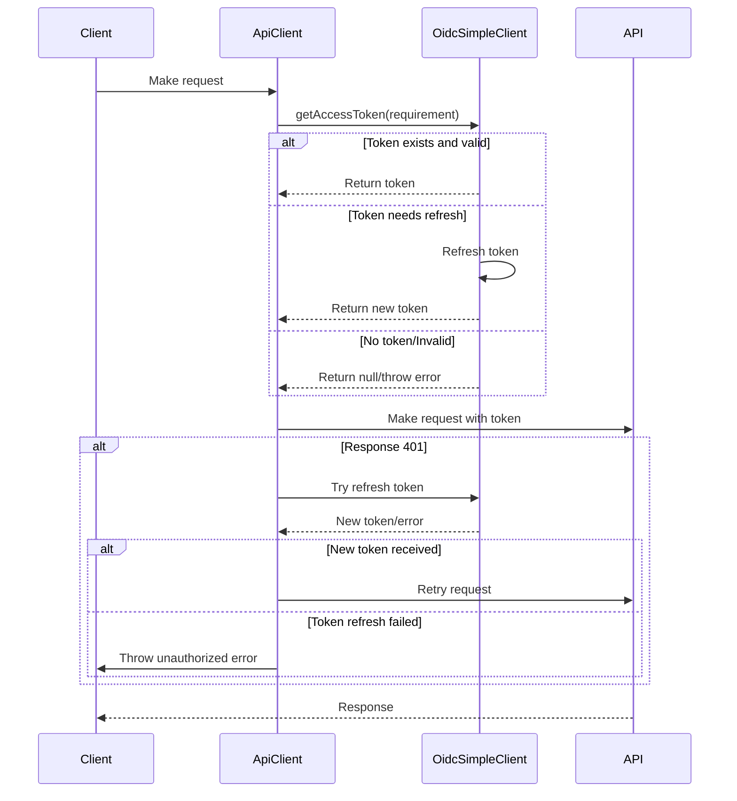

# API Client Documentation

The API Client is a robust HTTP client implementation built on top of [wretch](https://github.com/elbywan/wretch) that handles authentication, request management, error handling, and event emission.

## Features

- Authentication flow with OIDC token management
- Request pooling and status tracking
- Event system for errors, pool updates, and idle state
- Configurable retry mechanism with attempts and delay
- Custom error message handling
- Support for both relative and absolute URLs
- HTTP methods: GET, POST, PUT, PATCH, DELETE

## Architecture



## Authentication Flow

The client uses OidcSimpleClient for authentication with the following flow:



## Request Configuration

The client accepts the following configuration options:

```typescript
interface CustomRequestConfig {
  // Authentication requirement level (MUST | OPTIONAL | NEVER)
  authRequirement?: AuthRequirement;

  // Custom HTTP headers
  headers?: Record<string, string>;

  // Retry configuration
  retry?: {
    attempts: number; // Number of retry attempts
    delayMs: number; // Delay between retries
    onErrorKinds: string[]; // Error types to retry on
  };

  // Error handling configuration
  errorsConfig?: {
    messages?: Record<number, string> | string;
    hideErrors?: boolean;
  };

  // AbortController signal
  signal?: AbortSignal;
}
```

## Error Handling

The client implements a comprehensive error handling system:

1. **Error Types**:

   - `bad-request` (400)
   - `unauthorized` (401)
   - `forbidden` (403)
   - `not-found` (404)
   - `timeout` (408/504)
   - `server` (500+)
   - `canceled` (AbortError)
   - `client-unknown`

2. **Retry Mechanism**:

   ```typescript
   const defaultRetryConfig = {
     attempts: 0,
     delayMs: 1000,
     onErrorKinds: ['timeout'],
   };
   ```

3. **Custom Error Messages**:
   ```typescript
   const config = {
     errorsConfig: {
       messages: {
         401: 'Custom unauthorized message',
         404: 'Custom not found message',
       },
       hideErrors: false,
     },
   };
   ```

## Usage Examples

### Basic Request

```typescript
const client = new ApiClient();
client.init({ baseUrl: 'https://api.example.com' });

// GET request
const data = await client.get('/endpoint', { param: 'value' });

// POST request with body
const result = await client.post('/endpoint', { data: 'value' });
```

### Authenticated Request

```typescript
// Request with required authentication
const data = await client.get('/protected', null, {
  authRequirement: AUTH_REQUIREMENT.MUST,
});

// Request with optional authentication
const data = await client.get('/semi-protected', null, {
  authRequirement: AUTH_REQUIREMENT.OPTIONAL,
});
```

### Request with Retry

```typescript
const data = await client.get('/endpoint', null, {
  retry: {
    attempts: 3,
    delayMs: 1000,
    onErrorKinds: ['timeout', 'server'],
  },
});
```

### Custom Error Handling

```typescript
const data = await client.get('/endpoint', null, {
  errorsConfig: {
    messages: {
      404: 'Resource not available',
      500: 'Server error occurred',
    },
    hideErrors: true,
  },
});
```

### Event Handling

```typescript
// Listen for API errors
client.on('error', (error: ApiClientError) => {
  console.error('API Error:', error);
});

// Monitor request pool
client.on('poolUpdate', (pool: Map<string, string>) => {
  console.log('Active requests:', pool);
});

// Track idle state
client.on('idle', (isIdle: boolean) => {
  console.log('Client idle state:', isIdle);
});
```
