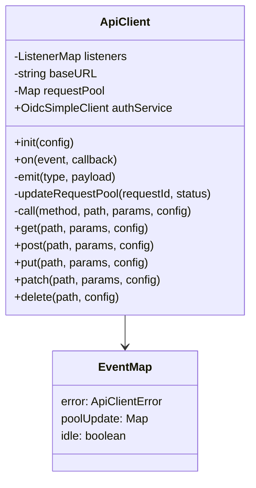
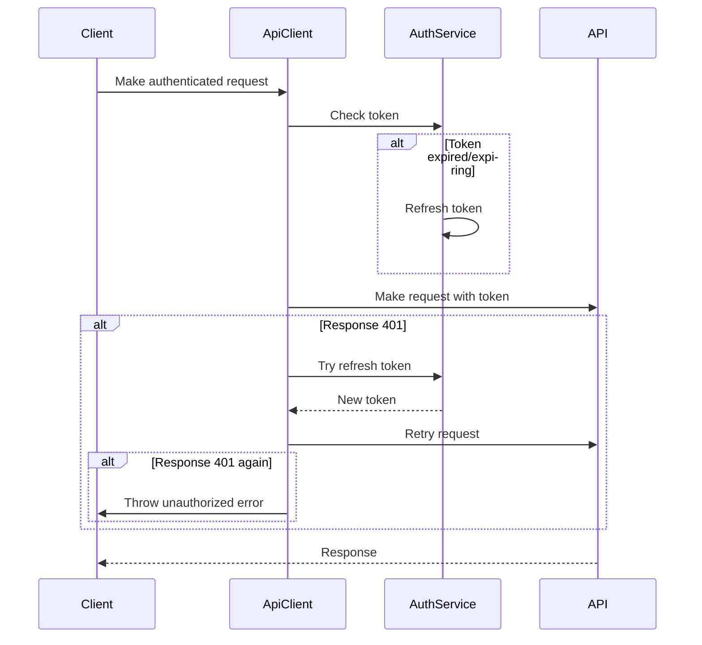
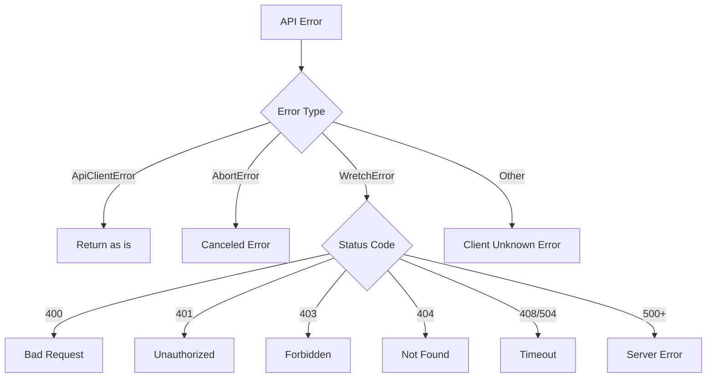

# API Client Documentation

The API Client is a robust HTTP client implementation built on top of [wretch](https://github.com/elbywan/wretch) that handles authentication, request management, error handling, and event emission.

## Features

- Authentication flow with token management
- Request pooling and status tracking
- Comprehensive error handling
- Event system for error, pool updates, and idle state
- Retry mechanism with configurable attempts and delay
- Support for both relative and absolute URLs
- HTTP methods: GET, POST, PUT, PATCH, DELETE

## Architecture



## Auth Flow



## Error Handling Flow



## Usage

### Basic Request

```typescript
const client = new ApiClient();
client.init({ baseUrl: 'https://api.example.com' });

// GET request
const data = await client.get('/endpoint', { param: 'value' });

// POST request
const result = await client.post('/endpoint', { data: 'value' });
```

### With Authentication

```typescript
// Authenticated request (requires configured authService)
const data = await client.get('/protected-endpoint', null, {
  authRequirement: AUTH_REQUIREMENT.REQUIRED,
});
```

### With Retry Configuration

```typescript
const data = await client.get('/endpoint', null, {
  retry: {
    attempts: 3,
    delayMs: 1000,
    onErrorKinds: ['timeout', 'server'],
  },
});
```

### Event Handling

```typescript
client.on('error', (error) => {
  console.error('API Error:', error);
});

client.on('idle', (isIdle) => {
  console.log('Client idle state:', isIdle);
});

client.on('poolUpdate', (pool) => {
  console.log('Active requests:', pool);
});
```

## Error Types

The API client handles various error types:

- `bad-request` (400)
- `unauthorized` (401)
- `forbidden` (403)
- `not-found` (404)
- `timeout` (408/504)
- `server` (500+)
- `canceled` (AbortError)
- `client-unknown` (Other errors)

Each error includes:

- Message: Human-readable error description
- Problem: Error classification and metadata
- Status: HTTP status code if applicable

## Request Configuration

The client accepts custom request configuration:

- `authRequirement`: Authentication requirement level
- `headers`: Custom HTTP headers
- `retry`: Retry configuration
- `errorsConfig`: Custom error handling
- `signal`: AbortController signal

## Event System

The client emits events for:

- `error`: When an API error occurs
- `poolUpdate`: When the request pool changes
- `idle`: When all requests complete
