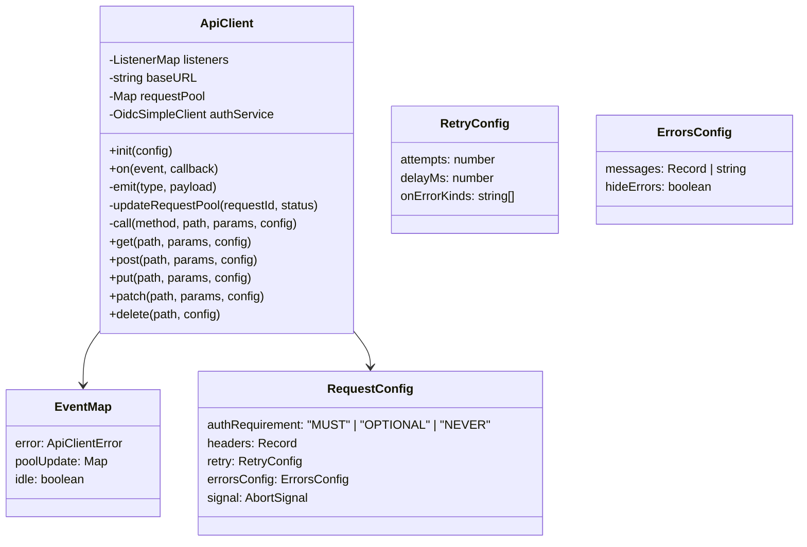
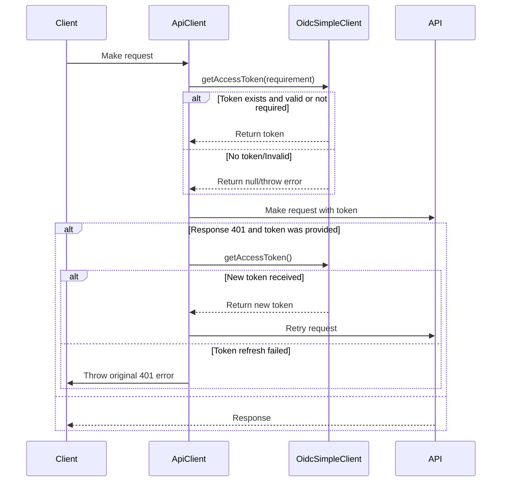

# API Client Documentation

The API Client is a robust HTTP client implementation built on top of [wretch](https://github.com/elbywan/wretch) that handles authentication, request management, error handling, and event emission.

## Features

- Authentication flow with OIDC token management
- Request pooling and status tracking
- Event system for errors, pool updates, and idle state
- Configurable retry mechanism with attempts and delay
- Custom error message handling
- Support for both relative and absolute URLs
- HTTP methods: GET, POST, PUT, PATCH, DELETE

## Architecture



## Authentication Flow

The client uses OidcSimpleClient for authentication with the following flow:



## Request Configuration

The client accepts the following configuration options:

```typescript
interface CustomRequestConfig {
  // Authentication requirement level (MUST | OPTIONAL | NEVER)
  // Default: OPTIONAL
  authRequirement?: AuthRequirement;

  // Custom HTTP headers
  headers?: Record<string, string>;

  // Retry configuration
  retry?: {
    attempts: number; // Number of retry attempts
    delayMs: number; // Delay between retries
    onErrorKinds: string[]; // Error types to retry on:  "bad-request" | "unauthorized" | "forbidden" | "not-found" | "timeout" | "server" | "canceled" | "client-unknown"
  };

  // Error handling configuration
  errorsConfig?: {
    messages?: Record<number, string> | string;
    hideErrors?: boolean;
  };

  // AbortController signal
  signal?: AbortSignal;
}
```

## Error Handling

The client implements a comprehensive error handling system:

1.  **Error Types**:

    - `bad-request` (400)
    - `unauthorized` (401)
    - `forbidden` (403)
    - `not-found` (404)
    - `timeout` (408/504)
    - `server` (500+)
    - `canceled` (AbortError)
    - `client-unknown`

    The ApiClient throws `ApiClientError` that contains `GeneralApiProblem` in `problem` property, describing appeared problem.

2.  **Retry Mechanism**:

    ```typescript
    const defaultRetryConfig = {
      attempts: 0,
      delayMs: 1000,
      onErrorKinds: ['timeout'],
    };
    ```

3.  **Custom Error Messages**:
    ```typescript
    const config = {
      errorsConfig: {
        messages: {
          401: 'Custom unauthorized message',
          404: 'Custom not found message',
        },
        hideErrors: false,
      },
    };
    ```

## Method: `get`

```typescript
public async get<T>(
  path: string,
  requestParams?: RequestParams,
  requestConfig?: CustomRequestConfig,
): Promise<T | null>
```

Makes a GET request to the specified path.

**Parameters:**

- **`path`**: The URL or path to the resource. Can be a relative path (e.g., `/users/123`) or an absolute URL (e.g., `https://example.com/users/123`).
- **`requestParams`** _(optional)_: An object containing query parameters to be added to the URL. The keys and values of this object will be converted into a query string. For example:

  ```typescript
  {
    id: 123,
    sort: 'name',
    order: 'asc'
  }
  // Becomes: ?id=123&sort=name&order=asc
  ```

  If `requestParams` is a string, it is appended to the URL as is, without any processing. If it's not provided, no query string is added.

- **`requestConfig`** _(optional)_: An object containing additional configuration for the request, as defined in [Request Configuration](#request-configuration). This allows you to control authentication, headers, retries, and error handling.

**Returns:**

- A `Promise` that resolves to the response data (parsed as type `T`), or `null` if the request is intentionally aborted or if an error occurs that prevents a successful response.

**Example:**

```typescript
const client = new ApiClient();
client.init({ baseUrl: 'https://api.example.com' });

// Simple GET request
const data = await client.get('/users'); // Fetches https://api.example.com/users

// GET request with query parameters
const user = await client.get('/users', { id: 123 }); // Fetches https://api.example.com/users?id=123

// GET request with query parameters and custom configuration
const products = await client.get(
  '/products',
  { category: 'electronics', limit: 10 },
  {
    headers: { 'X-Custom-Header': 'value' },
    retry: { attempts: 3 },
  },
); // Fetches https://api.example.com/products?category=electronics&limit=10
```

## Usage Examples

### Basic Request

```typescript
const client = new ApiClient();
client.init({ baseUrl: 'https://api.example.com' });

// GET request
const data = await client.get('/endpoint', { param: 'value' });

// POST request with body
const result = await client.post('/endpoint', { data: 'value' });
```

### Authenticated Request

```typescript
// Request with required authentication
const data = await client.get('/protected', /* No params */ undefined, {
  authRequirement: AUTH_REQUIREMENT.MUST,
});

// Request with optional authentication, and query params
const data = await client.get(
  '/semi-protected',
  { filter: 'some_filter' },
  {
    authRequirement: AUTH_REQUIREMENT.OPTIONAL,
  },
);
```

### Request with Retry

```typescript
const data = await client.get('/endpoint', /* No params */ undefined, {
  retry: {
    attempts: 3,
    delayMs: 1000,
    onErrorKinds: ['timeout', 'server'],
  },
});
```

### Custom Error Handling

```typescript
const data = await client.get('/endpoint', /* No params */ undefined, {
  errorsConfig: {
    messages: {
      404: 'Resource not available',
      500: 'Server error occurred',
    },
    hideErrors: true,
  },
});
```

### Event Handling

```typescript
// Listen for API errors
client.on('error', (error: ApiClientError) => {
  console.error('API Error:', error);
});

// Monitor request pool
client.on('poolUpdate', (pool: Map<string, string>) => {
  console.log('Active requests:', pool);
});

// Track idle state
client.on('idle', (isIdle: boolean) => {
  console.log('Client idle state:', isIdle);
});
```
