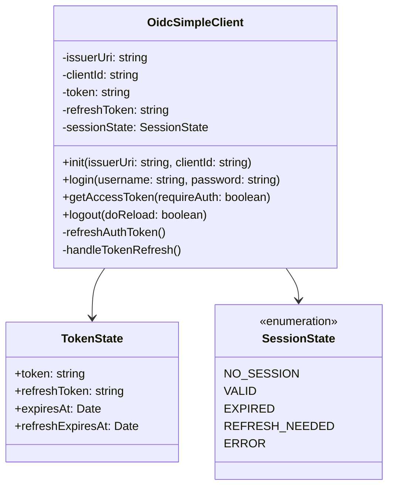
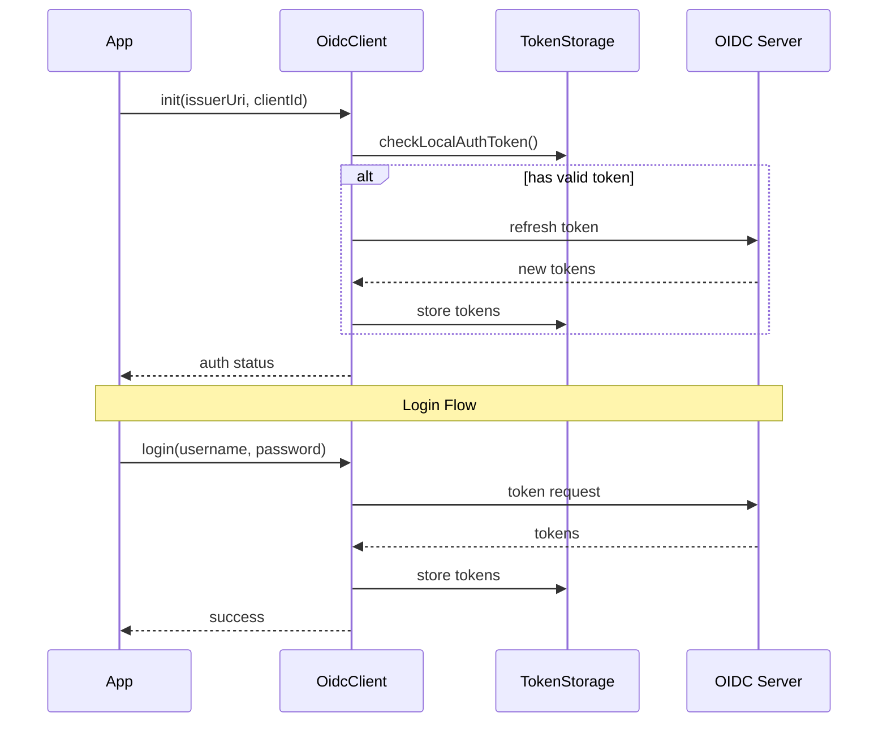
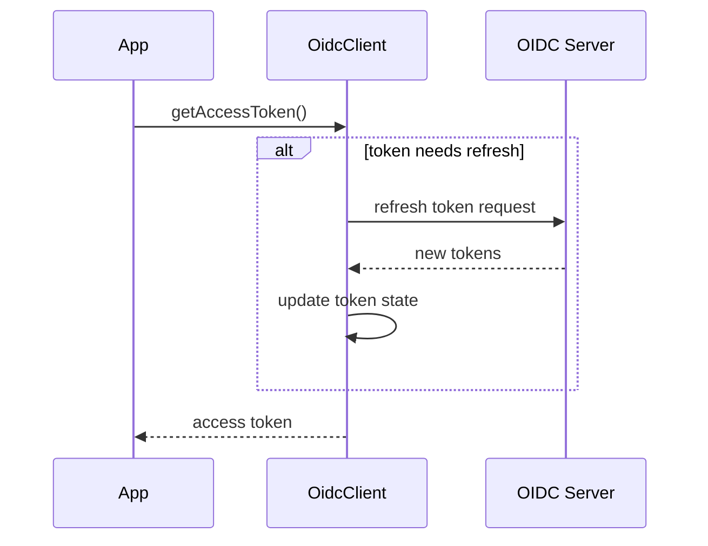

# OIDC Simple Client Documentation

## Overview

The OIDC Simple Client provides a lightweight implementation of OpenID Connect authentication flow, specifically focused on the Resource Owner Password Credentials (ROPC) grant type and refresh token handling.

## Architecture

### Class Diagram



### Authentication Flow



### Token Refresh Flow



## Key Features

### 1. Token Management

- Secure token storage in localStorage
- Automatic token refresh
- Token validation and sanitization
- Cross-tab synchronization support

### 2. Session States

```typescript
const SESSION_STATE = {
  NO_SESSION: 'NO_SESSION', // No active session
  VALID: 'VALID', // Session is active and valid
  EXPIRED: 'EXPIRED', // Session has expired
  REFRESH_NEEDED: 'REFRESH_NEEDED', // Token needs refresh
  ERROR: 'ERROR', // Error state
};
```

### 3. Authentication Requirements

```typescript
const AUTH_REQUIREMENT = {
  MUST: 'must', // Authentication required
  OPTIONAL: 'optional', // Authentication optional
  NEVER: 'never', // No authentication allowed
};
```

## Security Features

### Token Sanitization

The client implements several security measures:

- XSS payload detection
- JWT format validation
- Token expiration validation

## Usage Examples

### Initialization

```typescript
const client = new OidcSimpleClient();
await client.init('https://auth-server.com', 'client-id');
```

### Authentication

```typescript
// Login
const success = await client.authenticate('username', 'password');

// Get access token
const token = await client.getAccessToken();

// Logout
await client.logout();
```

## Error Handling

The client uses a custom `ApiClientError` class for error handling with specific error types:

- unauthorized
- bad-data
- network-error

## Best Practices

1. **Token Refresh**: Always use `getAccessToken()` to get the current token, as it handles automatic refresh.
2. **Error Handling**: Implement proper error handling for authentication failures.
3. **Security**: Never store sensitive credentials in client-side code.
4. **Cross-Tab Sync**: Enable `syncTabs` for applications requiring multi-tab support.

## Limitations

1. Uses Resource Owner Password Credentials (ROPC) grant type, which is deprecated in OAuth 2.1
2. Limited to single client_id per instance
3. No support for additional OAuth flows (Authorization Code, Implicit)
