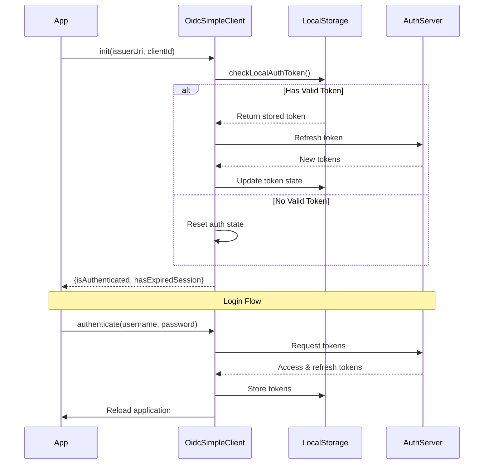
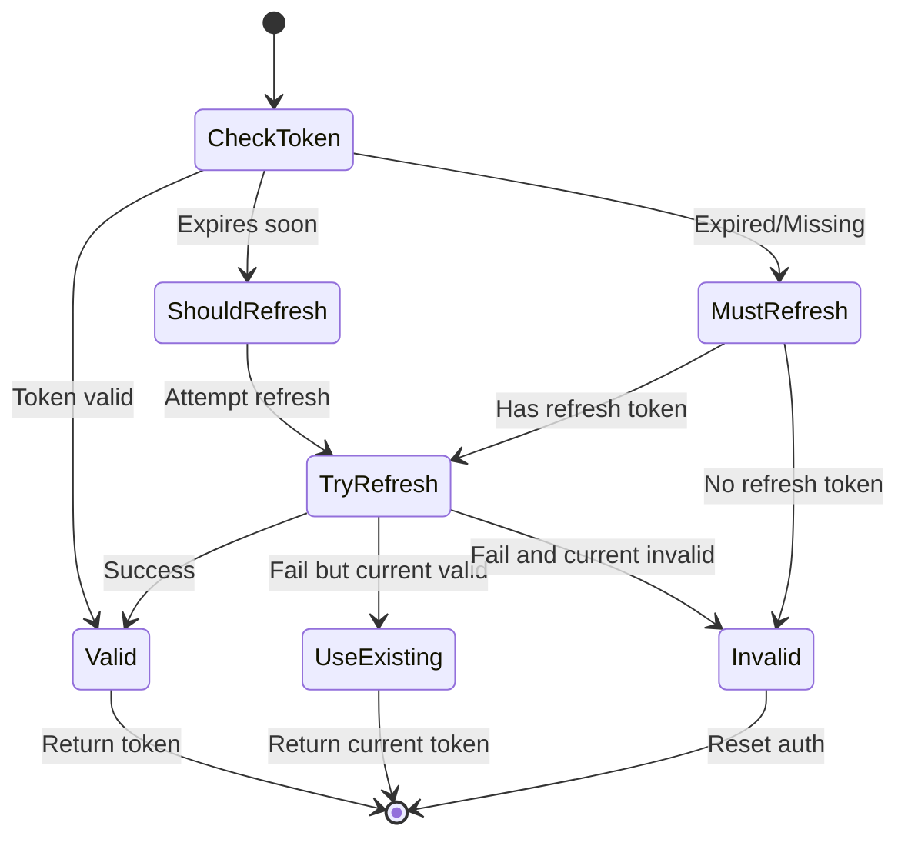
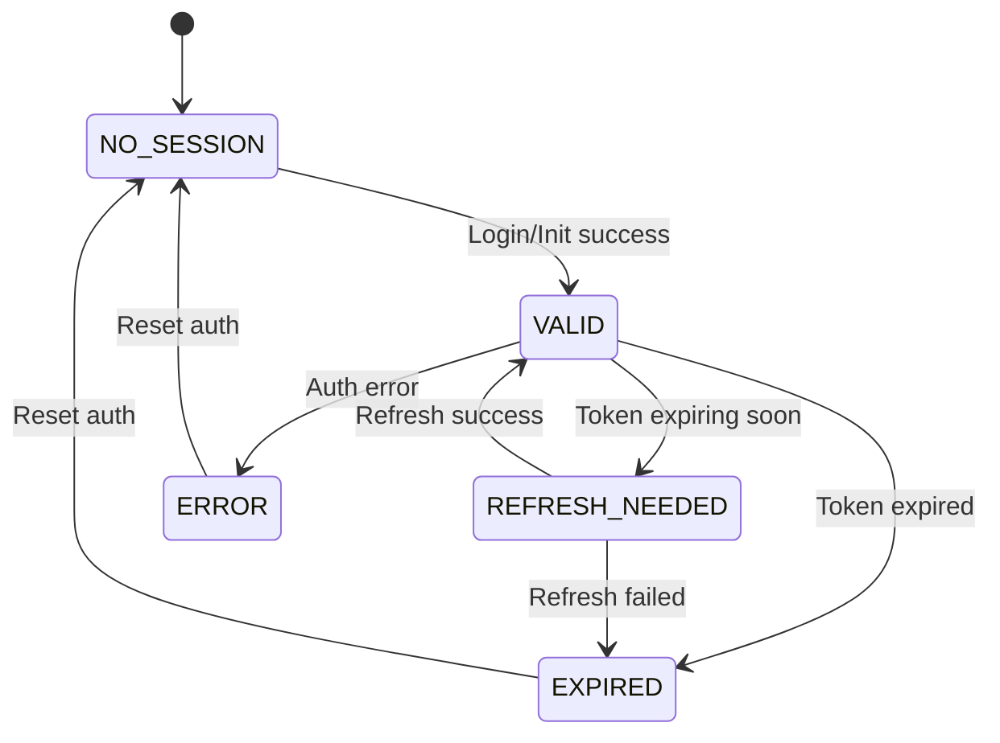

# OidcSimpleClient

A lightweight OpenID Connect client implementation focused on token management and session handling.

## Features

- Token-based authentication with JWT support
- Automatic token refresh management
- Cross-tab session synchronization
- XSS protection for token handling
- Configurable auth requirements (MUST, SHOULD, OPTIONAL)
- Event-based state management

## Usage

```typescript
// Initialize the client
const client = new OidcSimpleClient();
await client.init('https://auth-server.com/realms/my-realm', 'my-client-id');

// Login with username/password
const success = await client.authenticate('username', 'password');

// Get access token for API calls
const token = await client.getAccessToken({
  requirement: 'must', // 'must' | 'should' | 'optional'
});

// Logout
await client.logout();
```

## Authentication Flow



## Token Refresh Flow



## Session States



## Security Features

1. **Token Validation**

   - JWT format verification
   - XSS payload detection
   - Expiration checks
   - Refresh token rotation

2. **Storage Security**
   - Secure token storage in localStorage
   - Cross-tab synchronization
   - Automatic cleanup on session end

## API Reference

### Constructor

```typescript
constructor(
  storage: WindowLocalStorage['localStorage'] = localStorage,
  syncTabs: boolean = false
)
```

### Core Methods

#### `init(issuerUri: string, clientId: string): Promise<AuthState>`

Initializes the client and checks for existing auth state.

#### `authenticate(username: string, password: string): Promise<boolean | string>`

High-level authentication method that handles login and page reload.

#### `getAccessToken(options?: GetAccessTokenOptions): Promise<string>`

Gets the current access token, refreshing if necessary.

#### `logout(doReload?: boolean): Promise<void>`

Ends the current session and optionally reloads the page.

### Types

```typescript
interface AuthState {
  isAuthenticated: boolean;
  hasExpiredSession: boolean;
}

interface GetAccessTokenOptions {
  requirement?: 'must' | 'should' | 'optional';
}

type SessionState = 'NO_SESSION' | 'VALID' | 'EXPIRED' | 'REFRESH_NEEDED' | 'ERROR';
```

## Constants

- `TIME_TO_REFRESH_MS`: 3 minutes (180000ms)
- `LOCALSTORAGE_AUTH_KEY`: 'auth_token'

## Error Handling

The client uses `ApiClientError` for error handling with the following kinds:

- `unauthorized`: Authentication failures
- `bad-data`: Invalid token format or storage issues

## Event System

The client emits `sessionStateChanged` events with the following structure:

```typescript
interface AuthEvent {
  type: AuthEventType;
  reason?: string;
  error?: Error;
  sessionState?: SessionState;
}
```

## Best Practices

1. Always handle authentication errors gracefully
2. Use appropriate auth requirements for API calls
3. Implement proper error handling for storage failures
4. Consider enabling cross-tab synchronization for better UX
5. Handle page reloads appropriately in your application

## Development Notes

1. The client uses the legacy password grant type which is removed in OAuth 2.1
2. Token refresh is handled automatically based on expiration time
3. Cross-tab synchronization is optional but recommended
4. Token validation includes XSS protection measures
5. All token operations are atomic and handle concurrent requests
