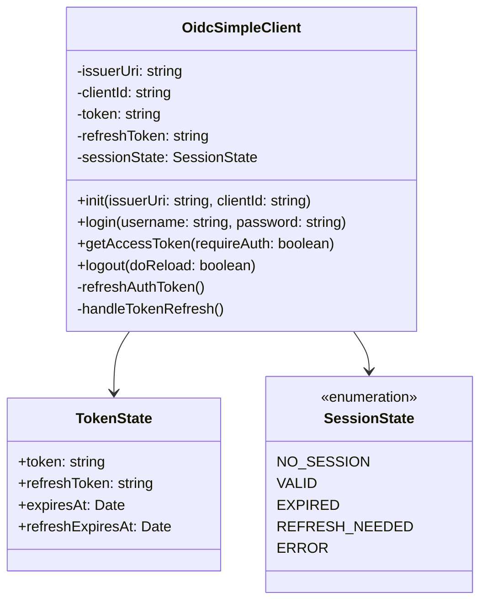
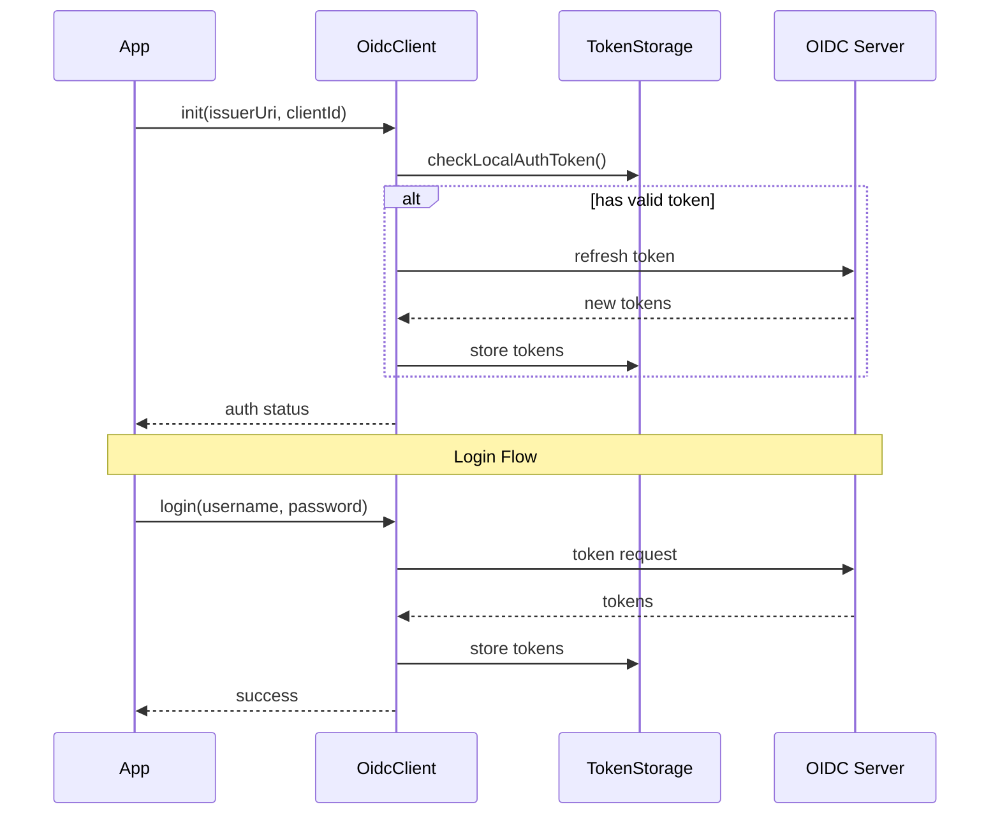
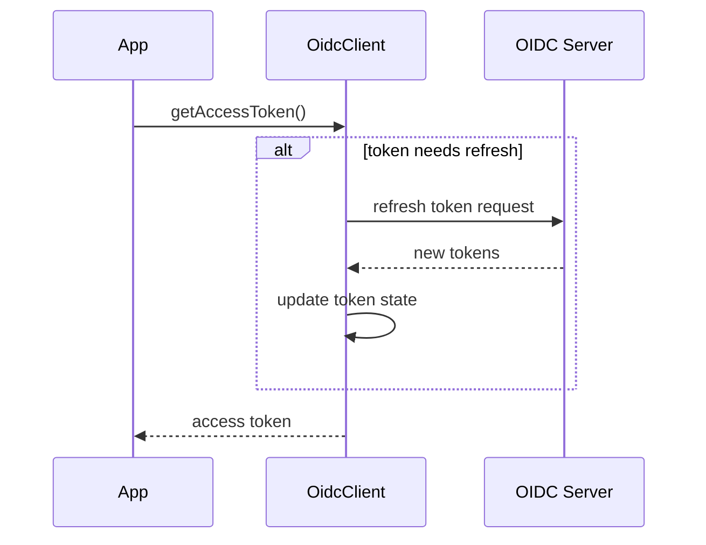

# OIDC Simple Client Documentation

## Overview

The OIDC Simple Client provides a lightweight implementation of OpenID Connect authentication flow, specifically focused on the Resource Owner Password Credentials (ROPC) grant type and refresh token handling.

## Architecture

### Class Diagram



### Authentication Flow



### Token Refresh Flow



## Key Features

### 1. Token Management

- Secure token storage in localStorage
- Automatic token refresh
- Token validation and sanitization
- Cross-tab synchronization support

### 2. Session States

Defined in `src/core/auth/constants.ts`:

```typescript
export const SESSION_STATE = {
  NO_SESSION: 'NO_SESSION', // No active session
  VALID: 'VALID', // Session is active and valid
  EXPIRED: 'EXPIRED', // Session has expired
  REFRESH_NEEDED: 'REFRESH_NEEDED', // Token needs refresh
  ERROR: 'ERROR', // Error state
} as const;
```

### 3. Authentication Requirements

Defined in `src/core/auth/constants.ts`:

```typescript
export const AUTH_REQUIREMENT = {
  MUST: 'must', // Authentication required
  OPTIONAL: 'optional', // Authentication optional
  NEVER: 'never', // No authentication allowed
} as const;
```

## Security Features

### Token Sanitization

The client implements several security measures:

- XSS payload detection
- JWT format validation
- Token expiration validation

## Usage Examples

### Initialization

```typescript
const client = new OidcSimpleClient();
await client.init('https://auth-server.com', 'client-id');

// With cross-tab synchronization:
const clientWithSync = new OidcSimpleClient(localStorage, true);
await clientWithSync.init('https://auth-server.com', 'client-id');
```

### Authentication

```typescript
// Login
const result = await client.authenticate('username', 'password');
// result can be true or error message string

// Get access token
const token = await client.getAccessToken();

// Logout
await client.logout(); // Reloads by default
await client.logout(false); // Does not reload
```

## Error Handling

The client uses a custom `ApiClientError` class for error handling. `ApiClientError` contains a `problem` property, which is an object with a `kind` property and, potentially a `data` property. Here are the possible `kind` values and their meanings:

- **`unauthorized`**: Indicates an authentication failure. The `data` property (if present) provides more details:
  - `not_authenticated`: The user needs to be logged in, but isn't. This is thrown by `getAccessToken` when `requireAuth` is true (the default).
  - `session_expired`: The user's session has expired. This is thrown by `getAccessToken` if the token refresh fails and `requireAuth` is true.
  - `invalid_grant`: The refresh token is invalid. This can happen during the `refreshAuthToken` call.
  - `invalid_token`: The token state is invalid. This is thrown by `getAccessToken` if the token and refresh token are invalid, and `requireAuth` is true.
- **`bad-data`**: Indicates a problem with the data received or processed:
  - Invalid token format (XSS, JWT structure).
  - Failed to update token state.
  - Invalid auth response.
- **`network-error`**: Indicates a network connectivity problem.
- **`server`**: Indicates a server-side error (e.g., a 500 status code).
- **`unknown`**: A catch-all for unexpected errors.
- **`timeout`**: Indicates a request timeout.

## Cross-Tab Synchronization

The `OidcSimpleClient` supports cross-tab synchronization of the authentication state. This means that if a user logs in or out in one browser tab, the other tabs will automatically reflect the updated authentication state.

### Constructor

```typescript
constructor(storage?: WindowLocalStorage['localStorage'], syncTabs?: boolean);
```

- **`storage`** _(optional)_: The storage mechanism to use. Defaults to `localStorage`. You can pass a different storage object (e.g., for testing).
- **`syncTabs`** _(optional)_: A boolean value indicating whether to enable cross-tab synchronization. Defaults to `false`.

### Enabling Cross-Tab Sync

To enable cross-tab synchronization, pass `true` for the `syncTabs` parameter in the `OidcSimpleClient` constructor:

```typescript
const client = new OidcSimpleClient(localStorage, true); // syncTabs enabled
```

### How it Works

The synchronization is achieved by listening to the `storage` event in the browser. This event is triggered whenever a change is made to `localStorage` in another tab.

1.  When `syncTabs` is enabled, the client adds an event listener for the `storage` event.
2.  When the `storage` event is fired, the client checks if the changed key is `LOCALSTORAGE_AUTH_KEY`.
3.  If the key matches and there's no new value, it means the user logged out in another tab, so the client resets the auth state.
4.  If the key matches and there's a new value, the client checks the local auth token to update the session state.

## Best Practices

1.  **Token Refresh**: Always use `getAccessToken()` to get the current token, as it handles automatic refresh.
2.  **Error Handling**: Implement proper error handling for authentication failures.
3.  **Security**: Never store sensitive credentials in client-side code.
4.  **Cross-Tab Sync**: Enable `syncTabs` for applications requiring multi-tab support.

## Limitations

1.  Uses Resource Owner Password Credentials (ROPC) grant type, which is deprecated in OAuth 2.1.
2.  Limited to a single client_id per instance.
3.  No support for additional OAuth flows (Authorization Code, Implicit).
