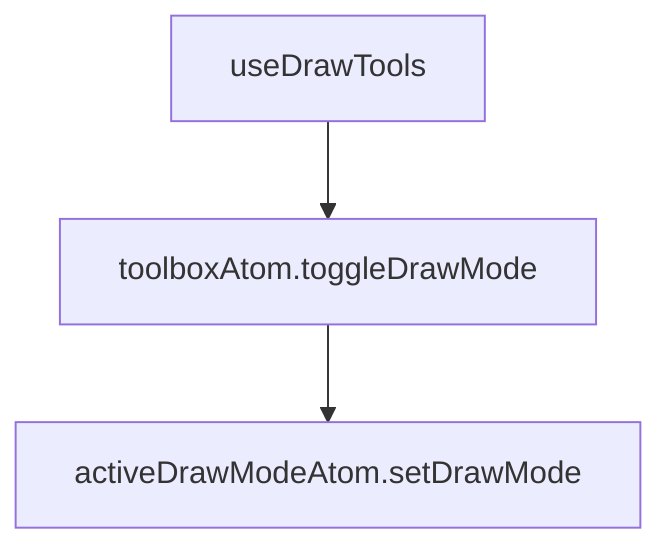

## v1

based on: nebula.gl (deck.gl v8)

integrated via MapboxLayer

    // deck.gl v8
    import {MapboxLayer} from '@deck.gl/mapbox'
    map.addLayer(new MapboxLayer ...

old docs: [pre-v1 structure](https://www.figma.com/file/G8VQQ3mctz5gPkcZZvbzCl/Untitled?node-id=0%3A1),
[updated version](https://www.figma.com/file/FcyFYb406D8zGFWxyK4zIk/Untitled?node-id=0%3A1)

### Toolbar button flow

- [useDrawTools: controlsArray.[mode].action: toggleDrawMode(drawModes[mode]),](./index.ts#L128)
- [toolboxAtom.toggleDrawMode](./atoms/toolboxAtom.ts#L64)
- [activeDrawModeAtom.setDrawMode(mode)](./atoms/activeDrawMode.ts#L10)

### Commit feature

- [DrawModeRenderer.\_onDrawEdit](./renderers/DrawModeRenderer.ts#L306)
- [DrawModeRenderer.\_addFeatureAction](./renderers/DrawModeRenderer.ts#L101)
- [combinedAtom.addFeature](./atoms/combinedAtom.ts#L93)
- [drawnGeometryAtom.addFeature](./atoms/drawnGeometryAtom.ts#L19)

## v2 (planning)

based on: @deck.gl-community/editable-layers (deck.gl v9+, maplibre v3+, webgl2)

integrated via MapboxOverlay

    // deck.gl v9
    import {MapboxOverlay} from '@deck.gl/mapbox'
    map.addControl(new MapboxOverlay({
      interleaved: true,
      layers: [new ArcLayer({...})]
    }))
