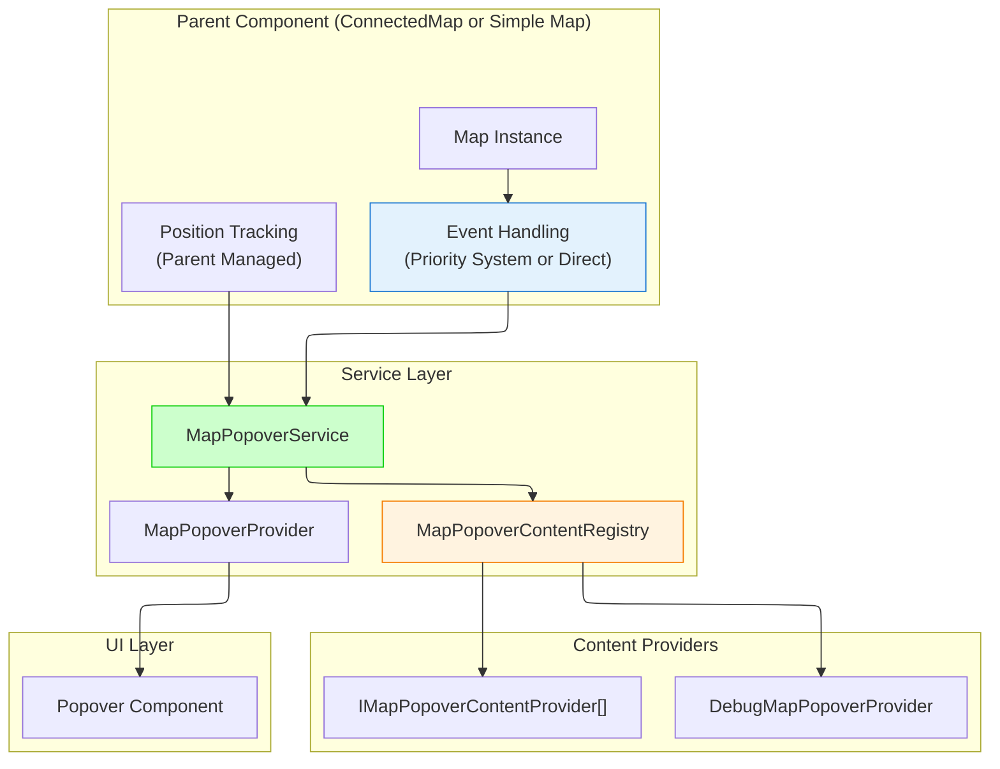

# Map Popover System

Service-based popover system for displaying content on map click events with automatic positioning and tracking. Implements ADR-002 service-based delegation architecture.

## Architecture



## Core Components

- **`MapPopoverService`**: Enhanced service API for popover display and positioning
- **`MapPopoverProvider`**: React context provider for popover rendering and service access
- **`MapPopoverContentRegistry`**: Registry for managing multiple content providers
- **`MapPopoverPositionCalculator`**: Screen position and placement calculation
- **Parent Component**: Handles event detection and position tracking (ConnectedMap or simple maps)

## Service-Based API

### Enhanced MapPopoverService Interface

```typescript
interface MapPopoverService {
  // Enhanced API for service-based delegation
  showWithContent: (
    point: ScreenPoint,
    content: React.ReactNode,
    options?: MapPopoverOptions,
  ) => void;
  showWithEvent: (mapEvent: MapMouseEvent, options?: MapPopoverOptions) => boolean;
  updatePosition: (point: ScreenPoint, placement?: Placement) => void;
  close: () => void;
  isOpen: () => boolean;

  // Legacy API methods for backward compatibility
  show: (point: ScreenPoint, content: React.ReactNode, placement?: Placement) => void;
  move: (point: ScreenPoint, placement?: Placement) => void;
}
```

## Integration Patterns

### 1. ConnectedMap Integration (Priority System)

ConnectedMap integrates MapPopover through the existing priority-based event system:

```tsx
// ConnectedMap automatically integrates MapPopover at priority 55
import { ConnectedMap } from '~components/ConnectedMap';

function App() {
  return (
    <div>
      <ConnectedMap />
      {/* MapPopover is automatically integrated */}
    </div>
  );
}
```

### 2. Simple Map Integration (Direct API)

For simple maps without the priority system:

```tsx
import { MapPopoverProvider, useMapPopoverService } from 'src/core/map';
import type { Map } from 'maplibre-gl';

function SimpleMapDemo() {
  const mapRef = useRef<HTMLDivElement>(null);
  const map = useMapInstance(mapRef);
  const popoverService = useMapPopoverService();

  useEffect(() => {
    if (!map) return;

    const handleClick = (event: MapMouseEvent) => {
      // Direct content approach
      const features = event.target?.queryRenderedFeatures?.(event.point) || [];
      if (features.length > 0) {
        const content = (
          <div>
            <h4>Feature: {features[0].layer.id}</h4>
            <pre>{JSON.stringify(features[0].properties, null, 2)}</pre>
          </div>
        );
        popoverService.showWithContent(event.point, content);
      }
    };

    const handleMove = () => {
      if (popoverService.isOpen()) {
        // Handle position updates manually
        const newPosition = calculatePosition(); // Your position logic
        popoverService.updatePosition(newPosition);
      }
    };

    map.on('click', handleClick);
    map.on('move', handleMove);

    return () => {
      map.off('click', handleClick);
      map.off('move', handleMove);
    };
  }, [map, popoverService]);

  return (
    <MapPopoverProvider>
      <div ref={mapRef} style={{ width: '100%', height: '400px' }} />
    </MapPopoverProvider>
  );
}
```

### 3. Registry-Based Integration

For complex applications with multiple content providers:

```tsx
import { MapPopoverProvider, mapPopoverRegistry } from 'src/core/map';

function AppWithRegistry() {
  return (
    <MapPopoverProvider registry={mapPopoverRegistry}>
      <ConnectedMap />
      {/* Content providers register themselves with mapPopoverRegistry */}
    </MapPopoverProvider>
  );
}
```

## Content Provider Architecture

The registry-based architecture allows multiple systems to provide content without conflicts.

### Creating Content Providers

```tsx
import type { IMapPopoverContentProvider, MapPopoverOptions } from 'src/core/map';
import type { MapMouseEvent } from 'maplibre-gl';

class FeatureTooltipProvider implements IMapPopoverContentProvider {
  renderContent(mapEvent: MapMouseEvent): React.ReactNode | null {
    const features = mapEvent.target?.queryRenderedFeatures?.(mapEvent.point) || [];

    if (!features.length) return null;

    const feature = features[0];
    return (
      <div>
        <h4>Feature Info</h4>
        <p>
          <strong>Layer:</strong> {feature.layer.id}
        </p>
        <p>
          <strong>Source:</strong> {feature.source}
        </p>
        <details>
          <summary>Properties</summary>
          <pre>{JSON.stringify(feature.properties, null, 2)}</pre>
        </details>
      </div>
    );
  }

  getPopoverOptions(): MapPopoverOptions {
    return {
      placement: 'top',
      closeOnMove: false,
      className: 'feature-tooltip',
    };
  }
}
```

### Provider Registration

```tsx
import { mapPopoverRegistry } from 'src/core/map';

function FeatureLayer({ enabled }: { enabled: boolean }) {
  const provider = useMemo(() => new FeatureTooltipProvider(), []);

  useEffect(() => {
    if (enabled) {
      mapPopoverRegistry.register(provider);
      return () => mapPopoverRegistry.unregister(provider);
    }
  }, [enabled, provider]);

  return null;
}
```

## Debug Features

The system includes a debug provider that activates when `KONTUR_DEBUG` is enabled:

```tsx
// Enable debug mode
localStorage.setItem('KONTUR_DEBUG', 'true');

// Debug provider automatically registers and shows:
// - All found features at click point
// - Layer information and source details
// - Complete properties JSON
// - Geographic coordinates and screen position
```

## Multiple Maps Support

Each map should have its own isolated popover provider:

```tsx
function MultiMapApp() {
  return (
    <div>
      {/* Each map gets its own isolated popover system */}
      <MapPopoverProvider>
        <SimpleMap mapId="map1" />
      </MapPopoverProvider>

      <MapPopoverProvider>
        <SimpleMap mapId="map2" />
      </MapPopoverProvider>
    </div>
  );
}
```

## Service Methods

### showWithContent()

Direct content display - parent determines when to show:

```tsx
popoverService.showWithContent({ x: 100, y: 200 }, <div>Custom content</div>, {
  placement: 'top',
});
```

### showWithEvent()

Registry-based content via map events:

```tsx
const hasContent = popoverService.showWithEvent(mapClickEvent);
// Returns true if content was found and displayed
```

### updatePosition()

Position updates during map movement:

```tsx
popoverService.updatePosition({ x: 150, y: 250 }, 'bottom');
```

### isOpen()

Check if popover is currently displayed:

```tsx
if (popoverService.isOpen()) {
  // Handle position tracking
}
```

## Position Tracking

Position tracking is handled by the parent component:

```tsx
// ConnectedMap handles this automatically
// For simple maps, implement manual tracking:

const handleMapMove = useCallback(() => {
  if (popoverService.isOpen() && currentGeographicPoint) {
    const screenPoint = map.project(currentGeographicPoint);
    const container = map.getContainer();
    const rect = container.getBoundingClientRect();

    popoverService.updatePosition({
      x: rect.left + screenPoint.x,
      y: rect.top + screenPoint.y,
    });
  }
}, [map, popoverService, currentGeographicPoint]);
```

## Type Definitions

### Service Types

```typescript
interface MapPopoverService {
  showWithContent: (
    point: ScreenPoint,
    content: React.ReactNode,
    options?: MapPopoverOptions,
  ) => void;
  showWithEvent: (mapEvent: MapMouseEvent, options?: MapPopoverOptions) => boolean;
  updatePosition: (point: ScreenPoint, placement?: Placement) => void;
  close: () => void;
  isOpen: () => boolean;

  // Legacy compatibility
  show: (point: ScreenPoint, content: React.ReactNode, placement?: Placement) => void;
  move: (point: ScreenPoint, placement?: Placement) => void;
}

interface MapPopoverOptions {
  placement?: Placement;
  closeOnMove?: boolean;
  className?: string;
}
```

### Content Provider Types

```typescript
interface IMapPopoverContentProvider {
  renderContent(mapEvent: MapMouseEvent): React.ReactNode | null;
  getPopoverOptions?(mapEvent: MapMouseEvent): MapPopoverOptions;
}

interface IMapPopoverContentRegistry {
  register(provider: IMapPopoverContentProvider): void;
  unregister(provider: IMapPopoverContentProvider): void;
  renderContent(mapEvent: MapMouseEvent): {
    content: React.ReactNode;
    options?: MapPopoverOptions;
  } | null;
}
```

### Provider Context

```typescript
interface MapPopoverProviderProps {
  children: React.ReactNode;
  registry?: IMapPopoverContentRegistry;
}
```

## Migration from Hook-Based Architecture

If migrating from the deprecated `useMapPopoverInteraction` hook:

### Before (Deprecated)

```tsx
// ❌ Old hook-based approach
useMapPopoverInteraction({
  map,
  popoverService,
  renderContent: (context) => <div>Content</div>,
});
```

### After (Service-Based)

```tsx
// ✅ New service-based approach
useEffect(() => {
  if (!map) return;

  const handleClick = (event: MapMouseEvent) => {
    const content = <div>Content</div>;
    popoverService.showWithContent(event.point, content);
  };

  map.on('click', handleClick);
  return () => map.off('click', handleClick);
}, [map, popoverService]);
```

## Architecture Benefits

- **Decoupled Design**: MapPopover no longer directly binds to map events
- **Flexible Integration**: Works with both priority systems and direct event handling
- **Multi-Map Support**: Clean isolation between different map instances
- **Provider Pattern**: Multiple content sources can coexist without conflicts
- **Debug Support**: Built-in debugging when `KONTUR_DEBUG` is enabled
