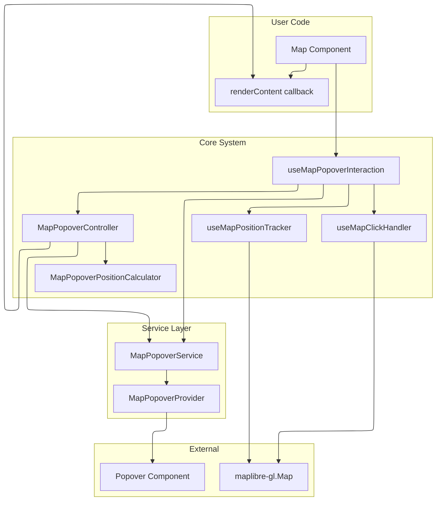

# Map Popover System

React hook system for displaying popovers on map click events with automatic positioning and tracking.

## Architecture



## Core Components

- **`useMapPopoverInteraction`**: Main hook for map click handling
- **`MapPopoverController`**: Click event orchestration and error handling
- **`MapPopoverService`**: Popover display and positioning interface
- **`MapPopoverProvider`**: React context provider for popover rendering
- **`MapPopoverPositionCalculator`**: Screen position and placement calculation

## Basic Usage

### 1. Provider Setup

```tsx
import { MapPopoverProvider } from 'src/core/map';

function App() {
  return (
    <MapPopoverProvider>
      <MapComponent />
    </MapPopoverProvider>
  );
}
```

### 2. Hook Usage

```tsx
import {
  useMapPopoverInteraction,
  useMapPopoverService,
  type MapClickContext,
} from 'src/core/map';
import type { Map } from 'maplibre-gl';

function MapComponent() {
  const map: Map | null = useYourMap();
  const popoverService = useMapPopoverService();

  const { close, destroy } = useMapPopoverInteraction({
    map,
    popoverService,
    renderContent: (context: MapClickContext) => {
      if (context.features?.length) {
        return (
          <div>
            <h4>{context.features[0].layer.id}</h4>
            <pre>{JSON.stringify(context.features[0].properties, null, 2)}</pre>
          </div>
        );
      }
      return (
        <p>
          Clicked at: {context.lngLat.lng}, {context.lngLat.lat}
        </p>
      );
    },
    onError: (errorInfo) => <div>Error: {errorInfo.error.message}</div>,
  });

  return <div ref={mapRef} style={{ width: '100%', height: '100vh' }} />;
}
```

## Configuration

```typescript
interface UseMapPopoverInteractionOptions {
  map: Map | null;
  popoverService: MapPopoverService;
  renderContent?: RenderPopoverContentFn;
  registry?: IMapPopoverContentRegistry;
  positionCalculator?: MapPopoverPositionCalculator;
  enabled?: boolean;
  trackingDebounceMs?: number;
  onError?: MapPopoverErrorHandler;
}

interface PopoverInteractionAPI {
  close: () => void;
  destroy: () => void;
  isDestroyed: boolean;
}
```

## Error Handling

```tsx
const handleError = (errorInfo: MapPopoverErrorInfo) => {
  console.error('Popover error:', errorInfo.error);
  return <div>Failed to render content</div>;
};

useMapPopoverInteraction({
  map,
  popoverService,
  renderContent,
  onError: handleError,
});
```

## Custom Position Calculator

```tsx
import { DefaultMapPopoverPositionCalculator } from 'src/core/map';

class CustomCalculator extends DefaultMapPopoverPositionCalculator {
  constructor() {
    super({
      arrowWidth: 20,
      placementThreshold: 80,
      edgePadding: 20,
    });
  }
}

const calculator = useMemo(() => new CustomCalculator(), []);

useMapPopoverInteraction({
  map,
  popoverService,
  renderContent,
  positionCalculator: calculator,
});
```

## Multiple Maps

```tsx
function MultiMapComponent() {
  const map1 = useMap(ref1);
  const map2 = useMap(ref2);
  const service = useMapPopoverService();

  useMapPopoverInteraction({
    map: map1,
    popoverService: service,
    renderContent: contentForMap1,
  });

  useMapPopoverInteraction({
    map: map2,
    popoverService: service,
    renderContent: contentForMap2,
  });
}
```

## Content Provider Architecture

The MapPopover system supports a registry-based content provider architecture that allows multiple systems to provide content for map popovers without conflicts. This architecture separates presentation logic (handled by MapPopover) from content generation logic (handled by providers).

### Architecture Overview

```
Map Click Event
    ↓
useMapPopoverInteraction Hook
    ↓
MapPopoverContentRegistry
    ↓
Provider.renderContent() for each registered provider
    ↓
First provider that returns content wins
    ↓
MapPopover Service renders the content
```

### How It Works

1. **Registry Coordination**: The `MapPopoverContentRegistry` maintains a list of registered content providers
2. **Event Processing**: On map click, the registry calls `renderContent()` on each provider in registration order
3. **First-Match-Wins**: The first provider that returns non-null content wins
4. **Unified Presentation**: All content is rendered through the same MapPopover presentation layer
5. **Automatic Lifecycle**: Providers can register/unregister dynamically as components mount/unmount

### Provider Pattern

Content providers are autonomous units that:

- Implement the `IMapPopoverContentProvider` interface
- Handle their own domain logic (feature detection, data processing)
- Return React content or null based on map click events
- Optionally specify popover display options
- Have no knowledge of other providers or the registry

### Basic Registry Usage

```tsx
import {
  MapPopoverContentRegistry,
  useMapPopoverInteraction,
  type IMapPopoverContentProvider,
} from 'src/core/map';

function MapWithProviders() {
  const map = useMap();
  const popoverService = useMapPopoverService();

  const registry = useMemo(() => {
    const reg = new MapPopoverContentRegistry();
    // Providers will be registered by renderers or components
    return reg;
  }, []);

  useMapPopoverInteraction({
    map,
    popoverService,
    registry, // Use registry instead of renderContent
  });

  return <div ref={mapRef} />;
}
```

### Creating Content Providers

```tsx
import type { IMapPopoverContentProvider, MapPopoverOptions } from 'src/core/map';
import type { MapMouseEvent } from 'maplibre-gl';

class FeatureTooltipProvider implements IMapPopoverContentProvider {
  renderContent(mapEvent: MapMouseEvent): React.ReactNode | null {
    const features = mapEvent.target.queryRenderedFeatures(mapEvent.point);

    if (!features.length) return null;

    const feature = features[0];
    return (
      <div>
        <h4>Feature Info</h4>
        <p>Layer: {feature.layer.id}</p>
        <pre>{JSON.stringify(feature.properties, null, 2)}</pre>
      </div>
    );
  }

  getPopoverOptions(): MapPopoverOptions {
    return {
      placement: 'top',
      closeOnMove: false,
      className: 'feature-tooltip',
    };
  }
}
```

### Provider Lifecycle Management

```tsx
function FeatureLayer({ enabled }: { enabled: boolean }) {
  const registry = useContext(MapPopoverRegistryContext);
  const provider = useMemo(() => new FeatureTooltipProvider(), []);

  useEffect(() => {
    if (enabled) {
      registry.register(provider);
      return () => registry.unregister(provider);
    }
  }, [enabled, registry, provider]);

  return null;
}
```

### Registry Implementation

The `MapPopoverContentRegistry` is a simple coordinator that:

```typescript
class MapPopoverContentRegistry {
  private providers: IMapPopoverContentProvider[] = [];

  register(provider: IMapPopoverContentProvider): void {
    // Add provider to the list (no duplicates)
    if (!this.providers.includes(provider)) {
      this.providers.push(provider);
    }
  }

  unregister(provider: IMapPopoverContentProvider): void {
    // Remove provider from the list
    const index = this.providers.indexOf(provider);
    if (index > -1) {
      this.providers.splice(index, 1);
    }
  }

  renderContent(
    mapEvent: MapMouseEvent,
  ): { content: React.ReactNode; options?: MapPopoverOptions } | null {
    // Try each provider until one returns content
    for (const provider of this.providers) {
      try {
        const content = provider.renderContent(mapEvent);
        if (content) {
          return {
            content,
            options: provider.getPopoverOptions?.(mapEvent),
          };
        }
      } catch (error) {
        console.error('Provider error:', error);
        // Continue to next provider on error
      }
    }
    return null;
  }
}
```

### Integration with MapPopover

The registry integrates seamlessly with the existing MapPopover infrastructure:

- **No Changes to Core**: The existing `MapPopoverService`, positioning, and tracking all work unchanged
- **Optional Usage**: You can still use `renderContent` callback directly without a registry
- **Backward Compatible**: Existing code continues to work without modification
- **Enhanced Hook**: `useMapPopoverInteraction` accepts either `renderContent` or `registry` parameter

## Type Definitions

### Core Types

```typescript
interface MapClickContext {
  map: Map;
  lngLat: GeographicPoint;
  point: ScreenPoint;
  features?: MapGeoJSONFeature[];
  originalEvent: MapMouseEvent;
}

type RenderPopoverContentFn = (context: MapClickContext) => React.ReactNode;

interface MapPopoverErrorInfo {
  error: Error;
  context: MapClickContext;
}

type MapPopoverErrorHandler = (errorInfo: MapPopoverErrorInfo) => React.ReactNode;

interface MapPopoverService {
  show: (point: ScreenPoint, content: React.ReactNode, placement?: Placement) => void;
  move: (point: ScreenPoint, placement?: Placement) => void;
  close: () => void;
}
```

### Content Provider Types

```typescript
interface MapPopoverOptions {
  placement?: Placement;
  closeOnMove?: boolean;
  className?: string;
}

interface IMapPopoverContentProvider {
  renderContent(mapEvent: MapMouseEvent): React.ReactNode | null;
  getPopoverOptions?(mapEvent: MapMouseEvent): MapPopoverOptions;
}

interface IMapPopoverContentRegistry {
  register(provider: IMapPopoverContentProvider): void;
  unregister(provider: IMapPopoverContentProvider): void;
  renderContent(mapEvent: MapMouseEvent): {
    content: React.ReactNode;
    options?: MapPopoverOptions;
  } | null;
}
```
