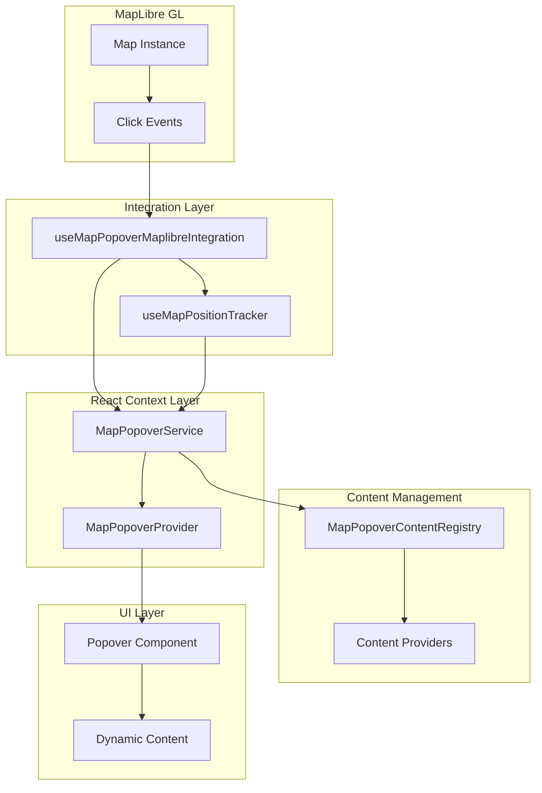
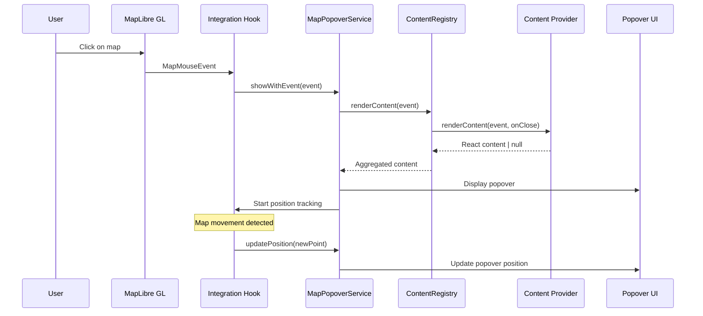
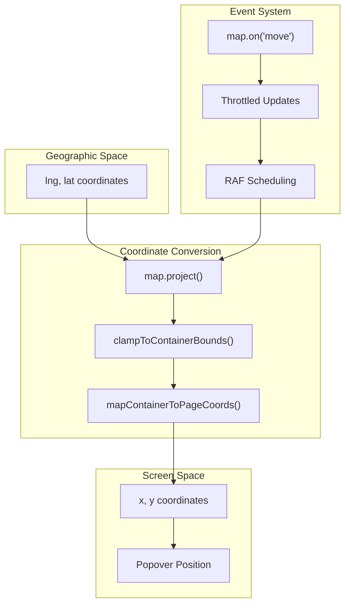
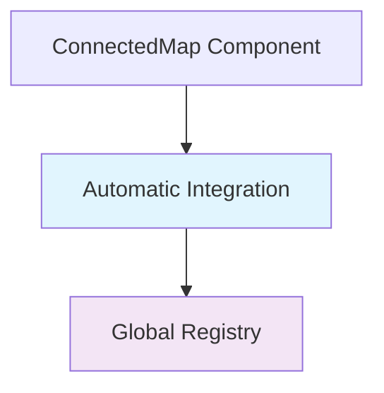
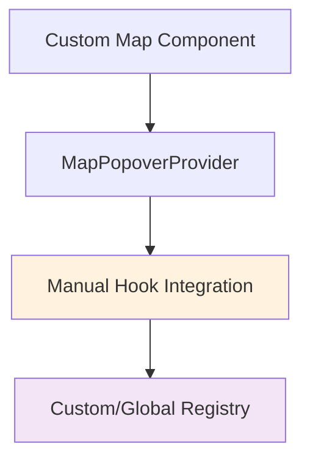

# Map Popover System

Interactive popover system for displaying content on MapLibre GL map click events with automatic position tracking.

## Table of Contents

- [Overview](#overview)
- [Architecture](#architecture)
  - [System Components](#system-components)
  - [Data Flow](#data-flow)
  - [Position Tracking Architecture](#position-tracking-architecture)
  - [Integration Patterns](#integration-patterns)
- [Quick Start](#quick-start)
- [API Reference](#api-reference)
- [Usage Patterns](#usage-patterns)
- [Configuration](#configuration)
- [Best Practices](#best-practices)
- [Troubleshooting](#troubleshooting)

## Overview

The Map Popover system provides a registry-based approach for displaying contextual content when users click on map features. It automatically handles coordinate conversion, position tracking during viewport changes, and content aggregation from multiple providers.

**Key Features:**

- 🎯 **Click-based content display** with automatic positioning
- 📍 **Geographic position tracking** that follows map viewport changes
- 🔧 **Registry-based providers** for modular content management
- ⚡ **Performance optimized** with throttling and RAF scheduling
- 🛡️ **Type-safe** with full TypeScript support

## Architecture

### System Components



### Data Flow



### Position Tracking Architecture



### Integration Patterns

The system supports two integration approaches:

#### Pattern 1: ConnectedMap (Automatic)



#### Pattern 2: Custom Integration (Manual)



## Quick Start

### Basic Setup

```tsx
import {
  MapPopoverProvider,
  useMapPopoverService,
  useMapPopoverMaplibreIntegration,
  mapPopoverRegistry,
} from '~core/map';

function MyMapApp() {
  return (
    <MapPopoverProvider registry={mapPopoverRegistry}>
      <MapComponent />
    </MapPopoverProvider>
  );
}

function MapComponent() {
  const popoverService = useMapPopoverService();

  // Enable popover system
  useMapPopoverMaplibreIntegration({
    maplibreInstance, // maplibreInstance must exist
    popoverService,
    enabled: true,
  });

  return <div ref={mapRef} className="map" />;
}
```

### Register Content Provider

```tsx
import { mapPopoverRegistry } from '~core/map';

// Create a provider
class FeatureInfoProvider implements IMapPopoverContentProvider {
  renderContent(mapEvent: MapMouseEvent, onClose: () => void): React.ReactNode | null {
    const features = mapEvent.target.queryRenderedFeatures(mapEvent.point);

    if (!features.length) return null;

    return (
      <div>
        <h4>Feature Details</h4>
        <p>Layer: {features[0].layer.id}</p>
        <button onClick={onClose}>Close</button>
      </div>
    );
  }
}

// Register provider
function MyComponent() {
  useEffect(() => {
    const provider = new FeatureInfoProvider();
    mapPopoverRegistry.register('feature-info', provider);

    return () => mapPopoverRegistry.unregister('feature-info');
  }, []);
}
```

## API Reference

### MapPopoverService

Main service interface for popover control.

```typescript
interface MapPopoverService {
  showWithEvent(mapEvent: MapMouseEvent, options?: MapPopoverOptions): boolean;
  showWithContent(
    point: ScreenPoint,
    content: React.ReactNode,
    options?: MapPopoverOptions,
  ): void;
  updatePosition(point: ScreenPoint, placement?: Placement): void;
  close(): void;
  isOpen(): boolean;
}
```

#### Methods

**`showWithEvent(mapEvent, options?)`**

- **Description**: Show popover using registered content providers
- **Parameters**:
  - `mapEvent`: MapLibre GL mouse event
  - `options`: Optional display configuration
- **Returns**: `boolean` - true if content was found and displayed

**`showWithContent(point, content, options?)`**

- **Description**: Show popover with custom content
- **Parameters**:
  - `point`: Screen coordinates `{x: number, y: number}`
  - `content`: React component or element
  - `options`: Optional display configuration

**`updatePosition(point, placement?)`**

- **Description**: Update popover position (used during map movement)
- **Parameters**:
  - `point`: New screen coordinates
  - `placement`: Optional new placement direction

**`close()`**

- **Description**: Close any open popover

**`isOpen()`**

- **Description**: Check if popover is currently open
- **Returns**: `boolean`

### MapPopoverOptions

Configuration for popover display behavior.

```typescript
interface MapPopoverOptions {
  placement?: Placement; // 'top' | 'bottom' | 'left' | 'right'
  closeOnMove?: boolean; // Auto-close on map movement
  className?: string; // Custom CSS class
}
```

### Content Provider Interface

Interface for creating content providers.

```typescript
interface IMapPopoverContentProvider {
  renderContent(mapEvent: MapMouseEvent, onClose: () => void): React.ReactNode | null;
}
```

**Parameters:**

- `mapEvent`: Complete MapLibre GL mouse event with coordinates and target
- `onClose`: Callback function to close the popover

**Returns:** React content to display, or `null` if provider can't handle the event

### Registry Interface

Interface for managing content providers.

```typescript
interface IMapPopoverContentRegistry {
  register(id: string, provider: IMapPopoverContentProvider): void;
  unregister(id: string): void;
  renderContent(mapEvent: MapMouseEvent, onClose: () => void): React.ReactNode | null;
  clear(): void;
  readonly providerCount: number;
}
```

### Integration Hook

Hook for connecting MapLibre GL events to the popover system.

```typescript
function useMapPopoverMaplibreIntegration(options: {
  map: Map; // MapLibre GL map instance
  popoverService: MapPopoverService; // Service from useMapPopoverService()
  enabled?: boolean; // Enable/disable integration (default: true)
  trackingThrottleMs?: number; // Position update throttling (default: 16ms)
  positionCalculator?: MapPopoverPositionCalculator; // Custom positioning logic
}): void;
```

## Usage Patterns

### Custom Map Integration

For custom map implementations:

```tsx
function CustomMap() {
  const [map, setMap] = useState<Map | null>(null);
  const popoverService = useMapPopoverService();

  // Initialize map
  useEffect(() => {
    const mapInstance = new Map({
      container: containerRef.current,
      style: 'mapbox://styles/mapbox/streets-v11',
    });
    setMap(mapInstance);

    return () => mapInstance.remove();
  }, []);

  // Integrate popover system
  useMapPopoverMaplibreIntegration({
    map,
    popoverService,
    enabled: true,
  });

  return (
    <MapPopoverProvider registry={mapPopoverRegistry}>
      <div ref={containerRef} className="map" />
    </MapPopoverProvider>
  );
}
```

### Creating Content Providers

#### Simple Feature Provider

```tsx
class FeatureTooltipProvider implements IMapPopoverContentProvider {
  renderContent(mapEvent: MapMouseEvent, onClose: () => void): React.ReactNode | null {
    const features = mapEvent.target.queryRenderedFeatures(mapEvent.point);

    if (!features.length) return null;

    const feature = features[0];

    return (
      <div className="feature-tooltip">
        <h4>{feature.properties?.name || 'Unnamed Feature'}</h4>
        <dl>
          <dt>Layer:</dt>
          <dd>{feature.layer.id}</dd>
          <dt>Source:</dt>
          <dd>{feature.source}</dd>
        </dl>
        <button onClick={onClose}>Close</button>
      </div>
    );
  }
}
```

#### Interactive Provider with Actions

```tsx
class FeatureActionsProvider implements IMapPopoverContentProvider {
  constructor(private onEdit: (feature: MapGeoJSONFeature) => void) {}

  renderContent(mapEvent: MapMouseEvent, onClose: () => void): React.ReactNode | null {
    const features = mapEvent.target.queryRenderedFeatures(mapEvent.point);
    const editableFeatures = features.filter((f) => f.layer.id.startsWith('editable-'));

    if (!editableFeatures.length) return null;

    return (
      <div className="feature-actions">
        <h4>Feature Actions</h4>
        {editableFeatures.map((feature, i) => (
          <div key={i}>
            <p>{feature.properties?.name}</p>
            <button onClick={() => this.handleEdit(feature, onClose)}>Edit</button>
            <button onClick={() => this.handleDelete(feature, onClose)}>Delete</button>
          </div>
        ))}
        <button onClick={onClose}>Cancel</button>
      </div>
    );
  }

  private handleEdit(feature: MapGeoJSONFeature, onClose: () => void) {
    this.onEdit(feature);
    onClose();
  }

  private handleDelete(feature: MapGeoJSONFeature, onClose: () => void) {
    // Handle delete logic
    onClose();
  }
}
```

### Provider Registration Patterns

#### Component-based Registration

```tsx
function FeatureLayer({ layerId, enabled }: { layerId: string; enabled: boolean }) {
  const provider = useMemo(() => new FeatureTooltipProvider(layerId), [layerId]);

  useEffect(() => {
    if (enabled) {
      mapPopoverRegistry.register(`tooltip-${layerId}`, provider);
      return () => mapPopoverRegistry.unregister(`tooltip-${layerId}`);
    }
  }, [enabled, layerId, provider]);

  return null;
}
```

#### Class-based Registration (for renderers)

```tsx
class LayerRenderer {
  private tooltipProvider: IMapPopoverContentProvider | null = null;

  mount() {
    this.tooltipProvider = new LayerTooltipProvider(this.layerId);
    mapPopoverRegistry.register(`tooltip-${this.layerId}`, this.tooltipProvider);
  }

  unmount() {
    if (this.tooltipProvider) {
      mapPopoverRegistry.unregister(`tooltip-${this.layerId}`);
      this.tooltipProvider = null;
    }
  }
}
```

## Configuration

### Position Tracking

Configure position update frequency:

```tsx
useMapPopoverMaplibreIntegration({
  map,
  popoverService,
  trackingThrottleMs: 16, // 60fps updates (default)
  // trackingThrottleMs: 50,  // 20fps for better performance
  // trackingThrottleMs: 0,   // No throttling (use RAF)
});
```

### Custom Positioning

Provide custom placement calculation:

```tsx
import { DefaultMapPopoverPositionCalculator } from '~core/map';

const customCalculator = new DefaultMapPopoverPositionCalculator({
  arrowWidth: 20, // Arrow size consideration
  placementThreshold: 24, // Distance from edge to change placement
  edgePadding: 12, // Minimum distance from container edge
});

useMapPopoverMaplibreIntegration({
  map,
  popoverService,
  positionCalculator: customCalculator,
});
```

### Multiple Maps

Each map needs its own provider:

```tsx
function MultiMapApp() {
  return (
    <>
      <MapPopoverProvider registry={mapPopoverRegistry}>
        <MapComponent mapId="main" />
      </MapPopoverProvider>

      <MapPopoverProvider registry={mapPopoverRegistry}>
        <MapComponent mapId="overview" />
      </MapPopoverProvider>
    </>
  );
}
```

### Custom Registry

Create isolated content registry:

```tsx
import { MapPopoverContentRegistry } from '~core/map';

const customRegistry = new MapPopoverContentRegistry();

function SpecializedMap() {
  return (
    <MapPopoverProvider registry={customRegistry}>
      <MapComponent />
    </MapPopoverProvider>
  );
}
```

## Best Practices

### Provider IDs

Use consistent naming conventions:

| Provider Type   | ID Pattern           | Example             |
| --------------- | -------------------- | ------------------- |
| Layer tooltips  | `tooltip-${layerId}` | `tooltip-buildings` |
| Feature actions | `actions-${layerId}` | `actions-points`    |
| Debug info      | `debug`              | `debug`             |
| Feature modules | `feature-name`       | `boundary-selector` |

### Memory Management

**Always unregister providers:**

```tsx
// ✅ Good
useEffect(() => {
  mapPopoverRegistry.register(id, provider);
  return () => mapPopoverRegistry.unregister(id);
}, []);

// ❌ Bad - memory leak
useEffect(() => {
  mapPopoverRegistry.register(id, provider);
}, []);
```

**Clear references in class components:**

```tsx
// ✅ Good
willUnMount() {
  if (this.provider) {
    mapPopoverRegistry.unregister(this.providerId);
    this.provider = null; // Clear reference
  }
}

// ❌ Bad - keeps reference
willUnMount() {
  mapPopoverRegistry.unregister(this.providerId);
}
```

### Performance

**Early return for irrelevant events:**

```tsx
renderContent(mapEvent: MapMouseEvent): React.ReactNode | null {
  // Quick checks first
  if (!this.isEnabled || !this.shouldShow) return null;

  // Expensive operations only when needed
  const features = mapEvent.target.queryRenderedFeatures(mapEvent.point);
  return features.length ? <Content features={features} /> : null;
}
```

**Optimize feature queries:**

```tsx
// ✅ Good - filter by layer
const features = mapEvent.target.queryRenderedFeatures(mapEvent.point, {
  layers: ['my-layer-id'],
});

// ❌ Slower - query all layers
const features = mapEvent.target.queryRenderedFeatures(mapEvent.point);
```

### Error Handling

**Graceful degradation:**

```tsx
renderContent(mapEvent: MapMouseEvent): React.ReactNode | null {
  try {
    const features = mapEvent.target.queryRenderedFeatures(mapEvent.point);
    if (!features?.length) return null;

    return <FeatureContent features={features} />;
  } catch (error) {
    console.error('Error rendering feature content:', error);
    return <div>Error loading feature information</div>;
  }
}
```

## Troubleshooting

### Popover Not Showing

**Check provider registration:**

```tsx
console.log('Registered providers:', mapPopoverRegistry.providerCount);
```

**Verify provider returns content:**

```tsx
renderContent(mapEvent: MapMouseEvent) {
  const features = mapEvent.target.queryRenderedFeatures(mapEvent.point);
  console.log('Features found:', features.length);
  // ...
}
```

**Ensure integration is enabled:**

```tsx
useMapPopoverMaplibreIntegration({
  enabled: true, // ← Check this
  // ...
});
```

### Position Tracking Issues

**Check map instance stability:**

```tsx
// ✅ Stable reference
const [map, setMap] = useState<Map | null>(null);

// ❌ Recreates on every render
const map = new Map(config);
```

**Verify coordinate system:**

```tsx
// Debug position updates
useMapPopoverMaplibreIntegration({
  map,
  popoverService,
  trackingThrottleMs: 16,
  onPositionUpdate: (point) => console.log('Position:', point), // Custom debug
});
```

### Performance Issues

**Reduce update frequency:**

```tsx
useMapPopoverMaplibreIntegration({
  trackingThrottleMs: 50, // Reduce from 16ms
});
```

**Disable during heavy operations:**

```tsx
const [isLoading, setIsLoading] = useState(false);

useMapPopoverMaplibreIntegration({
  enabled: !isLoading,
});
```

### Debug Mode

KONTUR_DEBUG will enable debug provider for development:

The debug provider shows:

- All features at click point
- Feature properties and metadata
- Geographic and screen coordinates
- Layer and source information

### Common Errors

**"Provider already registered"**

- Solution: Unregister before registering again

```tsx
mapPopoverRegistry.unregister(id); // Clear first
mapPopoverRegistry.register(id, provider);
```

**"Cannot read properties of null"**

- Solution: Check map instance exists

```tsx
if (!map) return; // Guard clause
useMapPopoverMaplibreIntegration({ map /* ... */ });
```

**Memory leaks**

- Solution: Always cleanup providers

```tsx
useEffect(() => {
  // register
  return () => mapPopoverRegistry.unregister(id); // cleanup
}, []);
```
