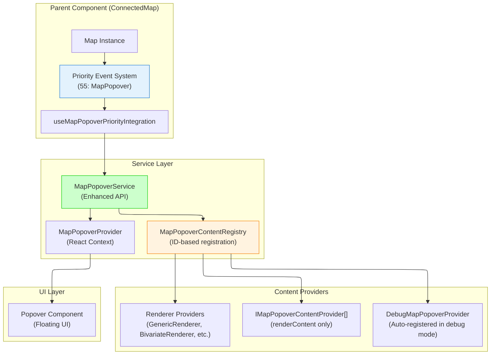

# Map Popover System

Service-based popover system for displaying content on map click events with automatic positioning and tracking. Implements ADR-002 service-based delegation architecture with registry-based content providers.

## Architecture



## Core Components

- **`useMapPopoverPriorityIntegration`**: Hook for ConnectedMap integration via priority system (priority 55)
- **`MapPopoverService`**: Enhanced service API for popover display and positioning
- **`MapPopoverProvider`**: React context provider for popover rendering and service access
- **`MapPopoverContentRegistry`**: ID-based registry for managing multiple content providers
- **`mapPopoverRegistry`**: Global singleton registry instance
- **`DebugMapPopoverProvider`**: Auto-registered debug provider when `KONTUR_DEBUG` is enabled

## Public API

Current exports from `src/core/map`:

```typescript
// Main integration hook (for ConnectedMap)
export { useMapPopoverPriorityIntegration } from './hooks/useMapPopoverPriorityIntegration';

// Service and provider
export { MapPopoverProvider, useMapPopoverService } from './popover/MapPopoverProvider';

// Global registry
export { mapPopoverRegistry } from './popover/globalMapPopoverRegistry';

// Type definitions
export type * from './types';
```

**Note**: Other hooks like `useMapPopoverMaplibreIntegration` are internal implementation details and not exported for public use.

## Integration Patterns

### 1. ConnectedMap Integration (Recommended)

ConnectedMap automatically integrates MapPopover through the priority system:

```tsx
import { ConnectedMap } from '~components/ConnectedMap';

function App() {
  return (
    <div>
      <ConnectedMap />
      {/* MapPopover automatically integrated at priority 55 */}
      {/* Content providers register with global mapPopoverRegistry */}
    </div>
  );
}
```

**How it works:**

- ConnectedMap uses `useMapPopoverPriorityIntegration` internally
- Integrates with existing priority event system
- Uses global `mapPopoverRegistry` for content providers
- No manual setup required

### 2. Simple Integration (Custom Implementation)

For simple cases without ConnectedMap, you can implement basic integration:

```tsx
import { MapPopoverProvider, useMapPopoverService, mapPopoverRegistry } from '~core/map';
import type { Map, MapMouseEvent } from 'maplibre-gl';

function SimpleMapDemo() {
  const mapRef = useRef<HTMLDivElement>(null);
  const map = useMapInstance(mapRef);
  const popoverService = useMapPopoverService();

  useEffect(() => {
    if (!map) return;

    const handleClick = (event: MapMouseEvent) => {
      // Use registry to find and display content
      const hasContent = popoverService.showWithEvent(event);

      if (!hasContent) {
        // Fallback content if no providers handle the event
        const content = (
          <div>
            <p>
              Clicked at: {event.lngLat.lng.toFixed(5)}, {event.lngLat.lat.toFixed(5)}
            </p>
            <p>No features found</p>
          </div>
        );
        popoverService.showWithContent(event.point, content);
      }
    };

    map.on('click', handleClick);
    return () => map.off('click', handleClick);
  }, [map, popoverService]);

  return (
    <MapPopoverProvider registry={mapPopoverRegistry}>
      <div ref={mapRef} style={{ width: '100%', height: '400px' }} />
    </MapPopoverProvider>
  );
}
```

**Important**: This pattern requires manual position tracking during map movement, which ConnectedMap handles automatically.

## Content Provider Architecture

### Current Registry Interface (ID-Based)

The registry now uses ID-based registration for better reliability:

```typescript
interface IMapPopoverContentRegistry {
  register(id: string, provider: IMapPopoverContentProvider): void;
  unregister(id: string): void;
  renderContent(mapEvent: MapMouseEvent): React.ReactNode | null;
}
```

### Creating Content Providers

```tsx
import type { IMapPopoverContentProvider } from '~core/map';
import type { MapMouseEvent } from 'maplibre-gl';

class FeatureTooltipProvider implements IMapPopoverContentProvider {
  renderContent(mapEvent: MapMouseEvent): React.ReactNode | null {
    const features = mapEvent.target?.queryRenderedFeatures?.(mapEvent.point) || [];

    if (!features.length) return null;

    const feature = features[0];
    return (
      <div>
        <h4>Feature Info</h4>
        <p>
          <strong>Layer:</strong> {feature.layer.id}
        </p>
        <p>
          <strong>Source:</strong> {feature.source}
        </p>
        <details>
          <summary>Properties</summary>
          <pre>{JSON.stringify(feature.properties, null, 2)}</pre>
        </details>
      </div>
    );
  }
}
```

### Provider Registration (Updated Pattern)

```tsx
import { mapPopoverRegistry } from '~core/map';

function FeatureLayer({ enabled }: { enabled: boolean }) {
  const provider = useMemo(() => new FeatureTooltipProvider(), []);

  useEffect(() => {
    if (enabled) {
      // Use unique ID for registration
      mapPopoverRegistry.register('feature-tooltip', provider);
      return () => mapPopoverRegistry.unregister('feature-tooltip');
    }
  }, [enabled, provider]);

  return null;
}
```

**Key Changes from Previous Version:**

- **ID-based registration**: Prevents memory leaks and enables better debugging
- **No getPopoverOptions**: Container controls popover behavior, providers only provide content
- **Stable React keys**: Uses provider IDs instead of array indices
- **Better error handling**: Provider ID included in error messages

## Current Renderer Integrations

The system integrates with existing layer renderers using consistent ID patterns:

### GenericRenderer

```typescript
// Registers with ID: `tooltip-${sourceId}`
mapPopoverRegistry.register(`tooltip-${this._sourceId}`, this._tooltipProvider);
```

### BivariateRenderer

```typescript
// Registers with IDs: `bivariate-${sourceId}` and `mcda-${sourceId}`
mapPopoverRegistry.register(`bivariate-${this._sourceId}`, this._bivariateProvider);
mapPopoverRegistry.register(`mcda-${this._sourceId}`, this._mcdaProvider);
```

### ClickableFeaturesRenderer

```typescript
// Registers with ID: `clickable-${sourceId}`
mapPopoverRegistry.register(`clickable-${this._sourceId}`, this._popoverProvider);
```

## Debug Features

Debug provider automatically registers when `KONTUR_DEBUG` is enabled:

```typescript
// Automatically registered with ID: 'debug'
if (KONTUR_DEBUG) {
  mapPopoverRegistry.register('debug', new DebugMapPopoverProvider());
}
```

**Debug provider shows:**

- All found features at click point
- Layer information and source details
- Complete properties JSON
- Geographic coordinates and screen position
- Feature count and geometry types

## Service API Reference

### Enhanced API Methods

```typescript
// Registry-based content resolution
popoverService.showWithEvent(mapEvent: MapMouseEvent, options?: MapPopoverOptions): boolean

// Direct content display
popoverService.showWithContent(point: ScreenPoint, content: React.ReactNode, options?: MapPopoverOptions): void

// Position updates (for map movement tracking)
popoverService.updatePosition(point: ScreenPoint, placement?: Placement): void

// State queries
popoverService.isOpen(): boolean
popoverService.close(): void
```

## Multiple Maps Support

Each map should have its own isolated popover provider:

```tsx
function MultiMapApp() {
  return (
    <div>
      {/* Each map gets its own isolated popover system */}
      <MapPopoverProvider registry={mapPopoverRegistry}>
        <ConnectedMap mapId="map1" />
      </MapPopoverProvider>

      <MapPopoverProvider registry={mapPopoverRegistry}>
        <ConnectedMap mapId="map2" />
      </MapPopoverProvider>
    </div>
  );
}
```

**Note**: All maps can share the same global `mapPopoverRegistry` since providers are designed to work with any map instance.

## Type Definitions

### Service Types

```typescript
interface MapPopoverService {
  showWithContent: (
    point: ScreenPoint,
    content: React.ReactNode,
    options?: MapPopoverOptions,
  ) => void;
  showWithEvent: (mapEvent: MapMouseEvent, options?: MapPopoverOptions) => boolean;
  updatePosition: (point: ScreenPoint, placement?: Placement) => void;
  close: () => void;
  isOpen: () => boolean;
}

interface MapPopoverOptions {
  placement?: Placement;
  closeOnMove?: boolean;
  className?: string;
}
```

### Content Provider Types

```typescript
interface IMapPopoverContentProvider {
  renderContent(mapEvent: MapMouseEvent): React.ReactNode | null;
}

interface IMapPopoverContentRegistry {
  register(id: string, provider: IMapPopoverContentProvider): void;
  unregister(id: string): void;
  renderContent(mapEvent: MapMouseEvent): React.ReactNode | null;
}
```

### Provider Context

```typescript
interface MapPopoverProviderProps {
  children: React.ReactNode;
  registry?: IMapPopoverContentRegistry;
}
```

## Architecture Benefits

### Reliability

- **Memory leak prevention**: ID-based registration eliminates object reference issues
- **Error isolation**: Provider errors don't crash the entire system
- **Debug capabilities**: Provider identification in error messages

### Performance

- **Stable React keys**: Uses provider IDs for optimal reconciliation
- **Centralized position tracking**: ConnectedMap handles all position updates
- **Registry aggregation**: Multiple providers rendered in single React fragment

### Maintainability

- **Clear separation of concerns**: Container controls behavior, providers provide content
- **Consistent patterns**: All renderers use same registration approach
- **Type safety**: Full TypeScript support with proper interfaces
