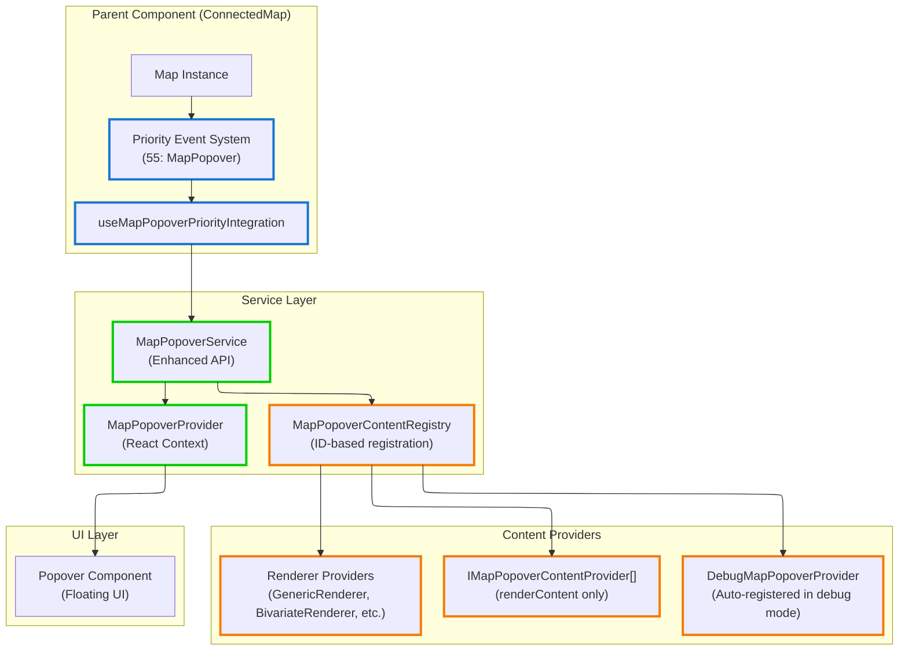

# Map Popover System

Service-based popover system for displaying content on map click events with automatic positioning and tracking. Uses registry-based content providers for clean separation of concerns.

## Architecture



## Core Components

- **`useMapPopoverPriorityIntegration`**: Hook for ConnectedMap integration via priority system (priority 55)
- **`MapPopoverService`**: Enhanced service API for popover display and positioning
- **`MapPopoverProvider`**: React context provider for popover rendering and service access
- **`MapPopoverContentRegistry`**: ID-based registry for managing multiple content providers
- **`mapPopoverRegistry`**: Global singleton registry instance
- **`DebugMapPopoverProvider`**: Auto-registered debug provider when `KONTUR_DEBUG` is enabled

## Public API

Current exports from `src/core/map`:

```typescript
// Priority integration (for ConnectedMap with tools)
export { useMapPopoverPriorityIntegration } from './hooks/useMapPopoverPriorityIntegration';

// Service and provider
export { MapPopoverProvider, useMapPopoverService } from './popover/MapPopoverProvider';

// Global registry
export { mapPopoverRegistry } from './popover/globalMapPopoverRegistry';
```

**Advanced Usage**: For simple maps without priority systems, you may also use:

```typescript
// Direct integration (for simple maps without tools)
import { useMapPopoverMaplibreIntegration } from '~core/map/hooks/useMapPopoverMaplibreIntegration';
```

**⚠️ Note**: `useMapPopoverMaplibreIntegration` is intended for simple map implementations. Use `useMapPopoverPriorityIntegration` for ConnectedMap to ensure proper tool coordination.

## Integration Patterns

The MapPopover system provides **two integration patterns** for different architectural contexts:

### Pattern Selection Guide

| Use Case         | Pattern              | Hook                               | Why                                               |
| ---------------- | -------------------- | ---------------------------------- | ------------------------------------------------- |
| **ConnectedMap** | Priority Integration | `useMapPopoverPriorityIntegration` | Respects tool exclusivity (Map Ruler, Draw Tools) |
| **Simple Maps**  | Direct Integration   | `useMapPopoverMaplibreIntegration` | No priority system overhead                       |

### 1. Priority Integration (ConnectedMap)

**When to use**: In ConnectedMap or applications with priority-based event system

```tsx
import { ConnectedMap } from '~components/ConnectedMap';

function App() {
  return (
    <div>
      <ConnectedMap />
      {/* MapPopover automatically integrated at priority 55 */}
      {/* Respects Map Ruler, Draw Tools, Boundary Selector priority */}
    </div>
  );
}
```

**How it works:**

- Uses `useMapPopoverPriorityIntegration` internally
- **Integrates with priority event system** (priority 55)
- **Respects tool exclusivity**: When Map Ruler is active, MapPopover won't show
- Uses global `mapPopoverRegistry` for content providers
- Automatic position tracking during map movement

**Priority Chain:**

```
Map Ruler (P:1) → Draw Tools (P:10) → Boundary Selector (P:50) → MapPopover (P:55) → Legacy Renderers (P:60)
```

### 2. Direct Integration (Simple Maps)

**When to use**: Simple map implementations without priority system infrastructure

```tsx
import { MapPopoverProvider, useMapPopoverService, mapPopoverRegistry } from '~core/map';
import { useMapPopoverMaplibreIntegration } from '~core/map/hooks/useMapPopoverMaplibreIntegration';
import type { Map } from 'maplibre-gl';

function SimpleMapDemo() {
  const mapRef = useRef<HTMLDivElement>(null);
  const map = useMapInstance(mapRef);
  const popoverService = useMapPopoverService();

  // Direct integration - registry-only pattern
  useMapPopoverMaplibreIntegration({
    map,
    popoverService,
    registry: mapPopoverRegistry,
    enabled: true,
  });

  return (
    <MapPopoverProvider registry={mapPopoverRegistry}>
      <div ref={mapRef} style={{ width: '100%', height: '400px' }} />
    </MapPopoverProvider>
  );
}
```

**How it works:**

- Uses `useMapPopoverMaplibreIntegration` directly with registry
- **Direct event binding** to map click events
- **No priority coordination** - always responds to clicks
- Automatic position tracking during map movement
- Registry-based content providers

**⚠️ Important**: This pattern bypasses priority systems. Use only when you don't have Map Ruler, Draw Tools, or other exclusive interaction tools.

### Architecture Rationale

**Why Two Integration Patterns?**

1. **ConnectedMap Complexity**: Full application needs priority coordination between multiple interaction tools
2. **Simple Map Flexibility**: Basic implementations shouldn't require priority system infrastructure
3. **Service Reusability**: Same `MapPopoverService` and content providers work in both contexts
4. **Performance**: Simple maps avoid priority system overhead

**Design Benefits:**

- ✅ **Registry-only content**: Single, clear pattern for adding popover content
- ✅ **Flexible Integration**: Works in complex and simple contexts
- ✅ **Tool Coordination**: Respects exclusivity in ConnectedMap
- ✅ **Performance**: Minimal overhead for simple cases

## Position Tracking Architecture

### Geographic Coordinate Tracking

**Location**: [`useMapPositionTracker.ts:13-117`](../../src/core/map/hooks/useMapPositionTracker.ts#L13-L117)

The tracking system converts geographic coordinates to screen positions with viewport change handling:

```typescript
interface MapPositionTracker {
  startTracking: (lngLat: [number, number]) => void;
  stopTracking: () => void;
  cleanup: () => void;
}

// Core tracking mechanism
const handleMapMove = useCallback(() => {
  if (!map || !currentLngLatRef.current) return;

  const [lng, lat] = currentLngLatRef.current;
  const pagePoint = geographicToPageCoords(map, [lng, lat], {
    edgePadding: 0,
    clampToBounds: true,
  });

  onPositionChange({ x: pagePoint.x, y: pagePoint.y });
}, [map, onPositionChange]);
```

**Key tracking behaviors:**

- **Geographic persistence**: Stores `[lng, lat]` coordinates, not screen pixels
- **Event-driven updates**: Responds to `map.on('move')` events
- **Viewport tolerance**: Handles pan, zoom, rotation, resize automatically
- **Performance optimization**: Throttled updates with RAF scheduling

### Performance Architecture

**Location**: [`useMapPositionTracker.ts:21-41`](../../src/core/map/hooks/useMapPositionTracker.ts#L21-L41)

The system employs multiple performance strategies:

```typescript
// Dual performance strategy
const throttledUpdatePosition = useMemo(() => {
  const rawUpdate = () => {
    // Geographic → screen coordinate calculation
    const pagePoint = geographicToPageCoords(map, [lng, lat]);
    onPositionChange({ x: pagePoint.x, y: pagePoint.y });
  };

  // Strategy 1: Throttled updates for high-frequency events
  if (debounceMs > 0) {
    return throttle(rawUpdate, debounceMs);
  }
  // Strategy 2: RAF scheduling for smooth animations
  return rawUpdate;
}, [map, onPositionChange, debounceMs]);
```

**Performance features:**

- **Throttling**: Configurable `debounceMs` for high-frequency events (default: 16ms)
- **RAF scheduling**: Uses `requestAnimationFrame` for smooth visual updates
- **Reference stability**: Refs prevent callback recreation during tracking
- **Cleanup management**: Cancels pending operations on unmount

### Tracking Lifecycle

1. **Start**: `startTracking([lng, lat])` stores geographic coordinates and binds to map `move` events
2. **Track**: Map movement triggers `handleMapMove()` which recalculates screen position
3. **Update**: New screen coordinates sent via `onPositionChange` callback
4. **Stop**: `stopTracking()` removes event listeners and clears stored coordinates

### Integration with MapPopover Service

**Location**: [`useMapPopoverMaplibreIntegration.ts:43-63`](../../src/core/map/hooks/useMapPopoverMaplibreIntegration.ts#L43-L63)

The service integrates tracking with popover display logic:

```typescript
const handlePositionChange = useCallback(
  (point: ScreenPoint) => {
    const currentService = popoverServiceRef.current;
    if (!currentService.isOpen()) return;

    try {
      // Calculate optimal placement based on viewport
      const { placement } = positionCalculator.calculate(containerRect, point.x, point.y);

      // Update popover position with new placement
      currentService.updatePosition(point, placement);
    } catch (error) {
      console.error('Error updating popover position:', error);
    }
  },
  [positionCalculator],
);

// Tracking activation on popover display
const handleMapClick = useCallback(
  (event: MapMouseEvent) => {
    const hasContent = popoverService.showWithEvent(event);
    if (hasContent) {
      // Start tracking the clicked geographic point
      positionTracker.startTracking([event.lngLat.lng, event.lngLat.lat]);
    }
  },
  [popoverService, positionTracker],
);
```

**Integration flow:**

1. **Click event**: Geographic coordinates captured from `MapMouseEvent`
2. **Content resolution**: Registry determines if content should display
3. **Tracking start**: Geographic point becomes tracking reference
4. **Position updates**: Screen position recalculated on map movement
5. **Placement optimization**: Popover placement adjusted for viewport edges

### Error Handling and Robustness

```typescript
// Coordinate validation
if (!isValidLngLatArray(lngLat)) {
  console.error(`Invalid coordinates for tracking: [${lngLat[0]}, ${lngLat[1]}]`);
  return;
}

// Position calculation error handling
try {
  const pagePoint = geographicToPageCoords(map, [lng, lat]);
  onPositionChange({ x: pagePoint.x, y: pagePoint.y });
} catch (error) {
  console.error('Error updating position:', error);
}
```

**Robustness features:**

- **Coordinate validation**: Prevents tracking invalid geographic points
- **Calculation error recovery**: Continues tracking even if single update fails
- **Resource cleanup**: Proper event listener and RAF cancellation
- **Null safety**: Guards against map instance changes during tracking

### Position Tracking Stability

### ⚠️ Critical: Avoiding Tracking Issues

When using `useMapPopoverMaplibreIntegration` directly, **position tracking can break** if callback dependencies are not handled correctly.

### Common Problem

**❌ This breaks position tracking:**

```tsx
function BrokenMapDemo() {
  const map = useMapInstance(mapRef);
  const popoverService = useMapPopoverService();

  // WRONG: This recreates the hook constantly!
  useMapPopoverMaplibreIntegration({
    map, // ❌ Causes position callback recreation
    popoverService, // ❌ Causes position callback recreation
    registry: mapPopoverRegistry,
  });
}
```

**Why it breaks:**

- `map` and `popoverService` change references on every render
- Position change callback recreates → position tracker recreates
- Tracking stops working when tracker is replaced

### ✅ Correct Implementation

The hooks internally use **refs for stability**:

```tsx
// Inside useMapPopoverMaplibreIntegration
const mapRef = useRef(map);
const popoverServiceRef = useRef(popoverService);
mapRef.current = map;
popoverServiceRef.current = popoverService;

const handlePositionChange = useCallback(
  (point: ScreenPoint) => {
    const currentMap = mapRef.current; // ✅ Stable reference
    const currentService = popoverServiceRef.current; // ✅ Stable reference

    if (!currentMap || !currentService.isOpen()) return;
    // ... position update logic
  },
  [positionCalculator], // ✅ Only stable dependencies
);
```

### Best Practices

**✅ Use stable map instances:**

```tsx
function CorrectMapDemo() {
  const mapRef = useRef<HTMLDivElement>(null);
  const [map, setMap] = useState<Map | null>(null); // ✅ Stable reference
  const popoverService = useMapPopoverService(); // ✅ Context provides stable service

  useLayoutEffect(() => {
    if (!mapRef.current) return;

    const mapInstance = new mapLibre.Map({
      container: mapRef.current,
      // ... map config
    });

    setMap(mapInstance); // ✅ Set once, stays stable

    return () => {
      mapInstance.remove();
      setMap(null);
    };
  }, []); // ✅ Empty dependency array

  useMapPopoverMaplibreIntegration({
    map, // ✅ Now stable
    popoverService, // ✅ Always stable from context
    registry: mapPopoverRegistry,
  });
}
```

**✅ For priority integration, refs are handled automatically:**

```tsx
function ConnectedMapExample() {
  // ✅ Priority integration handles all stability internally
  useMapPopoverPriorityIntegration({
    map: someMapInstance,
    popoverService,
    registry: mapPopoverRegistry,
  });
}
```

### Debug Tracking Issues

If position tracking stops working:

1. **Check console**: Look for "Error updating popover position" messages
2. **Verify stable references**: Ensure map and service don't recreate
3. **Use priority integration**: For ConnectedMap, prefer `useMapPopoverPriorityIntegration`
4. **Enable debug mode**: Set `KONTUR_DEBUG=true` to see tracking behavior

## Content Provider Architecture

### Registry Interface

The registry uses ID-based registration for reliability:

```typescript
interface IMapPopoverContentRegistry {
  register(id: string, provider: IMapPopoverContentProvider): void;
  unregister(id: string): void;
  renderContent(mapEvent: MapMouseEvent): React.ReactNode | null;
}
```

### Creating Content Providers

```tsx
import type { IMapPopoverContentProvider } from '~core/map';
import type { MapMouseEvent } from 'maplibre-gl';

class FeatureTooltipProvider implements IMapPopoverContentProvider {
  renderContent(mapEvent: MapMouseEvent): React.ReactNode | null {
    const features = mapEvent.target?.queryRenderedFeatures?.(mapEvent.point) || [];

    if (!features.length) return null;

    const feature = features[0];
    return (
      <div>
        <h4>Feature Info</h4>
        <p>
          <strong>Layer:</strong> {feature.layer.id}
        </p>
        <p>
          <strong>Source:</strong> {feature.source}
        </p>
        <details>
          <summary>Properties</summary>
          <pre>{JSON.stringify(feature.properties, null, 2)}</pre>
        </details>
      </div>
    );
  }
}
```

### Provider Registration

```tsx
import { mapPopoverRegistry } from '~core/map';

function FeatureLayer({ enabled }: { enabled: boolean }) {
  const provider = useMemo(() => new FeatureTooltipProvider(), []);

  useEffect(() => {
    if (enabled) {
      // Use unique ID for registration
      mapPopoverRegistry.register('feature-tooltip', provider);
      return () => mapPopoverRegistry.unregister('feature-tooltip');
    }
  }, [enabled, provider]);

  return null;
}
```

**Registry Benefits:**

- **ID-based registration**: Prevents memory leaks and enables better debugging
- **Provider isolation**: Errors in one provider don't crash others
- **Stable React keys**: Uses provider IDs for optimal reconciliation
- **Better error handling**: Provider ID included in error messages

## Current Renderer Integrations

The system integrates with existing layer renderers using consistent ID patterns:

### GenericRenderer

```typescript
// Registers with ID: `tooltip-${sourceId}`
mapPopoverRegistry.register(`tooltip-${this._sourceId}`, this._tooltipProvider);
```

### BivariateRenderer

```typescript
// Registers with IDs: `bivariate-${sourceId}` and `mcda-${sourceId}`
mapPopoverRegistry.register(`bivariate-${this._sourceId}`, this._bivariateProvider);
mapPopoverRegistry.register(`mcda-${this._sourceId}`, this._mcdaProvider);
```

### ClickableFeaturesRenderer

```typescript
// Registers with ID: `clickable-${sourceId}`
mapPopoverRegistry.register(`clickable-${this._sourceId}`, this._popoverProvider);
```

## Debug Features

Debug provider automatically registers when `KONTUR_DEBUG` is enabled:

```typescript
// Automatically registered with ID: 'debug'
if (KONTUR_DEBUG) {
  mapPopoverRegistry.register('debug', new DebugMapPopoverProvider());
}
```

**Debug provider shows:**

- All found features at click point
- Layer information and source details
- Complete properties JSON
- Geographic coordinates and screen position
- Feature count and geometry types

## Service API Reference

### Enhanced API Methods

```typescript
// Registry-based content resolution
popoverService.showWithEvent(mapEvent: MapMouseEvent, options?: MapPopoverOptions): boolean

// Direct content display
popoverService.showWithContent(point: ScreenPoint, content: React.ReactNode, options?: MapPopoverOptions): void

// Position updates (for map movement tracking)
popoverService.updatePosition(point: ScreenPoint, placement?: Placement): void

// State queries
popoverService.isOpen(): boolean
popoverService.close(): void
```

## Multiple Maps Support

Each map should have its own isolated popover provider:

```tsx
function MultiMapApp() {
  return (
    <div>
      {/* Each map gets its own isolated popover system */}
      <MapPopoverProvider registry={mapPopoverRegistry}>
        <ConnectedMap mapId="map1" />
      </MapPopoverProvider>

      <MapPopoverProvider registry={mapPopoverRegistry}>
        <ConnectedMap mapId="map2" />
      </MapPopoverProvider>
    </div>
  );
}
```

**Note**: All maps can share the same global `mapPopoverRegistry` since providers are designed to work with any map instance.

## Type Definitions

### Service Types

```typescript
interface MapPopoverService {
  showWithContent: (
    point: ScreenPoint,
    content: React.ReactNode,
    options?: MapPopoverOptions,
  ) => void;
  showWithEvent: (mapEvent: MapMouseEvent, options?: MapPopoverOptions) => boolean;
  updatePosition: (point: ScreenPoint, placement?: Placement) => void;
  close: () => void;
  isOpen: () => boolean;
}

interface MapPopoverOptions {
  placement?: Placement;
  closeOnMove?: boolean;
  className?: string;
}
```

### Content Provider Types

```typescript
interface IMapPopoverContentProvider {
  renderContent(mapEvent: MapMouseEvent): React.ReactNode | null;
}

interface IMapPopoverContentRegistry {
  register(id: string, provider: IMapPopoverContentProvider): void;
  unregister(id: string): void;
  renderContent(mapEvent: MapMouseEvent): React.ReactNode | null;
}
```

### Provider Context

```typescript
interface MapPopoverProviderProps {
  children: React.ReactNode;
  registry?: IMapPopoverContentRegistry;
}
```

## Architecture Benefits

### Reliability

- **Memory leak prevention**: ID-based registration eliminates object reference issues
- **Error isolation**: Provider errors don't crash the entire system
- **Debug capabilities**: Provider identification in error messages

### Performance

- **Stable React keys**: Uses provider IDs for optimal reconciliation
- **Centralized position tracking**: ConnectedMap handles all position updates
- **Registry aggregation**: Multiple providers rendered in single React fragment

### Maintainability

- **Single content pattern**: Registry-only approach eliminates API confusion
- **Clear separation of concerns**: Container controls behavior, providers provide content
- **Consistent patterns**: All renderers use same registration approach
- **Type safety**: Full TypeScript support with proper interfaces
