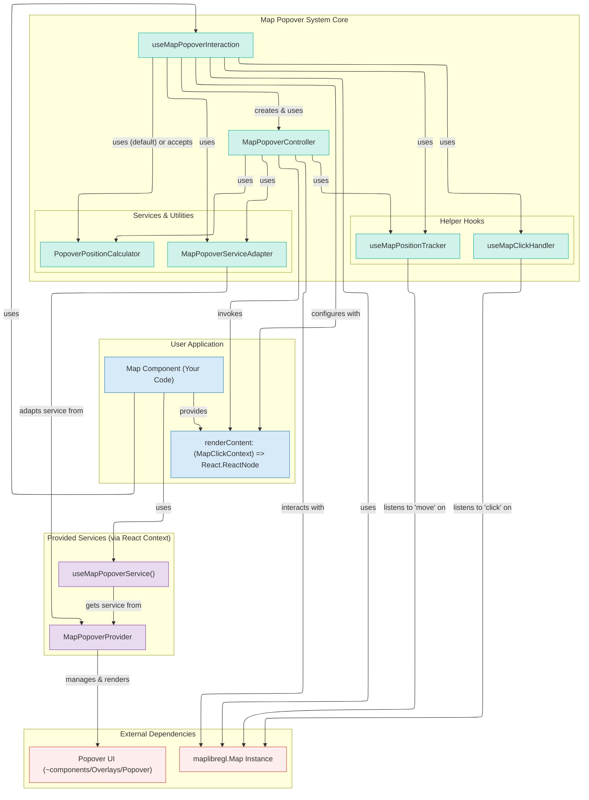
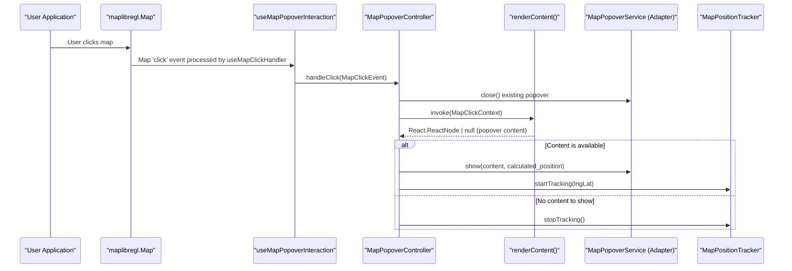

# Map Popover System

## 🏛️ Core Architecture

The system is composed of several key parts that work together to deliver the popover functionality. The main hook, `useMapPopoverInteraction`, orchestrates the various components.



## 🧩 Key Components & Responsibilities

- **`useMapPopoverInteraction`**: The primary React hook that integrates all parts of the popover system. It sets up event listeners, manages the `MapPopoverController`, and handles overall interaction state.
- **`MapPopoverController`**: Orchestrates the popover logic upon a map click. It determines what content to show (via `renderContent`), where to show it (via `PopoverPositionCalculator`), and instructs the `MapPopoverService` to display and update the popover. It also manages position tracking.
- **`renderContent` (callback: `(context: MapClickContext) => React.ReactNode | null`)**: A user-provided function that receives `MapClickContext` (including `maplibre-gl.Map`, `features`, `lngLat`, etc.) and returns the React content for the popover. This is the main customization point for popover content.
- **`useMapClickHandler`**: A generic hook that listens to click events on the map instance and passes relevant data to a handler (in this case, the `MapPopoverController`).
- **`useMapPositionTracker`**: Tracks the geographic position of the popover's anchor on the map. If the map moves, this hook ensures the popover's screen position is updated accordingly.
- **`PopoverPositionCalculator`**: Calculates the optimal screen coordinates (`pageX`, `pageY`) and placement (`top`, `bottom`, `left`, `right`) for the popover relative to the click point and map container. A `DefaultPopoverPositionCalculator` is provided and can be replaced.
- **`MapPopoverService`**: An interface defining how popovers are shown, moved, or hidden.
  - **`MapPopoverProvider`**: A React context provider that implements `PopoverService` using a concrete `Popover` UI component (e.g., from `~components/Overlays/Popover`).
  - **`MapPopoverServiceAdapter`**: Adapts the `PopoverService` from `MapPopoverProvider` to the `MapPopoverService` interface used by the controller, decoupling the core logic from the specific UI implementation.

## 🔄 Interaction Flow (Map Click)

The following diagram illustrates the sequence of events when a user clicks on the map:



## 📁 File Structure

The module is organized as follows:

```
src/core/map/
├── hooks/
│   ├── useMapClickHandler.ts         # Generic map click handling
│   ├── useMapPopoverInteraction.ts   # Main composable hook for popovers
│   └── useMapPositionTracker.ts      # Geographic position tracking
├── popover/
│   ├── MapPopoverController.ts         # Orchestrates popover interactions
│   ├── MapPopoverServiceAdapter.ts     # Interface adapter for popover service
│   ├── PopoverPositionCalculator.ts    # Position calculation logic
│   └── MapPopoverProvider.tsx          # Provider for popover service context & Popover UI
```

Key types like `MapClickContext` and `RenderPopoverContentFn` are defined in `types.ts`, centralizing the data structures for map interactions.

## 🚀 Quick Start

To integrate the popover system:

1.  **Wrap your map area with `MapPopoverProvider`**:

    ```tsx
    // somewhere in your app, likely near the map component
    import { MapPopoverProvider } from 'src/core/map';

    function AppWithMap() {
      return (
        <MapPopoverProvider>
          {/* ... other components, including your map */}
          <MyMapComponent />
        </MapPopoverProvider>
      );
    }
    ```

2.  **Use the `useMapPopoverInteraction` hook**:

    ```tsx
    import {
      useMapPopoverInteraction,
      MapPopoverServiceAdapter,
      useMapPopoverService,
      type MapClickContext, // Provides map, lngLat, features, etc.
      type RenderPopoverContentFn,
    } from 'src/core/map'; // Adjust path as needed
    import type { Map } from 'maplibre-gl';
    import React from 'react'; // For JSX in the callback

    function MyMapComponent() {
      const mapInstance: Map | null = useYourMapInstanceHook(); // Your hook to get the maplibre map
      const popoverServiceFromContext = useMapPopoverService(); // Gets service from MapPopoverProvider

      // Adapt the context's service to the interface expected by the hook
      const adaptedPopoverService = React.useMemo(
        () => new MapPopoverServiceAdapter(popoverServiceFromContext),
        [popoverServiceFromContext],
      );

      // Define how popover content is rendered
      const myRenderContent: RenderPopoverContentFn = (context: MapClickContext) => {
        if (context.features && context.features.length > 0) {
          const firstFeature = context.features[0];
          return (
            <div>
              <h4>{firstFeature.layer.id}</h4>
              <pre>{JSON.stringify(firstFeature.properties, null, 2)}</pre>
              <p>
                Clicked at: {context.lngLat.lng.toFixed(5)},{' '}
                {context.lngLat.lat.toFixed(5)}
              </p>
            </div>
          );
        }
        // Optionally, show popover even with no features
        // return <p>You clicked at: {context.lngLat.lng.toFixed(5)}, {context.lngLat.lat.toFixed(5)}</p>;
        return null; // Or return null to show no popover
      };

      useMapPopoverInteraction({
        map: mapInstance,
        popoverService: adaptedPopoverService,
        renderContent: myRenderContent,
      });

      return <div ref={mapRef} />; // Your map container ref
    }
    ```

### `MapClickContext` Details

The `renderContent` callback receives a `MapClickContext` object:

```typescript
export interface MapClickContext {
  map: maplibregl.Map;
  lngLat: maplibregl.LngLat; // Actually our GeographicPoint {lng, lat}
  point: maplibregl.Point; // Actually our ScreenPoint {x, y}
  features?: maplibregl.MapGeoJSONFeature[];
  originalEvent: maplibregl.MapMouseEvent;
}
```

_(Note: `lngLat` and `point` in `MapClickContext` are wrappers around MapLibre's `LngLat` and `Point` but provide simple `{lng, lat}` and `{x, y}` structures as defined in `types.ts`)_

## 🎛️ Configuration Options

The `useMapPopoverInteraction` hook accepts an options object:

```typescript
import type { Map } from 'maplibre-gl';
import type {
  MapPopoverService,
  PopoverPositionCalculator,
  RenderPopoverContentFn,
  MapClickContext, // Also available for renderContent signature
} from 'src/core/map/types';

interface UseMapPopoverInteractionOptions {
  map: Map | null;
  popoverService: MapPopoverService; // From MapPopoverServiceAdapter
  renderContent: RenderPopoverContentFn;
  positionCalculator?: PopoverPositionCalculator; // Optional: Defaults to DefaultPopoverPositionCalculator
  enabled?: boolean; // Optional: Defaults to true
  trackingDebounceMs?: number; // Optional: Debounce for position tracking, default: 16ms
}
```

## 🏗️ Extensibility

### 1. Advanced Content Rendering

The `renderContent` callback is the primary way to customize popover content. You can implement any logic, including conditional rendering based on feature properties or layers.

```tsx
const renderAdvancedContent: RenderPopoverContentFn = (context: MapClickContext) => {
  const buildingFeature = context.features?.find((f) => f.layer.id === 'buildings');
  if (buildingFeature) {
    // return <BuildingPopup feature={buildingFeature} />;
    return <div>Building ID: {buildingFeature.properties?.id}</div>;
  }

  const roadFeature = context.features?.find((f) => f.layer.id === 'roads');
  if (roadFeature) {
    // return <RoadPopup feature={roadFeature} />;
    return <div>Road Name: {roadFeature.properties?.name}</div>;
  }
  // ... more rules or default content
  return null;
};

// useMapPopoverInteraction({ ..., renderContent: renderAdvancedContent });
```

### 2. Custom Position Calculator

Provide your own implementation of `PopoverPositionCalculator` for fine-grained control over placement.

```tsx
import { DefaultPopoverPositionCalculator } from 'src/core/map';

class MyCustomPositionCalculator extends DefaultPopoverPositionCalculator {
  constructor() {
    super({
      arrowWidth: 20, // Custom arrow width for offset calculations
      placementThreshold: 50, // Larger threshold for changing placement
      edgePadding: 15, // More padding from viewport edges
    });
  }
  // Optionally, override the calculate method entirely
}

// useMapPopoverInteraction({
//   ...,
//   positionCalculator: new MyCustomPositionCalculator(),
// });
```

### 3. Multi-Map Support

The system inherently supports multiple map instances. Simply instantiate `useMapPopoverInteraction` for each map, providing the respective map instance. They can share the same `MapPopoverProvider` and `renderContent` logic or have distinct configurations.

```tsx
function MultiMapDashboard() {
  const map1 = useMapInstance(ref1); // Your hook for map 1
  const map2 = useMapInstance(ref2); // Your hook for map 2
  const popoverServiceFromContext = useMapPopoverService();
  const adaptedService = React.useMemo(
    () => new MapPopoverServiceAdapter(popoverServiceFromContext),
    [popoverServiceFromContext],
  );

  const sharedRenderContent: RenderPopoverContentFn = (context) => {
    /* ... */
  };

  useMapPopoverInteraction({
    map: map1,
    popoverService: adaptedService,
    renderContent: sharedRenderContent,
  });
  useMapPopoverInteraction({
    map: map2,
    popoverService: adaptedService,
    renderContent: sharedRenderContent,
  });
  // ...
}
```
