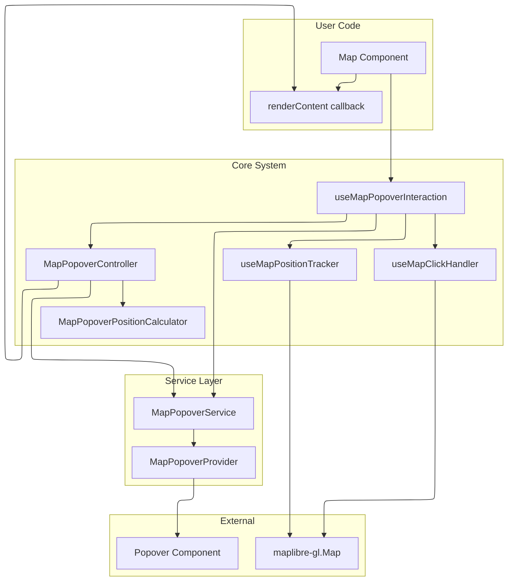

# Map Popover System

React hook system for displaying popovers on map click events with automatic positioning and tracking.

## Architecture



## Core Components

- **`useMapPopoverInteraction`**: Main hook for map click handling
- **`MapPopoverController`**: Click event orchestration and error handling
- **`MapPopoverService`**: Popover display and positioning interface
- **`MapPopoverProvider`**: React context provider for popover rendering
- **`MapPopoverPositionCalculator`**: Screen position and placement calculation

## Basic Usage

### 1. Provider Setup

```tsx
import { MapPopoverProvider } from 'src/core/map';

function App() {
  return (
    <MapPopoverProvider>
      <MapComponent />
    </MapPopoverProvider>
  );
}
```

### 2. Hook Usage

```tsx
import {
  useMapPopoverInteraction,
  useMapPopoverService,
  type MapClickContext,
} from 'src/core/map';
import type { Map } from 'maplibre-gl';

function MapComponent() {
  const map: Map | null = useYourMap();
  const popoverService = useMapPopoverService();

  const { close, destroy } = useMapPopoverInteraction({
    map,
    popoverService,
    renderContent: (context: MapClickContext) => {
      if (context.features?.length) {
        return (
          <div>
            <h4>{context.features[0].layer.id}</h4>
            <pre>{JSON.stringify(context.features[0].properties, null, 2)}</pre>
          </div>
        );
      }
      return (
        <p>
          Clicked at: {context.lngLat.lng}, {context.lngLat.lat}
        </p>
      );
    },
    onError: (errorInfo) => <div>Error: {errorInfo.error.message}</div>,
  });

  return <div ref={mapRef} style={{ width: '100%', height: '100vh' }} />;
}
```

## Configuration

```typescript
interface UseMapPopoverInteractionOptions {
  map: Map | null;
  popoverService: MapPopoverService;
  renderContent: RenderPopoverContentFn;
  positionCalculator?: MapPopoverPositionCalculator;
  enabled?: boolean;
  trackingDebounceMs?: number;
  onError?: MapPopoverErrorHandler;
}

interface PopoverInteractionAPI {
  close: () => void;
  destroy: () => void;
  isDestroyed: boolean;
}
```

## Error Handling

```tsx
const handleError = (errorInfo: MapPopoverErrorInfo) => {
  console.error('Popover error:', errorInfo.error);
  return <div>Failed to render content</div>;
};

useMapPopoverInteraction({
  map,
  popoverService,
  renderContent,
  onError: handleError,
});
```

## Custom Position Calculator

```tsx
import { DefaultMapPopoverPositionCalculator } from 'src/core/map';

class CustomCalculator extends DefaultMapPopoverPositionCalculator {
  constructor() {
    super({
      arrowWidth: 20,
      placementThreshold: 80,
      edgePadding: 20,
    });
  }
}

const calculator = useMemo(() => new CustomCalculator(), []);

useMapPopoverInteraction({
  map,
  popoverService,
  renderContent,
  positionCalculator: calculator,
});
```

## Multiple Maps

```tsx
function MultiMapComponent() {
  const map1 = useMap(ref1);
  const map2 = useMap(ref2);
  const service = useMapPopoverService();

  useMapPopoverInteraction({
    map: map1,
    popoverService: service,
    renderContent: contentForMap1,
  });

  useMapPopoverInteraction({
    map: map2,
    popoverService: service,
    renderContent: contentForMap2,
  });
}
```

## Type Definitions

```typescript
interface MapClickContext {
  map: Map;
  lngLat: GeographicPoint;
  point: ScreenPoint;
  features?: MapGeoJSONFeature[];
  originalEvent: MapMouseEvent;
}

type RenderPopoverContentFn = (context: MapClickContext) => React.ReactNode;

interface MapPopoverErrorInfo {
  error: Error;
  context: MapClickContext;
}

type MapPopoverErrorHandler = (errorInfo: MapPopoverErrorInfo) => React.ReactNode;

interface MapPopoverService {
  show: (point: ScreenPoint, content: React.ReactNode, placement?: Placement) => void;
  move: (point: ScreenPoint, placement?: Placement) => void;
  close: () => void;
}
```
