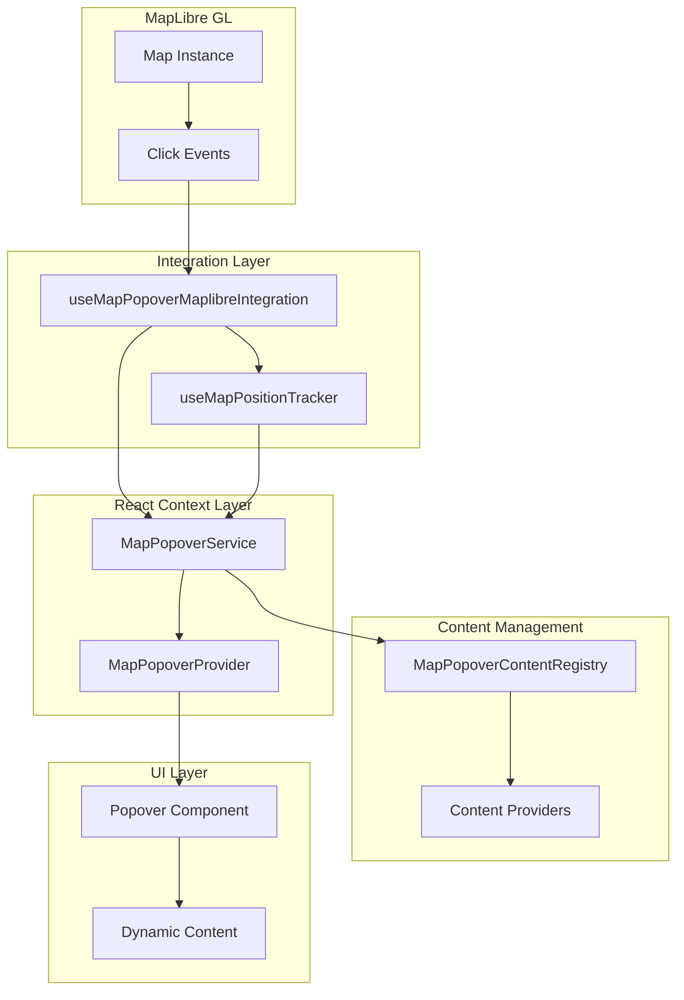
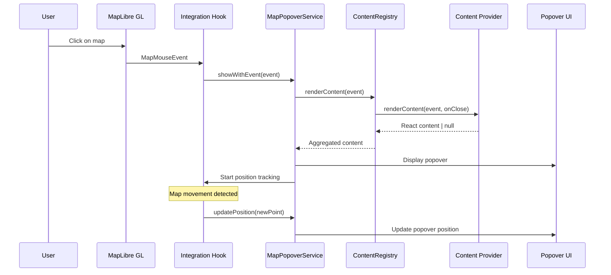
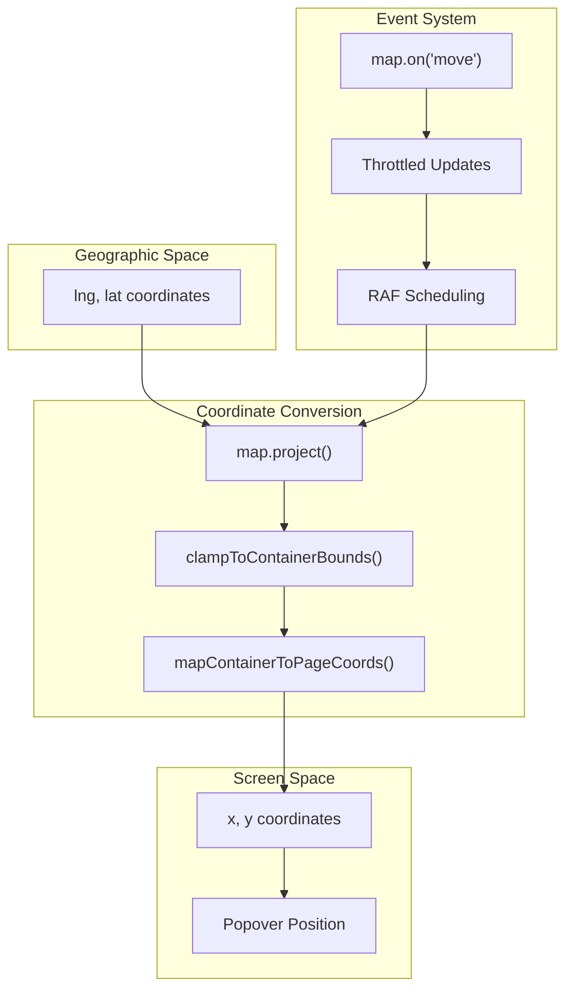
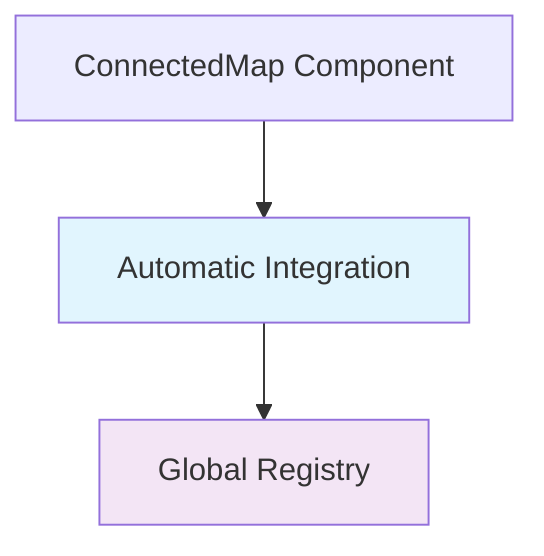
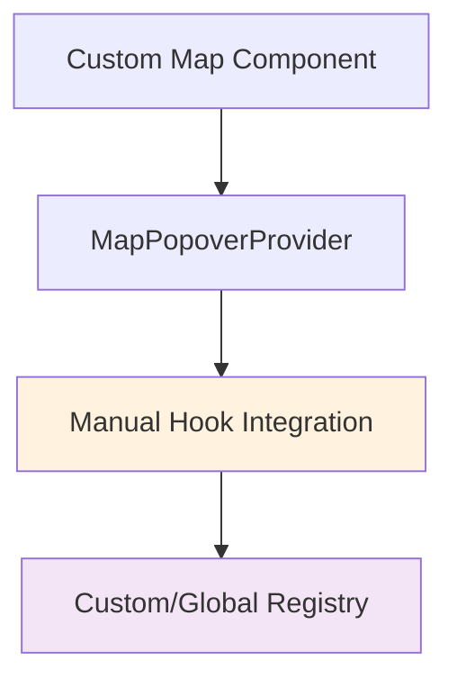
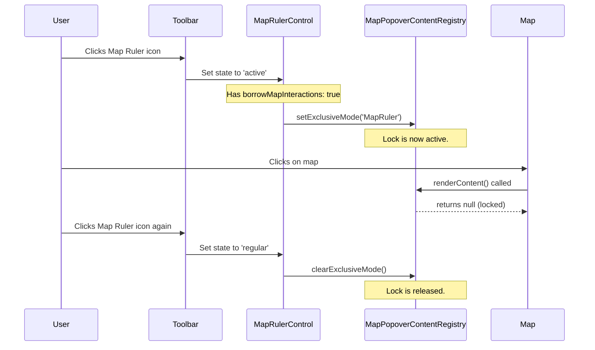

# MapPopover System

A comprehensive popover system for MapLibre GL map interactions with enhanced provider coordination, priority management, and tool integration.

## Table of Contents

- [Overview](#overview)
- [Architecture](#architecture)
  - [System Components](#system-components)
  - [Data Flow](#data-flow)
  - [Position Tracking Architecture](#position-tracking-architecture)
  - [Integration Patterns](#integration-patterns)
- [Quick Start](#quick-start)
- [API Reference](#api-reference)
- [Usage Patterns](#usage-patterns)
  - [Multi-Provider Setup](#multi-provider-setup)
  - [Tool Integration](#tool-integration)
  - [Interaction Locking](#interaction-locking)
  - [Example: Toolbar Integration](#example-toolbar-integration)
  - [Conditional Provider](#conditional-provider)
  - [Custom Map Integration](#custom-map-integration)
- [Configuration](#configuration)
- [Best Practices](#best-practices)
- [Troubleshooting](#troubleshooting)

## Overview

The MapPopover system provides:

- **Coordinated Content Providers**: Multiple providers can contribute content with priority-based execution
- **Tool Integration**: Exclusive modes for tools that need to override other interactions
- **External Locking**: Allows external systems like the Toolbar to disable popovers for their own tools.
- **Shared Resources**: Single feature query shared across all providers for performance
- **Context-Rich Interface**: Providers receive shared context with features, tool state, and provider info

## Architecture

### System Components



### Data Flow



### Position Tracking Architecture



### Integration Patterns

The system supports two integration approaches:

#### Pattern 1: ConnectedMap (Automatic)



#### Pattern 2: Custom Integration (Manual)



## Quick Start

### Use MapPopover Service

```tsx
import { useMapPopoverService } from '~core/map';

function MyMapComponent() {
  const popoverService = useMapPopoverService();

  const handleMapClick = (mapEvent: MapMouseEvent) => {
    // Show popover using registered providers
    const wasShown = popoverService.showWithEvent(mapEvent);

    if (!wasShown) {
      console.log('No providers handled this click');
    }
  };

  const showCustomContent = (point: ScreenPoint) => {
    popoverService.showWithContent(point, <div>Custom content!</div>, {
      placement: 'top',
    });
  };

  return <div>Map component with popover integration</div>;
}
```

### Register Content Provider

```tsx
import { mapPopoverRegistry } from '~core/map';
import { ProviderPriority } from '~core/map/types';

// Create a provider
class FeatureInfoProvider implements IMapPopoverContentProvider {
  readonly priority = ProviderPriority.NORMAL;

  renderContent(context: IMapPopoverProviderContext): React.ReactNode | null {
    const features = context.getFeatures();
    const { mapEvent, onClose } = context;

    if (!features.length) return null;

    return (
      <div>
        <h4>Feature Details</h4>
        <p>Layer: {features[0].layer.id}</p>
        <p>
          Coordinates: {mapEvent.lngLat.lat.toFixed(4)}, {mapEvent.lngLat.lng.toFixed(4)}
        </p>
        <button onClick={onClose}>Close</button>
      </div>
    );
  }
}

// Register provider
function MyComponent() {
  useEffect(() => {
    const provider = new FeatureInfoProvider();
    mapPopoverRegistry.register('feature-info', provider);

    return () => mapPopoverRegistry.unregister('feature-info');
  }, []);
}
```

### Create Tool Provider (Exclusive Mode)

```tsx
class BoundarySelectProvider implements IMapPopoverContentProvider {
  readonly priority = ProviderPriority.HIGH;
  readonly isExclusive = true;
  readonly toolId = 'boundary-selector';

  renderContent(context: IMapPopoverProviderContext): React.ReactNode | null {
    const { mapEvent, onClose, getProviderInfo } = context;
    const info = getProviderInfo();

    return (
      <div>
        <h4>Boundary Selector Tool</h4>
        <p>Mode: {info.mode}</p>
        <p>
          Click to select boundary at {mapEvent.lngLat.lat.toFixed(4)},{' '}
          {mapEvent.lngLat.lng.toFixed(4)}
        </p>
        <button onClick={onClose}>Cancel</button>
      </div>
    );
  }
}
```

## API Reference

### MapPopoverService

Main service interface for popover control.

```typescript
interface MapPopoverService {
  showWithEvent(mapEvent: MapMouseEvent, options?: MapPopoverOptions): boolean;
  showWithContent(
    point: ScreenPoint,
    content: React.ReactNode,
    options?: MapPopoverOptions,
  ): void;
  updatePosition(point: ScreenPoint, placement?: Placement): void;
  close(): void;
  isOpen(): boolean;
}
```

#### Methods

**`showWithEvent(mapEvent, options?)`**

- **Description**: Show popover using registered content providers
- **Parameters**:
  - `mapEvent`: MapLibre GL mouse event
  - `options`: Optional display configuration
- **Returns**: `boolean` - true if content was found and displayed

**`showWithContent(point, content, options?)`**

- **Description**: Show popover with custom content
- **Parameters**:
  - `point`: Screen coordinates `{x: number, y: number}`
  - `content`: React component or element
  - `options`: Optional display configuration

**`updatePosition(point, placement?)`**

- **Description**: Update popover position (used during map movement)
- **Parameters**:
  - `point`: New screen coordinates
  - `placement`: Optional new placement direction

**`close()`**

- **Description**: Close any open popover

**`isOpen()`**

- **Description**: Check if popover is currently open
- **Returns**: `boolean`

### MapPopoverOptions

Configuration for popover display behavior.

```typescript
interface MapPopoverOptions {
  placement?: Placement; // 'top' | 'bottom' | 'left' | 'right'
  closeOnMove?: boolean; // Auto-close on map movement
  className?: string; // Custom CSS class
}
```

### Content Provider Interface

Enhanced interface for creating content providers with context and priority support.

```typescript
interface IMapPopoverContentProvider {
  /**
   * Renders content for the map popover using shared context.
   * @param context - Shared context with features, tool state, and provider info
   * @returns React content to display, or null if this provider doesn't handle this event
   */
  renderContent(context: IMapPopoverProviderContext): React.ReactNode | null;

  /**
   * Provider execution priority - higher numbers execute first.
   */
  readonly priority: number;

  /**
   * Whether this provider requires exclusive execution (no other providers run).
   */
  readonly isExclusive?: boolean;

  /**
   * Tool identifier for exclusive mode coordination.
   */
  readonly toolId?: string;
}
```

### Provider Context Interface

Context object passed to providers with shared resources and metadata.

```typescript
interface IMapPopoverProviderContext {
  getFeatures(): MapGeoJSONFeature[];
  getToolState(): { activeToolId?: string; isExclusive: boolean };
  getProviderInfo(): { priority: number; mode: 'exclusive' | 'shared'; id: string };
  mapEvent: MapMouseEvent;
  onClose: () => void;
}
```

**Context Methods:**

- `getFeatures()`: Get features from shared query (eliminates duplicate queries)
- `getToolState()`: Get current tool state for coordination
- `getProviderInfo()`: Get provider's priority, mode, and ID
- `mapEvent`: Original MapLibre mouse event
- `onClose`: Callback to close the popover

### Priority Constants

```typescript
const ProviderPriority = {
  CRITICAL: 1000, // System-critical content
  HIGH: 100, // Tools and user interactions
  NORMAL: 50, // Standard content providers
  LOW: 10, // Background/auxiliary content
  DEBUG: 1, // Debug and development content
} as const;
```

### Registry Interface

Interface for managing content providers with coordination capabilities.

```typescript
interface IMapPopoverContentRegistry {
  register(id: string, provider: IMapPopoverContentProvider): void;
  unregister(id: string): void;
  renderContent(mapEvent: MapMouseEvent, onClose: () => void): React.ReactNode | null;
  /**
   * Sets exclusive mode for a specific provider and tool.
   * Also used by external systems (e.g., Toolbar) to lock popovers.
   * @param providerId - ID of the provider to make exclusive, or a generic tool ID.
   * @param toolId - Optional tool identifier.
   */
  setExclusiveMode(providerId: string, toolId?: string): void;
  clearExclusiveMode(): void;
  updateToolState(toolState: { activeToolId?: string; isExclusive: boolean }): void;
  setCloseCallback(callback: (() => void) | null): void;
  clear(): void;
  readonly providerCount: number;
}
```

## Usage Patterns

### Multi-Provider Setup

```tsx
// Register multiple providers with different priorities
const setupProviders = () => {
  // High priority tool
  mapPopoverRegistry.register('boundary-tool', new BoundarySelectProvider());

  // Normal content providers
  mapPopoverRegistry.register('feature-info', new FeatureInfoProvider());
  mapPopoverRegistry.register('layer-tooltip', new LayerTooltipProvider());

  // Debug provider (lowest priority)
  mapPopoverRegistry.register('debug', new DebugProvider());
};
```

### Tool Integration

```tsx
// Tool activation with automatic popover closure
const activateBoundarySelector = () => {
  // Registry automatically closes existing popovers when exclusive provider is registered
  mapPopoverRegistry.register('boundary-selector', boundarySelectorProvider);

  // Tool is now active - next map clicks will show only boundary selector
};

const deactivateBoundarySelector = () => {
  mapPopoverRegistry.unregister('boundary-selector');
  // Back to normal mode - all providers can respond to clicks
};
```

### Interaction Locking

To ensure a clean user experience, the popover system provides a generic **interaction locking** mechanism. This allows any part of the application to temporarily disable all popovers or grant exclusive access to a single tool.

The lock is controlled by two methods on the `IMapPopoverContentRegistry`:

- `setExclusiveMode(toolId: string)`: Activates the lock.
  - Immediately closes any currently open popover.
  - Prevents all popover providers from running, _except_ for one whose `toolId` matches the `toolId` passed to the function.
- `clearExclusiveMode()`: Deactivates the lock and returns the system to normal operation.

This is the standard architectural pattern for any tool or feature that needs to take temporary, exclusive control of map click interactions.

### Example: Toolbar Integration

The main application `Toolbar` is a primary consumer of the Interaction Locking mechanism.

- **Trigger**: Activating a toolbar control with `borrowMapInteractions: true` (e.g., `MapRuler`).
- **Action**: The `Toolbar` service calls `mapPopoverRegistry.setExclusiveMode(controlId)`.
- **Effect**: The popover system is locked, preventing popovers while the ruler is active. When the tool is deactivated, the `Toolbar` calls `mapPopoverRegistry.clearExclusiveMode()`.

**Flow Diagram (`MapRuler`)**



### Conditional Provider

```tsx
class ConditionalProvider implements IMapPopoverContentProvider {
  readonly priority = ProviderPriority.NORMAL;

  renderContent(context: IMapPopoverProviderContext): React.ReactNode | null {
    const features = context.getFeatures();
    const toolState = context.getToolState();

    // Only show when no exclusive tool is active
    if (toolState.isExclusive) return null;

    // Only show for buildings
    const buildingFeatures = features.filter((f) => f.properties?.type === 'building');
    if (!buildingFeatures.length) return null;

    return <BuildingInfoCard feature={buildingFeatures[0]} onClose={context.onClose} />;
  }
}
```

### Custom Map Integration

For custom map implementations:

```tsx
function useMapPopoverMaplibreIntegration(options: {
  map: Map;
  popoverService: MapPopoverService;
  enabled?: boolean;
  trackingThrottleMs?: number;
}): void {
  // Integration implementation
}
```

## Configuration

### Position Tracking

Configure position update frequency:

```tsx
useMapPopoverMaplibreIntegration({
  map,
  popoverService,
  trackingThrottleMs: 16, // 60fps updates (default)
  // trackingThrottleMs: 50,  // 20fps for better performance
  // trackingThrottleMs: 0,   // No throttling (use RAF)
});
```

### Custom Positioning

Provide custom placement calculation:

```tsx
import { DefaultMapPopoverPositionCalculator } from '~core/map';

const customCalculator = new DefaultMapPopoverPositionCalculator({
  arrowWidth: 20, // Arrow size consideration
  placementThreshold: 24, // Distance from edge to change placement
  edgePadding: 12, // Minimum distance from container edge
});

useMapPopoverMaplibreIntegration({
  map,
  popoverService,
  positionCalculator: customCalculator,
});
```

### Multiple Maps

Each map needs its own provider:

```tsx
function MultiMapApp() {
  return (
    <>
      <MapPopoverProvider registry={mapPopoverRegistry}>
        <MapComponent mapId="main" />
      </MapPopoverProvider>

      <MapPopoverProvider registry={mapPopoverRegistry}>
        <MapComponent mapId="overview" />
      </MapPopoverProvider>
    </>
  );
}
```

### Custom Registry

Create isolated content registry:

```tsx
import { MapPopoverContentRegistry } from '~core/map';

const customRegistry = new MapPopoverContentRegistry();

function SpecializedMap() {
  return (
    <MapPopoverProvider registry={customRegistry}>
      <MapComponent />
    </MapPopoverProvider>
  );
}
```

## Best Practices

### Provider IDs

Use consistent naming conventions:

| Provider Type   | ID Pattern           | Example             |
| --------------- | -------------------- | ------------------- |
| Layer tooltips  | `tooltip-${layerId}` | `tooltip-buildings` |
| Feature actions | `actions-${layerId}` | `actions-points`    |
| Debug info      | `debug`              | `debug`             |
| Feature modules | `feature-name`       | `boundary-selector` |

### Memory Management

**Always unregister providers:**

```tsx
// ✅ Good
useEffect(() => {
  mapPopoverRegistry.register(id, provider);
  return () => mapPopoverRegistry.unregister(id);
}, []);

// ❌ Bad - memory leak
useEffect(() => {
  mapPopoverRegistry.register(id, provider);
}, []);
```

**Clear references in class components:**

```tsx
// ✅ Good
willUnMount() {
  if (this.provider) {
    mapPopoverRegistry.unregister(this.providerId);
    this.provider = null; // Clear reference
  }
}

// ❌ Bad - keeps reference
willUnMount() {
  mapPopoverRegistry.unregister(this.providerId);
}
```

### Performance

**Early return for irrelevant events:**

```tsx
renderContent(mapEvent: MapMouseEvent): React.ReactNode | null {
  // Quick checks first
  if (!this.isEnabled || !this.shouldShow) return null;

  // Expensive operations only when needed
  const features = mapEvent.target.queryRenderedFeatures(mapEvent.point);
  return features.length ? <Content features={features} /> : null;
}
```

**Optimize feature queries:**

```tsx
// ✅ Good - filter by layer
const features = mapEvent.target.queryRenderedFeatures(mapEvent.point, {
  layers: ['my-layer-id'],
});

// ❌ Slower - query all layers
const features = mapEvent.target.queryRenderedFeatures(mapEvent.point);
```

### Error Handling

**Graceful degradation:**

```tsx
renderContent(mapEvent: MapMouseEvent): React.ReactNode | null {
  try {
    const features = mapEvent.target.queryRenderedFeatures(mapEvent.point);
    if (!features?.length) return null;

    return <FeatureContent features={features} />;
  } catch (error) {
    console.error('Error rendering feature content:', error);
    return <div>Error loading feature information</div>;
  }
}
```

## Troubleshooting

### Popover Not Showing

**Check provider registration:**

```tsx
console.log('Registered providers:', mapPopoverRegistry.providerCount);
```

**Verify provider returns content:**

```tsx
renderContent(mapEvent: MapMouseEvent) {
  const features = mapEvent.target.queryRenderedFeatures(mapEvent.point);
  console.log('Features found:', features.length);
  // ...
}
```

**Ensure integration is enabled:**

```tsx
useMapPopoverMaplibreIntegration({
  enabled: true, // ← Check this
  // ...
});
```

### Position Tracking Issues

**Check map instance stability:**

```tsx
// ✅ Stable reference
const [map, setMap] = useState<Map | null>(null);

// ❌ Recreates on every render
const map = new Map(config);
```

**Verify coordinate system:**

```tsx
// Debug position updates
useMapPopoverMaplibreIntegration({
  map,
  popoverService,
  trackingThrottleMs: 16,
  onPositionUpdate: (point) => console.log('Position:', point), // Custom debug
});
```

### Performance Issues

**Reduce update frequency:**

```tsx
useMapPopoverMaplibreIntegration({
  trackingThrottleMs: 50, // Reduce from 16ms
});
```

**Disable during heavy operations:**

```tsx
const [isLoading, setIsLoading] = useState(false);

useMapPopoverMaplibreIntegration({
  enabled: !isLoading,
});
```

### Debug Mode

KONTUR_DEBUG will enable debug provider for development:

The debug provider shows:

- All features at click point
- Feature properties and metadata
- Geographic and screen coordinates
- Layer and source information

### Common Errors

**"Provider already registered"**

- Solution: Unregister before registering again

```tsx
mapPopoverRegistry.unregister(id); // Clear first
mapPopoverRegistry.register(id, provider);
```

**"Cannot read properties of null"**

- Solution: Check map instance exists

```tsx
if (!map) return; // Guard clause
useMapPopoverMaplibreIntegration({ map /* ... */ });
```

**Memory leaks**

- Solution: Always cleanup providers

```tsx
useEffect(() => {
  // register
  return () => mapPopoverRegistry.unregister(id); // cleanup
}, []);
```
