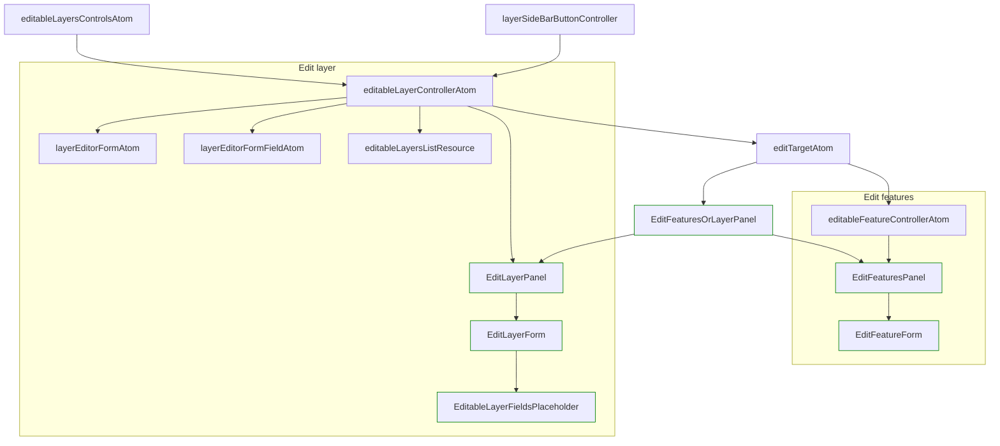

```mermaid
flowchart TB
  classDef View stroke:green;
  classDef coreAtom stroke:orange;


  editableLayersControlsAtom --> editableLayerControllerAtom
  layerSideBarButtonController --> editableLayerControllerAtom
  subgraph Edit layer
  editableLayerControllerAtom --> layerEditorFormAtom
  editableLayerControllerAtom --> layerEditorFormFieldAtom
  editableLayerControllerAtom --> editableLayersListResource
  EditLayerPanel:::View --> EditLayerForm:::View
  EditLayerForm:::View  --> EditableLayerFieldsPlaceholder:::View
  editableLayerControllerAtom --> EditLayerPanel
  end
  editableLayerControllerAtom --> editTargetAtom
  editTargetAtom --> EditFeaturesOrLayerPanel:::View
  EditFeaturesOrLayerPanel --> EditLayerPanel:::View
  EditFeaturesOrLayerPanel --> EditFeaturesPanel:::View

  editTargetAtom --> editableFeatureControllerAtom
  subgraph Edit features
  EditFeaturesPanel:::View --> EditFeatureForm:::View
  editableFeatureControllerAtom --> EditFeaturesPanel:::View
  end
```
