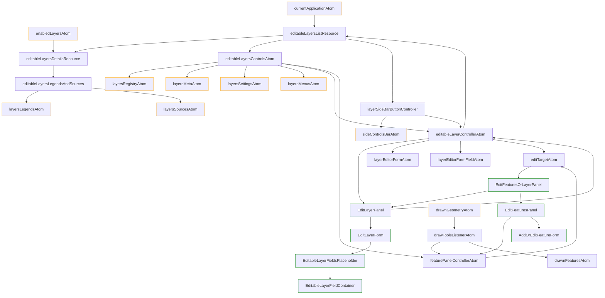

# Create Layer Feature

Feature flag name: `create_layer`

## Short feature purpose description:

Allows the authorized user to create and edit his own layers.

## How it works

Consists of two parts:

1. Create / Edit Layer properties
2. Create / Edit layer features

### Stage I - adding controls

1. When feature activated it run `layerSideBarButtonControllerAtom` and `layerContextMenu`.
2. `layerSideBarButtonControllerAtom` optionally add "create layer" control in side bar
3. `editableLayersControls` - add layers to "layers_panel" with "edit layer" and "edit features" options in layer context menu
4. `editableLayersControls` - add layers to "layers_panel" with "edit layer" and "edit features" options in layer context menu

5. It fetch user layers, and if such layers exist - add it in logical layers registry, with attached "edit" option.
   In case this feature disabled - `layers_in_area` fetch this layers with other regular layers without adding "edit" option.
   (`layers_in_area` checking `create_layer` flag for that)

### Stage II - Creating layer
