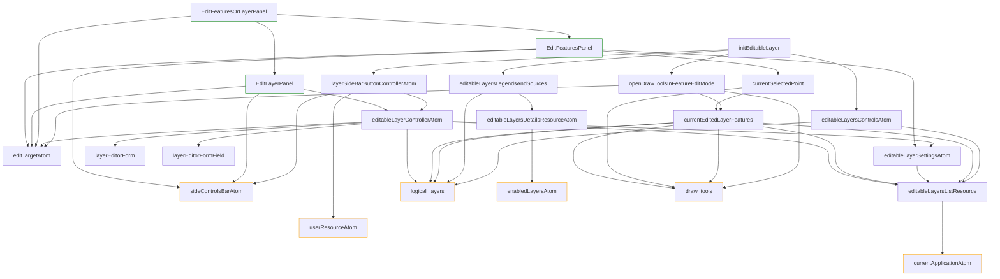

# Create Layer Feature

Feature flag name: `create_layer`

## Short feature purpose description:

Allows the authorized user to create and edit his own layers with geojson source,
and edit features properties

Consists of two parts:

1. Create / Edit Layer properties
   This part allows to change such properties like layer name,
   and properties files inside features.

2. Create / Edit layer features properties
   This part allows you to add/remove/move new features in layers,
   and edit properties for every feature.

## How to use

You must call the `initEditableLayer` from the root `index.ts` file to activate the feature,
and place `<LayerEditorPanel />` somewhere in the app

```ts
import {
  initEditableLayer,
  EditFeaturesOrLayerPanel,
} from '~features/create_layer';

function App() {
  useEffect(() => {
    initEditableLayer();
  }, []);

  return <EditFeaturesOrLayerPanel />;
}
```

## Requirements

This feature uses next core modules:

- logical_layers
- draw_tools
- currentApplicationAtom
- userResourceAtom
- notificationsService
- translationService
- side_bar
- apiClient

*

## How it works

1. layerSideBarButtonControllerAtom adds "Create layer" button in side bar (layerSideBarButtonControllerAtom). This button creates new layer on click.
2. editableLayersListResource atom loads enabled user layers
3. editableLayersControlsAtom - creates logical_layer (visible in layers panel) for every layer from editableLayersListResource
4. editableLayersLegendsAndSources - creates legends and sources for enabled layers
5. editTarget - contains id of layer that user edits and info about what part of layer is editing right now - layer info or layer features
   Depending on editTarget state <EditFeaturesOrLayerPanel /> shows layer edit form, or feature edit form, or nothing - if layer is not selected.
6. openDrawToolsInFeatureEditMode activates draw tools when editTarget point to edit feature state
7. editableLayerSettingsAtom contains settings of custom fields in features properties. Used for form.
8. currentSelectedPoint handles updates of selected features,
   while currentEditedLayerFeatures contains all features of current layer
9. editableLayerControllerAtom creates, deletes and handles updates of current layer


